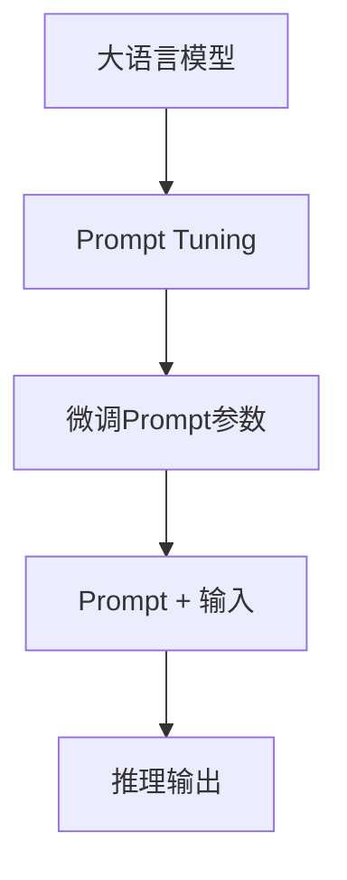

# 大语言模型原理基础与前沿 轻量级微调

## 1. 背景介绍

### 1.1 大语言模型的兴起

近年来,大型语言模型(Large Language Models, LLMs)在自然语言处理(NLP)领域掀起了一场革命。这些模型通过在海量文本数据上进行预训练,学习了丰富的语言知识和上下文信息,展现出令人惊叹的语言理解和生成能力。

代表性的大语言模型包括 GPT-3、PaLM、ChatGPT 等,它们不仅能够完成传统的 NLP 任务,如文本分类、机器翻译、问答系统等,更能够进行开放域的对话、文本创作、代码生成等复杂任务。这些模型的出现,为人工智能系统赋予了更强大的语言理解和生成能力,极大推动了自然语言处理技术的发展。

### 1.2 大语言模型的挑战

尽管大语言模型取得了巨大成功,但它们也面临着一些挑战:

1. **计算资源消耗巨大**: 训练大型语言模型需要海量的计算资源,包括高性能 GPU、大量训练数据和长时间的训练周期。这对于大多数组织来说是一个巨大的挑战。

2. **推理效率低下**: 虽然训练一次后,大语言模型可以应用于各种下游任务,但推理过程仍然计算密集,导致响应时间较长、部署成本高昂。

3. **缺乏任务专注性**: 尽管大语言模型具有广泛的知识,但它们在特定领域或任务上的表现往往不如专门设计的小型模型。

4. **可解释性和可控性差**: 大语言模型的内部机理"黑箱"式的,缺乏透明度,其预测结果的可解释性和可控性较差。

5. **存在偏见和不当内容**: 由于训练数据的局限性,大语言模型可能会产生有偏见或不当内容的输出。

为了应对这些挑战,研究人员提出了 "轻量级微调" 的概念,旨在通过适当的模型微调,在保留大语言模型强大能力的同时,降低计算资源消耗、提高推理效率、增强任务专注性、提升可解释性和可控性。

## 2. 核心概念与联系

### 2.1 微调(Fine-tuning)

微调是指在大语言模型的基础上,使用特定任务的数据进行进一步训练,以使模型在该任务上表现更好。这种方法利用了大语言模型已经学习到的丰富语言知识,只需要对模型进行少量调整,就可以适应新的任务。

与从头训练一个全新模型相比,微调具有以下优势:

1. **训练成本低**: 只需要对已有模型进行少量调整,因此训练时间和计算资源消耗大幅降低。

2. **数据需求少**: 由于模型已经学习了大量语言知识,微调只需要较少的任务相关数据。

3. **泛化能力强**: 通过微调,模型不仅学习了任务相关的知识,还保留了大语言模型的广泛语言理解能力。

4. **易于部署**: 微调后的模型通常比原始大语言模型小得多,更易于部署和推理。

然而,传统的微调方法也存在一些局限性,例如对大语言模型的修改较为彻底,可能会导致一些原有知识的丢失;微调过程计算资源消耗仍然可观;以及对于一些极端场景(如少量训练数据、跨领域迁移等),微调效果可能不佳。

### 2.2 轻量级微调(Prompt Tuning)

为了解决传统微调方法的局限,研究人员提出了 "轻量级微调" 的概念。轻量级微调的核心思想是,只对大语言模型的一小部分参数(通常是输入层或输出层)进行调整,而保留大部分参数不变。这种方式可以最大限度地保留模型原有的语言知识,同时降低计算资源消耗,提高推理效率。

轻量级微调的一种常见方式是 Prompt Tuning,即通过学习一个任务相关的 Prompt(提示词),将任务信号注入到大语言模型中。在推理时,将学习到的 Prompt 与输入拼接,输入到大语言模型,即可获得针对特定任务的预测结果。

Prompt Tuning 的优势在于:

1. **计算资源消耗低**: 只需要微调少量参数(Prompt),大大降低了训练和推理的计算开销。

2. **知识保留性强**: 保留了大语言模型绝大部分参数,因此能够很好地保留原有的语言知识。

3. **泛化能力好**: Prompt 学习到的是任务相关的指示信号,具有很强的泛化能力。

4. **可解释性高**: Prompt 本身就是一种可解释的任务描述,有助于提高模型的可解释性。

5. **灵活性强**: 可以方便地为不同任务学习不同的 Prompt,实现多任务适配。

### 2.3 Mermaid 流程图

下面的 Mermaid 流程图展示了轻量级微调(Prompt Tuning)的核心流程:



该流程图清晰地展示了轻量级微调的核心步骤:

1. 以大语言模型为基础
2. 通过 Prompt Tuning 技术
3. 微调 Prompt 参数
4. 将学习到的 Prompt 与输入拼接
5. 输入到大语言模型,获得推理输出

通过这种方式,我们可以在保留大语言模型原有语言知识的同时,使其适应特定任务,并且计算资源消耗较低、推理效率较高。

## 3. 核心算法原理具体操作步骤

### 3.1 Prompt Tuning 算法原理

Prompt Tuning 算法的核心思想是,学习一个任务相关的 Prompt,将任务信号注入到大语言模型中。具体来说,算法分为以下几个步骤:

1. **初始化 Prompt**: 首先,我们需要为特定任务初始化一个 Prompt,作为模型的输入。Prompt 可以是一个单词、一个短语,或者一段描述性的文本。

2. **构建训练数据**: 将初始化的 Prompt 与任务相关的训练数据拼接,构建成模型的输入格式。

3. **微调 Prompt 参数**: 将 Prompt 表示为一组可学习的参数(通常是词向量),并在训练数据上对这些参数进行微调,使得模型在特定任务上的表现最优。

4. **推理**: 在推理阶段,将学习到的 Prompt 与输入数据拼接,输入到大语言模型,获得针对特定任务的预测结果。

需要注意的是,在整个过程中,大语言模型的绝大部分参数都保持不变,只有 Prompt 相关的少量参数被微调。这样可以最大限度地保留模型原有的语言知识,同时降低计算资源消耗。

### 3.2 Prompt Tuning 算法步骤

下面是 Prompt Tuning 算法的具体操作步骤:

1. **初始化 Prompt**

   选择一个合适的初始 Prompt,可以是一个单词、一个短语,或者一段描述性的文本。初始 Prompt 的选择对算法的效果有一定影响,通常需要一些经验或者尝试不同的 Prompt。

2. **构建训练数据**

   将初始化的 Prompt 与任务相关的训练数据拼接,构建成模型的输入格式。例如,对于文本分类任务,输入格式可以是:

   ```
   Prompt: 这是一条 [类别] 的评论: [文本内容]
   ```

3. **表示 Prompt 为可学习参数**

   将 Prompt 表示为一组可学习的参数,通常是将 Prompt 中的每个词token化,并将其对应的词向量作为可学习参数。

4. **微调 Prompt 参数**

   在训练数据上,使用梯度下降等优化算法,对 Prompt 参数进行微调,使得模型在特定任务上的表现最优。

5. **推理**

   在推理阶段,将学习到的 Prompt 与输入数据拼接,输入到大语言模型,获得针对特定任务的预测结果。

以文本分类任务为例,推理过程如下:

```
Prompt: 这是一条 [类别] 的评论:
输入: 这家餐厅的食物非常好吃,环境也很棒,服务态度很好。
模型输出: 这是一条 [正面] 的评论
```

通过这种方式,我们可以在保留大语言模型原有语言知识的同时,使其适应特定任务,并且计算资源消耗较低、推理效率较高。

## 4. 数学模型和公式详细讲解举例说明

在 Prompt Tuning 算法中,我们需要学习 Prompt 参数,使得模型在特定任务上的表现最优。这可以通过最小化一个损失函数(Loss Function)来实现。

### 4.1 损失函数

假设我们有一个大语言模型 $M$,输入为 $x$,输出为 $y$。我们的目标是学习一个 Prompt $P$,使得在特定任务的训练数据 $\mathcal{D} = \{(x_i, y_i)\}_{i=1}^N$ 上,模型的预测结果 $\hat{y}_i = M(P \oplus x_i)$ 与真实标签 $y_i$ 的差异最小,其中 $\oplus$ 表示将 Prompt 与输入拼接的操作。

我们可以定义一个损失函数 $\mathcal{L}$ 来衡量模型预测与真实标签之间的差异,例如对于分类任务,可以使用交叉熵损失函数:

$$\mathcal{L}(P) = -\frac{1}{N}\sum_{i=1}^N y_i \log \hat{y}_i$$

我们的目标是通过优化 Prompt 参数 $P$,使得损失函数 $\mathcal{L}(P)$ 最小化。

### 4.2 优化算法

为了优化 Prompt 参数 $P$,我们可以使用梯度下降等优化算法。具体来说,我们需要计算损失函数 $\mathcal{L}(P)$ 对 Prompt 参数 $P$ 的梯度 $\nabla_P \mathcal{L}(P)$,然后沿着梯度的反方向更新 Prompt 参数:

$$P \leftarrow P - \eta \nabla_P \mathcal{L}(P)$$

其中 $\eta$ 是学习率,控制了每次更新的步长。

由于大语言模型 $M$ 的参数在整个过程中保持不变,因此梯度的计算只需要考虑 Prompt 参数 $P$ 对损失函数的影响。具体的计算过程可以利用自动微分技术,例如反向传播算法。

### 4.3 正则化

为了防止过拟合,并提高模型的泛化能力,我们可以在损失函数中加入正则化项,例如 L2 正则化:

$$\mathcal{L}(P) = -\frac{1}{N}\sum_{i=1}^N y_i \log \hat{y}_i + \lambda \|P\|_2^2$$

其中 $\lambda$ 是正则化系数,控制了正则化项的强度。通过 L2 正则化,我们可以限制 Prompt 参数的范数,避免出现过大的参数值,从而提高模型的泛化能力。

### 4.4 示例

以文本分类任务为例,假设我们有一个二分类问题,需要判断一条评论是正面还是负面。我们可以定义如下损失函数:

$$\mathcal{L}(P) = -\frac{1}{N}\sum_{i=1}^N \left[y_i \log \hat{y}_i^{(1)} + (1 - y_i) \log (1 - \hat{y}_i^{(1)})\right] + \lambda \|P\|_2^2$$

其中 $y_i \in \{0, 1\}$ 是评论的真实标签(0 表示负面,1 表示正面), $\hat{y}_i^{(1)}$ 是模型预测的正面评论的概率。我们的目标是通过优化 Prompt 参数 $P$,使得该损失函数最小化。

通过上述数学模型和公式,我们可以更好地理解 