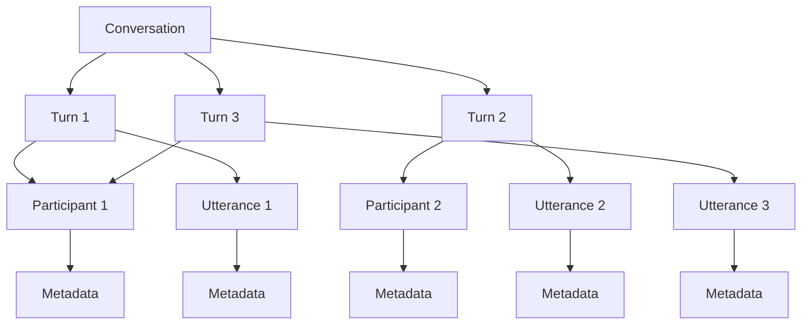
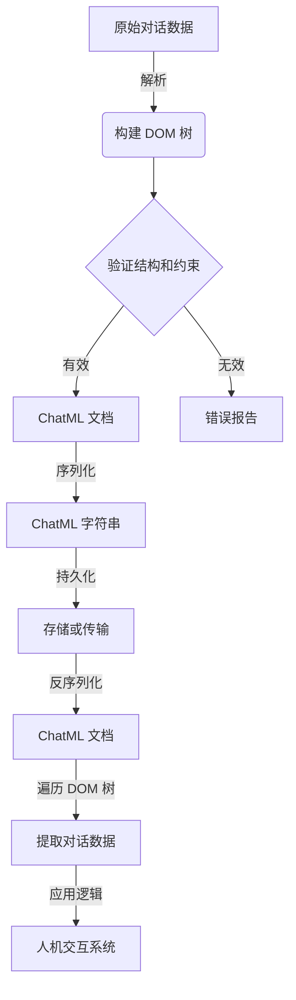

# 大语言模型应用指南：ChatML交互格式

## 1.背景介绍

### 1.1 大语言模型的兴起

近年来,随着计算能力的飞速提升和海量数据的积累,大型语言模型(Large Language Models, LLMs)在自然语言处理领域取得了令人瞩目的成就。这些模型通过在海量文本语料库上进行预训练,学习到了丰富的语言知识和上下文信息,从而具备了强大的语言理解和生成能力。

代表性的大语言模型包括 GPT-3、PaLM、ChatGPT 等,它们在各种自然语言处理任务上表现出色,如机器翻译、文本摘要、问答系统、内容创作等,极大地推动了人工智能在自然语言领域的发展。

### 1.2 人机交互的新范式

传统的人机交互方式通常是基于命令行或图形用户界面,用户需要熟悉特定的操作命令或界面布局。而大语言模型的出现为人机交互带来了全新的范式——自然语言交互。用户只需使用自然语言表达需求,大语言模型便可以理解并生成相应的自然语言响应,实现无缝的人机对话。

这种自然语言交互方式打破了传统人机交互的障碍,使得普通用户也能够方便地与人工智能系统进行交流,极大地降低了使用门槛。同时,大语言模型强大的语言理解和生成能力,使得人机对话更加自然流畅,提升了用户体验。

### 1.3 ChatML: 标准化的人机对话格式

虽然大语言模型为人机交互带来了新的可能性,但是缺乏统一的交互标准会导致不同系统之间的兼容性问题,阻碍了大规模的应用和发展。为了解决这一问题,ChatML(Chat Markup Language)应运而生,旨在为人机对话交互提供一种标准化的描述格式。

ChatML 是一种基于 XML 的标记语言,它定义了一系列标签和属性,用于描述人机对话的各个组成部分,如对话角色、对话内容、元数据等。通过 ChatML,人机对话可以被结构化地表示和存储,从而实现跨系统和跨平台的互操作性。

本文将重点介绍 ChatML 的核心概念、语法规范和应用场景,为读者提供一个全面的指南,帮助他们掌握这一新兴的人机交互标准,并探索其在实际应用中的潜力。

## 2.核心概念与联系

### 2.1 ChatML 的核心概念

ChatML 围绕着人机对话的核心要素构建,包括以下几个关键概念:

1. **Conversation(对话)**: 表示一个完整的人机对话过程,包含多个 Turn。
2. **Turn(回合)**: 表示对话中的一个回合,由一个 Participant 发起,可能包含一个或多个 Utterance。
3. **Participant(参与者)**: 表示对话中的一个参与者,可以是人类或机器智能体。
4. **Utterance(发言)**: 表示参与者在一个回合中的一段发言内容。
5. **Metadata(元数据)**: 描述对话、回合、参与者或发言的附加信息,如时间戳、语言、情感等。

这些核心概念通过 ChatML 的标记进行描述和组织,形成了一个结构化的人机对话表示方式。



### 2.2 ChatML 与其他标记语言的联系

ChatML 的设计借鉴了一些现有的标记语言和数据格式,如 XML、JSON 等,但针对人机对话场景进行了专门的优化和扩展。

与 XML 相似,ChatML 采用了基于标签的树状结构来表示数据,具有良好的可读性和可扩展性。但与 XML 不同的是,ChatML 专门针对人机对话场景进行了定制化设计,引入了对话、回合、参与者等特定概念,更好地捕捉了人机交互的本质特征。

与 JSON 相比,ChatML 虽然也是一种结构化数据格式,但它更加注重数据的语义和层次关系,而不仅仅是键值对的平面表示。这使得 ChatML 在描述复杂的人机对话时更加清晰和直观。

此外,ChatML 还借鉴了一些其他领域的标记语言和数据格式,如 HTML、Markdown 等,在表示文本格式、链接、多媒体内容等方面提供了丰富的支持。

通过与现有技术的融合和创新,ChatML 成为了一种专门为人机对话场景量身定制的标准化描述格式,为大规模应用和发展奠定了基础。

## 3.核心算法原理具体操作步骤

### 3.1 ChatML 文档结构

一个完整的 ChatML 文档由以下几个部分组成:

```xml
<?xml version="1.0" encoding="UTF-8"?>
<conversation>
  <metadata>
    <!-- 对话级元数据 -->
  </metadata>
  <turn>
    <participant>
      <metadata>
        <!-- 参与者级元数据 -->
      </metadata>
      <!-- 参与者信息 -->
    </participant>
    <utterance>
      <metadata>
        <!-- 发言级元数据 -->
      </metadata>
      <!-- 发言内容 -->
    </utterance>
  </turn>
  <!-- 更多回合 -->
</conversation>
```

1. **XML 声明**: 指定 XML 版本和字符编码。
2. **`<conversation>`**: 表示一个完整的人机对话,包含一个或多个 `<turn>` 元素。
3. **`<metadata>`**: 描述对话、参与者或发言的元数据信息,可以嵌套在不同层级。
4. **`<turn>`**: 表示一个对话回合,包含一个 `<participant>` 元素和一个或多个 `<utterance>` 元素。
5. **`<participant>`**: 描述对话参与者的信息,如姓名、角色、头像等。
6. **`<utterance>`**: 表示参与者在该回合中的一段发言内容。

通过这种层次化的结构,ChatML 能够清晰地表示人机对话的各个组成部分及其关系,同时也为元数据的灵活扩展留下了空间。

### 3.2 元数据的表示

元数据在 ChatML 中扮演着重要的角色,它为对话、参与者和发言提供了附加的上下文信息。元数据可以嵌套在 `<metadata>` 元素中,使用键值对的形式进行描述。

```xml
<metadata>
  <key1>value1</key1>
  <key2>value2</key2>
  <!-- 更多键值对 -->
</metadata>
```

元数据的键值对可以是任意合法的 XML 元素名称和元素内容,这为元数据的扩展性提供了极大的灵活性。常见的元数据包括:

- 时间戳: `<timestamp>2023-06-01T12:34:56Z</timestamp>`
- 语言: `<language>zh-CN</language>`
- 情感: `<sentiment>positive</sentiment>`
- 话题: `<topic>technology</topic>`
- 等等

通过合理利用元数据,ChatML 可以为人机对话提供丰富的上下文信息,支持更智能和个性化的交互体验。

### 3.3 多媒体内容的嵌入

除了纯文本内容之外,ChatML 还支持在发言中嵌入多种多媒体内容,如图像、视频、音频等,以增强交互的表现力和吸引力。

```xml
<utterance>
  这是一段文本发言,其中嵌入了一张图片:
  
</utterance>
```

多媒体内容可以使用标准的 HTML 标签进行嵌入,如 ``、`<video>`、`<audio>` 等。这些标签可以包含诸如源地址、备注文本等属性,以便正确地呈现和描述多媒体内容。

通过多媒体内容的支持,ChatML 不仅可以描述纯文本对话,还能够表示丰富的多模态人机交互场景,如图像问答、视频描述等,极大地扩展了其应用范围。

### 3.4 ChatML 处理流程

将人机对话数据转换为 ChatML 格式,或从 ChatML 格式解析出对话数据,都需要经过一系列处理步骤。以下是一个典型的 ChatML 处理流程:



1. **解析**: 将原始对话数据解析为 ChatML 文档对象模型 (DOM) 树。
2. **验证**: 检查 DOM 树是否符合 ChatML 的结构和约束规则。
3. **序列化**: 将验证通过的 DOM 树序列化为 ChatML 字符串格式。
4. **持久化**: 将 ChatML 字符串持久化到存储介质或传输到其他系统。
5. **反序列化**: 从持久化的 ChatML 字符串重建 ChatML 文档。
6. **遍历 DOM 树**: 遍历 ChatML 文档的 DOM 树,提取出所需的对话数据。
7. **应用逻辑**: 将提取的对话数据输入到人机交互系统中,执行相应的应用逻辑。

通过这一流程,ChatML 可以无缝地集成到各种人机交互系统中,实现对话数据的标准化表示、存储、传输和处理。

## 4.数学模型和公式详细讲解举例说明

虽然 ChatML 主要关注对话数据的结构化表示,但在某些场景下,还需要对对话内容进行数学建模和分析。以下是一些常见的数学模型和公式,可用于描述和优化人机对话过程。

### 4.1 对话流模型

对话流可以看作是一个马尔可夫过程,其中每个状态表示对话的当前上下文,转移概率则描述了下一个发言的可能性。我们可以使用隐马尔可夫模型 (HMM) 来建模对话流:

$$
P(U_1, U_2, \ldots, U_T) = \prod_{t=1}^T P(U_t | S_t) P(S_t | S_{t-1})
$$

其中 $U_t$ 表示第 $t$ 个发言, $S_t$ 表示第 $t$ 个隐状态。目标是最大化观测序列 $U_1, U_2, \ldots, U_T$ 的概率,可以通过 Viterbi 算法或 Baum-Welch 算法进行参数估计和状态解码。

### 4.2 对话行为建模

在某些场景下,我们需要对参与者的对话行为进行建模和预测。一种常见的方法是使用增强型马尔可夫决策过程 (POMDP),它可以同时考虑对话状态、参与者行为和观测结果之间的关系。

$$
P(A_t | O_{1:t}, A_{1:t-1}) \propto \sum_{S_t} P(O_t | S_t) \sum_{S_{t-1}} P(S_t | S_{t-1}, A_{t-1}) P(A_t | S_t)
$$

其中 $A_t$ 表示第 $t$ 个行为, $O_t$ 表示第 $t$ 个观测结果, $S_t$ 表示第 $t$ 个状态。目标是最大化给定过去观测和行为序列的当前行为概率,可以通过值迭代或策略迭代算法求解。

### 4.3 对话策略优化

在设计人机对话系统时,我们需要优化对话策略,以提高用户体验和任务完成率。一种常见的方法是将对话策略建模为马尔可夫决策过程 (MDP