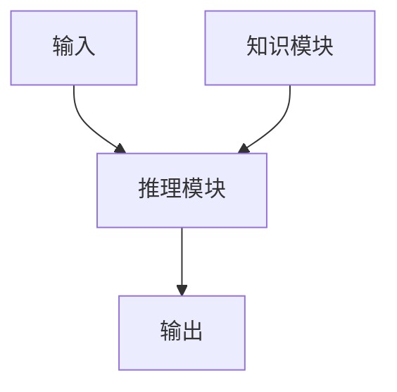
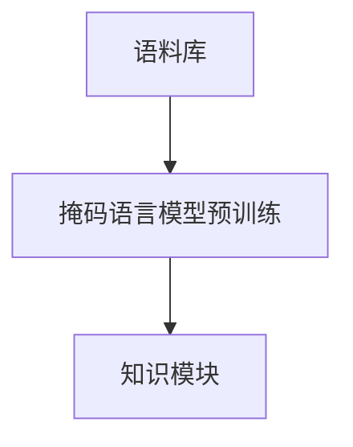
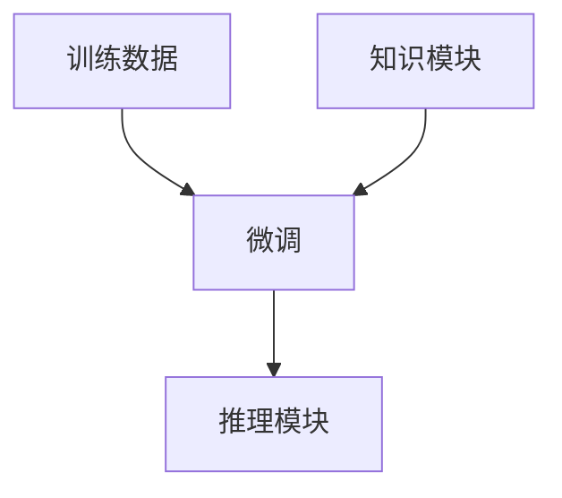
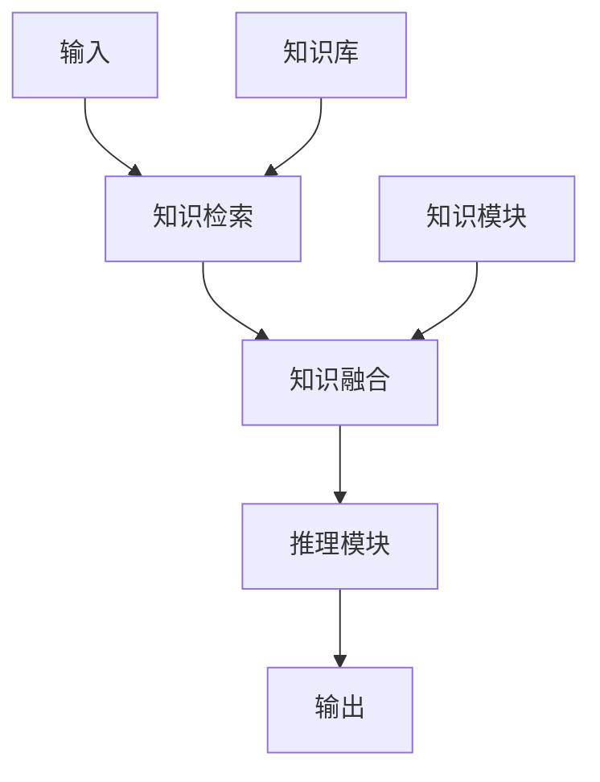

# 大语言模型应用指南：Gemini简介

## 1.背景介绍

### 1.1 大语言模型的兴起

近年来,自然语言处理(NLP)领域取得了长足进步,很大程度上得益于大型语言模型(Large Language Models, LLMs)的兴起。传统的NLP系统通常依赖于手工设计的特征和规则,难以捕捉语言的复杂性和多样性。而大型语言模型则通过在大规模文本语料上进行自监督学习,自动获取语言的丰富知识和语义信息,显著提升了NLP任务的性能表现。

大型语言模型通过注意力机制和transformer架构,能够有效地捕捉长距离的上下文依赖关系,并在下游任务中通过微调的方式快速迁移学习,取得了令人瞩目的成绩。代表性的模型有GPT、BERT、XLNet等,其中GPT-3更是凭借高达1750亿参数的规模,展现出了惊人的泛化能力。

### 1.2 大语言模型的挑战

尽管大型语言模型取得了巨大成功,但仍面临诸多挑战亟待解决。首先是训练和推理的计算成本高昂,需要大量的计算资源;其次是模型的可解释性和可控性较差,存在潜在的安全隐患;此外,大型语言模型也容易受到数据中的偏见和噪声的影响,产生不当的输出。因此,如何在保持模型性能的同时,降低计算成本、提高可解释性和可控性,是大型语言模型发展的关键课题。

### 1.3 Gemini的诞生

为了应对上述挑战,微软亚洲研究院提出了Gemini,一种新型的大语言模型架构。Gemini通过将大型语言模型解耦为两个相对独立的模块(一个用于捕获语言知识,另一个用于推理和生成),实现了高效的计算和更好的可解释性。同时,Gemini还引入了多种创新技术,如混合注意力机制、知识增强等,进一步提升了模型的性能和可控性。本文将对Gemini的核心思想、关键技术及其应用进行全面介绍。

## 2.核心概念与联系

### 2.1 Gemini的双塔架构

Gemini的核心思想是将传统的单一大型语言模型解耦为两个相对独立的模块:知识模块(Knowledge Module)和推理模块(Reasoning Module)。知识模块的作用是捕获语言的丰富知识和语义信息,而推理模块则负责根据输入和知识进行推理和生成输出。

这种双塔架构的优势在于:

1. **高效计算**:知识模块和推理模块可以分别进行预训练和微调,避免了对整个大型模型进行昂贵的训练,从而大幅降低了计算成本。
2. **可解释性**:通过分离知识和推理,可以更好地理解模型的决策过程,提高了可解释性。
3. **可控性**:可以针对不同的任务和场景,灵活地设计和优化推理模块,提高了模型的可控性。
4. **模块化设计**:知识模块和推理模块相对解耦,便于模块化设计和扩展。

Gemini的双塔架构如下图所示:

### 2.2 知识模块

知识模块的作用是从大规模语料中学习丰富的语言知识和语义信息。它通常是一个大型的transformer模型,采用自监督的方式进行预训练,如掩码语言模型(Masked Language Modeling)、下一句预测(Next Sentence Prediction)等。

知识模块的预训练过程如下:

经过预训练后,知识模块能够捕获语言的丰富知识,为下游任务提供强大的语义表示能力。

### 2.3 推理模块

推理模块的作用是根据输入和知识模块提供的语义信息,进行推理和生成输出。与知识模块相比,推理模块通常采用较小的模型结构,以提高计算效率。

推理模块的训练过程如下:

在训练过程中,推理模块利用知识模块提供的语义表示作为辅助信息,结合训练数据进行微调,学习特定任务的推理和生成能力。由于推理模块的规模较小,训练过程相对高效。

### 2.4 知识增强

为了进一步提升模型的性能和可控性,Gemini引入了知识增强(Knowledge Enhancement)的概念。知识增强是指在推理过程中,将外部知识库中的结构化知识融入到模型的推理过程中。

知识增强的过程如下:

具体来说,根据输入,系统会从知识库中检索相关的结构化知识;然后将检索到的知识与知识模块提供的语义表示进行融合,形成增强的语义表示;最后,推理模块基于增强的语义表示进行推理和生成。

通过知识增强,Gemini不仅能够利用预训练获得的语言知识,还能融入外部的结构化知识,从而提高模型的性能和可解释性。同时,由于知识库是可配置的,也增强了模型的可控性。

## 3.核心算法原理具体操作步骤

### 3.1 知识模块预训练

Gemini的知识模块采用了自监督的预训练方式,主要包括以下两个预训练任务:

1. **掩码语言模型(Masked Language Modeling, MLM)**

MLM任务的目标是根据上下文,预测被掩码的词。具体操作步骤如下:

1) 从语料库中随机采样一个序列
2) 在序列中随机选择15%的词进行掩码,替换为特殊的[MASK]标记
3) 使用transformer模型对被掩码的词进行预测
4) 将预测的词与真实词进行对比,计算交叉熵损失,并通过梯度下降优化模型参数

通过MLM预训练,知识模块可以学习到丰富的语义和上下文信息。

2. **下一句预测(Next Sentence Prediction, NSP)** 

NSP任务的目标是判断两个句子是否为连续的句子对。具体操作步骤如下:

1) 从语料库中随机采样一个句子对(A,B)
2) 以50%的概率,保持(A,B)的原始顺序;或者以50%的概率,随机选择另一个句子C,构成(A,C)
3) 使用transformer模型预测(A,B)是否为真实的句子对
4) 将预测结果与真实标签进行对比,计算二分类损失,并通过梯度下降优化模型参数

通过NSP预训练,知识模块可以学习到句子之间的关系和逻辑连贯性。

MLM和NSP两个预训练任务相互补充,共同帮助知识模块构建强大的语言表示能力。

### 3.2 推理模块微调

推理模块的训练过程是在知识模块预训练的基础上,针对特定的下游任务进行微调。微调的具体步骤如下:

1) 准备下游任务的训练数据集
2) 将训练数据输入到推理模块,并利用知识模块提供的语义表示作为辅助信息
3) 计算推理模块在训练数据上的损失函数(如分类损失、生成损失等)
4) 通过梯度下降,优化推理模块的参数,使其在下游任务上的性能最大化

需要注意的是,在微调过程中,知识模块的参数是固定的,只优化推理模块的参数。这样做的好处是:

1) 避免破坏知识模块学习到的通用语言知识
2) 降低计算成本,只需优化较小的推理模块
3) 增强了可解释性,推理模块的决策依赖于知识模块提供的语义表示

通过微调,推理模块可以学习到特定任务的推理和生成能力,并利用知识模块的语义表示提高性能。

### 3.3 知识增强

知识增强模块的作用是将外部知识库中的结构化知识融入到模型的推理过程中,以提高模型的性能和可解释性。知识增强的具体步骤如下:

1) **知识检索**

根据输入,从知识库中检索相关的实体、关系等结构化知识。知识检索可以采用基于规则的方法,也可以使用学习到的检索模型。

2) **知识表示**

将检索到的结构化知识转换为向量表示,以便后续融合到语义表示中。常用的方法包括:

- 基于图神经网络对知识图谱进行编码
- 基于预训练语言模型对文本知识进行编码

3) **知识融合**

将知识表示与知识模块提供的语义表示进行融合,生成增强的语义表示。融合方式包括:

- 简单拼接
- 门控融合(利用注意力机制动态调节语义表示和知识表示的权重)
- 知识路由(根据输入自适应选择不同的知识源进行融合)

4) **推理生成**

推理模块基于增强的语义表示,进行下游任务的推理和生成。

通过知识增强,Gemini可以充分利用外部知识库,提高模型的性能和可解释性。同时,由于知识库是可配置的,也增强了模型的可控性和灵活性。

## 4.数学模型和公式详细讲解举例说明

### 4.1 Transformer模型

Transformer是Gemini中知识模块和推理模块的基础模型架构。它基于自注意力(Self-Attention)机制,能够有效捕捉长距离的依赖关系,在许多NLP任务上取得了卓越的表现。

Transformer的核心思想是利用自注意力机制,直接对序列中的每个元素进行加权编码,而不需要依赖序列的顺序信息。自注意力的计算公式如下:

$$\mathrm{Attention}(Q, K, V) = \mathrm{softmax}(\frac{QK^T}{\sqrt{d_k}})V$$

其中:

- $Q$为查询(Query)向量
- $K$为键(Key)向量
- $V$为值(Value)向量
- $d_k$为缩放因子,用于防止点积过大导致梯度饱和

自注意力机制通过计算查询向量与所有键向量的相似性,得到一个注意力分数向量,然后将注意力分数与值向量进行加权求和,得到最终的编码表示。

在Transformer中,自注意力被应用在编码器(Encoder)和解码器(Decoder)的多头注意力(Multi-Head Attention)层中。多头注意力的计算公式如下:

$$\mathrm{MultiHead}(Q, K, V) = \mathrm{Concat}(head_1, \dots, head_h)W^O$$
$$\text{where } head_i = \mathrm{Attention}(QW_i^Q, KW_i^K, VW_i^V)$$

其中$W_i^Q$、$W_i^K$、$W_i^V$和$W^O$都是可学习的线性投影参数。多头注意力机制通过并行计算多个注意力头,能够从不同的子空间获取信息,提高了模型的表示能力。

除了多头注意力层,Transformer还包括前馈网络(Feed-Forward Network)层、层归一化(Layer Normalization)和残差连接(Residual Connection)等组件,共同构建了强大的序列建模能力。

### 4.2 混合注意力机制

虽然Transformer模型在捕捉长距离依赖关系方面表现出色,但在处理局部依赖关系时,其性能并不理想。为了解决这个问题,Gemini提出了混合注意力机制(Hybrid Attention),将自注意力与卷积注意力(Convolutional Attention)相结合。

卷积注意力的计算公式如下:

$$\mathrm{ConvAttention}(X) = \mathrm{softmax}(\frac{(X \circledast K)K^T}{\sqrt{d_k}}) \odot (X \circledast V)$$

其中:

- $X$为输入序列
- $K$