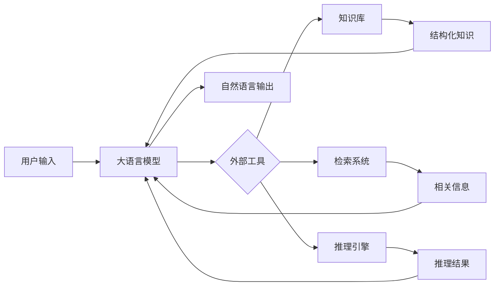

# 大语言模型应用指南：为什么需要外部工具

## 1. 背景介绍
### 1.1 大语言模型的兴起
近年来,随着深度学习技术的快速发展,大语言模型(Large Language Model, LLM)逐渐成为自然语言处理(Natural Language Processing, NLP)领域的研究热点。从2018年的BERT[1]、GPT[2],到2019年的GPT-2[3],再到2020年的GPT-3[4]和2021年的PaLM[5]等,大语言模型在各种NLP任务上取得了令人瞩目的成绩,展现出了强大的语言理解和生成能力。

### 1.2 大语言模型的局限性
尽管大语言模型在NLP领域取得了巨大的成功,但它们仍然存在一些固有的局限性[6]:

1. 知识获取和存储能力有限:大语言模型主要通过预训练从海量文本数据中学习知识,但这种知识获取方式难以覆盖所有领域,且知识更新速度较慢。
2. 推理和逻辑能力不足:大语言模型更擅长基于模式匹配和统计规律进行预测,在复杂推理和逻辑分析方面表现欠佳。
3. 缺乏外部信息交互:大语言模型难以主动获取和利用实时的外部信息,难以适应动态变化的应用场景。

### 1.3 外部工具的必要性
为了突破大语言模型的局限性,研究者们提出了引入外部工具(External Tools)的思路[7]。外部工具可以是各种知识库、检索系统、推理引擎等,通过与大语言模型的结合,可以显著增强模型的知识获取、逻辑推理和信息交互能力。本文将深入探讨大语言模型与外部工具结合的核心概念、关键技术、实践案例和未来发展趋势。

## 2. 核心概念与联系
### 2.1 大语言模型
大语言模型是一类基于深度神经网络,通过在大规模文本数据上进行预训练,从而学习到强大语言表征和生成能力的模型[8]。常见的大语言模型包括:

- BERT:基于Transformer的双向编码器表示模型,通过掩码语言模型和下一句预测任务进行预训练。
- GPT系列:基于Transformer的自回归语言模型,通过最大化下一个词的概率进行预训练。
- PaLM:谷歌提出的Pathways Language Model,通过Pathways架构和高效的稀疏专家模型实现万亿参数量级。

### 2.2 外部工具
外部工具是指独立于大语言模型之外,可以为其提供知识补充、逻辑推理、信息检索等能力的各类工具和系统[9]。常见的外部工具包括:

- 知识库:结构化或半结构化的知识库系统,如维基百科、Freebase等。
- 检索系统:基于关键词、语义等方式的信息检索系统,如搜索引擎、问答系统等。
- 推理引擎:基于规则、逻辑、因果等方式的推理决策系统,如专家系统、因果推理图等。

### 2.3 大语言模型与外部工具的关系
大语言模型与外部工具是一种互补和协同的关系[10]:

- 大语言模型负责自然语言理解和生成,将用户需求转化为结构化的查询语句。
- 外部工具负责知识存储、信息检索和逻辑推理,为大语言模型提供所需的外部信息。
- 大语言模型根据外部工具的反馈信息,生成最终的自然语言回复,完成人机交互。

下图展示了大语言模型与外部工具的交互流程:



## 3. 核心算法原理与操作步骤
将大语言模型与外部工具进行结合,需要解决以下几个关键问题:

1. 如何将自然语言查询转化为结构化的外部工具输入?
2. 如何选择和调用合适的外部工具?
3. 如何将外部工具的输出信息整合到大语言模型中?

### 3.1 查询转换
将自然语言查询转化为结构化的外部工具输入,主要采用以下两种方法:

1. 基于模板的方法:预先定义一系列查询模板,通过关键信息抽取和槽位填充,将自然语言查询转换为结构化的查询语句[11]。
2. 基于语义解析的方法:通过语义分析技术,如命名实体识别、关系抽取、语义角色标注等,直接从自然语言查询中提取结构化的语义表示[12]。

查询转换的一般步骤如下:

1. 对自然语言查询进行预处理,如分词、词性标注、命名实体识别等。
2. 根据预定义的模板或语义解析规则,提取查询中的关键信息,如实体、关系、属性等。
3. 将提取出的关键信息填充到查询模板或语义表示中,形成结构化的查询语句。
4. 根据查询语句的类型和内容,选择合适的外部工具进行调用。

### 3.2 外部工具选择与调用
选择和调用合适的外部工具,需要考虑以下几个因素:

1. 查询类型:根据查询的类型(如事实型、推理型、开放型等),选择适合的外部工具。
2. 知识领域:根据查询涉及的知识领域(如百科知识、专业领域知识等),选择覆盖相应领域的外部工具。
3. 性能效率:根据外部工具的性能和效率,选择查询响应时间较短的外部工具。

外部工具调用的一般步骤如下:

1. 根据查询语句的类型和内容,确定需要调用的外部工具。
2. 将查询语句转化为外部工具的输入格式,如API调用参数、SQL语句等。
3. 调用外部工具的接口,执行查询或推理操作。
4. 获取外部工具的输出结果,对结果进行解析和提取。

### 3.3 信息整合
将外部工具的输出信息整合到大语言模型中,需要解决以下两个问题:

1. 信息表示:如何将结构化的外部工具输出转化为大语言模型可以处理的表示形式?
2. 信息融合:如何将外部工具的输出信息与大语言模型的已有知识进行融合?

信息整合的一般步骤如下:

1. 将外部工具的输出结果转化为向量、文本、图等大语言模型可以处理的表示形式。
2. 将转化后的外部信息表示与大语言模型的上下文表示进行融合,如拼接、注意力机制等。
3. 利用融合后的表示,通过大语言模型生成最终的自然语言回复。

## 4. 数学模型与公式详解
### 4.1 查询转换模型
对于基于模板的查询转换方法,可以使用条件随机场(Conditional Random Field, CRF)模型[13]来实现。CRF是一种常用的序列标注模型,可以根据上下文信息对序列中的每个元素进行分类。

给定一个输入序列$x=(x_1,x_2,...,x_n)$和对应的标签序列$y=(y_1,y_2,...,y_n)$,CRF模型定义了条件概率分布:

$$P(y|x)=\frac{1}{Z(x)}\exp\left(\sum_{i=1}^n\sum_{j=1}^m\lambda_jf_j(y_{i-1},y_i,x,i)\right)$$

其中,$Z(x)$是归一化因子,$f_j$是特征函数,$\lambda_j$是对应的权重参数。通过最大化似然函数,可以学习出最优的权重参数:

$$\hat{\lambda}=\arg\max_{\lambda}\sum_{i=1}^N\log P(y^{(i)}|x^{(i)})$$

在预测阶段,给定输入序列$x$,可以通过动态规划算法(如Viterbi算法)找到最优的标签序列$y^*$:

$$y^*=\arg\max_yP(y|x)$$

### 4.2 外部工具选择模型
对于外部工具的选择,可以使用多标签分类模型[14]来实现。多标签分类是指一个样本可以同时属于多个类别,每个类别对应一个外部工具。

给定一个查询语句$q$和$m$个候选外部工具,可以将其表示为一个$m$维的二值向量$y=(y_1,y_2,...,y_m)$,其中$y_i\in\{0,1\}$表示是否选择第$i$个外部工具。多标签分类模型的目标是学习一个函数$f:Q\rightarrow\{0,1\}^m$,将查询语句映射为外部工具选择向量。

常用的多标签分类模型包括二元相关性(Binary Relevance)、分类器链(Classifier Chains)等。以二元相关性为例,它将多标签分类问题转化为$m$个独立的二元分类问题,对于每个外部工具$i$,训练一个二元分类器$f_i:Q\rightarrow\{0,1\}$。在预测阶段,将$m$个分类器的输出拼接起来,得到最终的外部工具选择向量:

$$f(q)=(f_1(q),f_2(q),...,f_m(q))$$

### 4.3 信息融合模型
对于外部工具输出信息与大语言模型知识的融合,可以使用注意力机制(Attention Mechanism)[15]来实现。注意力机制可以根据当前的上下文动态地分配不同的权重,实现信息的选择性融合。

给定大语言模型的上下文向量$h_t$和外部工具的输出向量$e_1,e_2,...,e_k$,注意力机制计算每个外部工具输出的权重:

$$\alpha_{ti}=\frac{\exp(score(h_t,e_i))}{\sum_{j=1}^k\exp(score(h_t,e_j))}$$

其中,$score$函数可以是简单的点积、双线性函数等。根据注意力权重,可以计算外部信息的加权和:

$$c_t=\sum_{i=1}^k\alpha_{ti}e_i$$

最后,将外部信息向量$c_t$与上下文向量$h_t$进行拼接或非线性变换,得到融合后的表示:

$$\tilde{h}_t=\tanh(W_c[c_t;h_t]+b_c)$$

融合后的表示$\tilde{h}_t$可以用于后续的自然语言生成任务。

## 5. 项目实践：代码实例与详解
下面以一个简单的问答系统为例,演示如何使用Python实现大语言模型与外部知识库的结合。

### 5.1 环境准备
首先,安装必要的Python库:

```bash
pip install transformers wikipedia
```

其中,transformers库提供了常用的预训练语言模型,wikipedia库用于访问维基百科的API。

### 5.2 加载预训练模型
使用transformers库加载预训练的GPT-2模型和分词器:

```python
from transformers import GPT2LMHeadModel, GPT2Tokenizer

model_name = "gpt2"
model = GPT2LMHeadModel.from_pretrained(model_name)
tokenizer = GPT2Tokenizer.from_pretrained(model_name)
```

### 5.3 实现维基百科知识库查询
定义一个函数,用于根据查询语句从维基百科中检索相关的知识:

```python
import wikipedia

def retrieve_knowledge(query):
    try:
        page = wikipedia.page(query)
        return page.summary
    except:
        return ""
```

### 5.4 实现查询转换和外部工具调用
定义一个函数,将自然语言查询转换为外部工具的输入,并调用维基百科知识库进行查询:

```python
def query_external_tool(query):
    # 查询转换
    query_words = query.split()
    query_entity = " ".join(query_words[2:])  # 简单地假设查询语句的格式为"What is [entity]?"
    
    # 外部工具调用
    knowledge = retrieve_knowledge(query_entity)
    
    return knowledge
```

### 5.5 实现信息融合和自然语言生成
定义一个函数,将外部知识库的查询结果与