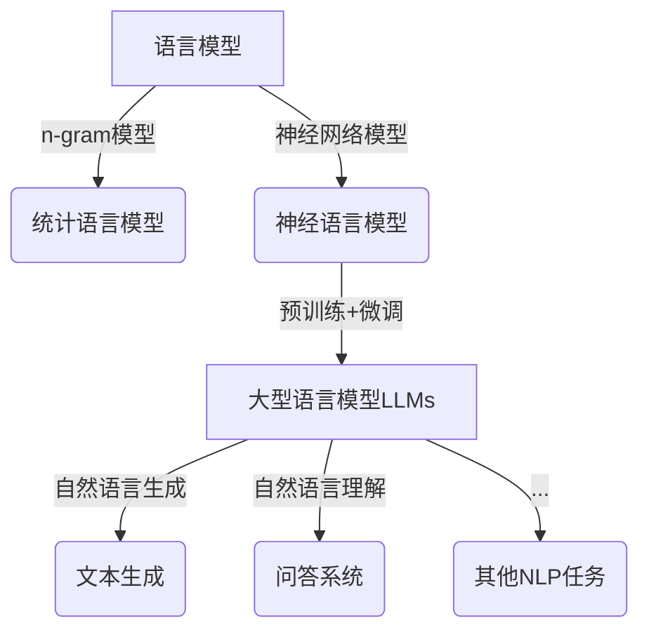
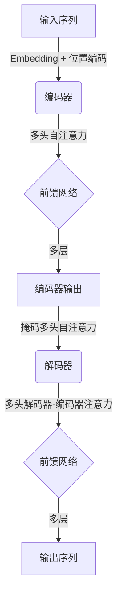

# 大语言模型应用指南：交互格式

## 1.背景介绍

随着人工智能技术的不断发展,大型语言模型(Large Language Models, LLMs)已经成为当前最炙手可热的技术之一。LLMs是一种基于深度学习的自然语言处理(NLP)模型,通过在海量文本数据上进行训练,能够生成看似人类写作的连贯、流畅的文本。

LLMs的出现为人机交互带来了全新的可能性。传统的人机交互方式往往局限于有限的命令集和预定义的响应模式,而LLMs则能够理解和生成自然语言,使得人机对话变得更加自然和智能化。目前,LLMs已经广泛应用于问答系统、写作辅助、智能客服等多个领域。

## 2.核心概念与联系

### 2.1 语言模型

语言模型(Language Model)是自然语言处理领域的一个核心概念。它是一种概率分布模型,用于计算一个语句或词序列出现的概率。语言模型广泛应用于机器翻译、语音识别、文本生成等任务中。

传统的语言模型通常基于n-gram统计模型或神经网络模型。n-gram模型根据历史上n-1个词来预测下一个词的概率,而神经网络语言模型则利用循环神经网络或transformer等深度学习模型来捕捉语言的上下文信息。

### 2.2 大型语言模型(LLMs)

大型语言模型(LLMs)是指具有数十亿甚至上万亿参数的大规模预训练语言模型。这些模型通过在海量文本数据上进行自监督学习,学习到了丰富的语言知识和上下文信息。

LLMs的核心思想是"预训练+微调"范式。在预训练阶段,模型在大量无标注文本数据上进行自监督学习,捕捉语言的统计规律;在微调阶段,模型根据特定的下游任务进行进一步的监督训练,从而获得针对性的能力。

一些著名的LLMs包括GPT-3、BERT、XLNet、T5等。这些模型展现出了惊人的自然语言生成和理解能力,在多个NLP任务上取得了state-of-the-art的表现。



## 3.核心算法原理具体操作步骤

### 3.1 Transformer模型

Transformer是LLMs中最核心和最常用的模型架构之一。它完全基于注意力(Attention)机制,摒弃了传统序列模型中的循环神经网络结构,大大提高了并行计算能力。

Transformer的主要组成部分包括编码器(Encoder)和解码器(Decoder)。编码器用于处理输入序列,解码器则生成输出序列。两者均由多个相同的层组成,每一层包含多头自注意力(Multi-Head Attention)和前馈神经网络(Feed-Forward Neural Network)子层。

1. **输入embedding**:将输入token (如单词或子词)映射为embedding向量。
2. **位置编码**:为每个embedding向量添加相对或绝对位置信息。
3. **编码器**:输入序列通过编码器层,每一层包含:
    - **多头自注意力**:计算输入序列中每个位置的表示,并关注与其他位置的关系。
    - **前馈网络**:对注意力输出进行进一步处理。
4. **解码器**(仅用于seq2seq任务):
    - **掩码多头自注意力**:防止每个位置关注后续位置。
    - **多头解码器-编码器注意力**:将解码器输出与编码器输出进行关注。
    - **前馈网络**:对注意力输出进行进一步处理。
5. **输出**:解码器最终输出序列。



### 3.2 LLMs预训练

LLMs的预训练通常采用自监督学习的方式,主要有以下几种策略:

1. **Causal Language Modeling(CLM)**:给定前缀文本,模型需要预测下一个token。这种方式被GPT等模型采用。
2. **Masked Language Modeling(MLM)**:随机掩码部分输入token,模型需要预测被掩码的token。BERT等模型采用此方法。
3. **次序预测**:判断两个句子的前后顺序是否正确,用于学习句子间的关系,BERT采用此辅助目标。
4. **替换token检测**:给定一个token,判断它是否是原始token,用于检测生成质量,ELECTRA等模型采用此策略。

预训练的目标是最大化模型在训练数据上的似然,通过梯度下降算法不断调整参数。预训练数据集通常包括大量高质量网页、书籍等文本数据。

### 3.3 LLMs微调

在完成通用预训练后,LLMs往往需要针对特定的下游任务进行进一步的微调训练。常见的微调方法包括:

1. **全模型微调**:在预训练模型的基础上,对全部参数进行微调,适用于大多数情况。
2. **仅微调部分层**:只微调模型的部分层(如最后几层),其余层保持不变,可减少计算开销。
3. **前馈层微调**:仅微调前馈网络层,保持注意力层不变,可快速适应新任务。
4. **Prompt Tuning**:固定住预训练模型的参数,只对连续的prompt进行训练,常用于小数据集场景。

微调时需要准备相应的任务数据集,并设计合适的输入表示形式。此外,还需要注意过拟合、标签不平衡等常见问题,并采取合适的策略(如正则化、数据增强等)。

## 4.数学模型和公式详细讲解举例说明

### 4.1 Transformer中的注意力机制

注意力机制是Transformer的核心,它能够自动捕捉输入序列中任意两个位置之间的依赖关系。对于给定的查询向量$q$、键向量$k$和值向量$v$,注意力计算公式如下:

$$\mathrm{Attention}(Q, K, V) = \mathrm{softmax}\left(\frac{QK^T}{\sqrt{d_k}}\right)V$$

其中,$d_k$是缩放因子,用于防止点积过大导致softmax函数的梯度较小。

多头注意力机制可以从不同的表示子空间捕捉不同的相关性,公式如下:

$$\mathrm{MultiHead}(Q, K, V) = \mathrm{Concat}(head_1, ..., head_h)W^O$$
$$\text{where } head_i = \mathrm{Attention}(QW_i^Q, KW_i^K, VW_i^V)$$

$W_i^Q\in\mathbb{R}^{d_\text{model}\times d_k}, W_i^K\in\mathbb{R}^{d_\text{model}\times d_k}, W_i^V\in\mathbb{R}^{d_\text{model}\times d_v}$和$W^O\in\mathbb{R}^{hd_v\times d_\text{model}}$是可学习的线性投影参数。

### 4.2 LLMs中的交叉熵损失

LLMs在预训练和微调时,通常采用最大化序列概率(等同于最小化交叉熵损失)作为目标函数。对于一个长度为$T$的序列$\boldsymbol{x}=(x_1,...,x_T)$,其损失函数为:

$$\mathcal{L}(\boldsymbol{x}) = -\sum_{t=1}^T\log P(x_t|\boldsymbol{x}_{<t};\boldsymbol{\theta})$$

其中,$\boldsymbol{\theta}$是模型参数,$P(x_t|\boldsymbol{x}_{<t};\boldsymbol{\theta})$表示基于之前的子序列$\boldsymbol{x}_{<t}$,模型预测当前token $x_t$的概率。

对于Masked LM任务,公式可改写为:

$$\mathcal{L}(\boldsymbol{x}) = -\sum_{t\in\mathcal{M}}\log P(x_t|\boldsymbol{x}_{\backslash t};\boldsymbol{\theta})$$

其中,$\mathcal{M}$是被掩码token的位置集合,$\boldsymbol{x}_{\backslash t}$表示将$x_t$位置掩码后的序列。

## 5.项目实践：代码实例和详细解释说明

以下是使用PyTorch实现的一个简单的Transformer模型示例,用于机器翻译任务。为了简洁,我们只实现了编码器和解码器的一个层。

```python
import torch
import torch.nn as nn
import math

# 辅助层
class PositionalEncoding(nn.Module):
    def __init__(self, d_model, dropout=0.1, max_len=5000):
        super(PositionalEncoding, self).__init__()
        self.dropout = nn.Dropout(p=dropout)
        pe = torch.zeros(max_len, d_model)
        position = torch.arange(0, max_len, dtype=torch.float).unsqueeze(1)
        div_term = torch.exp(torch.arange(0, d_model, 2).float() * (-math.log(10000.0) / d_model))
        pe[:, 0::2] = torch.sin(position * div_term)
        pe[:, 1::2] = torch.cos(position * div_term)
        pe = pe.unsqueeze(0).transpose(0, 1)
        self.register_buffer('pe', pe)

    def forward(self, x):
        x = x + self.pe[:x.size(0), :]
        return self.dropout(x)

# 注意力层
class MultiHeadAttention(nn.Module):
    def __init__(self, heads, d_model, dropout=0.1):
        super().__init__()
        self.d_model = d_model
        self.d_k = d_model // heads
        self.h = heads
        self.q_linear = nn.Linear(d_model, d_model)
        self.v_linear = nn.Linear(d_model, d_model)
        self.k_linear = nn.Linear(d_model, d_model)
        self.dropout = nn.Dropout(dropout)
        self.out = nn.Linear(d_model, d_model)

    def forward(self, q, k, v, mask=None):
        bs = q.size(0)
        # perform linear operation and split into h heads
        k = self.k_linear(k).view(bs, -1, self.h, self.d_k)
        q = self.q_linear(q).view(bs, -1, self.h, self.d_k)
        v = self.v_linear(v).view(bs, -1, self.h, self.d_k)
        # transpose to get dimensions bs * h * sl * d_model
        k = k.transpose(1, 2)
        q = q.transpose(1, 2)
        v = v.transpose(1, 2)
        # calculate attention using function we will define next
        scores = attention(q, k, v, self.d_k, mask, self.dropout)
        # concatenate heads and put through final linear layer
        concat = scores.transpose(1, 2).contiguous().view(bs, -1, self.d_model)
        output = self.out(concat)
    return output

# 编码器层
class EncoderLayer(nn.Module):
    def __init__(self, d_model, heads, dropout=0.1):
        super().__init__()
        self.norm_1 = nn.LayerNorm(d_model)
        self.norm_2 = nn.LayerNorm(d_model)
        self.attn = MultiHeadAttention(heads, d_model)
        self.ff = nn.Sequential(
            nn.Linear(d_model, 4 * d_model),
            nn.ReLU(),
            nn.Linear(4 * d_model, d_model)
        )
        self.dropout_1 = nn.Dropout(dropout)
        self.dropout_2 = nn.Dropout(dropout)

    def forward(self, x, mask):
        x2 = self.norm_1(x)
        x = x + self.dropout_1(self.attn(x2, x2, x2, mask))
        x2 = self.norm_2(x)
        x = x + self.dropout_2(self.ff(x2))
        return x

# 解码器层（与编码器层类似）
class DecoderLayer(nn.Module):
    ...

# Transformer模型
class Transformer(nn.Module):
    def __init__(self, src_vocab, tgt_vocab, d_model, N, heads):
        super().__init__()
        self.encoder = nn.ModuleList([EncoderLayer(d_