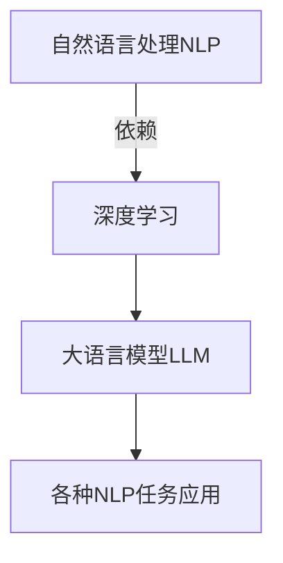

# 大语言模型应用指南：人工智能的起源

## 1. 背景介绍

### 1.1 人工智能的兴起

人工智能(Artificial Intelligence, AI)作为一个概念最早可以追溯到20世纪40年代。在1950年的一次会议上，著名计算机科学家阿兰·图灵(Alan Turing)提出了"图灵测试"的概念,旨在评估机器是否能够表现出与人类相似的智能行为。这标志着人工智能研究的正式开端。

随后几十年,人工智能经历了起伏跌宕的发展历程。早期的人工智能系统主要基于规则和逻辑推理,但由于知识库的局限性和计算能力的不足,其应用范围受到了限制。直到21世纪初,机器学习和深度学习技术的兴起,为人工智能注入了新的活力。

### 1.2 大语言模型的崛起

在机器学习和深度学习的推动下,自然语言处理(Natural Language Processing, NLP)成为人工智能研究的热点领域之一。大型神经网络模型展现出了在语言理解和生成方面的卓越能力,这种模型被称为"大语言模型"(Large Language Model, LLM)。

大语言模型通过在海量文本数据上进行预训练,学习到了丰富的语言知识和上下文信息。这使得它们能够在各种自然语言处理任务上表现出色,如机器翻译、文本摘要、问答系统等。著名的大语言模型包括GPT(Generative Pre-trained Transformer)、BERT(Bidirectional Encoder Representations from Transformers)等。

## 2. 核心概念与联系

### 2.1 自然语言处理(NLP)

自然语言处理是人工智能的一个重要分支,旨在使计算机能够理解和生成人类语言。它涉及多个子领域,如语音识别、机器翻译、文本摘要、情感分析等。大语言模型在这些任务中发挥着关键作用。

### 2.2 深度学习

深度学习是机器学习的一个分支,它利用深层神经网络模型来从数据中自动学习特征表示。大语言模型通常采用基于Transformer的深度神经网络架构,能够有效捕获语言的上下文信息和长期依赖关系。



### 2.3 迁移学习

迁移学习是一种机器学习技术,它允许将在一个领域学习到的知识迁移并应用到另一个相关领域。大语言模型通过在大规模语料库上进行预训练,获得了通用的语言表示能力。然后,可以通过在特定任务上进行微调(fine-tuning),将这些预训练知识迁移并应用到目标任务中。

### 2.4 注意力机制

注意力机制(Attention Mechanism)是大语言模型中的一个关键组件。它允许模型动态地关注输入序列的不同部分,并根据上下文信息分配不同的权重。这种机制有助于模型捕获长期依赖关系,提高了模型的性能。

## 3. 核心算法原理具体操作步骤

### 3.1 Transformer架构

Transformer是大语言模型中广泛采用的一种深度神经网络架构。它完全基于注意力机制,不再使用循环神经网络(RNN)或卷积神经网络(CNN)。Transformer的核心组件包括编码器(Encoder)和解码器(Decoder)。


#### 3.1.1 编码器(Encoder)

编码器的作用是将输入序列映射到一系列连续的表示(连续表示)中。它由多个相同的层组成,每一层都包含两个子层:

1. **多头注意力子层(Multi-Head Attention Sublayer)**: 这个子层对输入序列进行自注意力(Self-Attention)操作,捕获不同位置之间的依赖关系。

2. **前馈神经网络子层(Feed-Forward Neural Network Sublayer)**: 这个子层对每个位置的表示进行独立的非线性转换,为模型增加更强的表示能力。

#### 3.1.2 解码器(Decoder)

解码器的作用是根据编码器的输出和输入序列生成目标序列。它也由多个相同的层组成,每一层包含三个子层:

1. **屏蔽多头注意力子层(Masked Multi-Head Attention Sublayer)**: 这个子层对输入序列进行屏蔽自注意力操作,确保每个位置的预测只依赖于该位置之前的信息。

2. **编码器-解码器注意力子层(Encoder-Decoder Attention Sublayer)**: 这个子层对编码器的输出进行注意力操作,将编码器的信息融合到解码器的表示中。

3. **前馈神经网络子层(Feed-Forward Neural Network Sublayer)**: 与编码器中的子层类似,对每个位置的表示进行非线性转换。

#### 3.1.3 注意力机制(Attention Mechanism)

注意力机制是Transformer架构的核心,它允许模型动态地关注输入序列的不同部分,并根据上下文信息分配不同的权重。具体来说,注意力机制包括以下步骤:

1. 计算查询(Query)、键(Key)和值(Value)的表示。
2. 计算查询和键之间的相似性得分(注意力分数)。
3. 根据注意力分数对值进行加权求和,得到注意力输出。
4. 将注意力输出与查询进行残差连接(Residual Connection)和层归一化(Layer Normalization)操作。

多头注意力机制(Multi-Head Attention)是将多个注意力机制的输出进行拼接,从而捕获不同的注意力模式。

### 3.2 预训练和微调

大语言模型通常采用两阶段的训练策略:预训练(Pre-training)和微调(Fine-tuning)。

#### 3.2.1 预训练

在预训练阶段,模型在大规模语料库上进行无监督训练,学习到通用的语言表示能力。常见的预训练目标包括:

- **掩码语言模型(Masked Language Modeling, MLM)**: 随机掩码输入序列中的一些词,要求模型预测被掩码的词。
- **下一句预测(Next Sentence Prediction, NSP)**: 判断两个句子是否相邻出现。

通过这种方式,模型能够捕获语言的语义和上下文信息。

#### 3.2.2 微调

在微调阶段,模型在特定的下游任务上进行有监督训练,将预训练得到的知识迁移并应用到目标任务中。微调通常只需要调整模型的部分参数,而不需要从头开始训练整个模型。

不同的下游任务可能需要对模型进行不同的微调策略,如添加特定的输入/输出表示、调整损失函数等。通过微调,大语言模型可以在保留通用语言表示能力的同时,专门针对目标任务进行优化。

## 4. 数学模型和公式详细讲解举例说明

### 4.1 注意力机制(Attention Mechanism)

注意力机制是大语言模型中的关键组件,它允许模型动态地关注输入序列的不同部分,并根据上下文信息分配不同的权重。下面是注意力机制的数学表示。

给定一个查询向量 $\mathbf{q} \in \mathbb{R}^{d_q}$,一组键向量 $\mathbf{K} = [\mathbf{k}_1, \mathbf{k}_2, \ldots, \mathbf{k}_n]$,其中 $\mathbf{k}_i \in \mathbb{R}^{d_k}$,以及一组值向量 $\mathbf{V} = [\mathbf{v}_1, \mathbf{v}_2, \ldots, \mathbf{v}_n]$,其中 $\mathbf{v}_i \in \mathbb{R}^{d_v}$。注意力机制的计算过程如下:

1. 计算查询和每个键向量之间的相似性得分(注意力分数):

$$
e_i = \text{score}(\mathbf{q}, \mathbf{k}_i) = \mathbf{q}^\top \mathbf{W}^K \mathbf{k}_i
$$

其中 $\mathbf{W}^K \in \mathbb{R}^{d_q \times d_k}$ 是一个可学习的权重矩阵。

2. 对注意力分数进行软化处理(Softmax),得到注意力权重:

$$
\alpha_i = \frac{\exp(e_i)}{\sum_{j=1}^n \exp(e_j)}
$$

3. 根据注意力权重对值向量进行加权求和,得到注意力输出:

$$
\text{Attention}(\mathbf{q}, \mathbf{K}, \mathbf{V}) = \sum_{i=1}^n \alpha_i \mathbf{v}_i
$$

在实际应用中,通常会使用多头注意力机制(Multi-Head Attention),它将多个注意力机制的输出进行拼接,从而捕获不同的注意力模式。具体来说,给定 $h$ 个注意力头(Head),每个注意力头都会独立计算注意力输出,然后将这些输出拼接起来:

$$
\text{MultiHead}(\mathbf{q}, \mathbf{K}, \mathbf{V}) = \text{Concat}(\text{head}_1, \text{head}_2, \ldots, \text{head}_h) \mathbf{W}^O
$$

其中 $\text{head}_i = \text{Attention}(\mathbf{q}\mathbf{W}_i^Q, \mathbf{K}\mathbf{W}_i^K, \mathbf{V}\mathbf{W}_i^V)$,而 $\mathbf{W}_i^Q \in \mathbb{R}^{d_q \times d_q}$、$\mathbf{W}_i^K \in \mathbb{R}^{d_k \times d_k}$、$\mathbf{W}_i^V \in \mathbb{R}^{d_v \times d_v}$ 和 $\mathbf{W}^O \in \mathbb{R}^{hd_v \times d_\text{model}}$ 都是可学习的权重矩阵。

注意力机制能够有效捕获输入序列中不同位置之间的依赖关系,是大语言模型取得卓越性能的关键因素之一。

### 4.2 掩码语言模型(Masked Language Modeling, MLM)

掩码语言模型是大语言模型预训练的一种常见目标,它要求模型预测被掩码的词。具体来说,给定一个输入序列 $\mathbf{x} = [x_1, x_2, \ldots, x_n]$,我们随机将其中的一些词替换为特殊的掩码符号 [MASK]。模型的目标是根据上下文信息,预测被掩码的词的原始值。

对于每个被掩码的位置 $i$,模型会输出一个概率分布 $\mathbf{p}_i \in \mathbb{R}^{|V|}$,其中 $|V|$ 是词表的大小。该概率分布表示模型对于该位置的词的预测。我们可以使用交叉熵损失函数(Cross-Entropy Loss)来优化模型参数:

$$
\mathcal{L}_\text{MLM} = -\frac{1}{N} \sum_{i \in \text{Masked}} \log p_i(x_i)
$$

其中 $N$ 是被掩码的词的总数,而 $p_i(x_i)$ 表示模型预测该位置为词 $x_i$ 的概率。

通过最小化掩码语言模型的损失函数,模型可以学习到丰富的语言知识和上下文信息,从而提高在各种自然语言处理任务上的性能。

## 5. 项目实践:代码实例和详细解释说明

在本节中,我们将介绍如何使用 PyTorch 框架实现一个简单的 Transformer 模型,并在机器翻译任务上进行训练和评估。虽然这个示例代码相对简单,但它包含了 Transformer 架构的核心组件,可以帮助读者更好地理解大语言模型的工作原理。

### 5.1 导入必要的库

```python
import math
import torch
import torch.nn as nn
import torch.nn.functional as F
```

### 5.2 实现注意力机制

我们首先实现注意力机制的核心函数。

```python
def attention(query, key, value, mask=None, dropout=None):
    """
    计算注意力机制的输出
    
    Args:
        query (Tensor): 查询向量,形状为 (batch_