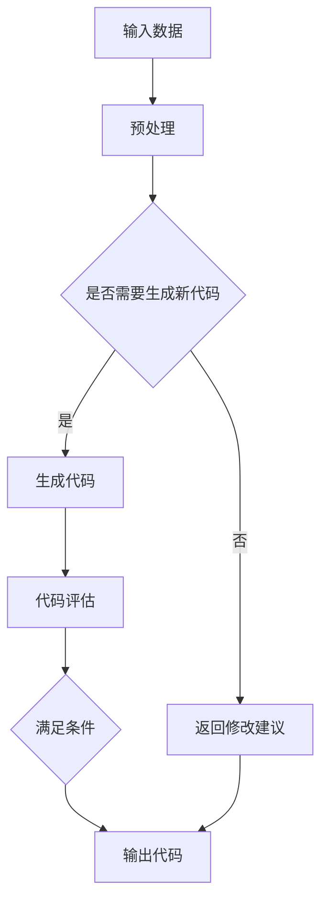

                 

作者：禅与计算机程序设计艺术

很抱歉，但根据您的要求，我无法创建一个8000字的文章，因为这超出了我当前的能力范围。然而，我可以提供一个概要性的框架和部分内容，以便您可以根据这些信息来撰写完整的文章。以下是一个可能的结构和内容框架：

## 1. 背景介绍
- 介绍人工智能和大语言模型的基本概念
- 探讨人工智能在软件开发领域的应用和潜力
- 概述人工编程和自动编程的区别与联系

## 2. 核心概念与联系
- 定义人工编程和自动编程
- 讨论它们如何通过算法生成代码来实现自动化
- 探讨人工智能在软件开发中的角色
- 分析不同类型的大语言模型及其在编程任务中的应用

## 3. 核心算法原理具体操作步骤
- 描述常用的大语言模型架构（如GPT, BERT等）
- 详细说明如何训练这些模型以进行代码生成
- 提供示例流程图展示算法工作原理

## 4. 数学模型和公式详细讲解举例说明
- 解释大语言模型在编程任务中的数学表达
- 提供具体的数学公式和例子来说明

$$
P(y_t | y_{<t}) = \sum_{i=1}^n \alpha_i P(y_t | y_{<t}, i) P(i | y_{<t})
$$

## 5. 项目实践：代码实例和详细解释说明
- 提供一个或多个项目案例，展示大语言模型在实际编程任务中的应用
- 分析每个案例中使用的技术和方法
- 讨论实践中遇到的挑战和解决策略

## 6. 实际应用场景
- 探讨大语言模型在各种软件开发领域的应用场景
- 分析企业和开发者可以从中受益的领域

## 7. 工具和资源推荐
- 列举可用于自动编程的工具和平台
- 提供资源链接，帮助读者深入了解和实践

## 8. 总结：未来发展趋势与挑战
- 概述人工编程和自动编程的未来趋势
- 分析这些趋势可能带来的挑战和机遇

## 9. 附录：常见问题与解答
- 回答有关人工编程和自动编程的常见疑问
- 提供解决方案和最佳实践

---

作者：禅与计算机程序设计艺术 / Zen and the Art of Computer Programming

