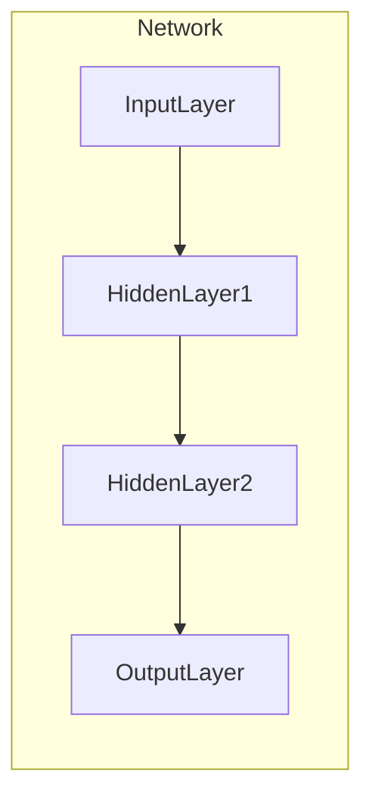
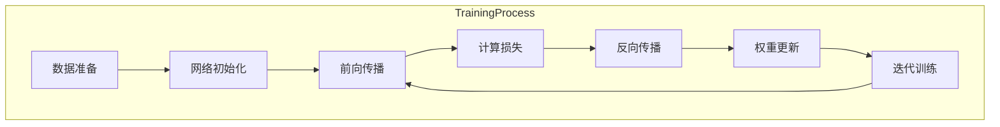

# 大语言模型应用指南：什么是神经网络

## 1. 背景介绍

### 1.1 人工智能的兴起

人工智能(AI)是当代科技领域最令人兴奋的发展之一。从语音助手到自动驾驶汽车,AI系统正在渗透到我们生活的方方面面。推动这一变革的核心是机器学习(ML)和深度学习(DL)等技术,它们赋予计算机以模拟人类智能的能力。

### 1.2 神经网络的重要性

在机器学习和深度学习的众多模型中,神经网络无疑是最为关键和广为人知的一种。它的灵感来源于生物神经系统的工作原理,通过对大量数据的训练,学习并捕捉其中的模式,从而对新的输入数据做出预测或决策。神经网络已广泛应用于图像识别、自然语言处理、推荐系统等领域,是构建人工智能系统的基石。

## 2. 核心概念与联系  

### 2.1 神经网络的基本结构

神经网络由节点(神经元)和连接它们的边(权重)组成。每个节点会从上一层接收输入信号,对其加权求和并应用激活函数,将结果传递给下一层。通过这种层层传递和转换,最终产生输出。



### 2.2 前馈神经网络和反向传播

前馈神经网络(FeedForward Neural Network)是最基本的神经网络形式,数据只会朝一个方向传递。在训练过程中,通过反向传播(BackPropagation)算法,将输出误差逐层反向传递,更新每个连接的权重,使网络逐步学习,提高准确性。

### 2.3 卷积神经网络

卷积神经网络(Convolutional Neural Network, CNN)是一种常用于处理图像等高维数据的专门网络结构。它的卷积层能自动学习数据的空间局部模式,极大降低了对手工设计特征的需求。

### 2.4 循环神经网络

循环神经网络(Recurrent Neural Network, RNN)则专门用于处理序列数据,如自然语言、语音和时间序列等。它通过内部的循环机制,能够捕捉数据中的长期依赖关系,被广泛应用于语音识别、机器翻译等领域。

### 2.5 注意力机制与Transformer

传统的序列模型难以有效处理长期依赖,注意力机制(Attention Mechanism)通过计算不同位置特征之间的相关性,自动学习对重要特征的关注程度,显著提升了模型性能。Transformer是首个完全基于注意力机制的模型,在机器翻译等任务中取得了突破性进展,也孕育了后来的大型语言模型。

### 2.6 大型语言模型

近年来,以GPT、BERT、XLNet、RoBERTa等为代表的大型语言模型(Large Language Model, LLM)凭借巨大的参数量和海量训练数据,展现出了惊人的自然语言理解和生成能力,推动了自然语言处理领域的飞速发展。

## 3. 核心算法原理具体操作步骤

### 3.1 神经网络的训练过程

神经网络的训练过程可分为以下几个关键步骤:

1. **数据准备**: 收集并预处理训练数据,将其转换为神经网络可识别的数值形式。

2. **网络初始化**: 根据任务需求设计网络结构,并初始化每个连接的权重。

3. **前向传播**: 输入数据,计算每一层的输出,直至得到最终输出。

4. **计算损失**: 将输出与标准答案进行比较,计算损失函数的值。

5. **反向传播**: 利用链式法则,计算每个权重相对于损失的梯度。

6. **权重更新**: 根据梯度下降算法,沿梯度的反方向更新每个权重的值。

7. **迭代训练**: 重复上述过程,不断优化网络权重,直至达到预期的性能指标。



### 3.2 常用优化算法

为加快训练收敛速度,通常会使用一些优化算法来更新权重,如:

- **随机梯度下降(SGD)**: 每次使用一个或一小批数据样本计算梯度,更新频繁但可能震荡。

- **动量法(Momentum)**: 在梯度基础上加入一个动量项,有助于加速并跳出局部最优。

- **RMSProp**: 通过指数移动加权平均自适应调整每个参数的学习率。

- **Adam**: 结合动量和RMSProp的优点,是当前最流行的优化算法之一。

### 3.3 正则化技术

为防止过拟合,常采用一些正则化技术:

- **L1/L2正则化**: 在损失函数中加入权重的L1或L2范数惩罚项。

- **Dropout**: 在训练时以一定概率随机将某些神经元的输出临时设为0,避免过度依赖某些特征。

- **批归一化(BatchNorm)**: 对每一层的输入数据进行归一化处理,加速收敛并提高泛化能力。

- **数据增强**: 通过各种变换(旋转、缩放等)生成更多训练样本,增强模型的鲁棒性。

## 4. 数学模型和公式详细讲解举例说明

### 4.1 神经元数学模型

单个神经元的数学模型可表示为:

$$
y = \phi\left(\sum_{i=1}^{n}w_ix_i + b\right)
$$

其中:
- $x_i$是第$i$个输入
- $w_i$是与第$i$个输入相关的权重
- $b$是偏置项
- $\phi$是激活函数,如Sigmoid、ReLU等

### 4.2 损失函数

为衡量模型的预测值与真实值之间的差距,需要定义一个损失函数(Loss Function)。常用的损失函数包括:

- 均方误差(Mean Squared Error, MSE):
  $$\text{MSE}(y, \hat{y}) = \frac{1}{n}\sum_{i=1}^{n}(y_i - \hat{y}_i)^2$$

- 交叉熵损失(Cross-Entropy Loss):
  $$\text{CrossEntropy}(y, \hat{y}) = -\sum_{i=1}^{n}y_i\log\hat{y}_i$$

其中$y$是真实标签,$\hat{y}$是模型预测值。

### 4.3 梯度下降

权重更新的核心是梯度下降算法,其基本形式为:

$$w_{t+1} = w_t - \eta\frac{\partial L}{\partial w_t}$$

其中$L$是损失函数,$\eta$是学习率,决定了每次更新的步长。通过不断迭代,权重朝着损失函数最小值的方向更新。

### 4.4 反向传播

反向传播算法使用链式法则计算每个权重相对于损失函数的梯度:

$$\frac{\partial L}{\partial w_{ij}} = \frac{\partial L}{\partial y_j}\frac{\partial y_j}{\partial z_j}\frac{\partial z_j}{\partial w_{ij}}$$

其中$z_j$是第$j$个神经元的加权输入。通过自下而上的方式,将梯度值逐层传递回每个权重连接。

### 4.5 卷积运算

卷积神经网络中的卷积运算可以用离散卷积公式表示:

$$
S(i, j) = (I * K)(i, j) = \sum_{m}\sum_{n}I(i+m, j+n)K(m, n)
$$

其中$I$是输入特征图,$K$是卷积核(滤波器),$S$是输出特征图。卷积核在输入上滑动,提取局部特征。

## 5. 项目实践:代码实例和详细解释说明

以下是使用Python和PyTorch框架构建一个简单的前馈神经网络分类器的示例:

```python
import torch
import torch.nn as nn

# 定义网络结构
class FeedforwardNet(nn.Module):
    def __init__(self, input_size, hidden_size, output_size):
        super(FeedforwardNet, self).__init__()
        self.fc1 = nn.Linear(input_size, hidden_size)
        self.relu = nn.ReLU()
        self.fc2 = nn.Linear(hidden_size, output_size)

    def forward(self, x):
        out = self.fc1(x)
        out = self.relu(out)
        out = self.fc2(out)
        return out

# 实例化网络
net = FeedforwardNet(input_size=28*28, hidden_size=100, output_size=10)

# 定义损失函数和优化器
criterion = nn.CrossEntropyLoss()
optimizer = torch.optim.Adam(net.parameters(), lr=0.001)

# 训练循环
for epoch in range(10):
    for data, labels in train_loader:
        # 前向传播
        outputs = net(data.view(-1, 28*28))
        loss = criterion(outputs, labels)

        # 反向传播和优化
        optimizer.zero_grad()
        loss.backward()
        optimizer.step()

    # 打印损失
    print(f'Epoch [{epoch+1}/10], Loss: {loss.item():.4f}')
```

以上代码定义了一个包含输入层、隐藏层和输出层的前馈神经网络。在训练循环中,我们执行以下步骤:

1. 将输入数据馈送到网络,获得输出。
2. 计算输出与标签之间的交叉熵损失。
3. 通过反向传播计算梯度。
4. 使用优化器(这里使用Adam)根据梯度更新网络权重。
5. 打印当前epoch的损失值。

经过多次迭代,网络将逐步学习,提高在训练数据上的分类准确率。

## 6. 实际应用场景

神经网络在现实世界中有着广泛的应用,下面列举了一些典型场景:

### 6.1 计算机视觉

- **图像分类**: 识别图像中的物体类别,如猫、狗、汽车等。
- **目标检测**: 在图像中定位并框选出感兴趣的目标物体。
- **语义分割**: 对图像中的每个像素点进行分类,了解场景的语义信息。
- **图像生成**: 基于训练数据,生成逼真的图像,用于增强数据集、图像修复等。

### 6.2 自然语言处理

- **机器翻译**: 将一种自然语言翻译成另一种语言。
- **文本分类**: 根据文本内容自动对文章进行分类,如新闻类别、垃圾邮件识别等。
- **情感分析**: 分析文本的情感倾向,如正面、负面或中性等。
- **问答系统**: 根据输入的自然语言问题,从知识库中检索并生成相应的答复。
- **文本生成**: 自动生成文本内容,如新闻报道、小说、诗歌等。

### 6.3 语音与音频

- **语音识别**: 将语音信号转录为文本。
- **语音合成**: 将文本转换为自然的语音输出。
- **说话人识别**: 识别说话人的身份。
- **音乐生成**: 根据训练数据,生成新的音乐作品。

### 6.4 推荐系统

- **个性化推荐**: 基于用户的历史行为数据,推荐感兴趣的商品、电影、音乐等。
- **社交网络推荐**: 在社交网络中推荐新的好友、帖子等。

### 6.5 金融领域

- **信用评分**: 评估申请人的信用风险。
- **欺诈检测**: 识别可疑的金融交易行为。
- **股票趋势预测**: 预测股票未来的走势。

### 6.6 医疗健康

- **医学图像分析**: 辅助医生诊断疾病,如检测肺部CT图像中的肿瘤。
- **药物发现**: 设计和优化新的药物分子结构。
- **医疗建议**: 根据病人症状提供就医建议。

## 7. 工具和资源推荐

以下是一些流行的深度学习框架和资源:

- **PyTorch**: 由Facebook开发的深度学习框架,设计简洁、接口友好。
- **TensorFlow**: 由Google开发的开源框架,功能全面