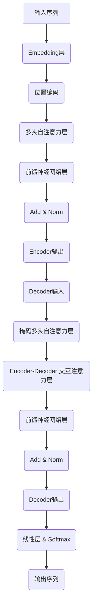

# 大语言模型应用指南：单步优化

## 1. 背景介绍

### 1.1 人工智能的崛起

人工智能(AI)已经成为当今科技领域最炙手可热的话题之一。随着算力的不断提升和数据的快速积累,AI技术在诸多领域展现出了令人惊叹的能力,从语音识别、图像处理到自然语言处理等,AI系统的性能已经可以媲美甚至超越人类水平。

在AI的多个分支中,大语言模型(Large Language Model,LLM)脱颖而出,成为近年来最引人注目的突破性技术。LLM通过在海量文本数据上进行预训练,学习到了丰富的语言知识和上下文关联能力,使其可以生成高质量、连贯流畅的文本输出,为广泛的自然语言处理任务提供强大支持。

### 1.2 大语言模型的兴起

大语言模型的发展可以追溯到2018年,当时谷歌推出了Transformer模型,展示了自注意力机制在序列建模任务中的卓越表现。紧接着,OpenAI发布了GPT(Generative Pre-trained Transformer)模型,通过在大规模语料库上进行预训练,实现了令人印象深刻的文本生成能力。

此后,越来越多的科技巨头和研究机构投入到大语言模型的探索中,模型规模和性能不断突破。2020年,OpenAI发布了拥有17亿参数的GPT-3,展现出了惊人的多任务学习能力,可以通过简单的提示就完成诸如文本生成、问答、代码编写等多种任务。2022年,DeepMind推出了具有5400亿参数的Gopher模型,再次刷新了大语言模型的规模纪录。

### 1.3 大语言模型的应用前景

大语言模型的出现为自然语言处理领域带来了革命性的变革。它们可以应用于多种场景,如智能写作辅助、问答系统、机器翻译、代码生成等,极大提升了人机交互的效率和质量。同时,大语言模型也为其他AI任务提供了强大的基础模型支持,如通过微调(fine-tuning)就可以将其应用于图像描述、关系抽取等下游任务。

然而,大语言模型也面临着一些挑战,如模型的公平性、安全性、可解释性等问题亟待解决。另外,训练大规模模型需要消耗大量的计算资源和能源,如何提高模型的效率和可持续性也是一个重要课题。

总的来说,大语言模型代表了人工智能发展的一个新阶段,它们将为各行各业带来深远的影响,同时也需要我们不断探索和创新,以充分发挥其潜力,并确保其可控、可解释和可持续。

## 2. 核心概念与联系

### 2.1 自然语言处理(NLP)

自然语言处理(Natural Language Processing,NLP)是人工智能的一个重要分支,旨在使计算机能够理解和生成人类语言。NLP技术广泛应用于机器翻译、问答系统、文本摘要、情感分析等领域。

传统的NLP系统通常采用基于规则的方法或统计机器学习模型,需要大量的特征工程和领域知识。而大语言模型则通过在海量语料库上进行无监督预训练,自动学习到丰富的语言知识和上下文关联能力,从而可以更好地理解和生成自然语言。

### 2.2 预训练与微调(Pre-training & Fine-tuning)

大语言模型的训练过程分为两个阶段:预训练(Pre-training)和微调(Fine-tuning)。

预训练阶段是在海量无标注语料库上进行的自监督学习,目标是学习到通用的语言表示能力。常见的预训练目标包括掩码语言模型(Masked Language Modeling)和下一句预测(Next Sentence Prediction)等。通过预训练,模型可以捕捉到丰富的语义和语法信息,为下游任务奠定基础。

微调阶段则是在特定的下游任务数据集上进行有监督的训练,对预训练模型进行进一步调整和优化。由于预训练模型已经学习到了通用的语言知识,微调过程往往可以在较少的数据和较少的训练步骤下取得不错的效果,这种转移学习范式大大提高了模型的数据效率和泛化能力。

### 2.3 注意力机制(Attention Mechanism)

注意力机制是大语言模型中的一个关键组件,它允许模型在处理序列数据时动态地聚焦于输入序列的不同部分,从而捕捉到长距离依赖关系。

最广为人知的注意力机制是Transformer模型中采用的多头自注意力(Multi-Head Self-Attention)。它通过计算查询(Query)、键(Key)和值(Value)之间的相似性分数,动态地为每个输出位置分配不同的注意力权重,从而实现对输入序列的选择性编码。

自注意力机制的引入使得模型可以有效地处理任意长度的序列输入,而不会受到梯度消失或爆炸的影响,这是大语言模型取得巨大成功的重要原因之一。

### 2.4 语义空间(Semantic Space)

大语言模型通过预训练,学习到了丰富的语义表示,将单词、短语和句子映射到一个高维的语义空间中。在这个语义空间中,相似的语义表示会聚集在一起,而不同的语义则会分布在不同的区域。

语义空间的存在使得大语言模型可以捕捉到单词之间的语义相似性和类比关系,从而支持更精确的语义理解和生成。同时,语义空间也为下游任务提供了一种有效的知识迁移方式,通过简单的向量运算就可以实现跨任务的知识迁移和组合。

### 2.5 提示学习(Prompt Learning)

提示学习是大语言模型中一种新兴的范式,它通过设计合适的提示(Prompt),引导预训练模型在特定任务上生成所需的输出,从而实现零样本或少样本学习。

提示可以是一段自然语言文本,也可以是一个任务示例或规则描述。通过巧妙设计提示,可以激活预训练模型中已经学习到的知识,使其生成符合预期的输出,而无需进行大规模的微调或重新训练。

提示学习展现了大语言模型强大的泛化能力和多任务学习潜力,它可以极大地降低下游任务的数据需求,同时也为探索模型的内在知识提供了一种新的途径。

## 3. 核心算法原理具体操作步骤

### 3.1 Transformer模型架构

Transformer是大语言模型中广泛采用的基础架构,它完全基于注意力机制,摒弃了传统的循环神经网络和卷积神经网络结构。Transformer的主要组成部分包括编码器(Encoder)和解码器(Decoder)两个模块。

编码器(Encoder)的作用是将输入序列编码为高维的语义表示,它由多个相同的层组成,每一层包含一个多头自注意力子层和一个前馈神经网络子层。自注意力子层捕捉输入序列中的长距离依赖关系,而前馈子层则对每个位置的表示进行非线性转换,提取更高层次的特征。

解码器(Decoder)的作用是根据编码器的输出和前一步的预测结果,生成目标序列。它也由多个相同的层组成,每一层包含三个子层:掩码多头自注意力层、编码器-解码器注意力层和前馈神经网络层。掩码自注意力层确保解码器只能关注当前位置及之前的输出,而编码器-解码器注意力层则融合了编码器的语义表示,用于指导解码过程。

在训练过程中,Transformer采用了掩码语言模型(Masked Language Modeling)和下一句预测(Next Sentence Prediction)等自监督目标,通过最大化掩码单词和句子连贯性的概率,学习到丰富的语言知识。

### 3.2 自注意力机制(Self-Attention Mechanism)

自注意力机制是Transformer模型的核心组件,它允许模型动态地聚焦于输入序列的不同部分,捕捉长距离依赖关系。

在自注意力计算过程中,每个输入位置都会与其他所有位置进行注意力交互,生成一个注意力分数矩阵。该矩阵反映了当前位置对其他位置的注意力权重,通过加权求和就可以得到当前位置的语义表示。

具体来说,自注意力机制包括以下几个步骤:

1. **线性投影**:将输入序列 $X$ 分别投影到查询(Query)、键(Key)和值(Value)空间,得到 $Q$、$K$ 和 $V$。

$$Q = XW^Q, K = XW^K, V = XW^V$$

2. **计算注意力分数**:通过查询 $Q$ 和键 $K$ 的点积,计算每个位置对应的注意力分数矩阵 $A$。

$$A = \text{softmax}(\frac{QK^T}{\sqrt{d_k}})$$

3. **加权求和**:将注意力分数矩阵 $A$ 与值 $V$ 相乘,得到每个位置的加权和表示 $Z$。

$$Z = AV$$

4. **多头注意力**:为了捕捉不同的子空间表示,自注意力机制会独立地学习多个注意力头,最后将它们的输出拼接起来。

$$\text{MultiHead}(Q, K, V) = \text{Concat}(head_1, \dots, head_h)W^O$$

通过自注意力机制,Transformer可以动态地关注输入序列的不同部分,并捕捉到长距离的依赖关系,这是传统的循环神经网络和卷积神经网络所无法实现的。自注意力机制的引入是大语言模型取得巨大成功的关键因素之一。

### 3.3 掩码语言模型(Masked Language Modeling)

掩码语言模型(Masked Language Modeling,MLM)是大语言模型预训练中广泛采用的自监督目标之一。它的基本思想是在输入序列中随机掩码一些单词,然后让模型根据上下文预测这些被掩码的单词。

具体来说,MLM的训练过程包括以下几个步骤:

1. **掩码处理**:在输入序列中随机选择一些单词位置,用特殊的掩码标记(如[MASK])替换它们。

2. **前向传播**:将掩码后的序列输入到Transformer编码器中,得到每个位置的语义表示。

3. **预测**:对于被掩码的位置,将其语义表示输入到一个分类器(通常是线性层加Softmax)中,预测该位置的单词。

4. **损失计算**:将预测的单词概率分布与真实单词的one-hot编码进行交叉熵计算,得到该位置的损失。

5. **反向传播**:将所有被掩码位置的损失求和,并通过反向传播算法更新模型参数。

通过MLM目标,大语言模型可以学习到丰富的语义和语法知识,捕捉单词之间的关联关系。同时,由于MLM是一种自监督学习方式,它可以利用大规模的无标注语料进行预训练,从而获得更强大的语言理解能力。

### 3.4 下一句预测(Next Sentence Prediction)

下一句预测(Next Sentence Prediction,NSP)是另一种常见的大语言模型预训练目标,它旨在帮助模型学习句子之间的连贯性和逻辑关系。

NSP的训练过程如下:

1. **样本构建**:从语料库中随机抽取一对相邻的句子作为正例,同时也构建一些负例(将第二句替换为语料库中的随机句子)。

2. **输入表示**:将句子对拼接起