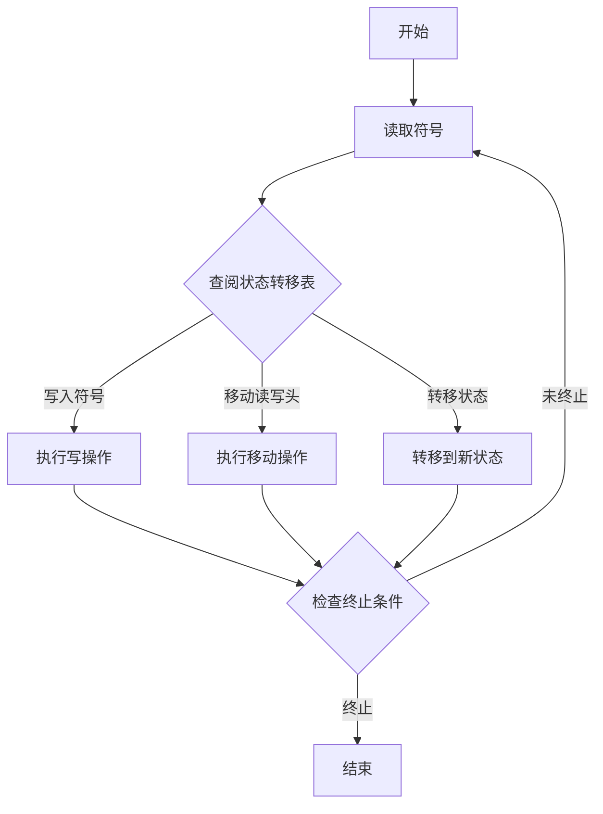
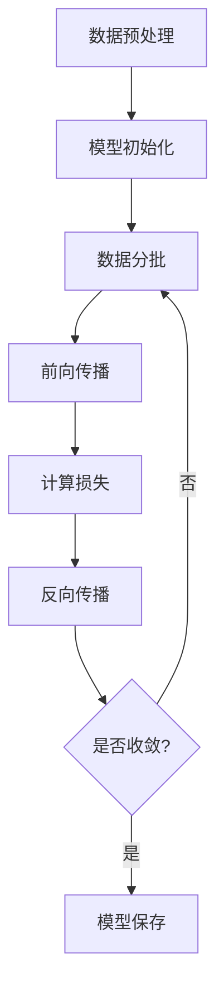

# 大语言模型应用指南：图灵机与大语言模型：可计算性与时间复杂度

## 1. 背景介绍

### 1.1 图灵机的诞生

图灵机是一种抽象的计算模型,由著名的计算机科学家艾伦·图灵在1936年提出。它是一种理论计算机模型,用于研究计算的本质和计算能力的极限。图灵机的设计旨在模拟人类计算员按照一系列规则操作纸带上的符号,从而执行计算任务。

图灵机的核心思想是通过一系列简单的规则来操作无限长的纸带,其上有符号序列。图灵机会根据当前状态和读取到的符号,决定下一步的操作,包括写入新符号、移动纸带位置以及转移到新的状态。这种简单而强大的计算模型奠定了现代计算理论的基础。

### 1.2 大语言模型的兴起

随着深度学习技术的不断发展,大型神经网络模型在自然语言处理领域取得了巨大的成功。大语言模型(Large Language Model,LLM)是一种基于深度学习的自然语言处理模型,通过在大量文本数据上进行预训练,学习语言的统计规律和语义信息。

大语言模型具有强大的文本生成能力,可以根据给定的上下文生成连贯、流畅的文本。它们不仅可以用于传统的自然语言处理任务,如机器翻译、文本摘要等,还可以应用于对话系统、问答系统、内容创作等广泛领域。

### 1.3 可计算性与时间复杂度

可计算性理论研究哪些问题是可计算的,以及计算的本质极限。图灵机提供了一种研究可计算性的有力工具。一个问题如果可以由图灵机解决,则被认为是可计算的。否则,该问题就是不可计算的。

时间复杂度是衡量算法效率的一个重要指标。它描述了算法执行所需的时间与输入规模之间的关系。对于大语言模型而言,由于需要处理大量文本数据,时间复杂度是一个关键的考虑因素,直接影响模型的实用性和可扩展性。

## 2. 核心概念与联系

### 2.1 图灵机与大语言模型的等价性

虽然图灵机和大语言模型看似截然不同,但它们在某种程度上是等价的。事实上,任何可计算的函数都可以被图灵机计算,而大语言模型则是一种通用的函数逼近器,可以近似任何可计算的函数。

我们可以将大语言模型视为一种通用的图灵机,其中神经网络的权重和结构相当于图灵机的状态和转移规则。通过训练,大语言模型学习到了语言的统计规律和语义信息,从而能够生成符合语言规则的文本输出。

### 2.2 可计算性与语言生成

可计算性理论为我们提供了一种研究语言生成能力的框架。一个语言如果可以被图灵机生成,则被认为是可计算的。相反,如果一个语言不能被任何图灵机生成,则它是不可计算的。

大语言模型的语言生成能力取决于它们的表示能力和训练数据。理论上,如果一个大语言模型具有足够的表示能力和充分的训练数据,它就可以生成任何可计算的语言。然而,在实践中,由于计算资源和数据的限制,大语言模型通常只能近似生成某些特定的语言。

### 2.3 时间复杂度与模型效率

时间复杂度是评估大语言模型效率的关键指标之一。对于给定的输入文本,大语言模型需要进行一系列计算操作,包括embedding、注意力计算、前向传播等,这些操作的时间复杂度决定了模型的整体效率。

通常情况下,大语言模型的时间复杂度与输入文本的长度和模型参数的数量有关。当输入文本越长或模型参数越多时,计算时间会显著增加。因此,在设计和优化大语言模型时,需要权衡模型的表示能力和计算效率。

## 3. 核心算法原理具体操作步骤

### 3.1 图灵机的工作原理

图灵机的工作原理可以概括为以下几个步骤:

1. **初始状态**:图灵机处于初始状态,读写头位于纸带的起始位置。
2. **读取符号**:图灵机读取当前读写头所指向的符号。
3. **状态转移**:根据当前状态和读取到的符号,图灵机查阅状态转移表,确定下一步的操作,包括写入新符号、移动读写头以及转移到新的状态。
4. **执行操作**:图灵机执行确定的操作。
5. **终止或循环**:如果达到终止状态,图灵机停止运行;否则,返回步骤2,继续执行。

图灵机的核心思想是通过有限的状态和转移规则,操作无限长的纸带,从而实现复杂的计算。



### 3.2 大语言模型的训练过程

大语言模型的训练过程通常包括以下几个步骤:

1. **数据预处理**:对原始文本数据进行清洗、标记化、构建词表等预处理操作。
2. **模型初始化**:初始化神经网络模型的参数,通常采用随机初始化或预训练模型的参数。
3. **数据分批**:将预处理后的数据划分为多个小批次,以便进行小批量训练。
4. **前向传播**:将输入数据传递给神经网络模型,计算输出结果。
5. **计算损失**:比较模型输出与真实标签之间的差异,计算损失函数的值。
6. **反向传播**:根据损失函数的梯度,使用优化算法(如Adam或SGD)更新模型参数。
7. **重复训练**:重复步骤4-6,直到模型收敛或达到预设的训练轮数。

通过不断迭代这个过程,大语言模型可以学习到语言的统计规律和语义信息,从而提高文本生成的质量。



## 4. 数学模型和公式详细讲解举例说明

### 4.1 图灵机的数学表示

图灵机可以用一个7元组 $M = (Q, \Gamma, b, \Sigma, \delta, q_0, F)$ 来表示,其中:

- $Q$ 是一个有限的状态集合
- $\Gamma$ 是纸带上的符号集合
- $b \in \Gamma$ 是纸带的空白符号
- $\Sigma \subseteq \Gamma - \{b\}$ 是输入符号集合
- $\delta: Q \times \Gamma \rightarrow Q \times \Gamma \times \{L, R\}$ 是状态转移函数
- $q_0 \in Q$ 是初始状态
- $F \subseteq Q$ 是终止状态集合

状态转移函数 $\delta$ 定义了图灵机在每个状态下读取到特定符号时的操作。它返回一个三元组 $(q', s', d)$,其中 $q'$ 是下一个状态, $s'$ 是要写入的符号, $d$ 是读写头的移动方向(左移 $L$ 或右移 $R$)。

例如,假设我们有一个图灵机 $M = (\{q_0, q_1, q_2\}, \{0, 1, b\}, b, \{0, 1\}, \delta, q_0, \{q_2\})$,其中 $\delta$ 定义如下:

$$
\delta(q_0, 0) = (q_1, 1, R) \\
\delta(q_0, 1) = (q_1, 0, R) \\
\delta(q_1, 0) = (q_1, 0, R) \\
\delta(q_1, 1) = (q_1, 1, R) \\
\delta(q_1, b) = (q_2, b, L)
$$

这个图灵机的功能是将输入的二进制数反转。例如,对于输入 $011b$,它会输出 $110b$。

### 4.2 大语言模型的数学表示

大语言模型通常采用基于transformer的架构,其核心是自注意力机制。给定一个长度为 $n$ 的输入序列 $X = (x_1, x_2, \ldots, x_n)$,自注意力机制计算每个位置 $i$ 的输出表示 $y_i$ 如下:

$$
y_i = \sum_{j=1}^n \alpha_{ij}(X_j W^V)
$$

其中 $W^V$ 是一个可学习的值矩阵,用于将输入向量 $X_j$ 映射到值空间。注意力权重 $\alpha_{ij}$ 是通过计算查询向量 $Q_i$ 和键向量 $K_j$ 之间的相似性得到的:

$$
\alpha_{ij} = \frac{e^{Q_i K_j^T}}{\sum_{k=1}^n e^{Q_i K_k^T}}
$$

$Q_i$ 和 $K_j$ 分别是通过线性变换得到的查询向量和键向量:

$$
Q_i = X_i W^Q, \quad K_j = X_j W^K
$$

其中 $W^Q$ 和 $W^K$ 是可学习的查询矩阵和键矩阵。

通过堆叠多个自注意力层和前馈神经网络层,大语言模型可以捕捉输入序列中的长程依赖关系,从而生成高质量的文本输出。

## 5. 项目实践:代码实例和详细解释说明

### 5.1 图灵机模拟器

为了更好地理解图灵机的工作原理,我们可以使用Python实现一个简单的图灵机模拟器。以下是一个示例代码:

```python
class TuringMachine:
    def __init__(self, states, tape, transition_func, start_state, final_states):
        self.states = states
        self.tape = list(tape)
        self.transition_func = transition_func
        self.current_state = start_state
        self.final_states = final_states
        self.head_pos = 0

    def run(self):
        while self.current_state not in self.final_states:
            current_symbol = self.tape[self.head_pos]
            next_state, write_symbol, move = self.transition_func[(self.current_state, current_symbol)]
            self.tape[self.head_pos] = write_symbol
            self.current_state = next_state
            if move == 'R':
                self.head_pos += 1
            elif move == 'L':
                self.head_pos -= 1

        return ''.join(self.tape)

# 定义状态转移函数
transition_func = {
    ('q0', '0'): ('q1', '1', 'R'),
    ('q0', '1'): ('q1', '0', 'R'),
    ('q1', '0'): ('q1', '0', 'R'),
    ('q1', '1'): ('q1', '1', 'R'),
    ('q1', '_'): ('q2', '_', 'L')
}

# 初始化图灵机
tm = TuringMachine(
    states=['q0', 'q1', 'q2'],
    tape='011_',
    transition_func=transition_func,
    start_state='q0',
    final_states=['q2']
)

# 运行图灵机
result = tm.run()
print(result)  # 输出: 110_
```

在这个示例中,我们定义了一个 `TuringMachine` 类来模拟图灵机的工作过程。`run()` 方法实现了图灵机的核心逻辑,包括读取当前符号、查阅状态转移函数、执行相应操作等步骤。

我们还定义了一个状态转移函数 `transition_func`,用于将输入的二进制数反转。最后,我们初始化了一个图灵机实例,并运行它以获得反转后的结果。

### 5.2 大语言模型实现示例

下面是一个使用PyTorch实现的简单大语言模型