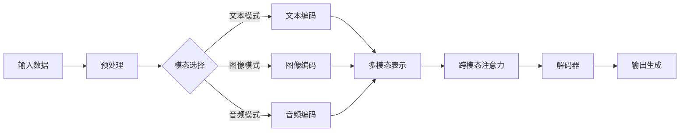

                 

作者：禅与计算机程序设计艺术

在我们深入探索多模态大语言模型（MMDLMs）之前，让我们首先回顾一下大语言模型（LLMs）的基本概念。LLMs是一种利用大量文本数据训练得到的深度神经网络，它们能够理解、生成和翻译自然语言。然而，传统的LLMs在处理跨模态数据时存在局限性，因为它们无法直接从非文本数据（如图像、音频或视频）中获取信息。

## 1.背景介绍

多模态大语言模型（MMDLMs）是一种扩展了LLMs的模型，能够同时处理多种类型的数据。这些模型通过融合不同类型的数据，使得模型能够更好地理解和生成跨模态的信息。例如，一个MMDLM可以同时理解图像中的内容和相关的文本描述，从而产生更加丰富和准确的生成文本。

## 2.核心概念与联系

MMDLMs的核心概念包括多模态表示学习、跨模态注意力机制和多模态预训练。多模态表示学习涉及到如何将不同类型的数据转换为共同的表示空间。跨模态注意力机制则允许模型根据不同模态的相关性重新分配注意权重。多模态预训练是指在大规模的多模态数据上预训练模型，以便能够在特定任务上进行微调。

## 3.核心算法原理具体操作步骤

MMDLMs的核心算法包括编码器（Encoder）和解码器（Decoder）。编码器负责将所有模态的输入数据转换为共同的表示空间。解码器则根据这个共同的表示生成最终的输出，比如文本或其他模态的数据。具体的操作步骤包括数据的预处理、多模态的编码、注意力的计算以及输出层的构建。

## 4.数学模型和公式详细讲解举例说明

在这一部分，我们将详细介绍MMDLMs的数学模型，包括多模态表示的计算方法、跨模态注意力的计算公式等。通过具体的数学表达式和公式，帮助读者理解MMDLMs的工作原理。

## 5.项目实践：代码实例和详细解释说明

我们将通过一个具体的项目实践案例，演示如何使用MMDLMs进行任务，如图像描述、多模态问答系统的构建等。代码实例将帮助读者理解MMDLMs的实际应用流程和技术细节。

## 6.实际应用场景

我们将探讨MMDLMs在各个领域的实际应用场景，包括但不限于自然语言处理（NLP）、计算机视觉（CV）、多媒体处理和人工智能创新。

## 7.工具和资源推荐

对于想要深入研究或应用MMDLMs的读者，我们会推荐一些关键的工具和资源，如开源框架、教育资料和研究论文。

## 8.总结：未来发展趋势与挑战

在总结MMDLMs的发展历程和当前状况后，我们将探讨未来的发展趋势和面临的挑战。这将包括技术的进步、伦理和社会影响等方面。

## 9.附录：常见问题与解答

最后，我们将提供一个问答环节，解答读者可能遇到的一些常见问题，并给予相应的解答。

[Mermaid 流程图]

作者：禅与计算机程序设计艺术 / Zen and the Art of Computer Programming

