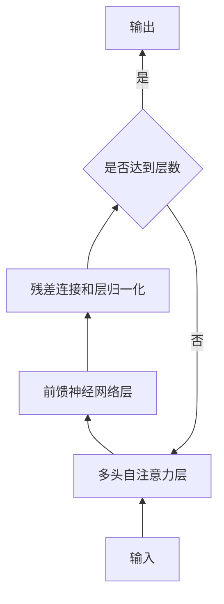

# 大语言模型应用指南：工具

## 1. 背景介绍
### 1.1 大语言模型的兴起
近年来,随着深度学习技术的不断进步,大语言模型(Large Language Models, LLMs)取得了突破性的发展。从GPT-3到ChatGPT,再到最新的LLaMA和Alpaca,大语言模型展现出了惊人的自然语言理解和生成能力,为人工智能领域带来了新的革命。

### 1.2 大语言模型的应用前景
大语言模型强大的语言能力使其在各个领域都有广泛的应用前景,如智能客服、内容创作、代码生成、知识问答等。但对于开发者和企业来说,如何有效地使用和部署大语言模型,构建实际应用,仍然面临诸多挑战。

### 1.3 本文的目的和价值
本文旨在为开发者和企业提供一份全面实用的大语言模型应用指南,重点介绍主流的大语言模型开发工具和平台。通过本文,读者可以了解到:

- 主流大语言模型的特点和适用场景
- 常用的大语言模型开发工具和平台
- 如何使用这些工具快速构建大语言模型应用
- 大语言模型应用开发的最佳实践和注意事项

希望本文能为大家在大语言模型应用开发之路上提供有价值的参考和指导。

## 2. 核心概念与联系
### 2.1 大语言模型的定义
大语言模型是一类基于海量文本数据训练的深度神经网络模型,通过自监督学习掌握了语言的统计规律和语义知识,具备强大的自然语言理解和生成能力。与传统的自然语言处理模型相比,大语言模型具有更好的泛化能力和鲁棒性。

### 2.2 预训练与微调
大语言模型的训练通常分为两个阶段:预训练和微调。

- 预训练阶段:在大规模无标注语料上进行自监督学习,掌握语言的基本规律和常识性知识。常见的预训练任务包括语言模型、掩码语言模型等。
- 微调阶段:在下游任务的标注数据上对预训练模型进行微调,使其适应特定任务。微调可显著减少所需标注数据,加速模型开发。

### 2.3 Transformer 架构
Transformer是当前大语言模型的主流架构。与传统的RNN、CNN等序列模型不同,Transformer使用自注意力机制(Self-Attention)直接建模词与词之间的依赖关系,并行计算效率更高。Transformer的核心组件包括:

- 多头自注意力层(Multi-Head Attention)
- 前馈神经网络层(Feed-Forward Network) 
- 残差连接(Residual Connection)和层归一化(Layer Normalization)

Transformer架构示意图:

### 2.4 记号化与词表
大语言模型的输入需要将文本转换为数字化的记号(Token)序列。常见的记号化方法包括:

- 字符级(Character-Level):将每个字符视为一个记号。
- 子词级(Subword-Level):通过字节对编码(Byte-Pair Encoding, BPE)等算法将词拆分为子词,在保留语义的同时缓解词表过大问题。
- 词级(Word-Level):将每个词视为一个记号,容易产生大量未登录词(Out-of-Vocabulary, OOV)。

不同的记号化粒度会影响模型的性能和泛化能力。目前主流的大语言模型如GPT-3、BERT等大多采用子词级记号化。

## 3. 核心算法原理与操作步骤
### 3.1 预训练算法
#### 3.1.1 语言模型
语言模型的目标是根据前文预测下一个词。给定词序列 $w_1, w_2, ..., w_n$,语言模型的概率为:

$$P(w_1, w_2, ..., w_n) = \prod_{i=1}^n P(w_i | w_1, w_2, ..., w_{i-1})$$

其中 $P(w_i | w_1, w_2, ..., w_{i-1})$ 表示在给定前 $i-1$ 个词的条件下,词 $w_i$ 的条件概率。

训练语言模型的目的是最大化上述概率,常用的损失函数是交叉熵损失:

$$\mathcal{L} = -\sum_{i=1}^n \log P(w_i | w_1, w_2, ..., w_{i-1})$$

#### 3.1.2 掩码语言模型
掩码语言模型(Masked Language Model, MLM)是BERT等模型常用的预训练任务。其核心思想是随机掩盖(mask)输入序列中的部分词,然后让模型根据上下文预测被掩盖的词。

MLM的训练目标是最小化被掩盖位置的预测误差:

$$\mathcal{L}_{\text{MLM}} = -\sum_{i \in \mathcal{M}} \log P(w_i | w_{\backslash \mathcal{M}})$$

其中 $\mathcal{M}$ 表示被掩盖词的位置集合,$w_{\backslash \mathcal{M}}$ 表示去掉被掩盖词的输入序列。

### 3.2 微调算法
#### 3.2.1 分类任务
对于文本分类等任务,可以在预训练语言模型的顶层添加一个线性分类器,然后在标注数据上进行端到端的微调。分类器的损失函数通常是交叉熵损失:

$$\mathcal{L}_{\text{cls}} = -\sum_{i=1}^N \sum_{j=1}^C y_{ij} \log \hat{y}_{ij}$$

其中 $N$ 为样本数,$C$ 为类别数,$y_{ij}$ 为样本 $i$ 属于类别 $j$ 的真实标签,$\hat{y}_{ij}$ 为模型预测的概率。

#### 3.2.2 生成任务
对于文本生成、对话等任务,可以使用预训练语言模型作为解码器,根据输入的上下文生成后续文本。生成过程通常使用beam search等搜索算法,选择概率最大的生成结果。

生成任务的损失函数与语言模型类似,是生成序列的交叉熵损失:

$$\mathcal{L}_{\text{gen}} = -\sum_{i=1}^n \log P(w_i | w_1, w_2, ..., w_{i-1}, c)$$

其中 $c$ 表示输入的上下文信息。

### 3.3 实践操作步骤
#### 3.3.1 环境准备
- 安装深度学习框架如PyTorch、TensorFlow等
- 安装transformers等预训练模型工具包

#### 3.3.2 数据准备
- 收集和清洗原始文本数据
- 使用记号化工具对文本进行预处理
- 构建训练、验证、测试数据集

#### 3.3.3 模型选择和加载
- 根据任务需求选择合适的预训练模型
- 使用transformers等工具包加载预训练模型权重

#### 3.3.4 模型微调
- 根据任务设计输入输出格式
- 在预训练模型顶层添加任务特定的层
- 定义损失函数和评估指标
- 使用标注数据进行模型微调

#### 3.3.5 模型推理与应用
- 使用微调后的模型对新数据进行推理
- 将模型封装为API服务,集成到实际应用系统中

## 4. 数学模型和公式详解
### 4.1 Transformer的数学原理
#### 4.1.1 自注意力机制
Transformer的核心是自注意力机制,可以捕捉词与词之间的依赖关系。对于输入序列 $\mathbf{X} \in \mathbb{R}^{n \times d}$,自注意力的计算过程为:

$$\text{Attention}(\mathbf{Q}, \mathbf{K}, \mathbf{V}) = \text{softmax}(\frac{\mathbf{Q}\mathbf{K}^T}{\sqrt{d_k}})\mathbf{V}$$

其中 $\mathbf{Q}, \mathbf{K}, \mathbf{V} \in \mathbb{R}^{n \times d}$ 分别表示查询(Query)、键(Key)、值(Value),通过输入 $\mathbf{X}$ 与可学习的矩阵 $\mathbf{W}_q, \mathbf{W}_k, \mathbf{W}_v$ 相乘得到:

$$\mathbf{Q} = \mathbf{X}\mathbf{W}_q, \quad \mathbf{K} = \mathbf{X}\mathbf{W}_k, \quad \mathbf{V} = \mathbf{X}\mathbf{W}_v$$

$\sqrt{d_k}$ 是缩放因子,用于控制点积的方差。

#### 4.1.2 多头自注意力
多头自注意力通过并行计算多个自注意力,捕捉不同子空间的信息。设头数为 $h$,每个头的自注意力输出为 $\text{head}_i$,则多头自注意力的计算为:

$$\text{MultiHead}(\mathbf{Q}, \mathbf{K}, \mathbf{V}) = \text{Concat}(\text{head}_1, ..., \text{head}_h)\mathbf{W}_o$$

$$\text{head}_i = \text{Attention}(\mathbf{Q}\mathbf{W}_i^Q, \mathbf{K}\mathbf{W}_i^K, \mathbf{V}\mathbf{W}_i^V)$$

其中 $\mathbf{W}_i^Q, \mathbf{W}_i^K, \mathbf{W}_i^V \in \mathbb{R}^{d \times d_k}$ 为每个头的投影矩阵,$\mathbf{W}_o \in \mathbb{R}^{hd_k \times d}$ 为输出投影矩阵。

#### 4.1.3 前馈神经网络
Transformer的每一层都包含一个前馈神经网络(FFN),对自注意力的输出进行非线性变换。FFN通常是两层带ReLU激活的全连接网络:

$$\text{FFN}(\mathbf{x}) = \text{ReLU}(\mathbf{x}\mathbf{W}_1 + \mathbf{b}_1)\mathbf{W}_2 + \mathbf{b}_2$$

其中 $\mathbf{W}_1 \in \mathbb{R}^{d \times d_f}, \mathbf{W}_2 \in \mathbb{R}^{d_f \times d}$ 为权重矩阵,$\mathbf{b}_1 \in \mathbb{R}^{d_f}, \mathbf{b}_2 \in \mathbb{R}^d$ 为偏置向量,$d_f$ 为FFN的隐藏层维度。

#### 4.1.4 残差连接和层归一化
为了促进梯度传播和训练稳定性,Transformer在每个子层(自注意力和FFN)之后都使用残差连接和层归一化。设子层输入为 $\mathbf{x}$,子层函数为 $f$,则残差连接和层归一化的计算为:

$$\mathbf{x}' = \text{LayerNorm}(\mathbf{x} + f(\mathbf{x}))$$

其中层归一化 $\text{LayerNorm}$ 对每个样本独立地对特征维度进行归一化:

$$\text{LayerNorm}(\mathbf{x}) = \frac{\mathbf{x} - \mu}{\sqrt{\sigma^2 + \epsilon}} \odot \gamma + \beta$$

$\mu, \sigma^2$ 分别为特征维度的均值和方差,$\gamma, \beta$ 为可学习的仿射变换参数。

### 4.2 预训练和微调的损失函数
#### 4.2.1 语言模型损失
语言模型的损失函数是负对数似然,即最小化真实词的负对数概率:

$$\mathcal{L}_{\text{LM}} = -\sum_{i=1}^n \log P(w_i | w_1, w_2, ..., w_{i-1})$$

其中 $P(w_i | w_1, w_2, ..., w_{i-1})$ 是语言模型在给定前 $i-1$ 个词的条件下预测词 $w_i$ 的概率。

#### 4.2.2 掩码语言模型损失
掩码语言模型的损失函数是被掩盖位置的交叉熵损失:

$$\mathcal{L}_{\text{MLM}} = -\sum_{i \in \mathcal{M}} \log P(w_i | w_{\backslash \mathcal{M}})$$

其中 $\mathcal{M}$ 为被