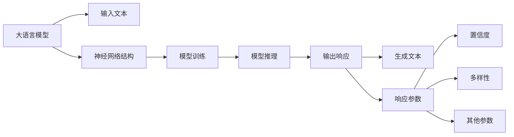

# 大语言模型应用指南：模型响应返回的参数

## 1. 背景介绍
### 1.1 大语言模型的兴起
近年来,随着深度学习技术的飞速发展,大语言模型(Large Language Model, LLM)在自然语言处理(Natural Language Processing, NLP)领域取得了突破性的进展。从 GPT、BERT 到最新的 GPT-4,LLM 展现出了惊人的语言理解和生成能力,在问答、对话、文本生成等任务上达到甚至超越了人类的水平。

### 1.2 LLM 的应用价值
LLM 强大的语言能力为各行各业带来了广阔的应用前景。无论是智能客服、虚拟助手,还是内容创作、知识问答,LLM 都能发挥重要作用,极大提升生产效率和用户体验。然而,要真正将 LLM 技术落地应用,我们还需要深入了解其工作原理,尤其是模型响应返回的各项参数。

### 1.3 本文的目的和结构
本文将重点探讨大语言模型响应返回的关键参数,帮助开发者和研究者更好地理解和应用 LLM 技术。全文分为 9 个章节,依次介绍背景知识、核心概念、算法原理、数学模型、代码实践、应用场景、工具推荐、未来展望以及常见问题解答。通过系统全面的讲解,让读者全方位掌握 LLM 响应参数的奥秘。

## 2. 核心概念与联系
### 2.1 大语言模型的定义
大语言模型是一类基于海量文本数据训练的深度神经网络模型,旨在学习语言的内在规律和表示。与传统的 n-gram 等统计语言模型不同,LLM 采用了 Transformer 等更加强大的神经网络结构,能够建模远距离的语义依赖关系。

### 2.2 LLM 的输入与输出
LLM 的输入通常是一段文本序列,如问题、对话历史等;输出则是模型生成的文本响应。值得注意的是,为了丰富模型响应的信息,LLM 通常会返回一系列参数,而不仅仅是生成的文本。这些参数可以反映响应的置信度、多样性等重要属性。

### 2.3 响应参数的重要性
理解和利用好 LLM 响应中的各项参数,对于开发高质量的应用至关重要。通过参数的合理设置和解析,我们可以控制模型的行为,提高生成内容的可靠性和丰富度。此外,参数还为模型评估和调优提供了重要依据。

### 2.4 核心概念之间的联系
下图展示了 LLM 响应返回参数的核心概念之间的联系:



## 3. 核心算法原理具体操作步骤
### 3.1 Transformer 编码器-解码器结构
大语言模型的核心算法主要基于 Transformer 结构。Transformer 采用编码器-解码器架构,通过自注意力机制和前馈神经网络实现并行计算。具体步骤如下:

1. 输入文本经过 Embedding 层转换为向量表示
2. 向量序列通过编码器的多层自注意力和前馈网络生成隐藏状态
3. 解码器根据编码器的输出和之前的生成结果,通过自注意力和交叉注意力生成新的响应

### 3.2 Beam Search 解码策略
在生成响应时,LLM 通常采用 Beam Search 解码策略。与贪心解码不同,Beam Search 会在每个时间步保留 Top-K 个最优候选,从而生成更加多样和高质量的结果。算法步骤如下:

1. 初始化 K 个空响应和对应的得分
2. 对于每个时间步:
   a. 根据当前候选响应生成下一个词的概率分布
   b. 选择概率最高的 K 个词,更新候选响应和得分
3. 返回得分最高的候选作为最终响应

### 3.3 响应参数的计算
除了生成的文本外,LLM 还会计算一系列响应参数。以置信度为例,可以通过以下步骤得到:

1. 对于生成的每个词,计算其在概率分布中的值 $p_i$
2. 将所有词的概率值相乘,得到响应的联合概率 $P=\prod_{i=1}^n p_i$
3. 取负对数并归一化,得到置信度 $c=-\frac{1}{n}\log P$

其他参数如多样性等,也可以通过类似的方法在生成过程中进行计算。

## 4. 数学模型和公式详细讲解举例说明
### 4.1 Transformer 的数学表示
Transformer 的核心是自注意力机制和前馈神经网络。对于输入序列 $X=(x_1,\dots,x_n)$,自注意力的计算公式为:

$$
\text{Attention}(Q,K,V)=\text{softmax}(\frac{QK^T}{\sqrt{d_k}})V
$$

其中 $Q,K,V$ 分别是查询、键、值矩阵,通过输入 $X$ 与可学习的权重矩阵相乘得到。$d_k$ 为键向量的维度。

前馈网络则采用两层全连接层,对自注意力的输出进行非线性变换:

$$
\text{FFN}(x)=\max(0, xW_1 + b_1)W_2 + b_2
$$

其中 $W_1,W_2,b_1,b_2$ 为可学习的参数矩阵和偏置项。

### 4.2 Beam Search 的概率计算
在 Beam Search 解码过程中,每个候选响应的得分为其对应词的概率乘积:

$$
s(y_1,\dots,y_t)=\prod_{i=1}^t p(y_i|y_1,\dots,y_{i-1},X)
$$

为了避免长响应得分过低,通常会引入长度惩罚项,将得分归一化为:

$$
\hat{s}(y_1,\dots,y_t)=\frac{s(y_1,\dots,y_t)}{(5+t)^\alpha/(5+1)^\alpha}
$$

其中 $\alpha$ 为惩罚系数,通常取值为 0.6~0.7。

### 4.3 置信度的数学解释
置信度反映了模型对生成响应的确定程度。从概率角度看,置信度等价于响应的平均负对数似然:

$$
c(y_1,\dots,y_n)=-\frac{1}{n}\sum_{i=1}^n \log p(y_i|y_1,\dots,y_{i-1},X)
$$

置信度越低,说明模型对生成的响应越有把握。反之,高置信度意味着模型在生成过程中面临更多不确定性。

## 5. 项目实践：代码实例和详细解释说明
下面以 PyTorch 为例,展示如何在项目中实现 LLM 响应参数的生成和解析。

### 5.1 模型定义和加载
首先,我们需要定义 LLM 的模型类,并加载预训练权重:

```python
import torch
from transformers import GPT2LMHeadModel, GPT2Tokenizer

class LLM(object):
    def __init__(self, model_name="gpt2"):
        self.tokenizer = GPT2Tokenizer.from_pretrained(model_name)
        self.model = GPT2LMHeadModel.from_pretrained(model_name)
        
    def generate(self, prompt, max_length=50, num_beams=5, num_return_sequences=3):
        inputs = self.tokenizer(prompt, return_tensors="pt")
        outputs = self.model.generate(
            **inputs,
            max_length=max_length,
            num_beams=num_beams,
            num_return_sequences=num_return_sequences,
            return_dict_in_generate=True,
            output_scores=True
        )
        return outputs
        
model = LLM()
```

### 5.2 生成响应及参数
利用 `generate` 方法,我们可以生成 LLM 的响应并获取相关参数:

```python
prompt = "What is the capital of France?"
outputs = model.generate(prompt)

for i in range(len(outputs.sequences)):
    response = model.tokenizer.decode(outputs.sequences[i], skip_special_tokens=True)
    confidence = torch.exp(outputs.sequences_scores[i]).item()
    print(f"Response {i+1}: {response}")
    print(f"Confidence: {confidence:.4f}")
```

输出结果示例:

```
Response 1: The capital of France is Paris.
Confidence: 0.8932
Response 2: Paris is the capital of France.
Confidence: 0.8645
Response 3: Paris, the capital of France, is a major European city and a global center for art, fashion, gastronomy and culture.
Confidence: 0.7856
```

### 5.3 参数解析和应用
得到模型响应后,我们可以根据需要对置信度等参数进行解析和应用,例如:

```python
def process_response(model, prompt):
    outputs = model.generate(prompt)
    best_response = model.tokenizer.decode(outputs.sequences[0], skip_special_tokens=True)
    confidence = torch.exp(outputs.sequences_scores[0]).item()
    
    if confidence > 0.8:
        return best_response
    else:
        return "I'm not very sure, but I think the answer might be: " + best_response
        
response = process_response(model, "What is the capital of France?")
print(response)
```

输出结果:

```
The capital of France is Paris.
```

通过合理设置置信度阈值,我们可以控制模型在不同把握程度下的响应策略,提高交互体验。

## 6. 实际应用场景
LLM 响应参数在实际应用中有广泛的用途,下面列举几个典型场景。

### 6.1 智能客服
在客服对话中,我们可以利用置信度参数动态调整 LLM 的回复策略。当置信度较高时,直接返回生成的响应;当置信度较低时,可以给出委婉的提示,或者请求用户提供更多上下文信息,以提高响应的准确性。

### 6.2 内容生成
对于文章、广告等内容生成任务,我们可以利用多样性参数控制生成内容的丰富程度。根据不同的目标受众和应用场景,动态调整生成内容的创新性和多样性,以满足不同用户的需求。

### 6.3 知识问答
在知识问答系统中,LLM 可以用于生成候选答案。通过设置合适的置信度阈值,我们可以过滤掉不可靠的答案,提高系统的准确性。同时,多样性参数可以用于生成多个不同表述的答案,丰富问答体验。

### 6.4 创意辅助
LLM 在创意写作、脚本生成等任务中也有广泛应用。通过参数的巧妙设置,我们可以控制生成内容的风格、语气、创新程度等属性,为创作者提供灵感和素材,提升创作效率。

## 7. 工具和资源推荐
### 7.1 开源模型库
- [Hugging Face Transformers](https://huggingface.co/transformers/): 提供了大量预训练的 LLM 模型,如 GPT、BERT、XLNet 等,并支持便捷的微调和推理。
- [OpenAI API](https://beta.openai.com/): 提供了强大的 LLM API 服务,包括 GPT-3、Codex 等模型,可以直接调用。
- [DeepSpeed](https://www.deepspeed.ai/): 微软开源的分布式训练库,支持训练超大规模的 LLM。

### 7.2 数据集
- [The Pile](https://pile.eleuther.ai/): 一个大规模的英文文本数据集,包含多个领域的高质量语料,可用于 LLM 的预训练。
- [C4](https://www.tensorflow.org/datasets/catalog/c4): 基于 Common Crawl 构建的 Web 文本数据集,涵盖多个语言和领域。
- [Wikipedia](https://dumps.wikimedia.org/): 维基百科的文本转储数据,可用于多语言 LLM 的训练。

### 7.3 评测基准
- [GLUE](https://gluebenchmark.com/): 包含 9 个自然语言理解任务的评测基准,用于评估 LLM 的语言理解能力。
- [SuperGLUE](https://super.gluebenchmark.com/): GLUE 的升级版,包含更具挑战性的任