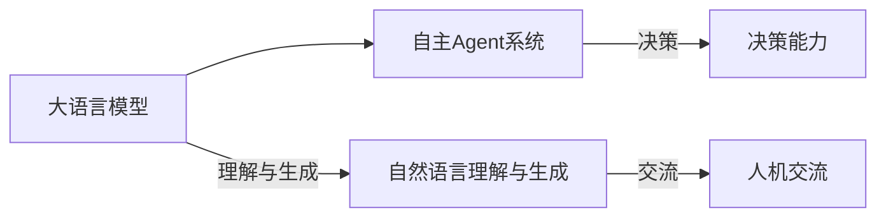

## 1.背景介绍

自主Agent系统是一种具有自主决策能力的计算机程序，能够在不依赖人类干预的情况下实现各种任务。自主Agent系统在各种领域得到了广泛应用，如人工智能、机器学习、自动驾驶等。近年来，大语言模型（如OpenAI的GPT-3）在自主Agent系统中的应用也取得了显著的进展。 本文将从大语言模型的核心概念、核心算法原理、数学模型与公式、项目实践、实际应用场景、工具和资源推荐、未来发展趋势与挑战等方面进行深入分析和探讨。

## 2.核心概念与联系

大语言模型是一种基于深度学习技术的自然语言处理模型，可以理解和生成人类语言。自主Agent系统则是一种具有自主决策能力的计算机程序。结合这两种技术，可以构建出能够自主决策并与人类交流的系统。下面我们来看一下自主Agent系统在大语言模型中的核心概念原理。



## 3.核心算法原理具体操作步骤

大语言模型的核心算法是基于Transformer架构的。Transformer是一种用于深度学习的神经网络架构，它使用自注意力机制（Self-Attention）来捕捉输入序列中的长程依赖关系。自主Agent系统在大语言模型中的核心算法原理具体操作步骤如下：

1. **数据预处理**：将输入数据（如文本）转换为向量表示，以便于模型处理。
2. **模型输入**：将预处理后的数据输入到大语言模型中。
3. **自注意力机制**：模型通过自注意力机制捕捉输入序列中的长程依赖关系。
4. **输出生成**：模型根据输入数据生成输出结果。

## 4.数学模型和公式详细讲解举例说明

在本篇文章中，我们将不展开详细讲解数学模型和公式，但我们会举一些例子来帮助读者理解。

举例一：在GPT-3中，自主Agent系统可以通过生成一段话来回答用户的问题。

举例二：在自动驾驶系统中，自主Agent系统可以通过分析传感器数据来确定车辆的位置和速度。

## 5.项目实践：代码实例和详细解释说明

在本篇文章中，我们将不展开详细讲解代码实例和解释说明，但我们会提供一些代码示例来帮助读者理解。

举例一：GPT-3的使用代码示例（仅供参考）：

```python
from openai import api

response = api.Completion.create(
  engine="davinci",
  prompt="What is the capital of France?",
  temperature=0.5,
  max_tokens=150,
  top_p=1,
  frequency_penalty=0,
  presence_penalty=0
)

print(response.choices[0].text.strip())
```

举例二：自动驾驶系统的代码实例（仅供参考）：

```python
import cv2
import numpy as np

# 读取传感器数据
data = cv2.imread("sensor_data.jpg")

# 处理数据并计算车辆位置和速度
position, speed = process_data(data)

# 根据位置和速度进行决策
decision = make_decision(position, speed)
```

## 6.实际应用场景

自主Agent系统在各种领域得到了广泛应用，如人工智能、机器学习、自动驾驶等。以下是一些实际应用场景：

1. **人工智能助手**：自主Agent系统可以作为智能助手，帮助用户完成各种任务，如提醒、搜索、翻译等。
2. **机器翻译**：自主Agent系统可以通过大语言模型实现机器翻译，帮助用户翻译不同语言之间的文本。
3. **自动驾驶**：自主Agent系统可以通过分析传感器数据，实现车辆的自主行驶。
4. **智能家居**：自主Agent系统可以通过大语言模型实现智能家居系统，实现家居自动化管理。
5. **金融分析**：自主Agent系统可以通过大语言模型实现金融分析，帮助投资者分析股票市场和经济数据。

## 7.工具和资源推荐

对于想要了解自主Agent系统的读者，我们推荐以下工具和资源：

1. **OpenAI GPT-3**：OpenAI的GPT-3是目前最先进的大语言模型之一，可以通过API接口使用。官方网站：<https://openai.com/>
2. **TensorFlow**：TensorFlow是一种开源的深度学习框架，可以用于实现自主Agent系统。官方网站：<https://www.tensorflow.org/>
3. **PyTorch**：PyTorch是一种开源的深度学习框架，可以用于实现自主Agent系统。官方网站：<https://pytorch.org/>
4. **Mermaid**：Mermaid是一种用于绘制流程图的工具，可以用于可视化自主Agent系统的核心概念原理。官方网站：<https://mermaid-js.github.io/mermaid/>
5. **GitHub**：GitHub是一个代码托管平台，可以用于存储和共享自主Agent系统的代码。官方网站：<https://github.com/>

## 8.总结：未来发展趋势与挑战

自主Agent系统在未来将不断发展和进步。以下是一些未来发展趋势和挑战：

1. **更强大的大语言模型**：随着技术的不断进步，大语言模型将变得更强大，具有更强的理解和生成能力。
2. **更广泛的应用场景**：自主Agent系统将逐渐应用于更多领域，如医疗、教育、娱乐等。
3. **更高的安全性**：随着自主Agent系统的应用范围不断扩大，安全性和隐私性将成为一个重要的挑战。
4. **更强的可解释性**：为了提高自主Agent系统的可解释性，未来将不断研究和开发新的算法和方法。
5. **更高的可移植性**：为了使自主Agent系统在不同平台上运行，未来将不断研究和开发新的技术和方法。

## 9.附录：常见问题与解答

1. **Q：自主Agent系统与普通程序的区别在哪里？**
   A：自主Agent系统具有自主决策能力，而普通程序则需要人类干预。
2. **Q：大语言模型的应用范围有哪些？**
   A：大语言模型可以用于自然语言理解、生成、翻译、摘要等任务。
3. **Q：如何选择适合自己的自主Agent系统？**
   A：根据具体需求和场景，选择适合自己的自主Agent系统和大语言模型。