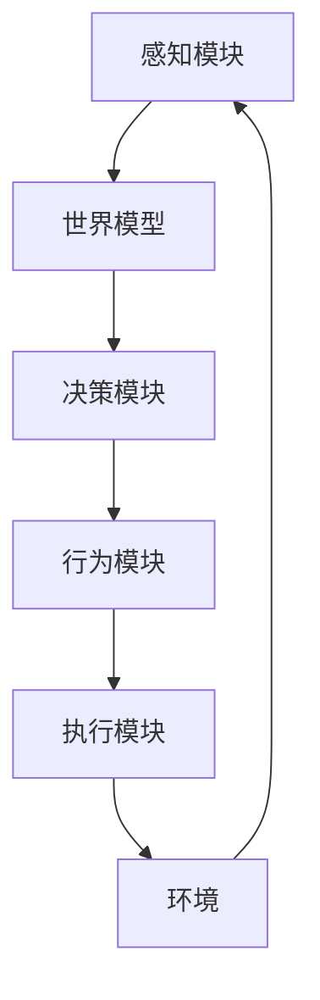

# 大语言模型应用指南：自主Agent系统简介

## 1.背景介绍

### 1.1 人工智能的发展历程

人工智能(Artificial Intelligence, AI)是一门富有挑战性的计算机科学分支,旨在创建出能够模仿人类智能行为的智能机器。自20世纪50年代问世以来,人工智能经历了起起伏伏的发展历程。

早期的人工智能系统主要集中在特定领域,如机器人、专家系统和游戏等,通过编写规则和算法来模拟人类的决策过程。然而,这种基于规则的方法存在局限性,难以处理复杂的、不确定的情况。

### 1.2 机器学习与深度学习的兴起

21世纪初,机器学习(Machine Learning)技术的兴起,使得人工智能系统能够从数据中自主学习,而不再完全依赖人工编写的规则。这极大地扩展了人工智能的应用范围和能力。

近年来,深度学习(Deep Learning)作为机器学习的一个分支,凭借其在语音识别、图像识别、自然语言处理等领域取得的卓越表现,成为人工智能研究的热点。深度学习能够自动从大量数据中学习特征表示,极大简化了特征工程的工作。

### 1.3 大语言模型的崛起

作为深度学习在自然语言处理领域的杰出应用,大型语言模型(Large Language Model, LLM)近年来引起了广泛关注。大语言模型通过在海量文本数据上预训练,学习到丰富的语言知识,可以生成看似人类水平的自然语言输出。

著名的大语言模型有GPT(Generative Pre-trained Transformer)、BERT(Bidirectional Encoder Representations from Transformers)等,它们展现出惊人的语言理解和生成能力,在机器翻译、文本摘要、问答系统等应用中发挥着重要作用。

### 1.4 自主Agent系统的需求

随着大语言模型能力的不断提升,人们开始期望它们不仅能生成高质量的语言输出,还能具备一定的理解、推理和决策能力,从而成为真正的"智能助手"。这就需要将大语言模型与其他人工智能技术(如知识图谱、规划与决策等)相结合,构建自主Agent系统。

自主Agent系统旨在模拟人类的认知过程,具备感知、学习、推理、规划和行动的综合能力。它们可以根据用户的需求,自主地完成一系列复杂任务,而不再局限于单一的语言生成功能。

## 2.核心概念与联系

### 2.1 Agent与环境

在自主Agent系统中,Agent是指具有一定智能和自主性的主体,能够感知环境、做出决策并执行相应行为。环境则是Agent所处的外部世界,包括各种对象、事件和信息。

Agent与环境之间存在双向交互:

- Agent通过感知器(Sensors)获取环境的状态信息
- 根据状态信息和内部知识,Agent通过执行器(Actuators)对环境作出响应行为

这种持续的感知-决策-行动循环,使得Agent能够根据环境的变化做出适当的反应,完成既定的任务目标。

### 2.2 Agent的体系结构

一个典型的自主Agent通常由以下几个核心模块组成:

1. **感知模块(Perception Module)**: 负责从环境中获取原始数据,并对数据进行预处理和特征提取,为世界模型提供输入。
2. **世界模型(World Model)**: 根据感知数据构建对环境的表示,包括当前状态、背景知识等,为决策模块提供信息支持。
3. **决策模块(Decision Module)**: 基于世界模型和目标函数,运用规划、推理等技术做出行为决策。
4. **行为模块(Behavior Module)**: 将决策转化为具体的行为指令,并调用执行模块执行。
5. **执行模块(Execution Module)**: 通过执行器对环境作出实际操作,产生影响并获取新的感知数据,循环往复。

在这个体系结构中,大语言模型可以作为世界模型的重要组成部分,为Agent提供语义理解和知识支持。同时,其他模块也可以通过交互式对话的方式,与大语言模型进行信息交换。

### 2.3 Agent的能力要求

一个高度自主的Agent系统,需要具备以下几方面的核心能力:

1. **自然语言理解与生成**: 能够准确理解自然语言指令,并用自然语言进行交互和解释。
2. **知识表示与推理**: 具有丰富的背景知识,能够进行逻辑推理和常识性推理。
3. **规划与决策**: 能够根据目标制定行动计划,并做出明智的决策。
4. **持续学习**: 在与环境交互的过程中不断积累新知识,优化自身的行为策略。
5. **多模态感知**: 除了自然语言,还能够处理视觉、声音等多种模态的输入信号。
6. **人机协作**: 能够与人类用户进行高效协作,相互理解、信任和配合。

这些能力的实现需要多种人工智能技术的融合,包括自然语言处理、知识图谱、规划与决策、强化学习、多模态感知等,是一个极具挑战的系统工程。

## 3.核心算法原理具体操作步骤

### 3.1 大语言模型

大语言模型是构建自主Agent系统的基础,它通过自监督预训练的方式,在大量文本数据上学习语言的表示,掌握丰富的语义和世界知识。

目前主流的大语言模型架构是基于Transformer的序列到序列(Seq2Seq)模型,包括编码器(Encoder)和解码器(Decoder)两个部分。编码器将输入序列(如文本)映射为向量表示,解码器则根据编码器的输出和前一个时间步的输出,自回归地生成下一个标记。

以GPT(Generative Pre-trained Transformer)为例,其训练过程可以概括为以下几个步骤:

1. **数据预处理**: 从大量文本语料库(如网页、书籍等)中抽取出连续的文本序列,构建训练数据集。
2. **词嵌入(Token Embedding)**: 将每个词(或子词)映射为一个向量表示,作为模型的初始输入。
3. **位置编码(Positional Encoding)**: 为每个位置添加一个位置向量,使模型能够捕获序列的位置信息。
4. **Transformer编码器**: 输入序列经过多层Transformer编码器,捕获长程依赖关系,得到上下文表示。
5. **掩码语言模型(Masked Language Modeling)**: 在训练时,随机掩码部分输入词,要求模型预测被掩码的词。
6. **下一句预测(Next Sentence Prediction)**: 判断两个句子是否相邻,捕获句子间的关系。
7. **预训练**: 以上两个任务的损失函数的加权和作为总损失,使用海量数据对模型进行预训练。

通过上述自监督预训练,大语言模型能够学习到丰富的语言知识,为后续的任务精调(Fine-tuning)或生成任务奠定基础。

### 3.2 知识图谱构建

为了赋予Agent更强的推理和决策能力,需要将大语言模型与结构化的知识库相结合。知识图谱(Knowledge Graph)是一种高效的知识表示形式,可以明确描述实体、概念及其之间的关系。

构建知识图谱的一般流程如下:

1. **实体识别(Entity Recognition)**: 从非结构化文本中识别出实体(人物、地点、组织等)。
2. **关系抽取(Relation Extraction)**: 利用模式匹配、监督学习等方法,从文本中抽取实体间的语义关系。
3. **实体链接(Entity Linking)**: 将文本中的实体链接到知识库中的现有实体。
4. **知识融合(Knowledge Fusion)**: 将抽取的三元组知识与现有知识库进行去重、融合和补全。
5. **知识存储**: 采用高效的图数据库(如Neo4j)或RDF存储,持久化知识图谱数据。

在这个过程中,大语言模型可以发挥重要作用,为实体识别、关系抽取等任务提供有力的语义支持。同时,知识图谱也可以反过来为大语言模型提供结构化的背景知识,增强其推理和生成能力。

### 3.3 规划与决策

作为自主Agent的"大脑",规划与决策模块需要根据当前状态和目标,制定合理的行动计划,并做出明智的决策。这通常涉及以下几个步骤:

1. **问题建模**: 将实际问题形式化为一个规划问题,确定状态空间、行动空间和目标状态。
2. **状态估计**: 基于感知数据和世界模型,估计出当前的状态。
3. **路径搜索**: 在状态空间中搜索从当前状态到目标状态的最优路径,可采用经典搜索算法(如A*算法)或启发式搜索。
4. **决策理论**: 在存在不确定性时,需要利用概率模型和效用理论来评估各种行为方案的预期效用,做出最优决策。
5. **规划与执行**: 将搜索到的最优路径分解为一系列具体行动,并通过执行模块实施。

在这个过程中,大语言模型和知识图谱可以为状态估计、目标建模等环节提供语义支持。同时,规划与决策模块也可以与大语言模型交互,获取必要的指令和反馈。

### 3.4 强化学习

对于复杂的、动态变化的环境,Agent需要不断从经验中学习,优化自身的行为策略。强化学习(Reinforcement Learning)提供了一种有效的学习范式。

强化学习的基本思想是:Agent与环境进行交互,根据执行行为后获得的奖励信号,不断调整自身的策略模型,以期在长期获得最大化的累积奖励。

一个典型的强化学习流程包括:

1. **初始化**: 初始化Agent的策略模型,通常采用深度神经网络来表示。
2. **交互环节**:
    - Agent根据当前状态,从策略模型中采样一个行为
    - 执行该行为,获得环境的反馈(新状态和奖励信号)
    - 将(状态,行为,奖励,新状态)的交互记录存入经验池
3. **学习环节**:
    - 从经验池中采样出一个批次的交互记录
    - 计算这些记录中的累积奖励(回报)
    - 通过策略梯度下降等优化算法,更新策略模型的参数
4. **迭代学习**: 重复上述交互-学习的过程,直至策略收敛

在自主Agent系统中,强化学习可以与其他模块相结合,例如利用大语言模型生成的自然语言指令作为奖励信号,或者将知识图谱中的规则作为辅助奖励,以加速学习过程。

## 4.数学模型和公式详细讲解举例说明

### 4.1 Transformer模型

Transformer是大语言模型的核心架构,它完全基于注意力机制(Attention Mechanism)来捕获输入序列的长程依赖关系,避免了RNN的梯度消失问题。

Transformer的编码器由多个相同的层组成,每一层包含两个子层:多头注意力机制(Multi-Head Attention)和前馈全连接网络(Feed-Forward Network)。

#### 4.1.1 缩放点积注意力

注意力机制的核心是缩放点积注意力(Scaled Dotted-Product Attention),其数学表达式为:

$$
\text{Attention}(Q, K, V) = \text{softmax}\left(\frac{QK^T}{\sqrt{d_k}}\right)V
$$

其中 $Q$ 为查询(Query)向量, $K$ 为键(Key)向量, $V$ 为值(Value)向量。$d_k$ 为缩放因子,用于防止点积的方差过大导致梯度消失。

这种注意力机制可以自动捕获输入序列中不同位置间的相关性,赋予每个位置不同的权重,从而有效地建模长程依赖关系。

#### 4.1.2 多头注意力机制

为了捕获不同子