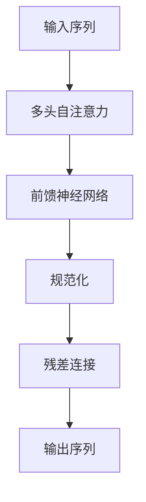
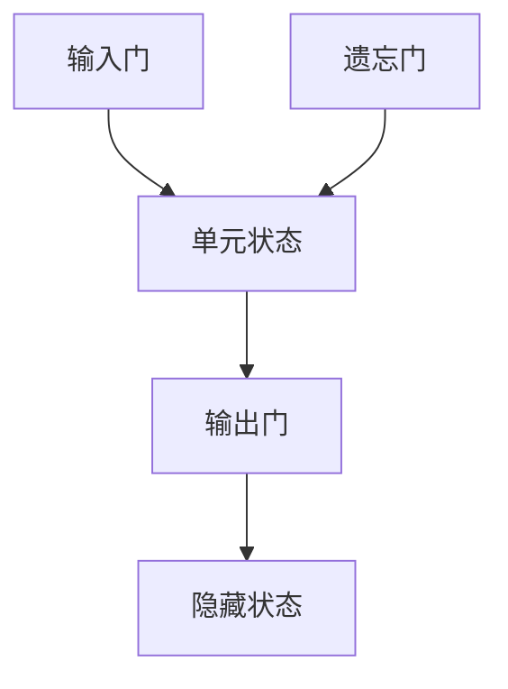

# 大语言模型应用指南：长短期记忆

## 1. 背景介绍

### 1.1 人工智能的发展历程

人工智能(Artificial Intelligence, AI)是当代最具颠覆性的技术之一,它的发展已经渗透到了我们生活的方方面面。从最早的专家系统,到机器学习算法的兴起,再到当下的深度学习浪潮,人工智能技术一直在不断演进和发展。

### 1.2 大语言模型的兴起

在深度学习领域,大语言模型(Large Language Model, LLM)是近年来最具革命性的突破之一。大语言模型通过在海量文本数据上预训练,学习了丰富的语言知识和上下文信息,从而可以生成高质量、连贯的自然语言输出。

### 1.3 长短期记忆网络

长短期记忆网络(Long Short-Term Memory, LSTM)是一种特殊的递归神经网络,专门设计用于解决长序列数据的问题。它通过精心设计的门控机制,能够有效地捕捉长期依赖关系,从而在自然语言处理、语音识别等序列数据任务中表现出色。

## 2. 核心概念与联系

### 2.1 自注意力机制

自注意力机制(Self-Attention Mechanism)是大语言模型的核心组成部分之一。它允许模型在处理序列数据时,直接捕捉序列中任意两个位置之间的关联关系,从而更好地建模长期依赖性。

$$
\mathrm{Attention}(Q, K, V) = \mathrm{softmax}(\frac{QK^T}{\sqrt{d_k}})V
$$

其中,Q(Query)、K(Key)和V(Value)分别表示查询、键和值向量。

### 2.2 transformer架构

Transformer是第一个完全基于自注意力机制的序列转换模型,它彻底抛弃了传统的循环神经网络和卷积神经网络结构。Transformer架构的引入,使得大语言模型可以高效地并行计算,从而在训练时获得了极大的加速。



### 2.3 LSTM与transformer的关系

尽管LSTM和transformer在架构上存在显著差异,但它们都旨在解决序列数据建模的核心问题——捕捉长期依赖关系。LSTM通过门控机制来记忆和遗忘信息,而transformer则利用自注意力机制直接对序列中任意位置的元素进行关联建模。

## 3. 核心算法原理具体操作步骤 

### 3.1 LSTM网络结构

LSTM网络由一系列重复的模块或单元组成,每个单元包含一个遗忘门、输入门和输出门,用于控制信息的流动。



1. 遗忘门决定了从上一时间步的单元状态中遗忘什么信息。
2. 输入门决定了从当前输入和上一隐藏状态中获取什么新信息。
3. 输出门决定了输出什么作为当前时间步的隐藏状态。

### 3.2 LSTM前向传播过程

LSTM的前向传播过程可以分为以下几个步骤:

1. 计算遗忘门的激活值:

$$
f_t = \sigma(W_f \cdot [h_{t-1}, x_t] + b_f)
$$

2. 计算输入门的激活值:

$$
i_t = \sigma(W_i \cdot [h_{t-1}, x_t] + b_i)
$$

3. 计算候选单元状态值:

$$
\tilde{C}_t = \tanh(W_C \cdot [h_{t-1}, x_t] + b_C)
$$

4. 计算单元状态值:

$$
C_t = f_t \odot C_{t-1} + i_t \odot \tilde{C}_t
$$

5. 计算输出门的激活值:

$$
o_t = \sigma(W_o \cdot [h_{t-1}, x_t] + b_o)
$$

6. 计算隐藏状态值:

$$
h_t = o_t \odot \tanh(C_t)
$$

其中,$\sigma$表示sigmoid激活函数,$\odot$表示元素wise乘积运算。

### 3.3 Transformer自注意力机制

Transformer中的自注意力机制可以分为以下几个步骤:

1. 线性投影,将输入分别映射到Query,Key和Value空间:

$$
\begin{aligned}
Q &= XW^Q\\
K &= XW^K\\
V &= XW^V
\end{aligned}
$$

2. 计算注意力分数:

$$
\text{Attention}(Q, K, V) = \text{softmax}(\frac{QK^T}{\sqrt{d_k}})V
$$

3. 多头注意力机制,将多个注意力头的结果拼接:

$$
\text{MultiHead}(Q, K, V) = \text{Concat}(head_1, \ldots, head_h)W^O
$$

其中,每个注意力头$head_i$都是通过不同的线性投影矩阵计算得到。

## 4. 数学模型和公式详细讲解举例说明

### 4.1 LSTM门控机制

LSTM的门控机制是其核心创新之处,它通过精心设计的门结构,使网络能够学习何时保留旧信息,何时添加新信息,从而更好地捕捉长期依赖关系。

以遗忘门为例,它的激活值由下式计算得到:

$$
f_t = \sigma(W_f \cdot [h_{t-1}, x_t] + b_f)
$$

其中,$h_{t-1}$是上一时间步的隐藏状态,$x_t$是当前时间步的输入,而$W_f$和$b_f$则是可训练的权重和偏置参数。sigmoid函数的输出值域为(0,1),因此遗忘门的激活值也在这个区间内。值越接近0,表示遗忘上一时间步的单元状态;值越接近1,表示保留上一时间步的单元状态。

### 4.2 Transformer注意力分数计算

在Transformer的自注意力机制中,注意力分数的计算是关键步骤之一。给定Query,Key和Value张量,注意力分数的计算过程如下:

$$
\text{Attention}(Q, K, V) = \text{softmax}(\frac{QK^T}{\sqrt{d_k}})V
$$

其中,$d_k$是Query和Key向量的维度。将$QK^T$除以$\sqrt{d_k}$的目的是为了防止较大的点积值导致softmax函数的梯度较小,从而使模型更加稳定。

softmax函数将原始分数转换为概率分布,因此每个注意力分数的值域为(0,1),并且所有分数之和为1。这些分数反映了当前Query对应的Value的重要程度。最终,注意力机制通过加权求和的方式,将所有Value张量组合成最终的注意力输出。

### 4.3 多头注意力机制

为了捕捉不同子空间的相关性,Transformer采用了多头注意力机制。每个注意力头都是通过不同的线性投影矩阵计算得到,从而关注输入序列的不同表示子空间。多头注意力的计算公式如下:

$$
\text{MultiHead}(Q, K, V) = \text{Concat}(head_1, \ldots, head_h)W^O
$$

其中,每个注意力头$head_i$都是通过下式计算得到:

$$
head_i = \text{Attention}(QW_i^Q, KW_i^K, VW_i^V)
$$

$W_i^Q$,$W_i^K$和$W_i^V$分别是第$i$个注意力头的Query,Key和Value的线性投影矩阵。最后,所有注意力头的输出被拼接在一起,并通过另一个线性投影$W^O$得到最终的多头注意力输出。

通过多头注意力机制,Transformer能够同时关注输入序列的不同表示子空间,从而提高了模型的表示能力。

## 5. 项目实践:代码实例和详细解释说明

为了更好地理解LSTM和Transformer模型,我们将通过实际代码示例来演示它们的实现细节。这里,我们将使用PyTorch深度学习框架进行代码实现。

### 5.1 LSTM实现

```python
import torch
import torch.nn as nn

class LSTMCell(nn.Module):
    def __init__(self, input_size, hidden_size):
        super(LSTMCell, self).__init__()
        self.input_size = input_size
        self.hidden_size = hidden_size

        # 门控参数
        self.W_f = nn.Parameter(torch.Tensor(input_size + hidden_size, hidden_size))
        self.U_f = nn.Parameter(torch.Tensor(hidden_size, hidden_size))
        self.b_f = nn.Parameter(torch.Tensor(hidden_size))

        self.W_i = nn.Parameter(torch.Tensor(input_size + hidden_size, hidden_size))
        self.U_i = nn.Parameter(torch.Tensor(hidden_size, hidden_size))
        self.b_i = nn.Parameter(torch.Tensor(hidden_size))

        self.W_o = nn.Parameter(torch.Tensor(input_size + hidden_size, hidden_size))
        self.U_o = nn.Parameter(torch.Tensor(hidden_size, hidden_size))
        self.b_o = nn.Parameter(torch.Tensor(hidden_size))

        self.W_c = nn.Parameter(torch.Tensor(input_size + hidden_size, hidden_size))
        self.U_c = nn.Parameter(torch.Tensor(hidden_size, hidden_size))
        self.b_c = nn.Parameter(torch.Tensor(hidden_size))

        self.init_weights()

    def init_weights(self):
        stdv = 1.0 / math.sqrt(self.hidden_size)
        for weight in self.parameters():
            weight.data.uniform_(-stdv, stdv)

    def forward(self, x, hidden):
        h_prev, c_prev = hidden

        x_combined = torch.cat((x, h_prev), 1)

        f_gate = torch.sigmoid(x_combined @ self.W_f + h_prev @ self.U_f + self.b_f)
        i_gate = torch.sigmoid(x_combined @ self.W_i + h_prev @ self.U_i + self.b_i)
        o_gate = torch.sigmoid(x_combined @ self.W_o + h_prev @ self.U_o + self.b_o)
        c_tilde = torch.tanh(x_combined @ self.W_c + h_prev @ self.U_c + self.b_c)

        c = f_gate * c_prev + i_gate * c_tilde
        h = o_gate * torch.tanh(c)

        return h, c
```

在上述代码中,我们实现了LSTM单元的前向传播过程。首先,我们初始化门控参数,包括遗忘门、输入门、输出门和候选单元状态的权重和偏置。

在`forward`函数中,我们首先将当前输入`x`和上一时间步的隐藏状态`h_prev`拼接在一起,得到`x_combined`张量。然后,我们分别计算遗忘门、输入门、输出门和候选单元状态的值。最后,根据LSTM公式,我们更新单元状态`c`和隐藏状态`h`。

### 5.2 Transformer实现

```python
import torch
import torch.nn as nn
import math

class MultiHeadAttention(nn.Module):
    def __init__(self, d_model, num_heads):
        super(MultiHeadAttention, self).__init__()
        self.d_model = d_model
        self.num_heads = num_heads
        self.head_dim = d_model // num_heads

        self.W_q = nn.Linear(d_model, d_model)
        self.W_k = nn.Linear(d_model, d_model)
        self.W_v = nn.Linear(d_model, d_model)
        self.fc = nn.Linear(d_model, d_model)

    def forward(self, query, key, value, mask=None):
        batch_size = query.size(0)

        q = self.W_q(query).view(batch_size, -1, self.num_heads, self.head_dim).transpose(1, 2)
        k = self.W_k(key).view(batch_size, -1, self.num_heads, self.head_dim).transpose(1, 2)
        v = self.W_v(value).view(batch_size, -1, self.num_heads, self.head_dim).transpose(1, 2)

        scores = torch.matmul(q, k.transpose(-2, -1)) / math.sqrt(self.head_dim)

        if mask is not None:
            scores = scores.masked_fill(mask == 0, -1e9)

        attention_weights = nn.Softmax(dim=-1)(scores)
        output = torch.matmul(attention_weights, v).transpose(1, 2).contiguous()
        output = output.view(batch_size, -1, self.d_model)
        output = self.fc(output)

        return output
```

在上述代