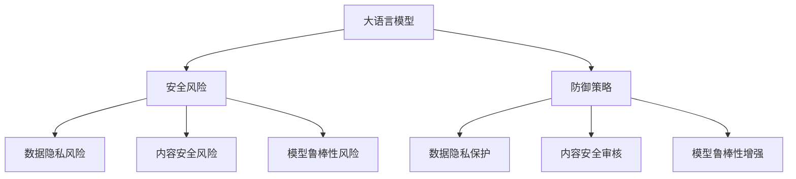

# 大语言模型应用指南：防御策略

## 1. 背景介绍
### 1.1 大语言模型的发展现状
#### 1.1.1 大语言模型的定义与特点
#### 1.1.2 大语言模型的发展历程
#### 1.1.3 大语言模型的应用领域

### 1.2 大语言模型面临的安全挑战  
#### 1.2.1 隐私泄露风险
#### 1.2.2 有害内容生成
#### 1.2.3 模型滥用与误用

### 1.3 大语言模型防御策略的必要性
#### 1.3.1 保护用户隐私
#### 1.3.2 维护社会伦理道德
#### 1.3.3 促进大语言模型健康发展

## 2. 核心概念与联系
### 2.1 大语言模型的基本原理
#### 2.1.1 Transformer 架构
#### 2.1.2 自监督学习
#### 2.1.3 迁移学习

### 2.2 大语言模型的安全风险分类
#### 2.2.1 数据隐私风险
#### 2.2.2 内容安全风险
#### 2.2.3 模型鲁棒性风险

### 2.3 大语言模型防御策略概述
#### 2.3.1 数据隐私保护
#### 2.3.2 内容安全审核
#### 2.3.3 模型鲁棒性增强



## 3. 核心算法原理具体操作步骤
### 3.1 差分隐私算法
#### 3.1.1 差分隐私的定义
#### 3.1.2 高斯机制与拉普拉斯机制
#### 3.1.3 差分隐私在大语言模型中的应用

### 3.2 内容安全审核算法
#### 3.2.1 基于规则的内容审核
#### 3.2.2 基于机器学习的内容审核
#### 3.2.3 人机结合的内容审核策略

### 3.3 对抗训练算法
#### 3.3.1 对抗样本的生成方法
#### 3.3.2 对抗训练的损失函数设计
#### 3.3.3 对抗训练在大语言模型中的应用

## 4. 数学模型和公式详细讲解举例说明
### 4.1 差分隐私数学模型
差分隐私的核心思想是在保证数据有用性的同时，最大限度地保护个体隐私不被泄露。形式化定义如下：

给定两个相邻数据集 $D_1$ 和 $D_2$，它们之间只相差一条记录。对于任意输出 $S \subseteq Range(A)$，如果对所有相邻数据集 $D_1$ 和 $D_2$ 都满足：

$Pr[A(D_1) \in S] \leq e^\varepsilon \times Pr[A(D_2) \in S]$

则称算法 $A$ 满足 $\varepsilon$-差分隐私。其中 $\varepsilon$ 为隐私预算，$\varepsilon$ 越小，隐私保护程度越高。

常见的差分隐私机制有：
- 拉普拉斯机制：对函数 $f$ 的输出添加拉普拉斯噪声，$\widetilde{f}(x)=f(x)+Lap(\frac{\Delta f}{\varepsilon})$
- 高斯机制：对函数 $f$ 的输出添加高斯噪声，$\widetilde{f}(x)=f(x)+N(0, \sigma^2)$，其中 $\sigma \geq \frac{\sqrt{2ln(1.25/\delta)}\Delta f}{\varepsilon}$

### 4.2 对抗训练数学模型
对抗训练旨在通过引入对抗样本，增强模型的鲁棒性，提高面对对抗攻击的防御能力。其数学模型可描述为如下min-max优化问题：

$$\underset{\theta}{\text{min}}  \mathbb{E}_{(x,y)\sim D} \left[\underset{\delta \in S}{\text{max}} L(\theta,x+\delta,y)\right]$$

其中 $\theta$ 为模型参数，$x$ 为输入样本，$y$ 为标签，$\delta$ 为对抗扰动，$S$ 为扰动集合，$L$ 为损失函数。

求解该问题的常见算法有：
- FGSM：$x^{adv} = x + \epsilon \text{sign}(\nabla_x J(\theta, x, y))$
- PGD：$x^{adv}_{t+1} = \Pi_{x+S} (x^{adv}_{t} + \alpha \text{sign}(\nabla_x J(\theta, x^{adv}_t, y)))$
- Free-AT：$\delta = \delta + \alpha \text{sign}(\nabla_\delta J(\theta, x+\delta, y))$

## 5. 项目实践：代码实例和详细解释说明
### 5.1 使用差分隐私训练大语言模型
```python
import torch
from opacus import PrivacyEngine

# 定义模型
model = MyLargeLanguageModel()

# 定义优化器
optimizer = torch.optim.Adam(model.parameters())

# 初始化隐私引擎
privacy_engine = PrivacyEngine(
    model,
    batch_size=64,
    sample_size=60000,
    alphas=[1 + x / 10.0 for x in range(1, 100)] + list(range(12, 64)),
    noise_multiplier=1.3,
    max_grad_norm=1.0,
)
privacy_engine.attach(optimizer)

# 模型训练
for epoch in range(num_epochs):
    for i, (data, target) in enumerate(dataloader):
        optimizer.zero_grad()
        output = model(data)
        loss = criterion(output, target)
        loss.backward()
        optimizer.step()
```

以上代码使用了 Opacus 库实现了差分隐私的大语言模型训练。主要步骤包括：
1. 定义模型和优化器
2. 初始化隐私引擎 PrivacyEngine，设置相关参数如噪声系数等
3. 将隐私引擎附加到优化器上
4. 正常进行模型训练，优化器会自动添加差分隐私噪声

### 5.2 使用对抗训练增强大语言模型鲁棒性
```python
import torch

# 定义模型
model = MyLargeLanguageModel()

# 定义攻击方法
def fgsm_attack(model, data, target, epsilon):
    data_adv = data.detach().clone()
    data_adv.requires_grad = True
    output = model(data_adv)
    loss = F.cross_entropy(output, target)
    model.zero_grad()
    loss.backward()
    data_grad = data_adv.grad.data
    sign_data_grad = data_grad.sign()
    data_adv = data_adv + epsilon*sign_data_grad
    data_adv = torch.clamp(data_adv, 0, 1)
    return data_adv

# 对抗训练
for epoch in range(num_epochs):
    for i, (data, target) in enumerate(dataloader):
        model.train()
        
        # 对抗样本生成
        data_adv = fgsm_attack(model, data, target, epsilon=0.1)
        
        # 对抗训练
        output = model(data_adv)
        loss = criterion(output, target)
        optimizer.zero_grad()
        loss.backward()
        optimizer.step()
```

以上代码展示了使用FGSM方法生成对抗样本，并进行对抗训练的过程。主要步骤包括：
1. 定义模型和攻击方法 fgsm_attack
2. 在每个训练批次中，先用干净数据训练模型
3. 然后使用 fgsm_attack 生成对抗样本
4. 再用对抗样本训练模型，增强模型鲁棒性

## 6. 实际应用场景
### 6.1 智能客服中的隐私保护
在智能客服系统中，用户经常需要提供一些隐私信息如姓名、电话等。使用差分隐私技术可以在保证客服质量的同时，防止隐私数据被恶意窃取。

### 6.2 内容审核与有害信息过滤
社交平台、新闻媒体等场景需要对用户生成内容进行审核，过滤违规有害信息。结合规则与机器学习的内容安全审核策略，可以有效降低大语言模型生成有害内容的风险。

### 6.3 模型安全性评估
为防止大语言模型被恶意攻击，需要在模型部署前进行安全性评估。采用对抗训练、对抗攻击等方法，全面评估模型面对各类攻击的防御能力，有助于及早发现和修复模型漏洞。

## 7. 工具和资源推荐
### 7.1 差分隐私工具库
- Opacus：PyTorch 的差分隐私训练库
- Tensorflow-Privacy：Tensorflow 的差分隐私库
- IBM Diffprivlib：通用差分隐私库

### 7.2 内容安全审核平台
- 百度内容审核：图文、视频、音频等多场景的内容审核服务
- 阿里云内容安全：文本、图片等内容的智能审核
- 腾讯云文本内容安全：专注文本内容的安全审核

### 7.3 对抗攻防工具
- Foolbox：Python 工具箱，支持多种对抗攻击和防御方法
- AdvBox：腾讯 AI Lab 开源的对抗工具箱
- CleverHans：评估机器学习系统漏洞的 Python 库

## 8. 总结：未来发展趋势与挑战
### 8.1 大语言模型安全领域的发展趋势
- 隐私保护与安全技术不断完善
- 人工智能伦理与安全标准逐步建立
- 安全风险评估贯穿大语言模型全生命周期

### 8.2 未来研究的主要挑战
- 差分隐私在大语言模型中的高效实现
- 内容审核策略的准确性与覆盖面
- 对抗训练的高效性与模型性能平衡

### 8.3 总结
大语言模型在赋能各行各业的同时，也面临诸多安全挑战。本文从数据隐私保护、内容安全审核、模型鲁棒性增强三个角度，介绍了一些关键的防御策略和算法。未来还需在理论与实践上持续探索，平衡大语言模型的功能性与安全性，促进其健康可持续发展。

## 9. 附录：常见问题与解答
### 9.1 差分隐私会显著降低模型性能吗？
理论上差分隐私通过添加噪声来保护隐私，会对模型性能造成一定影响。但许多研究表明，合理设置隐私预算，优化训练流程，差分隐私与模型效用可以达到较好平衡。

### 9.2 如何选择合适的内容安全审核策略？
内容审核需要考虑准确率、覆盖面、速度等多个因素。可根据应用场景数据特点，灵活选择规则、机器学习等不同技术，并辅以人工审核把关。通常采用多策略组合，优势互补。

### 9.3 对抗训练是否会影响模型泛化性？
对抗训练本质上是一种数据增强方式，合理使用可以提高模型泛化性。但如果对抗样本质量不高或比例过大，也可能导致模型过拟合问题。因此需要平衡对抗训练强度，必要时辅以正则化手段。

---
作者：禅与计算机程序设计艺术 / Zen and the Art of Computer Programming