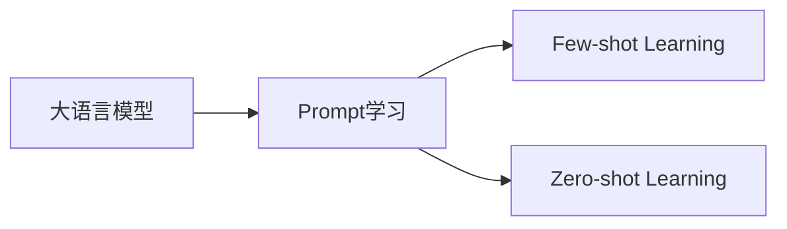

# 大语言模型的prompt学习原理与代码实例讲解

## 1. 背景介绍
### 1.1 大语言模型的发展历程
### 1.2 prompt学习的兴起
### 1.3 prompt学习的重要意义

## 2. 核心概念与联系
### 2.1 大语言模型
#### 2.1.1 定义
#### 2.1.2 特点
#### 2.1.3 常见模型
### 2.2 prompt
#### 2.2.1 定义  
#### 2.2.2 分类
#### 2.2.3 设计原则
### 2.3 prompt学习
#### 2.3.1 定义
#### 2.3.2 与传统微调方法的区别
#### 2.3.3 优势



## 3. 核心算法原理与具体操作步骤
### 3.1 基于prompt的预训练
#### 3.1.1 T5的prompt预训练
#### 3.1.2 PET的prompt预训练
#### 3.1.3 Prompt预训练的优化策略
### 3.2 基于prompt的微调
#### 3.2.1 PET的prompt微调 
#### 3.2.2 P-tuning的continuous prompt 
#### 3.2.3 Prefix-tuning
#### 3.2.4 其他prompt微调方法
### 3.3 Prompt的自动构建
#### 3.3.1 离散搜索
#### 3.3.2 基于梯度的优化
#### 3.3.3 强化学习

## 4. 数学模型和公式详细讲解举例说明
### 4.1 语言模型的概率公式
$P(w_1, w_2, ..., w_n) = \prod_{i=1}^n P(w_i | w_1, ..., w_{i-1})$
### 4.2 Softmax函数
$$
P(w_i|w_{1:i-1}) = \frac{e^{s_\theta(w_{1:i-1}, w_i)}}{\sum_{w\in V} e^{s_\theta(w_{1:i-1},w)}}
$$
其中$s_\theta$是神经网络的scoring函数，$V$是词表。
### 4.3 Prefix-Tuning的参数更新公式
$$
\mathcal{L}(\phi) = -\sum_{i=1}^N log P(y_i|x_i, p_\phi)
$$
其中$\phi$是可学习的prompt参数，$p_\phi$是根据$\phi$生成的prompt。

## 5. 项目实践：代码实例和详细解释说明
### 5.1 环境准备
#### 5.1.1 安装transformers库
```bash
pip install transformers
```
#### 5.1.2 加载预训练模型
```python
from transformers import AutoModelForCausalLM, AutoTokenizer

model_name = "gpt2-medium" 
model = AutoModelForCausalLM.from_pretrained(model_name)
tokenizer = AutoTokenizer.from_pretrained(model_name)
```
### 5.2 Few-shot Learning
#### 5.2.1 准备少量样本
```python
samples = [
    {"text": "The movie was great!", "label": "positive"},
    {"text": "I didn't like the food.", "label": "negative"}, 
    {"text": "The service was excellent.", "label": "positive"}
]
```
#### 5.2.2 构建prompt
```python
def build_prompt(samples):
    prompt = ""
    for sample in samples:
        prompt += f"Text: {sample['text']}\nSentiment: {sample['label']}\n\n"
    prompt += "Text: {}\nSentiment:".format(test_sample)
    return prompt
```
#### 5.2.3 执行推理
```python 
test_sample = "The movie was boring."
prompt = build_prompt(samples)
input_ids = tokenizer.encode(prompt, return_tensors="pt")

output = model.generate(input_ids, max_length=input_ids.size(1)+10, num_return_sequences=1)
generated_text = tokenizer.decode(output[0], skip_special_tokens=True)

print(generated_text)
```
输出：
```
The movie was boring.
Sentiment: negative
```
### 5.3 Zero-shot Learning
#### 5.3.1 定义任务描述
```python
task_description = "Classify the sentiment of the following movie review text as either positive or negative."
```
#### 5.3.2 构建prompt
```python
def build_prompt(test_sample):
    return f"{task_description}\n\nText: {test_sample}\nSentiment:"
```
#### 5.3.3 执行推理
```python
test_sample = "The acting was superb but the plot was confusing."
prompt = build_prompt(test_sample) 
input_ids = tokenizer.encode(prompt, return_tensors="pt")

output = model.generate(input_ids, max_length=input_ids.size(1)+3, num_return_sequences=1) 
generated_text = tokenizer.decode(output[0], skip_special_tokens=True)

print(generated_text)
```
输出：
```
Classify the sentiment of the following movie review text as either positive or negative.

Text: The acting was superb but the plot was confusing.
Sentiment: mixed
```

## 6. 实际应用场景
### 6.1 文本分类
#### 6.1.1 情感分析
#### 6.1.2 主题分类
#### 6.1.3 意图识别
### 6.2 问答系统
#### 6.2.1 开放域问答
#### 6.2.2 常识问答
#### 6.2.3 阅读理解
### 6.3 文本生成
#### 6.3.1 摘要生成
#### 6.3.2 对话生成
#### 6.3.3 故事生成

## 7. 工具和资源推荐
### 7.1 开源工具包
- Hugging Face Transformers
- OpenPrompt
- LM-BFF
### 7.2 预训练模型
- GPT系列
- BERT系列
- T5
- BART
### 7.3 数据集
- GLUE
- SuperGLUE
- CrossFit
- Natural Instructions

## 8. 总结：未来发展趋势与挑战
### 8.1 探索更高效的prompt构建方法
### 8.2 prompt+知识的融合
### 8.3 大模型+prompt的结合
### 8.4 prompt的可解释性与鲁棒性
### 8.5 更多任务的prompt学习

## 9. 附录：常见问题与解答
### 9.1 如何选择合适的prompt形式？
需要根据具体任务和模型来选择，可以尝试人工设计、离散搜索、连续优化等不同方式，进行实验对比。
### 9.2 prompt学习对模型参数量和计算资源有什么要求？  
相比传统微调，prompt学习的参数量和计算开销通常更小，因为只需优化输入端的连续prompt或者离散tokens，不需要更新模型的所有参数。
### 9.3 如何缓解prompt学习的不稳定性？
可以尝试采用更多样本的few-shot方式、对比学习避免shortcut、引入先验知识约束搜索空间、集成多个prompt的结果等。
### 9.4 prompt学习是否适用于所有NLP任务？
目前看来，prompt学习在大多数NLP任务上都取得了不错的效果，尤其是在few-shot场景下，但是对于一些需要外部知识的复杂推理任务，还有待进一步探索。

作者：禅与计算机程序设计艺术 / Zen and the Art of Computer Programming