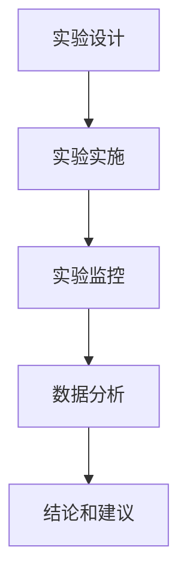

## 背景介绍

实验跟踪和实验管理是现代计算机科学和工程领域中不可或缺的部分。它涉及到从实验设计、实施、监控到数据分析的全过程，旨在提高实验的可重复性和质量。实验跟踪和实验管理的原理和实践在许多领域得到广泛应用，如人工智能、机器学习、计算机视觉、自然语言处理等。

本文将深入探讨实验跟踪和实验管理的原理、核心概念、算法和实际应用场景，以及提供一些建议和资源推荐。我们将通过代码实例和详细解释说明来帮助读者更好地理解这些概念和技术。

## 核心概念与联系

实验跟踪和实验管理的核心概念包括以下几个方面：

1. **实验设计**：实验设计是实验过程的基础，涉及到实验目标、设计方法、数据收集和分析等方面。好的实验设计可以提高实验的可重复性和准确性，减少误差和偏差。

2. **实验实施**：实验实施涉及到实验环境、工具和技术的选择和配置。高质量的实验实施可以确保实验结果的可靠性和准确性。

3. **实验监控**：实验监控是在实验进行过程中对实验数据和进度进行实时跟踪和分析的过程。实验监控可以帮助检测实验中的问题，及时调整实验过程，确保实验的顺利进行。

4. **数据分析**：实验数据分析是实验结果的核心部分。数据分析可以帮助我们发现实验中的规律和趋势，得出有价值的结论。

实验跟踪和实验管理的联系在于它们相互依赖且相互影响。好的实验设计可以提高实验实施和监控的质量，良好的实验监控和数据分析可以帮助我们优化实验设计和实施。

## 核心算法原理具体操作步骤

在本部分，我们将详细讲解实验跟踪和实验管理的核心算法原理和具体操作步骤。我们将使用 Mermaid 流程图来帮助读者更好地理解这些概念和技术。



1. **实验设计**：实验设计是整个实验过程的基础。我们需要确定实验目标、选择合适的方法和技术，并制定详细的实验计划和步骤。

2. **实验实施**：实验实施包括选择合适的实验环境和工具，配置实验设备和技术，并确保实验过程的顺利进行。

3. **实验监控**：实验监控包括对实验数据和进度进行实时跟踪和分析，检测实验中的问题，并进行调整。

4. **数据分析**：数据分析是实验结果的核心部分。我们需要对实验数据进行统计和可视化分析，发现实验中的规律和趋势，得出有价值的结论。

5. **结论和建议**：实验结果的结论和建议是实验的最终目标。我们需要根据实验结果提供有针对性的建议和解决方案。

## 数学模型和公式详细讲解举例说明

在本部分，我们将详细讲解实验跟踪和实验管理的数学模型和公式，并举例说明它们的实际应用。

1. **实验设计**：实验设计过程中我们可以使用统计学中的正态分布模型来估计实验中的误差和偏差。例如，根据样本数据计算出均值和标准差，然后使用正态分布公式计算出95%信頼区间。

2. **实验实施**：实验实施过程中，我们可以使用线性回归模型来估计实验数据之间的关系。例如，通过实验数据计算出最佳拟合直线的方程式，然后使用线性回归公式计算出实验数据之间的关联程度。

3. **实验监控**：实验监控过程中，我们可以使用时间序列分析模型来检测实验数据中的趋势和循环规律。例如，通过实验数据计算出自相关函数和偏自相关函数，然后使用ARIMA模型估计实验数据中的季节性和趋势性。

4. **数据分析**：数据分析过程中，我们可以使用机器学习算法如支持向量机(SVM)、随机森林(RF)等来进行分类和预测分析。例如，根据实验数据训练支持向量机模型，然后使用模型进行预测分析。

## 项目实践：代码实例和详细解释说明

在本部分，我们将通过一个实际的项目实例来详细讲解实验跟踪和实验管理的代码实现和解释。

假设我们正在进行一个机器学习项目，需要使用支持向量机(SVM)进行分类分析。我们将使用Python和Scikit-learn库来实现这个项目。

```python
import numpy as np
import pandas as pd
from sklearn.model_selection import train_test_split
from sklearn.preprocessing import StandardScaler
from sklearn.svm import SVC
from sklearn.metrics import accuracy_score

# 读取实验数据
data = pd.read_csv('data.csv')
X = data.iloc[:, :-1].values
y = data.iloc[:, -1].values

# 数据预处理
X_train, X_test, y_train, y_test = train_test_split(X, y, test_size=0.2, random_state=42)
scaler = StandardScaler()
X_train = scaler.fit_transform(X_train)
X_test = scaler.transform(X_test)

# SVM模型训练
clf = SVC(kernel='linear')
clf.fit(X_train, y_train)

# 预测分析
y_pred = clf.predict(X_test)

# 结果评估
accuracy = accuracy_score(y_test, y_pred)
print('准确率：', accuracy)
```

在这个例子中，我们首先读取实验数据，然后使用Scikit-learn库中的train_test_split函数将数据分为训练集和测试集。接着，我们对数据进行标准化处理，使用StandardScaler类实现。然后我们使用SVC类训练SVM模型，并使用模型进行预测分析。最后，我们使用accuracy_score函数计算预测结果的准确率。

## 实际应用场景

实验跟踪和实验管理技术在许多领域得到广泛应用，如人工智能、机器学习、计算机视觉、自然语言处理等。以下是一些实际应用场景：

1. **人工智能**：人工智能领域中，实验跟踪和实验管理可以帮助我们优化算法和模型，提高系统性能和稳定性。

2. **机器学习**：机器学习领域中，实验跟踪和实验管理可以帮助我们选择合适的模型和参数，减少过拟合和欠拟合的问题。

3. **计算机视觉**：计算机视觉领域中，实验跟踪和实验管理可以帮助我们提高图像识别和分类的准确率，降低误识别率。

4. **自然语言处理**：自然语言处理领域中，实验跟踪和实验管理可以帮助我们优化文本分类和摘要生成的效果，提高文本理解和推理能力。

## 工具和资源推荐

在实验跟踪和实验管理领域中，有许多工具和资源可以帮助我们进行高效的实验管理和数据分析。以下是一些建议和资源推荐：

1. **实验跟踪工具**：使用实验跟踪工具如Jupyter Notebook、Google Colab等，可以帮助我们进行高效的实验跟踪和数据分析。

2. **数据可视化工具**：使用数据可视化工具如Matplotlib、Seaborn等，可以帮助我们进行高效的数据可视化和分析。

3. **数学和统计学资源**：学习数学和统计学知识，如线性代数、概率论和统计学等，可以帮助我们更好地理解实验数据和结果。

4. **机器学习资源**：学习机器学习知识，如支持向量机(SVM)、随机森林(RF)等，可以帮助我们选择合适的模型和参数，优化实验过程。

## 总结：未来发展趋势与挑战

实验跟踪和实验管理技术在现代计算机科学和工程领域中具有重要意义。随着技术的不断发展，实验跟踪和实验管理将继续发展和进步。未来，我们将看到更高效、更智能的实验跟踪和实验管理工具和技术的出现。同时，我们也将面临更高的技术要求和挑战，需要不断学习和探索新的技术和方法。

## 附录：常见问题与解答

在实验跟踪和实验管理领域中，常见的问题包括：

1. **如何选择合适的实验设计方法和技术？**
在选择实验设计方法和技术时，我们需要根据实验目标和需求进行评估。可以参考相关文献和专家建议，选择合适的方法和技术。

2. **如何确保实验结果的可重复性和准确性？**
要确保实验结果的可重复性和准确性，我们需要遵循严格的实验过程，确保实验环境和工具的稳定性，并对实验数据进行充分的分析和评估。

3. **如何处理实验中的异常值和偏差？**
在实验过程中可能会出现异常值和偏差，这可能影响实验结果的准确性。我们需要对异常值和偏差进行检测和处理，如删除异常值、使用均值回归等方法。

4. **如何选择合适的数据分析方法和工具？**
选择合适的数据分析方法和工具需要根据实验目标和需求进行评估。可以参考相关文献和专家建议，选择合适的方法和工具。

作者：禅与计算机程序设计艺术 / Zen and the Art of Computer Programming