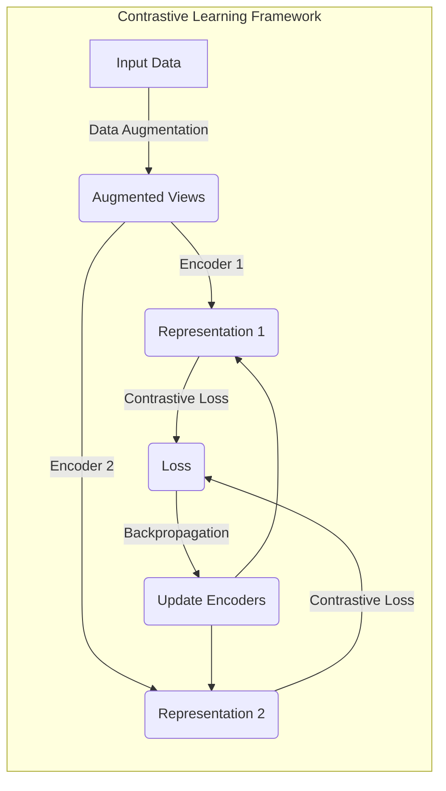

# 对比学习Contrastive Learning原理与代码实例讲解

## 1. 背景介绍

### 1.1 什么是对比学习

对比学习(Contrastive Learning)是一种自监督表示学习方法,旨在从大量未标记数据中学习数据的表示。与监督学习需要大量标记数据不同,对比学习可以利用海量未标记数据进行预训练,从而获得有效的数据表示,为下游任务做好准备。

对比学习的核心思想是"相似的样本应该具有相似的表示,不相似的样本应该具有不同的表示"。通过最大化相似样本之间表示的相似性,最小化不相似样本之间表示的相似性,模型可以学习到对数据的高质量表示。

### 1.2 对比学习的重要性

对比学习在计算机视觉、自然语言处理等领域取得了巨大成功,成为无监督表示学习的主导范式。通过预训练,模型可以从大量未标记数据中学习通用的表示,为下游任务提供有力支撑。这种无监督预训练的范式大大降低了标注数据的需求,显著提高了模型的泛化能力。

此外,对比学习还被应用于其他领域,如推荐系统、图神经网络等,展现出广阔的应用前景。随着对比学习理论和方法的不断发展,相信它将在更多领域发挥重要作用。

## 2. 核心概念与联系

### 2.1 对比学习的核心思想

对比学习的核心思想是"相似的样本应该具有相似的表示,不相似的样本应该具有不同的表示"。具体来说,对比学习通过设计对比损失函数(Contrastive Loss),最大化相似样本之间表示的相似性,最小化不相似样本之间表示的相似性,从而学习到高质量的数据表示。

### 2.2 正样本与负样本

在对比学习中,需要明确定义正样本(Positive Sample)和负样本(Negative Sample)。正样本指的是相似的样本对,如同一个图像的两种不同视角;负样本指的是不相似的样本对,如不同图像。对比学习的目标是最大化正样本之间表示的相似性,最小化负样本之间表示的相似性。

### 2.3 对比损失函数

对比损失函数(Contrastive Loss)是对比学习的核心,用于衡量正样本表示的相似性和负样本表示的不相似性。常见的对比损失函数包括 NT-Xent Loss、InfoNCE Loss 等。这些损失函数通常基于相似度度量(如点积相似度)来计算正负样本表示的相似程度,并对其进行优化。

### 2.4 数据增强

数据增强(Data Augmentation)是对比学习的重要组成部分。通过对输入数据进行一系列变换(如裁剪、旋转、噪声添加等),可以产生相似但不完全相同的正样本对。这种数据增强策略可以增强模型对数据的鲁棒性,提高表示的质量。

### 2.5 对比学习框架

对比学习框架通常包括两个编码器(Encoder)和一个对比损失函数。两个编码器分别对输入的正样本进行编码,得到对应的表示向量。然后,对比损失函数根据正负样本的表示向量计算损失,并对编码器进行优化,使得正样本表示相似,负样本表示不相似。



上图展示了一个典型的对比学习框架。输入数据首先经过数据增强,产生多个增强视图。这些视图被分别输入两个编码器,得到对应的表示向量。然后,对比损失函数根据这些表示向量计算损失,并通过反向传播更新编码器的参数,使得正样本表示相似,负样本表示不相似。

## 3. 核心算法原理具体操作步骤

### 3.1 对比学习算法步骤

对比学习算法的具体步骤如下:

1. **准备数据集**: 收集大量未标记的数据,如图像、文本等。

2. **数据增强**: 对输入数据进行数据增强,产生多个相似但不完全相同的正样本视图。常见的数据增强操作包括裁剪、旋转、噪声添加等。

3. **编码器前向传播**: 将正样本视图输入两个独立的编码器(如卷积神经网络或transformer),分别得到对应的表示向量。

4. **构建正负样本对**: 从批次中选择正样本对(同一个样本的不同视图)和负样本对(不同样本之间的视图)。

5. **计算对比损失**: 根据正负样本对的表示向量,计算对比损失函数(如NT-Xent Loss或InfoNCE Loss)。对比损失函数的目标是最大化正样本表示的相似性,最小化负样本表示的相似性。

6. **反向传播和优化**: 通过反向传播,计算对比损失相对于编码器参数的梯度,并使用优化器(如SGD或Adam)更新编码器的参数。

7. **重复训练**: 重复上述步骤,直到模型收敛或达到预设的训练轮数。

通过上述步骤,对比学习算法可以从大量未标记数据中学习到高质量的数据表示,为下游任务做好准备。

### 3.2 对比学习算法伪代码

以下是对比学习算法的伪代码:

```python
# 对比学习算法伪代码

# 初始化编码器
encoder1 = Encoder()
encoder2 = Encoder()

# 定义对比损失函数
contrastive_loss = NTXentLoss()

# 训练循环
for epoch in num_epochs:
    # 遍历数据集
    for data in dataset:
        # 数据增强
        views = data_augmentation(data)
        
        # 编码器前向传播
        repr1 = encoder1(views[0])
        repr2 = encoder2(views[1])
        
        # 构建正负样本对
        positive_pairs = ... # 同一个样本的不同视图
        negative_pairs = ... # 不同样本之间的视图
        
        # 计算对比损失
        loss = contrastive_loss(repr1, repr2, positive_pairs, negative_pairs)
        
        # 反向传播和优化
        loss.backward()
        optimizer.step()

# 保存编码器权重
save_weights(encoder1, encoder2)
```

上述伪代码展示了对比学习算法的主要步骤。首先初始化两个编码器,并定义对比损失函数。然后在训练循环中,对输入数据进行数据增强,得到多个正样本视图。将这些视图输入编码器,得到对应的表示向量。接下来,构建正负样本对,计算对比损失函数。最后,通过反向传播和优化器更新编码器的参数。重复上述步骤,直到模型收敛。

## 4. 数学模型和公式详细讲解举例说明

### 4.1 对比损失函数

对比损失函数是对比学习的核心,用于衡量正样本表示的相似性和负样本表示的不相似性。常见的对比损失函数包括NT-Xent Loss和InfoNCE Loss。

#### 4.1.1 NT-Xent Loss

NT-Xent Loss(Normalized Temperature-scaled Cross Entropy Loss)是一种常用的对比损失函数,其公式如下:

$$
\mathcal{L}_{i}=-\log \frac{\exp \left(\operatorname{sim}\left(\mathbf{z}_{i}, \mathbf{z}_{j}\right) / \tau\right)}{\sum_{k=1}^{2 N} \mathbb{1}_{[k \neq i]} \exp \left(\operatorname{sim}\left(\mathbf{z}_{i}, \mathbf{z}_{k}\right) / \tau\right)}
$$

其中:

- $\mathbf{z}_{i}$和$\mathbf{z}_{j}$是同一个样本的两个不同视图的表示向量,是正样本对。
- $\operatorname{sim}(\mathbf{u}, \mathbf{v})=\mathbf{u}^{\top} \mathbf{v} /\|\mathbf{u}\|\|\mathbf{v}\|$是余弦相似度函数,用于衡量两个向量的相似性。
- $\tau$是一个温度超参数,用于控制相似度的尺度。
- 分母部分是所有$2N$个样本中除了$\mathbf{z}_{i}$之外的其他样本与$\mathbf{z}_{i}$的相似度之和,这些样本被视为负样本。
- $\mathbb{1}_{[k \neq i]}$是指示函数,当$k \neq i$时取值为1,否则为0。

NT-Xent Loss的目标是最大化正样本对$(\mathbf{z}_{i}, \mathbf{z}_{j})$的相似度,同时最小化$\mathbf{z}_{i}$与所有负样本的相似度。通过优化这个损失函数,编码器可以学习到高质量的数据表示。

#### 4.1.2 InfoNCE Loss

InfoNCE Loss(Information Noise-Contrastive Estimation Loss)是另一种常用的对比损失函数,其公式如下:

$$
\mathcal{L}_{i}=-\log \frac{\exp \left(\operatorname{sim}\left(\mathbf{z}_{i}, \mathbf{z}_{j}\right)\right)}{\exp \left(\operatorname{sim}\left(\mathbf{z}_{i}, \mathbf{z}_{j}\right)\right)+\sum_{k=1}^{K} \exp \left(\operatorname{sim}\left(\mathbf{z}_{i}, \mathbf{z}_{k}^{-}\right)\right)}
$$

其中:

- $\mathbf{z}_{i}$和$\mathbf{z}_{j}$是同一个样本的两个不同视图的表示向量,是正样本对。
- $\mathbf{z}_{k}^{-}$是负样本的表示向量。
- $\operatorname{sim}(\mathbf{u}, \mathbf{v})$是相似度函数,通常使用余弦相似度或点积。
- $K$是负样本的数量。

InfoNCE Loss的目标也是最大化正样本对的相似度,同时最小化正样本与负样本的相似度。与NT-Xent Loss不同的是,InfoNCE Loss只考虑了一个批次中的负样本,而不是所有样本。

通过优化上述对比损失函数,编码器可以学习到高质量的数据表示,使得正样本表示相似,负样本表示不相似。

### 4.2 数据增强策略

数据增强是对比学习的重要组成部分,它通过对输入数据进行一系列变换,产生相似但不完全相同的正样本视图。常见的数据增强策略包括:

#### 4.2.1 图像数据增强

对于图像数据,常用的数据增强操作包括:

- 裁剪(Cropping)
- 旋转(Rotation)
- 翻转(Flipping)
- 颜色抖动(Color Jittering)
- 高斯噪声(Gaussian Noise)
- 遮挡(Cutout)

这些操作可以应用于图像的不同视图,产生相似但不完全相同的正样本对。例如,对同一张图像进行不同程度的裁剪和旋转,可以得到两个相似但不同的视图。

#### 4.2.2 文本数据增强

对于文本数据,常用的数据增强操作包括:

- 词替换(Word Replacement)
- 词删除(Word Deletion)
- 词插入(Word Insertion)
- 词顺序打乱(Word Shuffle)

这些操作可以应用于同一段文本的不同视图,产生相似但不完全相同的正样本对。例如,对同一段文本进行词替换和词删除,可以得到两个相似但不同的视图。

数据增强策略的选择取决于具体的数据类型和任务,合理的数据增强可以提高模型的鲁棒性和泛化能力。

## 5. 项目实践:代码实例和详细解释说明

在本节中,我们将通过一个基于PyTorch的对比学习示例代码,展示如何实现对比学习算法。该示例代码使用CIFAR-10数据集进行训练,并使用ResNet-18作为编码器。

### 5.1 导入必要的库

```python
import torch
import torch.nn as nn
import torch.nn.functional as F
from torchvision import datasets, transforms
```

### 5.2 定义数据增强策略

```python
# 数据增强
transform_train = transforms.