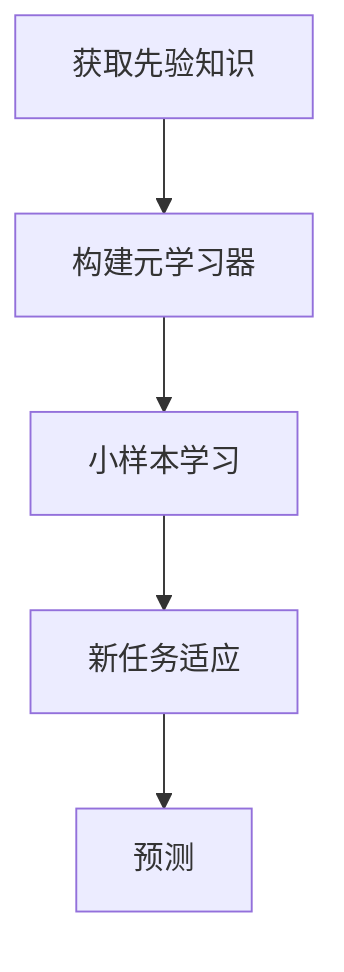

# 小样本学习 (Few-Shot Learning) 原理与代码实例讲解

## 1. 背景介绍

### 1.1 传统机器学习的挑战

在传统的机器学习中,我们通常需要大量的标注数据来训练模型,以期获得良好的泛化性能。然而,在许多现实应用场景中,获取大量高质量的标注数据是一项昂贵且耗时的过程。这种数据稀缺的问题严重阻碍了机器学习模型在这些领域的应用。

### 1.2 小样本学习的兴起

小样本学习(Few-Shot Learning)旨在通过少量示例(few examples)就能快速学习新概念并泛化到新的任务上。这种学习范式极大地降低了标注数据的需求,为解决数据稀缺问题提供了一种有效途径。近年来,小样本学习在计算机视觉、自然语言处理等领域引起了广泛关注,并取得了卓越的研究进展。

## 2. 核心概念与联系

### 2.1 小样本学习的定义

小样本学习(Few-Shot Learning)是一种机器学习范式,它旨在通过少量示例(few examples)就能快速学习新概念并泛化到新的任务上。与传统的监督学习不同,小样本学习不需要大量的标注数据,而是利用少量示例和先验知识来学习新任务。

### 2.2 小样本学习与其他学习范式的关系

小样本学习与其他一些机器学习范式有着密切的联系,例如:

- 迁移学习(Transfer Learning): 利用在源领域学习到的知识来帮助目标领域的学习。小样本学习可以被视为一种特殊的迁移学习,其中源领域和目标领域之间存在较大的差异。
- 元学习(Meta-Learning): 学习如何快速学习新任务的能力。小样本学习通常借助元学习来提高模型的快速适应能力。
- 零次学习(Zero-Shot Learning): 在完全没有任何示例的情况下学习新概念。零次学习可以被视为小样本学习的一个极端情况。

### 2.3 小样本学习的挑战

小样本学习面临以下几个主要挑战:

1. 数据稀缺: 只有少量的示例数据,很容易导致过拟合。
2. 任务多样性: 需要快速适应不同的任务,具有良好的泛化能力。
3. 知识利用: 如何有效利用先验知识和少量示例来学习新任务。

## 3. 核心算法原理具体操作步骤

小样本学习的核心算法原理可以概括为以下几个步骤:



### 3.1 获取先验知识

首先,我们需要获取一些先验知识,通常是从大量数据中学习到的一般化表示或模型。这些先验知识可以来自于预训练模型、迁移学习或其他机器学习技术。

### 3.2 构建元学习器

基于获取的先验知识,我们构建一个元学习器(Meta-Learner)。元学习器的目标是学习如何快速适应新任务,而不是直接学习具体的任务。常见的元学习算法包括模型无关的元学习(Model-Agnostic Meta-Learning, MAML)、优化作为模型的元学习(Optimization as a Model for Few-Shot Learning)等。

### 3.3 小样本学习

在小样本学习阶段,我们利用元学习器和少量示例数据来快速学习新任务。这个过程通常包括以下步骤:

1. 从任务分布中采样一个新任务。
2. 利用该任务的少量示例数据,通过元学习器进行快速适应。
3. 评估模型在该任务上的性能,并根据需要进行优化。

### 3.4 新任务适应

经过小样本学习后,我们获得了一个针对新任务的适应模型。这个模型可以利用先验知识和少量示例数据,在新任务上表现出良好的泛化能力。

### 3.5 预测

最后,我们可以使用适应后的模型对新的输入数据进行预测,完成实际的任务。

## 4. 数学模型和公式详细讲解举例说明

在小样本学习中,常见的数学模型和公式包括:

### 4.1 模型无关的元学习 (MAML)

MAML是一种广泛使用的元学习算法,它旨在找到一个好的初始化点,使得在少量更新步骤后,模型可以快速适应新任务。MAML的目标函数可以表示为:

$$\min_{\theta} \sum_{T_i \sim p(T)} \mathcal{L}_{T_i}(f_{\theta_i^*})$$

其中,$$\theta$$是模型的初始参数,$$T_i$$是从任务分布$$p(T)$$中采样的任务,$$f_{\theta_i^*}$$是在任务$$T_i$$上经过少量更新步骤后的模型,$$\mathcal{L}_{T_i}(\cdot)$$是任务$$T_i$$的损失函数。

MAML通过优化上述目标函数,找到一个好的初始化点$$\theta$$,使得在任何新任务上,只需经过少量更新步骤,模型就可以快速适应。

### 4.2 优化作为模型的元学习

优化作为模型的元学习(Optimization as a Model for Few-Shot Learning)是另一种流行的元学习方法。它将优化过程建模为一个可学习的模型,旨在直接学习快速适应新任务的优化策略。

该方法引入了一个元学习器$$g_{\phi}$$,其参数为$$\phi$$。给定一个新任务$$T_i$$和相应的支持集(support set)$$\mathcal{D}_i^{tr}$$,我们可以通过优化以下目标函数来获得适应后的模型参数$$\theta_i^*$$:

$$\theta_i^* = g_{\phi}(T_i, \mathcal{D}_i^{tr})$$

在训练阶段,我们优化元学习器$$g_{\phi}$$的参数$$\phi$$,使得在任务分布$$p(T)$$上,适应后的模型$$f_{\theta_i^*}$$在查询集(query set)$$\mathcal{D}_i^{qr}$$上的损失最小化:

$$\min_{\phi} \sum_{T_i \sim p(T)} \mathcal{L}_{T_i}(f_{\theta_i^*}, \mathcal{D}_i^{qr})$$

其中,$$\theta_i^* = g_{\phi}(T_i, \mathcal{D}_i^{tr})$$。

通过这种方式,元学习器$$g_{\phi}$$学习了一种快速适应新任务的优化策略,可以在少量示例数据的情况下快速生成适应后的模型参数。

### 4.3 原型网络

原型网络(Prototypical Networks)是一种基于距离度量的小样本学习方法。它将每个类别表示为一个原型向量,并根据输入数据与原型向量之间的距离来进行分类。

给定一个新任务$$T_i$$,其支持集为$$\mathcal{D}_i^{tr} = \{(x_j, y_j)\}_{j=1}^{N}$$,其中$$x_j$$是输入数据,$$y_j \in \{1, 2, \ldots, K\}$$是对应的类别标签。我们可以计算每个类别$$k$$的原型向量$$c_k$$:

$$c_k = \frac{1}{|S_k|} \sum_{(x_j, y_j) \in S_k} f_{\theta}(x_j)$$

其中,$$S_k = \{(x_j, y_j) \in \mathcal{D}_i^{tr} | y_j = k\}$$是属于类别$$k$$的支持集合,$$f_{\theta}(\cdot)$$是一个嵌入函数,用于将输入数据映射到一个向量空间。

对于一个新的查询样本$$x^*$$,我们可以计算它与每个原型向量的距离,并将其分配到最近的原型所对应的类别:

$$y^* = \arg\min_k d(f_{\theta}(x^*), c_k)$$

其中,$$d(\cdot, \cdot)$$是一个距离度量函数,如欧几里得距离或余弦距离。

在训练阶段,我们优化嵌入函数$$f_{\theta}(\cdot)$$的参数$$\theta$$,使得在任务分布$$p(T)$$上,查询集$$\mathcal{D}_i^{qr}$$上的分类准确率最大化。

原型网络的优点是简单且易于理解,缺点是它假设每个类别可以用一个单一的原型向量来表示,这可能在某些情况下过于简单化。

## 5. 项目实践: 代码实例和详细解释说明

在这一部分,我们将通过一个实际的代码示例来演示如何实现小样本学习。我们将使用PyTorch框架,并基于MAML算法构建一个小样本图像分类模型。

### 5.1 数据准备

我们将使用著名的Omniglot数据集进行实验。Omniglot数据集包含来自多种文字系统的手写字符图像,非常适合用于小样本学习任务。

```python
import torchvision.datasets as datasets
import torchvision.transforms as transforms

# 定义数据转换
transform = transforms.Compose([
    transforms.Resize(28),
    transforms.ToTensor(),
    transforms.Normalize((0.5,), (0.5,))
])

# 加载Omniglot数据集
omniglot = datasets.Omniglot(root='./data', download=True, transform=transform)
```

### 5.2 MAML实现

我们将实现MAML算法的核心部分,包括元学习器和任务采样器。

```python
import torch
import torch.nn as nn
import torch.optim as optim

# 定义卷积网络模型
class ConvNet(nn.Module):
    def __init__(self):
        super(ConvNet, self).__init__()
        self.conv1 = nn.Conv2d(1, 64, 3, padding=1)
        self.bn1 = nn.BatchNorm2d(64)
        self.conv2 = nn.Conv2d(64, 64, 3, padding=1)
        self.bn2 = nn.BatchNorm2d(64)
        self.conv3 = nn.Conv2d(64, 64, 3, padding=1)
        self.bn3 = nn.BatchNorm2d(64)
        self.conv4 = nn.Conv2d(64, 64, 3, padding=1)
        self.bn4 = nn.BatchNorm2d(64)
        self.fc1 = nn.Linear(64, 10)

    def forward(self, x):
        x = F.max_pool2d(F.relu(self.bn1(self.conv1(x))), 2)
        x = F.max_pool2d(F.relu(self.bn2(self.conv2(x))), 2)
        x = F.max_pool2d(F.relu(self.bn3(self.conv3(x))), 2)
        x = F.max_pool2d(F.relu(self.bn4(self.conv4(x))), 2)
        x = x.view(x.size(0), -1)
        x = self.fc1(x)
        return x

# 定义MAML元学习器
class MAML(nn.Module):
    def __init__(self, model, lr=0.01, first_order=False):
        super(MAML, self).__init__()
        self.model = model
        self.lr = lr
        self.first_order = first_order

    def forward(self, x_spt, y_spt, x_qry, y_qry):
        # 计算支持集损失和梯度
        loss_spt = F.cross_entropy(self.model(x_spt), y_spt)
        grads = torch.autograd.grad(loss_spt, self.model.parameters(), create_graph=True)
        
        # 更新模型参数
        fast_weights = list(map(lambda p: p[1] - self.lr * p[0], zip(grads, self.model.parameters())))
        
        # 计算查询集损失
        loss_qry = F.cross_entropy(self.model(*fast_weights)(x_qry), y_qry)
        
        # 计算元梯度和更新元学习器参数
        if self.first_order:
            grads = torch.autograd.grad(loss_qry, self.model.parameters())
        else:
            grads = torch.autograd.grad(loss_qry, fast_weights)
        
        return loss_qry

# 定义任务采样器
def task_sampler(dataset, n_way, k_shot, k_query):
    # 随机采样类别
    classes = torch.randperm(len(dataset.ys))[:n_way]
    
    # 构建支持集和查询集
    support_data, support_labels = [], []
    query_data, query_labels = [], []
    for c in classes:
        # 获取当前类别的所有数据
        data_c = dataset.data[dataset.ys == c]
        
        # 随机采