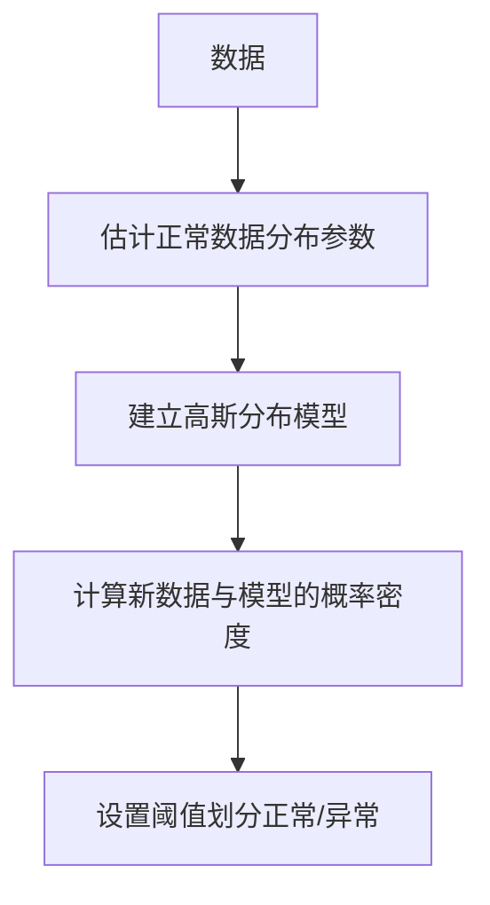
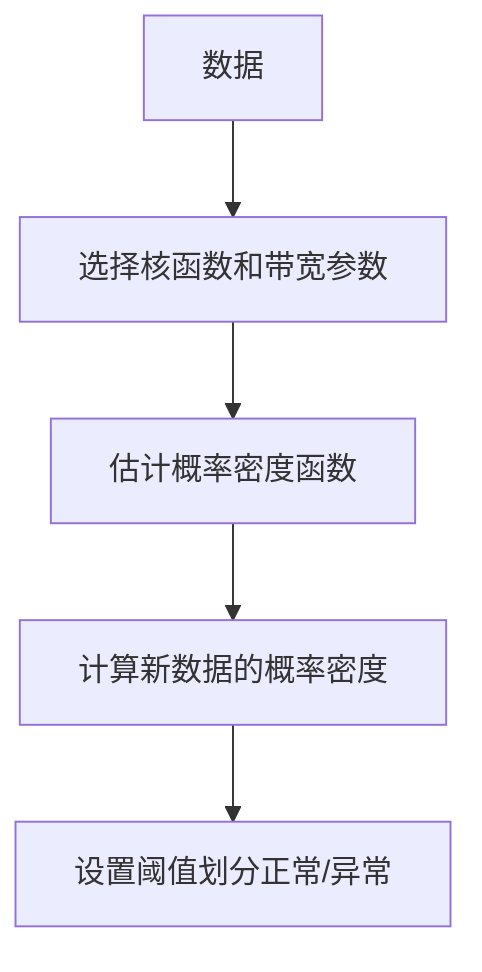
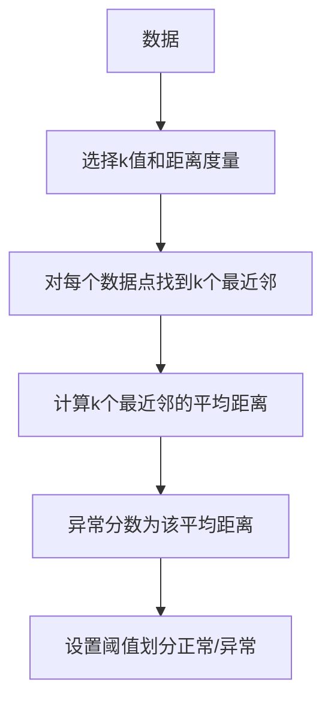
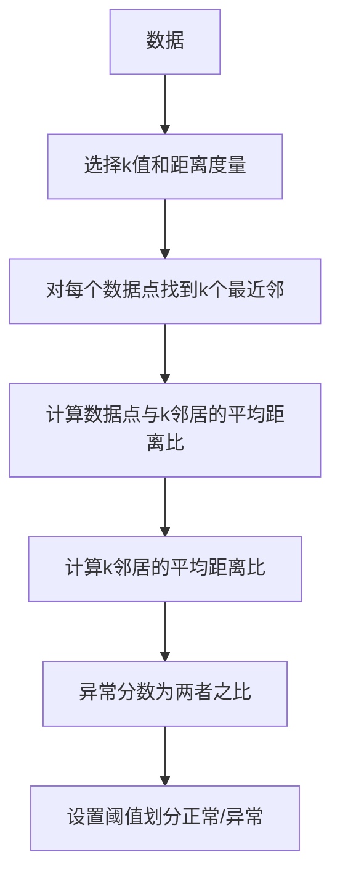
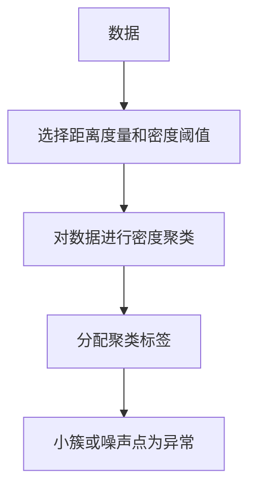
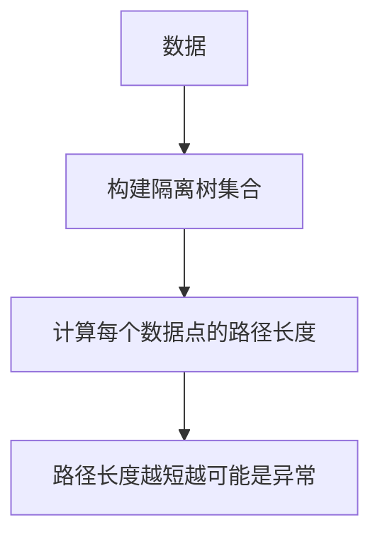
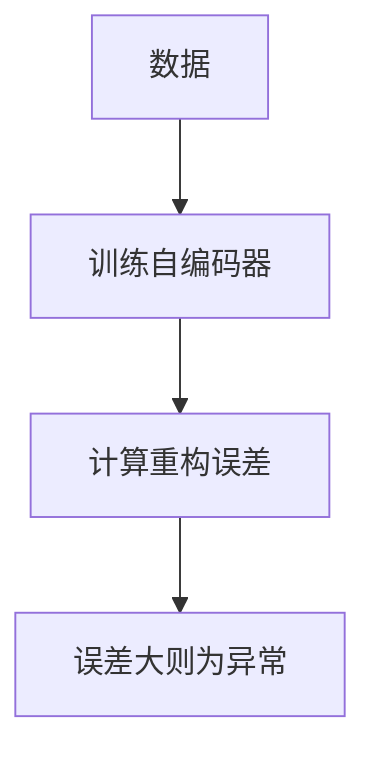
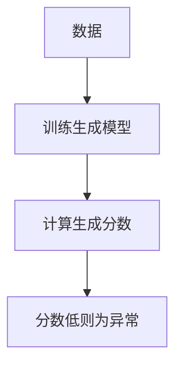

# 异常检测(Anomaly Detection)原理与代码实战案例讲解

## 1.背景介绍

在当今数据驱动的时代,异常检测已成为许多领域的关键技术,如金融欺诈检测、网络安全入侵检测、制造业缺陷检测等。异常检测的目标是从大量数据中识别出那些与正常模式显著不同的"异常"数据点或事件。这些异常可能表示潜在的威胁、错误或新的行为模式,及时发现和处理异常对于确保系统的可靠性和安全性至关重要。

### 1.1 异常检测的重要性

异常检测在以下几个方面具有重要意义:

- **安全防护**: 及时发现网络入侵、欺诈行为、恶意代码等安全威胁,保护系统和数据的安全。
- **故障检测**: 监测制造过程、机器运行状态等,发现异常从而预防故障发生。
- **健康监控**: 检测医疗数据中的异常,有助于疾病的早期发现和治疗。
- **客户行为分析**: 发现客户异常行为模式,为个性化服务和营销策略提供依据。

### 1.2 异常检测的挑战

尽管异常检测极为重要,但也面临着诸多挑战:

- **数据不平衡**: 异常数据通常远少于正常数据,导致训练数据极度不平衡。
- **异常多样性**: 异常的形式多种多样,很难用统一的模型来描述。
- **数据噪声**: 真实数据往往存在噪声,噪声会干扰异常检测的准确性。
- **数据漂移**: 随着时间推移,正常数据的分布可能发生变化,需要动态调整模型。

## 2.核心概念与联系

### 2.1 异常检测的类型

根据是否使用已标记的异常数据进行训练,异常检测可分为三种类型:

1. **监督异常检测(Supervised Anomaly Detection)**
   - 利用已标记的正常和异常数据训练分类模型
   - 常用算法:逻辑回归、决策树、支持向量机等
2. **无监督异常检测(Unsupervised Anomaly Detection)** 
   - 仅使用未标记的正常数据训练,将偏离正常模式的数据视为异常
   - 常用算法:聚类算法、隔离森林、一类支持向量机等
3. **半监督异常检测(Semi-Supervised Anomaly Detection)**
   - 利用少量已标记异常数据和大量未标记数据进行训练
   - 常用算法:深度自编码器、生成对抗网络等

### 2.2 异常分数与阈值

异常检测算法通常会为每个数据点计算一个异常分数,表示其偏离正常模式的程度。异常分数越高,越可能是异常。通过设置一个阈值,可将数据点划分为正常和异常两类。

阈值的选择需要在检测率(异常被正确检测的比例)和误报率(正常被错误标记为异常的比例)之间权衡。阈值设置过高,会导致许多异常被遗漏;阈值过低,则会产生大量误报。

### 2.3 异常检测与其他技术的关系

异常检测与以下技术领域密切相关:

- **outlier detection(离群点检测)**: 侧重于识别数据集中的极端值。
- **novelty detection(新颖性检测)**: 侧重于识别与训练数据完全不同的新模式。
- **概念漂移检测**: 检测数据分布随时间变化的情况,以动态调整模型。

## 3.核心算法原理具体操作步骤

异常检测算法的核心思想是学习正常数据的模式,并将偏离该模式的数据视为异常。常见的无监督异常检测算法包括:

### 3.1 基于统计的方法

#### 3.1.1 高斯分布模型

1. 假设正常数据服从高斯(正态)分布
2. 使用正常数据估计高斯分布的均值和协方差矩阵
3. 对于新数据点,计算其在该高斯分布下的概率密度
4. 设置阈值,概率密度低于阈值的视为异常

优点是模型简单、高效,但只能检测连续数值型数据,且对异常分布的假设较为严格。

#### 3.1.2 核密度估计

1. 选择合适的核函数(如高斯核)和带宽参数
2. 使用核密度估计方法,基于正常数据估计概率密度函数
3. 对于新数据点,计算其在估计的概率密度函数下的密度值
4. 设置阈值,密度值低于阈值的视为异常

核密度估计能够捕捉任意形状的数据分布,但计算复杂度较高,并且对带宽参数的选择敏感。

### 3.2 基于距离的方法

#### 3.2.1 k-近邻异常分数

1. 选择k值(k个最近邻)和距离度量(如欧几里得距离)
2. 对于每个数据点,找到与其最近的k个邻居
3. 计算该数据点到这k个邻居的平均距离,作为其异常分数
4. 设置阈值,异常分数大于阈值的视为异常

该方法简单直观,但对k值和距离度量的选择敏感,且计算复杂度较高。

#### 3.2.2 局部异常系数

1. 选择k值和距离度量
2. 对于每个数据点p,找到与其最近的k个邻居
3. 计算p到这k个邻居的平均距离,记为lrd
4. 对于p的每个k邻居q,计算q到其余k-1邻居的平均距离
5. 计算所有k邻居的上述平均距离的均值,记为lrd_avg
6. p的异常分数为lrd/lrd_avg
7. 设置阈值,异常分数大于阈值的视为异常

该方法能够检测出局部密度较低的异常点,但同样需要选择合适的k值和距离度量。

### 3.3 基于聚类的方法

#### 3.3.1 基于密度的聚类

1. 选择距离度量(如欧几里得距离)和密度阈值
2. 使用DBSCAN等基于密度的聚类算法对数据进行聚类
3. 为每个数据点分配对应的聚类标签
4. 聚类簇较小或未被分配簇的噪声点视为异常

该方法能够自动发现任意形状的聚类,但对密度阈值的选择敏感,且无法检测出大簇中的异常点。

#### 3.3.2 隔离森林

1. 使用随机划分构建一个隔离树集合(即隔离森林)
2. 对于每个数据点,计算其在隔离树集合中的平均路径长度
3. 路径长度越短,则该数据点越容易被隔离,越可能是异常

隔离森林能够有效检测出异常点,并且对数据的分布无假设。但在高维数据上可能效果不佳,并且对噪声数据敏感。

### 3.4 基于深度学习的方法

#### 3.4.1 自编码器

1. 使用正常数据训练自编码器网络
2. 对于新数据点,将其输入自编码器并计算重构误差
3. 误差越大,则该数据点越可能是异常

自编码器能够自动学习数据的特征表示,但需要大量正常数据进行训练,并且对异常类型的鲁棒性较差。

#### 3.4.2 生成对抗网络

1. 使用正常数据训练生成对抗网络(GAN)的生成模型
2. 对于新数据点,将其输入生成模型并计算生成分数
3. 生成分数越低,则该数据点越可能是异常

GAN能够学习数据的真实分布,并生成逼真的正常样本。但训练过程不稳定,且难以解释异常的原因。

## 4.数学模型和公式详细讲解举例说明

异常检测算法通常涉及一些核心的数学概念和模型,下面将详细讲解其中的一些重要公式。

### 4.1 高斯分布模型

高斯分布(正态分布)是一种重要的连续概率分布,在异常检测中被广泛应用。其概率密度函数为:

$$
f(x|\mu,\Sigma)=\frac{1}{\sqrt{(2\pi)^d|\Sigma|}}\exp\left(-\frac{1}{2}(x-\mu)^T\Sigma^{-1}(x-\mu)\right)
$$

其中:
- $x$是$d$维数据向量
- $\mu$是$d$维均值向量
- $\Sigma$是$d\times d$维协方差矩阵
- $|\Sigma|$表示$\Sigma$的行列式

在异常检测中,我们通常使用正常数据的均值$\mu$和协方差$\Sigma$来构建高斯分布模型。对于新的数据点$x$,可以计算其在该高斯分布下的概率密度$f(x|\mu,\Sigma)$。如果概率密度较低,则将$x$视为异常点。

**示例**:假设我们有一个二维数据集,其中大部分数据点服从均值为$(0,0)$,协方差矩阵为$\begin{bmatrix}1&0\\0&1\end{bmatrix}$的高斯分布。我们可以使用这个高斯分布模型来检测异常点。

考虑数据点$x=(2,3)$,其概率密度为:

$$
f(x|\mu,\Sigma)=\frac{1}{2\pi}\exp\left(-\frac{1}{2}(2^2+3^2)\right)\approx0.0439
$$

由于概率密度较低,因此可以将$(2,3)$视为异常点。

### 4.2 核密度估计

核密度估计是一种非参数密度估计方法,它不对数据分布作任何假设,而是直接根据数据估计概率密度函数。其公式为:

$$
\hat{f}(x)=\frac{1}{nh}\sum_{i=1}^nK\left(\frac{x-x_i}{h}\right)
$$

其中:
- $n$是样本数量
- $x_1,x_2,...,x_n$是样本数据点
- $K(\cdot)$是核函数,通常选择高斯核$K(u)=\frac{1}{\sqrt{2\pi}}\exp(-\frac{1}{2}u^2)$
- $h$是带宽参数,控制核函数的平滑程度

核密度估计将每个数据点$x_i$用一个核函数$