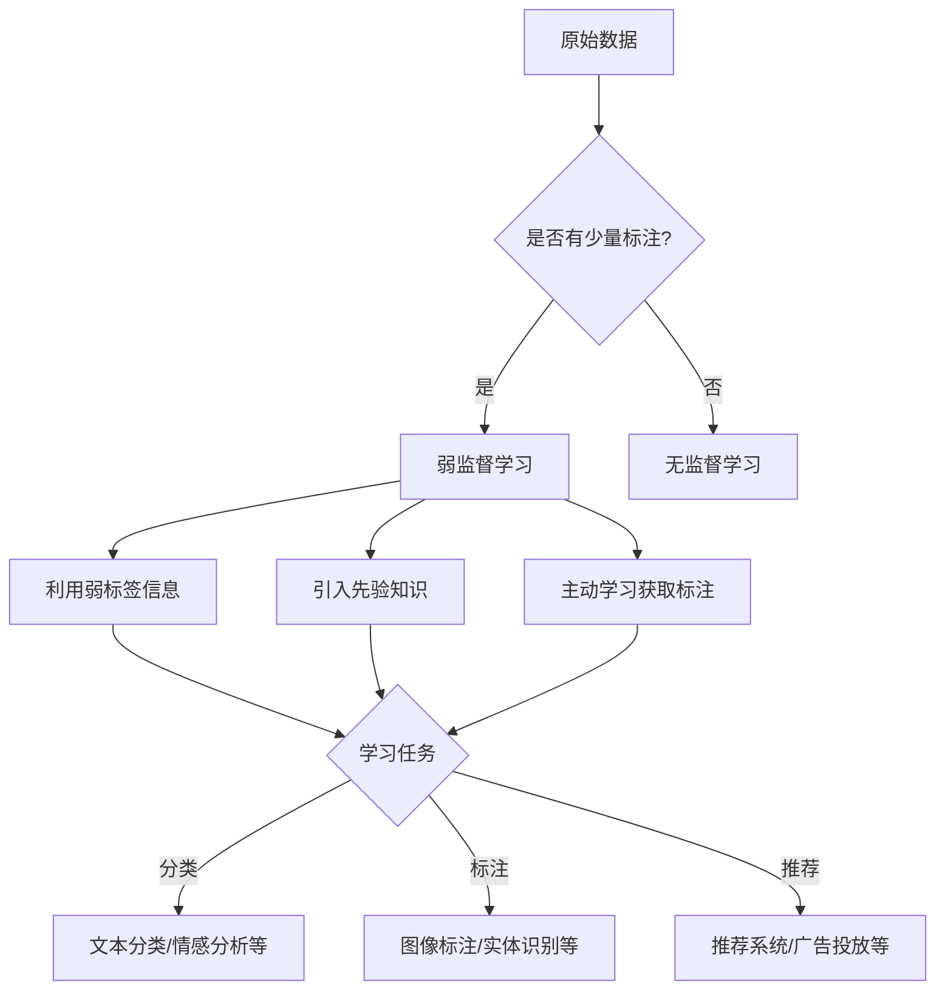

# 弱监督学习 原理与代码实例讲解

## 1. 背景介绍
### 1.1 监督学习的局限性 
### 1.2 弱监督学习的提出
### 1.3 弱监督学习的优势

## 2. 核心概念与联系
### 2.1 弱标签
#### 2.1.1 定义
#### 2.1.2 特点
#### 2.1.3 获取方式
### 2.2 半监督学习
#### 2.2.1 定义 
#### 2.2.2 与弱监督学习的区别和联系
### 2.3 多示例学习
#### 2.3.1 定义
#### 2.3.2 与弱监督学习的区别和联系
### 2.4 主动学习
#### 2.4.1 定义
#### 2.4.2 与弱监督学习的区别和联系

## 3. 核心算法原理具体操作步骤
### 3.1 基于图的方法
#### 3.1.1 标签传播算法
#### 3.1.2 谱方法
### 3.2 基于分布式表示的方法  
#### 3.2.1 词袋模型
#### 3.2.2 词嵌入模型
### 3.3 基于生成式模型的方法
#### 3.3.1 主题模型
#### 3.3.2 变分自编码器

## 4. 数学模型和公式详细讲解举例说明
### 4.1 标签传播算法的数学模型
#### 4.1.1 模型假设
#### 4.1.2 目标函数
#### 4.1.3 优化求解
#### 4.1.4 算法流程
### 4.2 词嵌入模型的数学原理
#### 4.2.1 CBOW模型
#### 4.2.2 Skip-Gram模型 
#### 4.2.3 负采样
### 4.3 变分自编码器的数学原理
#### 4.3.1 生成模型
#### 4.3.2 变分推断
#### 4.3.3 重参数化技巧

## 5. 项目实践：代码实例和详细解释说明
### 5.1 基于PyTorch实现标签传播算法
#### 5.1.1 数据准备
#### 5.1.2 模型定义
#### 5.1.3 训练过程
#### 5.1.4 测试评估
### 5.2 基于TensorFlow实现词嵌入模型
#### 5.2.1 数据预处理
#### 5.2.2 模型构建
#### 5.2.3 训练词向量
#### 5.2.4 可视化分析
### 5.3 基于Keras实现变分自编码器
#### 5.3.1 数据加载
#### 5.3.2 编码器和解码器
#### 5.3.3 损失函数设计
#### 5.3.4 训练与生成

## 6. 实际应用场景
### 6.1 文本分类
#### 6.1.1 场景描述
#### 6.1.2 弱监督学习的应用
### 6.2 图像标注
#### 6.2.1 场景描述
#### 6.2.2 弱监督学习的应用
### 6.3 推荐系统
#### 6.3.1 场景描述
#### 6.3.2 弱监督学习的应用

## 7. 工具和资源推荐
### 7.1 开源工具包
#### 7.1.1 Snorkel
#### 7.1.2 Weak-supervise
### 7.2 数据集资源
#### 7.2.1 ImageNet
#### 7.2.2 Wikipedia
### 7.3 论文与教程
#### 7.3.1 综述论文
#### 7.3.2 经典论文
#### 7.3.3 视频教程

## 8. 总结：未来发展趋势与挑战
### 8.1 弱监督学习的研究进展
### 8.2 弱监督学习面临的挑战
### 8.3 弱监督学习的未来发展方向

## 9. 附录：常见问题与解答
### 9.1 弱监督学习和无监督学习的区别是什么？
### 9.2 弱监督学习需要多少标注数据？
### 9.3 弱监督学习的泛化性能如何？
### 9.4 弱监督学习适用于哪些任务场景？

弱监督学习是机器学习领域的一个重要分支,它试图利用容易获取的弱标签信息,在只有少量甚至没有精确标注数据的情况下,训练出高质量的模型。与传统的监督学习范式相比,弱监督学习大大降低了人工标注的成本,使得训练数据的获取更加容易。同时它又能比无监督学习利用更多的先验知识,学习更加复杂和准确的模型。

弱监督学习通常需要解决三个关键问题:一是如何表示和利用弱标签信息,将其与强标签建立联系；二是如何引入领域先验知识,弥补监督信息的不足；三是如何主动学习,有效地获取新的标注数据。针对这些问题,研究者提出了许多有效的方法,主要包括:基于图的方法、基于分布式表示的方法、基于生成式模型的方法等。

基于图的方法将数据看作图中的节点,并通过节点之间的边建模它们的相似性。标签信息在图中传播,未标注数据可以从相邻的已标注数据获得标签。代表性的算法有标签传播和谱方法等。这类方法的优点是直观有效,缺点是计算复杂度较高。

基于分布式表示的方法试图学习数据的低维向量表示,使得语义相似的数据具有相近的表示。它能自动地学习数据的特征,减少了特征工程的工作量。词袋模型和词嵌入模型是两种常用的表示学习方法。前者将文本表示成词频向量,后者则将词映射为稠密向量。神经网络常被用于学习词嵌入。

基于生成式模型的方法假设数据由某种隐变量生成,并通过学习生成过程来建模数据分布。主题模型和变分自编码器是两种代表性的生成式模型。主题模型如LDA将文本看作是话题的混合分布,并从词分布中推断话题。变分自编码器则学习数据的隐空间表示,并可用于数据的生成和插值。

除了方法研究,弱监督学习在许多实际任务中得到了成功应用,如文本分类、图像标注、推荐系统等。以文本分类为例,利用关键词、情感词典等做弱标签,再经过训练,可以在大规模语料上得到较好的分类器。

尽管弱监督学习取得了长足进展,但它仍然面临诸多挑战:弱标签信息不一致、噪声较多；先验知识难以获取和表示；主动学习策略的选择等。如何进一步提升弱监督学习的精度、稳定性和适用性,是目前亟待解决的问题。未来,弱监督学习将向更加智能化、自动化和规模化的方向发展。

综上,弱监督学习是一种介于监督学习和无监督学习之间的新范式,它充分利用了弱标签信息和先验知识,有效地缓解了标注数据稀缺的问题。随着理论的进一步完善和应用的不断深入,弱监督学习必将在人工智能领域发挥越来越重要的作用。

作者：禅与计算机程序设计艺术 / Zen and the Art of Computer Programming