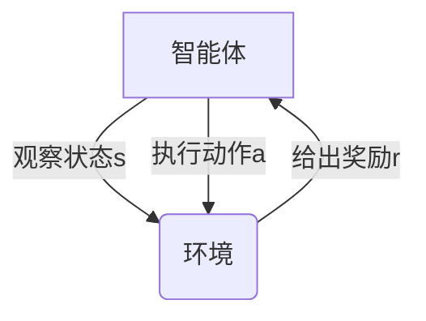

# 强化学习 原理与代码实例讲解

## 1.背景介绍

### 1.1 什么是强化学习

强化学习(Reinforcement Learning, RL)是机器学习的一个重要分支,它关注于如何基于环境反馈来学习行为策略,使得在一段时间内能够获得最大的累积奖励。与监督学习不同,强化学习没有提供标准的答案,智能体(Agent)必须通过不断尝试和环境交互来学习获取最优策略。

强化学习的思想源自于心理学家对动物学习行为的研究。动物通过反复尝试并获得奖惩反馈,逐步形成对环境的认知和行为习惯。类似地,强化学习智能体也是通过与环境交互获得奖励或惩罚信号,不断调整自身策略,最终学会执行获得最大累积奖励的行为序列。

### 1.2 强化学习在实际应用中的重要性

强化学习在诸多领域展现出巨大的应用潜力和价值,例如:

- 机器人控制:使机器人能够自主学习完成复杂任务
- 游戏AI:训练AI代理人在游戏中作出明智决策
- 资源管理:优化数据中心、电网等资源的分配和调度
- 自动驾驶:训练汽车在复杂环境中安全高效地行驶
- 金融交易:开发自动化交易策略以maximizeize收益
- 工业控制:优化工厂生产流程以提高效率和产量

随着算力和数据的不断增长,强化学习在更多领域大显身手,推动着人工智能的发展和应用。

## 2.核心概念与联系 

### 2.1 强化学习的形式化描述

强化学习问题可以形式化为一个马尔可夫决策过程(Markov Decision Process, MDP),由一个五元组(S, A, P, R, γ)组成:

- S是环境的状态集合
- A是智能体可选动作的集合  
- P是状态转移概率,P(s'|s,a)表示在状态s执行动作a后,转移到状态s'的概率
- R是奖励函数,R(s,a)表示在状态s执行动作a获得的即时奖励
- γ∈[0,1]是折扣因子,用于平衡当前和未来奖励的权重

智能体的目标是学习一个策略π:S→A,使得在遵循该策略时能够maximizeize累积折扣奖励:

$$G_t = \sum_{k=0}^{\infty} \gamma^k R_{t+k+1}$$

其中,t是当前时间步,G是从t开始遵循策略π获得的累积奖励。

### 2.2 强化学习的主要方法

根据是否基于模型,强化学习主要分为两大类:

1. **基于模型方法**
    - 先从经验数据估计出环境的转移概率P和奖励函数R
    - 基于估计的模型,通过规划或迭代方法求解最优策略
    - 优点是数据利用率高,收敛速度快
    - 缺点是估计模型的偏差会影响最终策略

2. **无模型方法**
    - 直接从与环境交互的经验数据中学习策略
    - 不需要显式建模,避免了模型偏差
    - 常用的方法有Q-Learning、Sarsa、Policy Gradient等
    - 优点是简单,无需建模;缺点是收敛慢,数据利用率低

此外,还有一些结合模型和无模型优点的混合方法,如Dyna、模型辅助的策略优化等。

## 3.核心算法原理具体操作步骤

### 3.1 动态规划方法

对于有限状态马尔可夫决策过程,可以使用动态规划的方法求解最优策略。这里介绍两种经典算法:策略迭代和值迭代。

#### 3.1.1 策略迭代(Policy Iteration)

策略迭代算法包含两个阶段交替进行:策略评估和策略提升。

1. **策略评估**:对于当前策略π,求解其价值函数V^π,即遵循π获得的期望累积奖励。这通过求解Bellman期望方程完成:

$$V^{\pi}(s) = \mathbb{E}_{\pi}\left[R_{t+1} + \gamma V^{\pi}(S_{t+1}) | S_t = s\right]$$

2. **策略提升**:利用评估得到的V^π,计算出一个在所有状态下均不小于V^π的新策略π'。这通过解决Bellman最优方程完成:

$$V^{*}(s) = \max_{a}\mathbb{E}\left[R_{t+1} + \gamma V^{*}(S_{t+1}) | S_t = s, A_t = a\right]$$

$$\pi'(s) = \arg\max_{a}\mathbb{E}\left[R_{t+1} + \gamma V^{*}(S_{t+1}) | S_t = s, A_t = a\right]$$

重复上述两个步骤,直至策略收敛到最优策略π*。

#### 3.1.2 值迭代(Value Iteration)

值迭代通过迭代更新Bellman最优方程,逐步逼近最优价值函数V*和最优策略π*。

$$V_{k+1}(s) = \max_{a}\mathbb{E}\left[R_{t+1} + \gamma V_k(S_{t+1}) | S_t = s, A_t = a\right]$$

$$\pi^{*}(s) = \arg\max_{a}\mathbb{E}\left[R_{t+1} + \gamma V^{*}(S_{t+1}) | S_t = s, A_t = a\right]$$

值迭代的每一步都使价值函数更接近V*,经过足够多次迭代后,可以收敛到最优解。

### 3.2 时序差分学习

对于大规模状态空间,动态规划方法由于维数灾难而失效。时序差分学习(Temporal Difference Learning)则是一种无模型的增量式学习方法,通过不断与环境交互来逐步更新价值函数或策略。

#### 3.2.1 Q-Learning

Q-Learning是最经典的时序差分算法之一,它直接学习状态-动作价值函数Q(s,a),而不是价值函数V(s)。

在每个时间步,Q-Learning根据下式更新Q值:

$$Q(S_t, A_t) \leftarrow Q(S_t, A_t) + \alpha\left(R_{t+1} + \gamma\max_{a}Q(S_{t+1}, a) - Q(S_t, A_t)\right)$$

其中,α是学习率,γ是折扣因子。更新目标是使Q(s,a)逼近期望的Q值。

在学习过程中,智能体根据某种策略(如ε-贪婪)选择动作,并不断更新Q函数。当Q函数收敛后,最优策略为:

$$\pi^{*}(s) = \arg\max_{a}Q^{*}(s, a)$$

#### 3.2.2 Sarsa

Sarsa(State-Action-Reward-State-Action)也是一种经典的时序差分算法,与Q-Learning的区别在于它直接学习在当前策略π下的Q^π函数。

Sarsa的更新规则为:

$$Q(S_t, A_t) \leftarrow Q(S_t, A_t) + \alpha\left(R_{t+1} + \gamma Q(S_{t+1}, A_{t+1}) - Q(S_t, A_t)\right)$$

其中,A_{t+1}是根据策略π在状态S_{t+1}选择的下一个动作。

Sarsa在策略评估和控制两方面都比Q-Learning更加直接,但收敛性能可能会差一些。

### 3.3 策略梯度算法

除了学习价值函数或Q函数,另一种强化学习方法是直接对策略进行参数化,并根据累积奖励的梯度来优化策略参数,这就是策略梯度(Policy Gradient)算法。

假设策略π由参数θ参数化,π(a|s,θ)表示在状态s下执行动作a的概率。我们的目标是最大化期望的累积奖励:

$$J(\theta) = \mathbb{E}_{\tau \sim \pi_{\theta}}\left[\sum_{t=0}^{T}R(s_t, a_t)\right]$$

其中τ=(s_0,a_0,s_1,a_1,...)是状态-动作的轨迹序列。

根据策略梯度定理,可以计算出J(θ)关于θ的梯度为:

$$\nabla_{\theta}J(\theta) = \mathbb{E}_{\tau \sim \pi_{\theta}}\left[\sum_{t=0}^{T}\nabla_{\theta}\log\pi(a_t|s_t, \theta)Q^{\pi_{\theta}}(s_t, a_t)\right]$$

利用这个梯度估计,可以使用策略梯度上升等优化算法来更新策略参数θ。

常见的策略梯度算法包括REINFORCE、Actor-Critic、Trust Region Policy Optimization(TRPO)、Proximal Policy Optimization(PPO)等。

## 4.数学模型和公式详细讲解举例说明

### 4.1 马尔可夫决策过程

马尔可夫决策过程(Markov Decision Process, MDP)是强化学习问题的数学模型,由一个五元组(S, A, P, R, γ)组成。

- **状态空间S**:环境的所有可能状态的集合。
- **动作空间A**:智能体在每个状态下可选择的动作集合。
- **状态转移概率P**:P(s'|s,a)表示在状态s执行动作a后,转移到状态s'的概率。
- **奖励函数R**:R(s,a)或R(s,a,s')表示在状态s执行动作a获得的即时奖励。
- **折扣因子γ**:γ∈[0,1]用于平衡当前和未来奖励的权重。

智能体的目标是学习一个策略π:S→A,使得在遵循该策略时能够maximizeize累积折扣奖励:

$$G_t = \sum_{k=0}^{\infty} \gamma^k R_{t+k+1}$$

其中,t是当前时间步。

#### 4.1.1 马尔可夫性质

马尔可夫性质指的是未来状态只依赖于当前状态,与过去状态无关:

$$P(S_{t+1}|S_t, A_t, S_{t-1}, A_{t-1}, ...) = P(S_{t+1}|S_t, A_t)$$

这种性质简化了问题,使得我们只需要考虑当前状态和动作,而不必关注整个历史轨迹。

#### 4.1.2 马尔可夫奖励过程

如果奖励函数只依赖于当前状态和动作,即R(s,a),那么MDP就是一个马尔可夫奖励过程。否则如果奖励还依赖于下一状态,即R(s,a,s'),就是一个非马尔可夫奖励过程。

马尔可夫奖励过程更简单一些,但非马尔可夫奖励过程也可以通过状态扩展的方式转化为马尔可夫过程。

### 4.2 Bellman方程

Bellman方程是解决MDP问题的关键,它将价值函数(或Q函数)分解为两部分:即时奖励和来自下一状态的价值。

#### 4.2.1 Bellman期望方程

对于一个确定性策略π,其价值函数V^π(s)应该满足Bellman期望方程:

$$V^{\pi}(s) = \mathbb{E}_{\pi}\left[R_{t+1} + \gamma V^{\pi}(S_{t+1}) | S_t = s\right]$$
$$= \sum_{a}\pi(a|s)\sum_{s'} P(s'|s,a)\left[R(s,a) + \gamma V^{\pi}(s')\right]$$

这个方程表示,V^π(s)等于当前获得的即时奖励,加上根据策略π转移到下一状态后获得的折扣价值。

我们可以将这个方程形成一个线性系统,并求解出V^π。这就是策略评估的过程。

#### 4.2.2 Bellman最优方程

对于最优策略π*,其对应的最优价值函数V*应该满足Bellman最优方程:

$$V^{*}(s) = \max_{a}\mathbb{E}\left[R_{t+1} + \gamma V^{*}(S_{t+1}) | S_t = s, A_t = a\right]$$

$$= \max_{a}\sum_{s'} P(s'|s,a)\left[R(s,a) + \gamma V^{*}(s')\right]$$

这个方程表示,V*(s)等于在当前状态s下执行最优动作获得的即时奖励,加上转