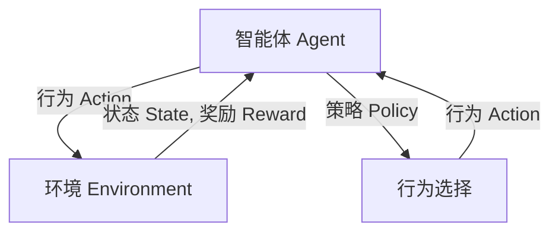
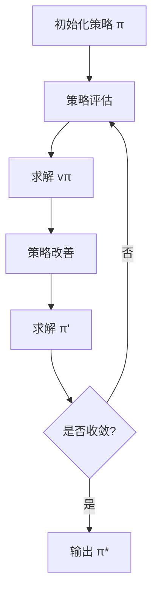

# 强化学习Reinforcement Learning与逆强化学习：理论与实践

## 1.背景介绍

### 1.1 什么是强化学习

强化学习(Reinforcement Learning, RL)是机器学习的一个重要分支,它关注于如何基于环境反馈来学习行为策略,以最大化长期累积奖励。与监督学习不同,强化学习没有提供标注的训练数据集,而是通过与环境的交互来学习。

强化学习的核心思想是利用试错来学习,即智能体(Agent)在环境(Environment)中采取行动(Action),环境会根据行动给出奖惩反馈(Reward),智能体根据这些反馈来调整自己的策略,以获得更多奖励。这种学习过程类似于人类通过实践和经验来获取知识和技能。

### 1.2 强化学习的应用

强化学习已被广泛应用于多个领域,例如:

- 游戏AI: 训练智能体玩大型游戏,如国际象棋、AlphaGo等
- 机器人控制: 训练机器人完成特定任务,如行走、抓取等
- 自动驾驶: 训练自动驾驶系统在复杂环境中安全行驶
- 资源管理: 优化数据中心资源分配、网络流量控制等
- 金融交易: 自动化交易策略优化

### 1.3 逆强化学习概述  

逆强化学习(Inverse Reinforcement Learning, IRL)是强化学习的一个分支,它关注从专家示范行为中推断出潜在的奖励函数。传统的强化学习需要人工设计奖励函数,而逆强化学习则通过观察示范数据来自动学习奖励函数,从而避免了手工设计的复杂性。

逆强化学习的应用场景包括:

- 机器人控制: 从人类示范中学习任务奖励
- 对抗模仿学习: 从对手策略中推断奖励,用于训练AI代理
- 对话系统: 从人类对话中学习对话奖励

## 2.核心概念与联系

### 2.1 强化学习核心要素

强化学习问题由以下几个核心要素组成:

- 智能体(Agent): 能够感知环境并采取行动的主体
- 环境(Environment): 智能体所处的外部世界
- 状态(State): 环境的当前情况
- 行为(Action): 智能体可以采取的操作
- 奖励函数(Reward Function): 对智能体行为给出评价反馈
- 策略(Policy): 智能体根据状态选择行为的规则

智能体和环境之间通过感知(Perception)和行为(Action)进行交互,环境会根据智能体的行为给出奖惩反馈(Reward),智能体的目标是学习一个最优策略,在长期内获得最大化的累积奖励。

### 2.2 强化学习与其他机器学习的区别

- 监督学习(Supervised Learning): 给定标注的训练数据集,学习一个映射函数
- 无监督学习(Unsupervised Learning): 仅给定输入数据,学习数据的内在结构
- 强化学习(Reinforcement Learning): 通过与环境交互获取反馈,学习最优策略

强化学习的特点是没有给定解答案,而是通过试错和累积经验来学习,这使得它更加贴近真实世界,但也带来了更大的探索和学习难度。

### 2.3 逆强化学习核心思想

传统强化学习需要人工设计奖励函数,而逆强化学习的核心思想是:给定专家示范的状态-行为序列,推断出隐含的奖励函数,从而学习到与专家行为相似的策略。

逆强化学习问题可以形式化为:给定专家示范轨迹 $\tau_E$,估计出一个奖励函数 $R$,使得在这个奖励函数下,专家的行为 $\pi_E$ 比其他行为 $\pi$ 获得更高的期望回报:

$$
\mathbb{E}_{\tau \sim \pi_E}[R(\tau)] \geq \mathbb{E}_{\tau \sim \pi}[R(\tau)]
$$

通过学习到这个隐含的奖励函数,我们就可以用传统的强化学习算法去优化相应的策略。

## 3.核心算法原理具体操作步骤

### 3.1 马尔可夫决策过程(MDP)

强化学习问题通常建模为马尔可夫决策过程(Markov Decision Process, MDP),它是一个离散时间的随机控制过程,由以下要素组成:

- 状态集合 $\mathcal{S}$
- 行为集合 $\mathcal{A}$
- 转移概率 $\mathcal{P}_{ss'}^a = \mathbb{P}(s_{t+1}=s'|s_t=s, a_t=a)$
- 奖励函数 $\mathcal{R}_s^a = \mathbb{E}[r_{t+1}|s_t=s, a_t=a]$
- 折扣因子 $\gamma \in [0, 1)$

在每个时间步 $t$,智能体处于状态 $s_t$,选择行为 $a_t$,然后转移到新状态 $s_{t+1}$,并获得即时奖励 $r_{t+1}$。智能体的目标是最大化长期累积折现奖励:

$$
G_t = \sum_{k=0}^{\infty} \gamma^k r_{t+k+1}
$$

### 3.2 值函数和贝尔曼方程

值函数(Value Function)用于评估一个状态或状态-行为对的长期价值,包括状态值函数和行为值函数:

- 状态值函数 $v_\pi(s) = \mathbb{E}_\pi[G_t|s_t=s]$
- 行为值函数 $q_\pi(s,a) = \mathbb{E}_\pi[G_t|s_t=s, a_t=a]$

值函数满足贝尔曼方程:

$$
\begin{aligned}
v_\pi(s) &= \sum_a \pi(a|s) \left( \mathcal{R}_s^a + \gamma \sum_{s'} \mathcal{P}_{ss'}^a v_\pi(s') \right) \\
q_\pi(s,a) &= \mathcal{R}_s^a + \gamma \sum_{s'} \mathcal{P}_{ss'}^a v_\pi(s')
\end{aligned}
$$

贝尔曼方程为求解最优值函数和策略提供了理论基础。

### 3.3 策略迭代算法

策略迭代(Policy Iteration)是求解MDP最优策略的经典算法,包含两个核心步骤:

1. 策略评估(Policy Evaluation): 对于给定策略 $\pi$,求解其值函数 $v_\pi$
2. 策略改善(Policy Improvement): 对于当前值函数,更新为一个更优的贪婪策略

通过不断迭代策略评估和策略改善两个步骤,算法最终会收敛到最优策略 $\pi^*$。

### 3.4 时序差分学习算法

时序差分(Temporal Difference, TD)学习是一种基于采样的策略评估方法,它通过递归更新值函数估计来逼近真实值函数,避免了建模转移概率和奖励函数的需求。

Q-Learning是一种基于TD的无模型算法,它直接学习行为值函数 $Q(s,a)$,不需要建模环境动态。在每个时间步,Q-Learning根据下式更新Q值:

$$
Q(s_t, a_t) \leftarrow Q(s_t, a_t) + \alpha \left( r_{t+1} + \gamma \max_{a'} Q(s_{t+1}, a') - Q(s_t, a_t) \right)
$$

其中 $\alpha$ 是学习率。通过不断探索和更新,Q-Learning最终会收敛到最优行为值函数 $Q^*(s,a)$,从而可以导出最优策略 $\pi^*(s) = \arg\max_a Q^*(s,a)$。

### 3.5 策略梯度算法

策略梯度(Policy Gradient)算法是另一种求解强化学习问题的重要方法,它直接对策略参数进行优化,使期望回报最大化。

对于参数化策略 $\pi_\theta(a|s)$,我们希望最大化目标函数:

$$
J(\theta) = \mathbb{E}_{\tau \sim \pi_\theta} \left[ \sum_{t=0}^T r(s_t, a_t) \right]
$$

根据策略梯度定理,目标函数的梯度为:

$$
\nabla_\theta J(\theta) = \mathbb{E}_{\tau \sim \pi_\theta} \left[ \sum_{t=0}^T \nabla_\theta \log \pi_\theta(a_t|s_t) Q^{\pi_\theta}(s_t, a_t) \right]
$$

通过估计这个梯度,我们就可以用梯度上升法来优化策略参数 $\theta$。

策略梯度算法可以直接优化非确定性策略,并且可以应用于连续动作空间,但它的收敛性和样本效率通常较差。

### 3.6 Actor-Critic算法

Actor-Critic算法结合了策略迭代和策略梯度的思想,包含两个模块:

- Actor(策略): 根据当前状态选择行为,参数为 $\theta$
- Critic(值函数): 评估当前状态或状态-行为对的值,参数为 $w$

Actor根据Critic提供的值函数估计来更新策略参数,Critic则根据TD误差来更新值函数参数。两个模块相互促进,共同优化同一目标函数。

Actor-Critic算法结合了策略梯度的有效性和时序差分的高效性,在许多复杂任务中取得了很好的表现。

## 4.数学模型和公式详细讲解举例说明

### 4.1 马尔可夫决策过程的形式化定义

马尔可夫决策过程(MDP)是强化学习问题的数学模型,它由一个五元组 $(\mathcal{S}, \mathcal{A}, \mathcal{P}, \mathcal{R}, \gamma)$ 形式化定义:

- $\mathcal{S}$ 是有限的状态集合
- $\mathcal{A}$ 是有限的行为集合
- $\mathcal{P}_{ss'}^a = \mathbb{P}(s_{t+1}=s'|s_t=s, a_t=a)$ 是状态转移概率
- $\mathcal{R}_s^a = \mathbb{E}[r_{t+1}|s_t=s, a_t=a]$ 是期望奖励函数
- $\gamma \in [0, 1)$ 是折现因子

在时间步 $t$,智能体处于状态 $s_t \in \mathcal{S}$,选择行为 $a_t \in \mathcal{A}$,然后转移到新状态 $s_{t+1}$ 的概率为 $\mathcal{P}_{s_ts_{t+1}}^{a_t}$,并获得即时奖励 $r_{t+1}$ 的期望值为 $\mathcal{R}_{s_t}^{a_t}$。

智能体的目标是学习一个策略 $\pi: \mathcal{S} \rightarrow \mathcal{A}$,使得期望的累积折现奖励最大化:

$$
\max_\pi \mathbb{E}_\pi \left[ \sum_{t=0}^\infty \gamma^t r_{t+1} \right]
$$

### 4.2 贝尔曼方程的推导

贝尔曼方程是求解MDP最优值函数和策略的理论基础,下面我们推导状态值函数的贝尔曼方程。

对于任意策略 $\pi$,状态值函数 $v_\pi(s)$ 定义为:

$$
v_\pi(s) = \mathbb{E}_\pi \left[ \sum_{k=0}^\infty \gamma^k r_{t+k+1} \bigg| s_t=s \right]
$$

将右式展开:

$$
\begin{aligned}
v_\pi(s) &= \mathbb{E}_\pi \left[ r_{t+1} + \gamma \sum_{k=0}^\infty \gamma^k r_{t+k+2} \bigg| s_t=s \right] \\
         &= \mathbb{E}_\pi \left[ r_{t+1} + \gamma \mathbb{E}_