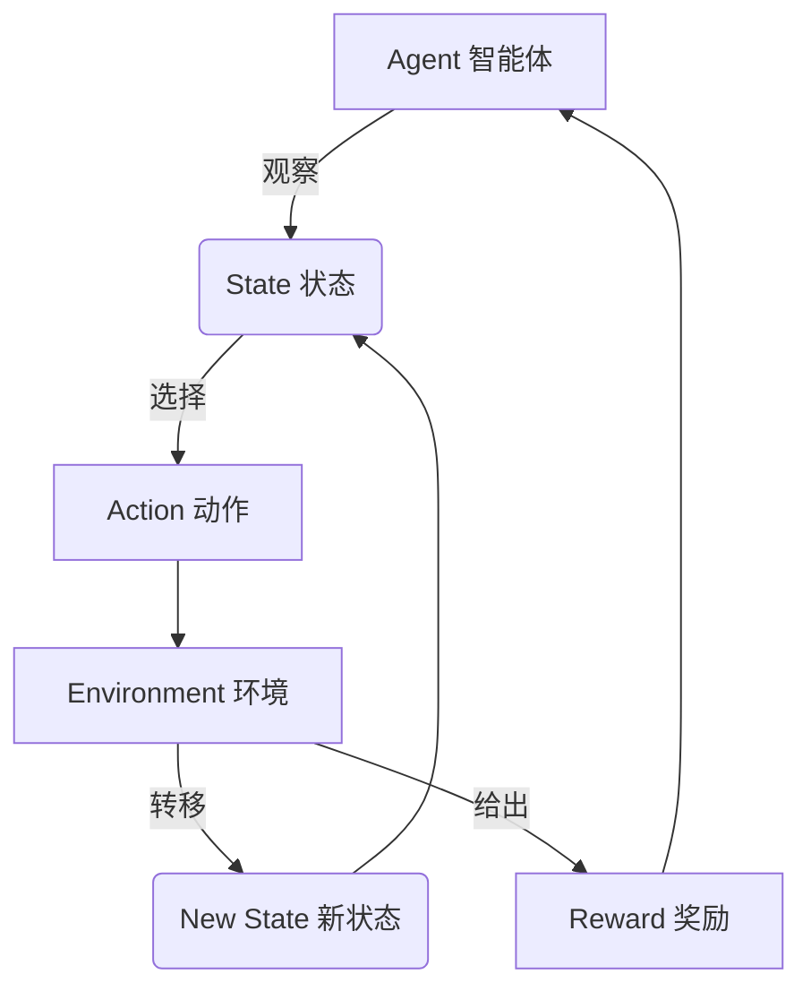
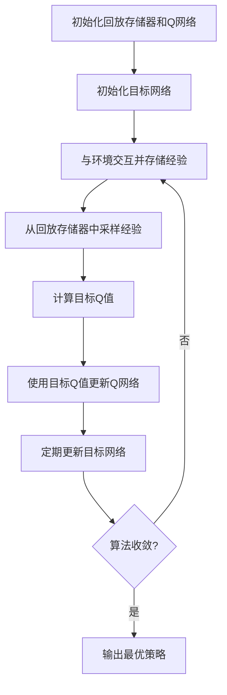

# 强化学习Reinforcement Learning在增强现实AR中的应用路径

## 1.背景介绍

### 1.1 增强现实AR的兴起

增强现实(Augmented Reality, AR)是一种将虚拟信息与现实世界融合的技术,它通过计算机视觉、图像处理和渲染等技术,将计算机生成的图像、声音、文字等虚拟信息叠加到现实世界的视景中,为用户提供一种全新的沉浸式体验。近年来,随着移动设备和可穿戴设备的普及,增强现实技术得到了迅速发展,在游戏、导航、教育、医疗等领域展现出广阔的应用前景。

### 1.2 增强现实面临的挑战

尽管增强现实技术发展迅猛,但它也面临着一些挑战和局限性。其中一个主要挑战是如何实现智能化的人机交互。传统的增强现实系统大多依赖预定义的规则和模式,缺乏灵活性和适应性。另一个挑战是如何在复杂的环境中实现准确的物体识别和跟踪,以及如何处理动态场景中的变化。

### 1.3 强化学习在增强现实中的应用潜力

强化学习(Reinforcement Learning, RL)是机器学习的一个重要分支,它通过与环境的交互,学习如何采取最优策略以最大化累积奖励。与监督学习和无监督学习不同,强化学习不需要大量标注数据,而是通过试错和反馈来学习。这种特性使得强化学习在处理复杂、动态环境中的决策问题时具有独特的优势。

将强化学习应用于增强现实系统,可以赋予系统自主学习和决策的能力,从而实现更智能化、更人性化的人机交互体验。同时,强化学习在处理复杂环境和动态场景方面也展现出了巨大的潜力,为解决增强现实面临的挑战提供了新的思路和方法。

## 2.核心概念与联系

### 2.1 强化学习的基本概念

强化学习是一种基于奖励信号的学习方法,它由四个核心要素组成:

- **Agent(智能体)**: 执行动作并与环境交互的主体。
- **Environment(环境)**: 智能体所处的外部世界,包括状态和奖励信号。
- **State(状态)**: 环境的当前状况,描述了智能体所处的位置和情况。
- **Action(动作)**: 智能体在当前状态下可以采取的操作。
- **Reward(奖励)**: 环境对智能体采取动作的反馈,指导智能体朝着目标方向学习。

智能体与环境之间的交互过程如下:

1. 智能体观察当前环境状态。
2. 根据状态,智能体选择采取一个动作。
3. 环境根据智能体的动作,转移到新的状态,并给出相应的奖励信号。
4. 智能体接收奖励信号,并更新策略,以期在未来获得更高的累积奖励。

强化学习的目标是找到一个最优策略,使智能体在与环境的交互中获得最大的累积奖励。



### 2.2 强化学习与增强现实的联系

将强化学习应用于增强现实系统,可以将增强现实系统视为一个环境,用户交互则是智能体在该环境中采取的动作。系统根据用户的动作和环境状态,给出相应的反馈和奖励信号,从而引导智能体(即增强现实系统)学习最优的交互策略。

在这种框架下,增强现实系统可以自主学习如何提供最佳的虚拟信息叠加、交互方式等,从而实现更智能化、更人性化的用户体验。同时,强化学习在处理复杂环境和动态场景方面的优势,也有助于解决增强现实系统在物体识别、跟踪和场景理解等方面的挑战。

## 3.核心算法原理具体操作步骤

强化学习算法的核心思想是通过与环境的交互,不断尝试不同的策略,并根据获得的奖励信号来更新策略,最终找到一个能够最大化累积奖励的最优策略。常见的强化学习算法包括Q-Learning、Sarsa、Deep Q-Network(DQN)等。以下将以DQN算法为例,介绍其具体的原理和操作步骤。

### 3.1 Deep Q-Network(DQN)算法

Deep Q-Network(DQN)是将深度神经网络引入Q-Learning算法的一种方法,它能够处理高维、连续的状态空间,并通过神经网络来近似Q值函数。DQN算法的核心思想是使用一个深度神经网络来估计Q值函数,并通过经验回放(Experience Replay)和目标网络(Target Network)等技术来提高算法的稳定性和收敛性。

DQN算法的具体步骤如下:

1. **初始化回放存储器(Replay Memory)和Q网络**
   - 回放存储器用于存储智能体与环境的交互经验,以便后续进行采样和学习。
   - Q网络是一个深度神经网络,用于估计Q值函数,即在给定状态下采取某个动作的预期累积奖励。

2. **初始化目标网络(Target Network)**
   - 目标网络是Q网络的副本,用于计算目标Q值,以提高算法的稳定性。
   - 目标网络的权重会定期从Q网络复制过来,但更新频率远低于Q网络。

3. **与环境交互并存储经验**
   - 智能体根据当前状态和Q网络输出的Q值,选择一个动作。
   - 智能体执行选择的动作,观察到新的状态和奖励。
   - 将(状态、动作、奖励、新状态)的经验存储到回放存储器中。

4. **从回放存储器中采样经验,计算目标Q值**
   - 从回放存储器中随机采样一批经验。
   - 对于每个经验,计算目标Q值:
     - 如果新状态是终止状态,目标Q值就是奖励值。
     - 否则,目标Q值是奖励值加上折现因子乘以目标网络在新状态下预测的最大Q值。

5. **使用目标Q值更新Q网络**
   - 计算Q网络在当前状态下对应动作的Q值预测与目标Q值之间的均方误差损失。
   - 使用反向传播算法更新Q网络的权重,最小化损失函数。

6. **定期更新目标网络**
   - 每隔一定步数,将Q网络的权重复制到目标网络。

7. **重复步骤3-6,直到算法收敛**

通过不断与环境交互、存储经验、采样经验并更新Q网络,DQN算法可以逐步学习到一个近似最优的Q值函数,从而得到一个最优的策略。

### 3.2 算法流程图



## 4.数学模型和公式详细讲解举例说明

### 4.1 Q值函数

在强化学习中,Q值函数$Q^{\pi}(s,a)$定义为在策略$\pi$下,从状态$s$出发,采取动作$a$,之后能够获得的预期累积奖励。数学表达式如下:

$$Q^{\pi}(s,a) = \mathbb{E}_{\pi}\left[ \sum_{k=0}^{\infty} \gamma^k r_{t+k+1} \mid s_t=s, a_t=a \right]$$

其中:

- $\gamma \in [0,1]$是折现因子,用于权衡即时奖励和长期奖励的重要性。
- $r_t$是在时间步$t$获得的奖励。
- $\mathbb{E}_{\pi}$表示在策略$\pi$下的期望值。

目标是找到一个最优策略$\pi^*$,使得对于任意状态$s$和动作$a$,其Q值函数$Q^{\pi^*}(s,a)$都最大化。

### 4.2 Bellman方程

Bellman方程是强化学习中的一个重要概念,它描述了Q值函数与状态转移概率和奖励函数之间的关系。对于任意策略$\pi$,Q值函数满足以下Bellman方程:

$$Q^{\pi}(s,a) = \mathbb{E}_{r,s'}\left[ r + \gamma \max_{a'} Q^{\pi}(s',a') \mid s,a \right]$$

其中:

- $r$是执行动作$a$后获得的即时奖励。
- $s'$是执行动作$a$后转移到的新状态。
- $\gamma$是折现因子。
- $\max_{a'} Q^{\pi}(s',a')$表示在新状态$s'$下,选择最优动作$a'$所能获得的最大Q值。

Bellman方程提供了一种递归的方式来计算Q值函数,它将Q值函数分解为即时奖励和折现后的未来最大预期奖励之和。

### 4.3 Q-Learning算法

Q-Learning是一种基于Bellman方程的强化学习算法,它通过不断更新Q值函数,逐步逼近最优策略。Q-Learning算法的更新规则如下:

$$Q(s_t,a_t) \leftarrow Q(s_t,a_t) + \alpha \left[ r_t + \gamma \max_{a} Q(s_{t+1},a) - Q(s_t,a_t) \right]$$

其中:

- $\alpha$是学习率,控制着Q值函数更新的幅度。
- $r_t$是在时间步$t$获得的即时奖励。
- $\gamma$是折现因子。
- $\max_{a} Q(s_{t+1},a)$是在新状态$s_{t+1}$下,选择最优动作所能获得的最大Q值。

通过不断与环境交互,并根据上述更新规则调整Q值函数,Q-Learning算法最终会收敛到最优Q值函数,从而得到最优策略。

### 4.4 Deep Q-Network(DQN)

Deep Q-Network(DQN)是将深度神经网络引入Q-Learning算法的一种方法,它能够处理高维、连续的状态空间。在DQN中,Q值函数由一个深度神经网络$Q(s,a;\theta)$来近似,其中$\theta$是网络的权重参数。

DQN算法的目标是通过最小化以下损失函数来训练Q网络:

$$L(\theta) = \mathbb{E}_{(s,a,r,s')\sim U(D)}\left[ \left( r + \gamma \max_{a'} Q(s',a';\theta^-) - Q(s,a;\theta) \right)^2 \right]$$

其中:

- $U(D)$是从经验回放存储器$D$中均匀采样的经验样本。
- $\theta^-$是目标网络的权重参数,用于计算目标Q值。
- $\gamma$是折现因子。

通过梯度下降算法最小化损失函数,可以逐步更新Q网络的权重参数$\theta$,从而使Q网络能够近似最优的Q值函数。

## 5.项目实践:代码实例和详细解释说明

以下是一个使用Python和PyTorch实现的简单DQN算法示例,用于解决经典的CartPole问题(用杆子平衡小车)。代码中包含了DQN算法的核心组件,如Q网络、经验回放存储器、目标网络更新等。

```python
import gym
import math
import random
import numpy as np
import matplotlib.pyplot as plt
from collections import namedtuple
from itertools import count

import torch
import torch.nn as nn
import torch.optim as optim
import torch.nn.functional as F

# 定义经验存储器
Transition = namedtuple('Transition', ('state', 'action', 'next_state', 'reward'))

class ReplayMemory(object):
    def __init__(self, capacity):
        self.memory = []
        self.capacity = capacity
        self.position = 0

    def push(self, *args):
        if len(self.memory) < self.capacity:
            self.memory.append(None)
        self.memory[self.position]