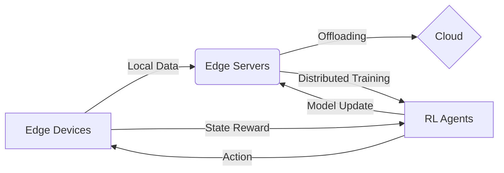

# 强化学习Reinforcement Learning在边缘计算中的应用前景

## 1. 背景介绍
### 1.1 强化学习的兴起
近年来,随着人工智能技术的飞速发展,强化学习(Reinforcement Learning,RL)作为一种重要的机器学习范式,在学术界和工业界都受到了广泛关注。强化学习通过智能体(Agent)与环境的交互,根据环境的反馈信号(Reward)来不断优化决策策略(Policy),从而实现序贯决策问题的求解。相比监督学习和无监督学习,强化学习更接近人类的学习方式,具有很大的应用潜力。

### 1.2 边缘计算的发展
与此同时,随着物联网、5G等新一代信息技术的发展,海量的终端设备产生了爆炸式增长的数据,给云计算模式带来了巨大挑战。为了应对这一挑战,边缘计算(Edge Computing)应运而生。边缘计算将计算、存储、网络等资源部署在靠近数据源头的网络边缘侧,可以大幅降低时延,减轻云端压力,提升用户体验。边缘计算正在成为新一代分布式计算的重要形态。

### 1.3 强化学习与边缘计算的结合
强化学习与边缘计算看似是两个不同领域的技术,但它们的结合却能产生意想不到的化学反应。一方面,边缘计算为强化学习在实际场景中的应用提供了有力支撑,可以解决强化学习面临的样本效率低、训练时间长等瓶颈问题。另一方面,强化学习为边缘计算的关键问题,如任务卸载、资源分配等,提供了新的解决思路。强化学习与边缘计算的结合,正在成为学术界和工业界共同关注的热点。

## 2. 核心概念与联系
### 2.1 强化学习的核心概念
- 智能体(Agent):做出决策和执行动作的主体。
- 环境(Environment):智能体所处的环境,接收智能体的动作,并给出反馈。 
- 状态(State):环境的状态表示。
- 动作(Action):智能体根据策略选择的动作。
- 策略(Policy):将状态映射到动作的函数。
- 奖励(Reward):环境对智能体动作的即时反馈。
- 价值函数(Value Function):衡量状态或状态-动作对的长期累积奖励。

### 2.2 边缘计算的核心概念
- 边缘设备(Edge Device):部署在网络边缘的计算设备,如路由器、网关、智能手机等。
- 边缘服务器(Edge Server):位于边缘网络中,提供计算和存储服务的服务器。
- 边缘智能(Edge Intelligence):将人工智能技术应用于边缘,实现数据的就地处理和分析。
- 任务卸载(Task Offloading):将计算任务从终端设备卸载到边缘服务器或云端执行。
- 资源管理(Resource Management):对边缘网络中的计算、存储、网络等资源进行合理分配和调度。

### 2.3 强化学习与边缘计算的联系
强化学习与边缘计算的结合主要体现在以下几个方面:
1. 强化学习可以用于解决边缘计算中的关键问题,如任务卸载、资源分配等。将边缘环境建模为马尔可夫决策过程(MDP),智能体通过与环境交互学习最优策略。
2. 边缘计算可以为强化学习提供分布式的训练环境。多个边缘节点并行探索和学习,加速模型收敛。同时,边缘设备产生的本地数据可用于强化学习的训练。
3. 强化学习训练好的模型可以部署在边缘设备上,实现低时延的在线决策。将决策能力下沉到边缘,可以大幅提升响应速度和鲁棒性。

下图展示了强化学习与边缘计算结合的基本架构:



## 3. 核心算法原理与具体操作步骤
强化学习有多种不同的算法,这里我们重点介绍一种被广泛应用的算法——深度Q网络(Deep Q-Network,DQN)。

### 3.1 Q学习
Q学习是一种经典的无模型强化学习算法,它通过学习动作-状态值函数Q(s,a)来选择最优动作。Q函数表示在状态s下选择动作a可以获得的长期累积奖励的期望。Q学习的更新公式为:

$$Q(s_t,a_t) \leftarrow Q(s_t,a_t) + \alpha [r_t + \gamma \max_a Q(s_{t+1},a) - Q(s_t,a_t)]$$

其中,$\alpha$是学习率,$\gamma$是折扣因子。

### 3.2 深度Q网络
传统Q学习使用Q表来存储每个状态-动作对的值,当状态和动作空间很大时,这种方法变得不可行。深度Q网络使用深度神经网络来拟合Q函数,将状态作为网络的输入,输出各个动作的Q值。DQN的损失函数为:

$$L(\theta) = \mathbb{E}_{(s,a,r,s')\sim D}[(r + \gamma \max_{a'}Q(s',a';\theta^-) - Q(s,a;\theta))^2]$$

其中,$\theta$是当前网络的参数,$\theta^-$是目标网络的参数,D是经验回放缓冲区。

### 3.3 DQN的训练步骤
1. 初始化Q网络和目标网络,经验回放缓冲区D。
2. for episode = 1 to M do
3. 　初始化环境状态s
4. 　for t = 1 to T do
5. 　　根据$\epsilon-greedy$策略选择动作a
6. 　　执行动作a,观察奖励r和下一状态s'
7. 　　将转移(s,a,r,s')存入D
8. 　　从D中随机采样一个批次的转移
9. 　　计算目标值 $y=r+\gamma \max_{a'}Q(s',a';\theta^-)$
10. 　 最小化损失 $L(\theta) = (y - Q(s,a;\theta))^2$
11.　  每C步同步目标网络参数 $\theta^- \leftarrow \theta$
12.　 s <- s'
13. end for
14. end for

## 4. 数学模型和公式详细讲解举例说明
为了更好地理解DQN算法,下面我们通过一个简单的例子来说明。

考虑一个网格世界环境,智能体可以执行上下左右四个动作。每走一步奖励为-1,走到终点奖励为+10,掉入陷阱奖励为-10。我们的目标是训练一个智能体,让它学会找到最短路径到达终点。

我们使用一个两层的全连接神经网络来拟合Q函数:

$$Q(s,a;\theta) = W_2 \cdot ReLU(W_1 \cdot s)$$

其中,$W_1$和$W_2$是网络权重。

假设在某一时刻t,智能体位于状态$s_t$,执行动作$a_t$后,环境给出奖励$r_t=-1$,并转移到新状态$s_{t+1}$。我们将这个转移样本$(s_t,a_t,r_t,s_{t+1})$存入经验回放缓冲区D。

在训练时,我们从D中随机采样一个批次的转移样本,对于每个样本$(s,a,r,s')$,计算目标Q值:

$$y = r + \gamma \max_{a'}Q(s',a';\theta^-)$$

然后最小化预测Q值与目标Q值的均方误差:

$$L(\theta) = (y - Q(s,a;\theta))^2$$

通过梯度下降法更新网络参数$\theta$,使预测Q值不断逼近真实Q值。

在测试时,我们只需要根据当前状态,用训练好的Q网络选择Q值最大的动作即可:

$$\pi(s) = \arg\max_a Q(s,a;\theta)$$

通过以上过程,智能体可以学到一个最优策略,实现自主导航。

## 5. 项目实践：代码实例和详细解释说明
下面我们使用PyTorch实现一个简单的DQN算法,并应用于上述网格世界导航问题。

```python
import torch
import torch.nn as nn
import torch.optim as optim
import numpy as np
import random
from collections import deque

# 定义Q网络
class QNet(nn.Module):
    def __init__(self, state_dim, action_dim):
        super(QNet, self).__init__()
        self.fc1 = nn.Linear(state_dim, 64)
        self.fc2 = nn.Linear(64, action_dim)

    def forward(self, x):
        x = torch.relu(self.fc1(x))
        x = self.fc2(x)
        return x

# 定义DQN智能体
class DQNAgent:
    def __init__(self, state_dim, action_dim, lr, gamma, epsilon, target_update):
        self.state_dim = state_dim
        self.action_dim = action_dim
        self.lr = lr
        self.gamma = gamma
        self.epsilon = epsilon
        self.target_update = target_update
        
        self.Q = QNet(state_dim, action_dim)
        self.Q_target = QNet(state_dim, action_dim)
        self.optimizer = optim.Adam(self.Q.parameters(), lr=self.lr)
        
        self.replay_buffer = deque(maxlen=10000)
        self.batch_size = 64
        
    def select_action(self, state):
        if np.random.rand() < self.epsilon:
            return np.random.randint(self.action_dim)
        else:
            state = torch.tensor(state, dtype=torch.float32).unsqueeze(0)
            q_values = self.Q(state)
            action = q_values.argmax().item()
            return action
        
    def update(self):
        if len(self.replay_buffer) < self.batch_size:
            return
        
        batch = random.sample(self.replay_buffer, self.batch_size)
        states, actions, rewards, next_states, dones = zip(*batch)
        
        states = torch.tensor(states, dtype=torch.float32)
        actions = torch.tensor(actions, dtype=torch.long).unsqueeze(1)
        rewards = torch.tensor(rewards, dtype=torch.float32).unsqueeze(1)
        next_states = torch.tensor(next_states, dtype=torch.float32)
        dones = torch.tensor(dones, dtype=torch.float32).unsqueeze(1)
        
        current_q = self.Q(states).gather(1, actions)
        max_next_q = self.Q_target(next_states).max(1)[0].unsqueeze(1)
        target_q = rewards + (1 - dones) * self.gamma * max_next_q
        
        loss = nn.MSELoss()(current_q, target_q.detach())
        
        self.optimizer.zero_grad()
        loss.backward()
        self.optimizer.step()
        
    def push(self, state, action, reward, next_state, done):
        self.replay_buffer.append((state, action, reward, next_state, done))
        
    def train(self, num_episodes):
        for episode in range(num_episodes):
            state = env.reset()
            done = False
            episode_reward = 0
            
            while not done:
                action = self.select_action(state)
                next_state, reward, done = env.step(action)
                self.push(state, action, reward, next_state, done)
                state = next_state
                episode_reward += reward
                self.update()
                
            if episode % self.target_update == 0:
                self.Q_target.load_state_dict(self.Q.state_dict())
            
            print(f"Episode {episode}: Reward = {episode_reward}")
            
# 创建网格世界环境
class GridWorld:
    def __init__(self, size=5):
        self.size = size
        self.agent_pos = (0, 0)
        self.goal_pos = (size-1, size-1)
        self.trap_pos = (size//2, size//2)
        
    def reset(self):
        self.agent_pos = (0, 0)
        return self._get_state()
    
    def step(self, action):
        x, y = self.agent_pos
        if action == 0:  # 上
            x = max(0, x-1)
        elif action == 1:  # 下
            x = min(self.size-1, x+1)
        elif action == 2:  # 左
            y = max(0, y-1)
        elif action == 3:  # 右
            y = min(self.size-1, y+1)
        self.agent_pos = (x, y)
        
        if self.agent_pos == self.goal_pos:
            reward = 10
            done = True
        elif self.agent_pos == self.trap_pos:
            reward = -10
            done = True
        else:
            reward = -1
            done = False
        
        return self._get_state(), reward, done
    
    def _get_state(self):