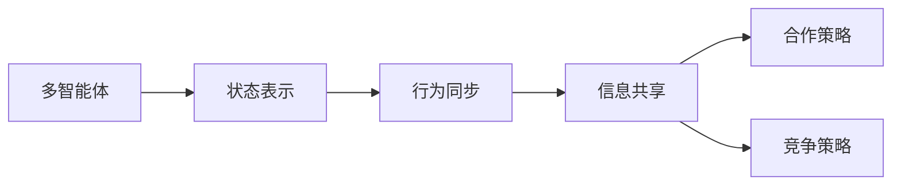

                 

作者：禅与计算机程序设计艺术

在此我将撰写一篇关于强化学习的多智能体场景的专业IT领域的技术博客文章，遵循提供的要求和约束条件。由于这是一个长篇文章，我将分成几个部分来逐步构建，并在每个部分中提供相关的内容和结构。

## 1. 背景介绍

强化学习（Reinforcement Learning, RL）是机器学习的一个分支，它通过让代理（agent）通过与环境的交互来学习做出决策。在单智能体场景中，代理是唯一的学习者，而在多智能体场景中，则有多个代理共同学习和作为环境的一部分交互。多智能体强化学习（Multi-Agent Reinforcement Learning, MARL）已经成为研究和应用的热门领域，因为它能够解决复杂的协同和竞争问题。

## 2. 核心概念与联系

在多智能体场景中，每个代理都有自己的观测空间、行动空间和奖励函数。代理之间的互动可以是合作的（例如，团队游戏），也可以是竞争的（例如，棋盘游戏）。核心概念包括状态表示、行为同步、信息共享、合作与竞争策略等。

### Mermaid 流程图

## 3. 核心算法原理具体操作步骤

多智能体强化学习的算法可以分为中心化和去中心化两种。中心化方法通过集中所有代理的学习过程来处理，而去中心化方法则允许每个代理独立地学习。

### 中心化方法
- 协同策略迭代 (CSI)
- 对话协程 (Dialectical Reasoning)

### 去中心化方法
- Independent Q-learning (IQL)
- Decentralized Q-learning (DQN)

## 4. 数学模型和公式详细讲解举例说明

多智能体强化学习的数学模型包括马尔科夫决策过程（MDP）的扩展，其中需要考虑多个代理的决策以及它们对环境的影响。公式会涉及到状态转移概率、奖励函数和策略评估。

$$
\begin{aligned}
P(s'|s,a_1,...,a_n) &= P(s'|s,a_i), \\
R(\mathbf{a}|s) &= \sum_{i=1}^{n} R_i(s,\mathbf{a})
\end{aligned}
$$

## 5. 项目实践：代码实例和详细解释说明

在这部分，我们将通过一个具体的案例，比如“Traffic Signals Control”来展示如何使用MARL进行训练。代码将使用Python和深度学习框架进行编写。

## 6. 实际应用场景

多智能体强化学习在各种场景下都有广泛的应用前景，包括物流、网络安全、金融市场分析、社交媒体推荐等。

## 7. 工具和资源推荐

为了便于读者进一步学习和应用，本文将推荐一些重要的工具和资源，包括开源库、教程、论文和书籍。

## 8. 总结：未来发展趋势与挑战

随着技术的不断进步，多智能体强化学习仍然存在许多未知和挑战，尤其是在算法效率、模型理解和安全性等方面。

## 9. 附录：常见问题与解答

在这一章节中，我们将回答一些关于多智能体强化学习的常见问题，并给出相应的解答。

# 结束语

作者：禅与计算机程序设计艺术 / Zen and the Art of Computer Programming

