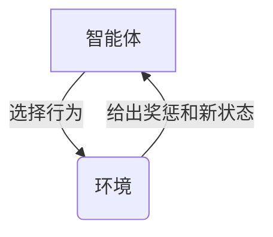
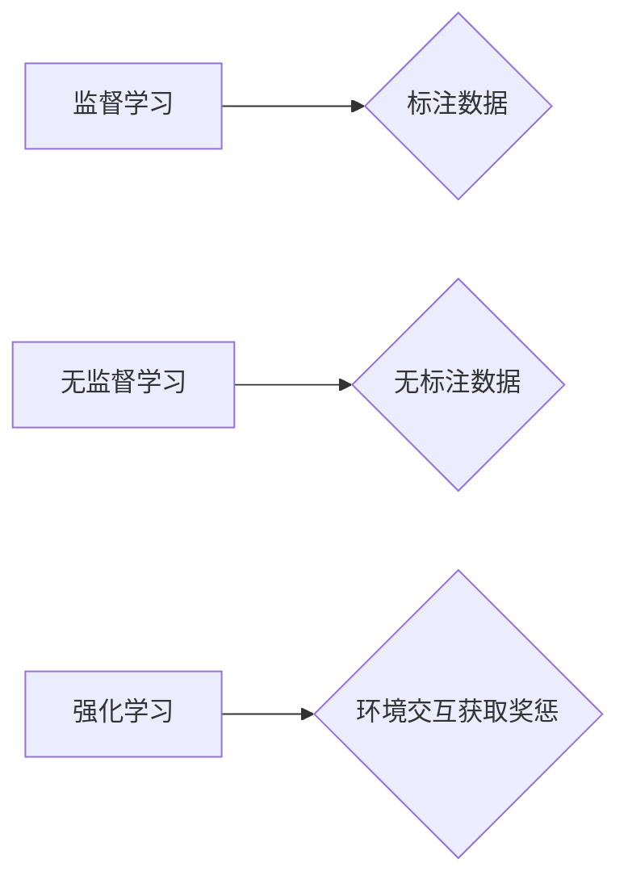
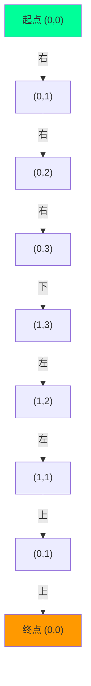

# 强化学习：DL、ML和AI的交集

## 1.背景介绍

### 1.1 人工智能的崛起

人工智能(AI)已经成为当代科技发展的核心驱动力。从语音助手到自动驾驶汽车,AI系统正在渗透到我们生活的方方面面。然而,AI的发展并非一蹴而就,它是多个领域交叉融合的结果,其中包括机器学习(ML)、深度学习(DL)和强化学习(RL)。

### 1.2 机器学习与深度学习

机器学习使计算机能够从数据中学习,而不需要显式编程。深度学习则是机器学习的一个子集,它利用神经网络模拟人脑的工作原理,在处理复杂数据(如图像、语音等)方面表现出色。

### 1.3 强化学习的重要性

尽管机器学习和深度学习取得了巨大成功,但它们都存在一个共同的局限性:需要大量标注数据进行监督学习。而强化学习则不同,它使智能体能够通过与环境的互动来学习,从而在没有明确标注数据的情况下获取知识。这使得强化学习在诸多领域具有广阔的应用前景。

## 2.核心概念与联系

### 2.1 强化学习基本概念

强化学习是一种基于奖惩的学习范式,其中智能体(Agent)通过与环境(Environment)交互来学习。智能体根据当前状态(State)选择行为(Action),环境则根据这个行为给出奖惩(Reward),并转移到下一个状态。智能体的目标是最大化长期累积奖励。

### 2.2 与监督学习和无监督学习的关系

强化学习与监督学习和无监督学习有着明显的区别。监督学习需要大量标注数据,而无监督学习则完全没有标签。强化学习则介于两者之间,它没有明确的标注数据,但通过与环境的互动获得奖惩信号。

### 2.3 深度学习在强化学习中的作用

虽然传统的强化学习算法(如Q-Learning、Sarsa等)已取得一些成功,但在处理高维观测数据(如视觉、语音等)时往往会遇到维数灾难的问题。深度神经网络则能够自动从原始数据中提取有用的特征,从而极大提高了强化学习的性能。这种结合深度学习的强化学习算法被称为深度强化学习(Deep Reinforcement Learning)。

## 3.核心算法原理具体操作步骤

### 3.1 马尔可夫决策过程

强化学习问题通常被建模为马尔可夫决策过程(MDP),它是一个由状态集合$\mathcal{S}$、行为集合$\mathcal{A}$、转移概率$\mathcal{P}$和奖励函数$\mathcal{R}$组成的四元组$(\mathcal{S}, \mathcal{A}, \mathcal{P}, \mathcal{R})$。

$$
\begin{aligned}
\mathcal{P}_{ss'}^a &= \mathbb{P}[S_{t+1}=s' | S_t=s, A_t=a] \\
\mathcal{R}_s^a &= \mathbb{E}[R_{t+1} | S_t=s, A_t=a]
\end{aligned}
$$

其中$\mathcal{P}_{ss'}^a$表示在状态$s$下选择行为$a$后转移到状态$s'$的概率,$\mathcal{R}_s^a$表示在状态$s$下选择行为$a$的期望奖励。

智能体的目标是找到一个策略$\pi: \mathcal{S} \rightarrow \mathcal{A}$,使得沿着该策略行动时的长期累积奖励最大化:

$$
J(\pi) = \mathbb{E}_\pi \left[ \sum_{t=0}^\infty \gamma^t R_{t+1} \right]
$$

其中$\gamma \in [0, 1)$是折扣因子,用于平衡当前奖励和未来奖励的权重。

### 3.2 价值函数和Bellman方程

为了找到最优策略,我们需要定义状态价值函数$V^\pi(s)$和行为价值函数$Q^\pi(s, a)$,它们分别表示在策略$\pi$下从状态$s$开始,或从状态$s$开始采取行为$a$,之后遵循$\pi$所能获得的长期累积奖励。

$$
\begin{aligned}
V^\pi(s) &= \mathbb{E}_\pi \left[ \sum_{t=0}^\infty \gamma^t R_{t+1} | S_0=s \right] \\
Q^\pi(s, a) &= \mathbb{E}_\pi \left[ \sum_{t=0}^\infty \gamma^t R_{t+1} | S_0=s, A_0=a \right]
\end{aligned}
$$

价值函数满足著名的Bellman方程:

$$
\begin{aligned}
V^\pi(s) &= \sum_{a \in \mathcal{A}} \pi(a|s) \left( \mathcal{R}_s^a + \gamma \sum_{s' \in \mathcal{S}} \mathcal{P}_{ss'}^a V^\pi(s') \right) \\
Q^\pi(s, a) &= \mathcal{R}_s^a + \gamma \sum_{s' \in \mathcal{S}} \mathcal{P}_{ss'}^a V^\pi(s')
\end{aligned}
$$

利用这些方程,我们可以通过动态规划或时序差分学习的方式来求解价值函数,进而找到最优策略。

### 3.3 时序差分学习

时序差分(Temporal Difference,TD)学习是一种无模型的强化学习算法,它根据实际经历的轨迹来更新价值函数估计,而不需要事先知道环境的转移概率和奖励函数。

对于状态价值函数,TD更新规则为:

$$
V(S_t) \leftarrow V(S_t) + \alpha \left[ R_{t+1} + \gamma V(S_{t+1}) - V(S_t) \right]
$$

其中$\alpha$是学习率。这种更新方式被称为TD(0)。

对于行为价值函数,TD更新规则为:

$$
Q(S_t, A_t) \leftarrow Q(S_t, A_t) + \alpha \left[ R_{t+1} + \gamma \max_{a'} Q(S_{t+1}, a') - Q(S_t, A_t) \right]
$$

这种更新方式被称为Q-Learning。

TD学习算法通常与函数逼近技术(如线性函数逼近或神经网络)相结合,以处理大规模状态空间。

### 3.4 策略梯度算法

除了基于价值函数的算法,还有一类重要的强化学习算法是基于策略梯度的。策略梯度算法直接对策略$\pi_\theta$进行参数化,并通过梯度上升的方式优化策略参数$\theta$,使得期望回报最大化:

$$
\theta_{k+1} = \theta_k + \alpha \hat{\nabla_\theta} J(\pi_\theta)
$$

其中$\hat{\nabla_\theta} J(\pi_\theta)$是期望回报梯度的无偏估计。常见的策略梯度算法包括REINFORCE、Actor-Critic等。

策略梯度算法通常与深度神经网络相结合,构成了深度强化学习的主要算法框架。

## 4.数学模型和公式详细讲解举例说明

### 4.1 马尔可夫决策过程

马尔可夫决策过程(MDP)是强化学习问题的基本数学模型。一个MDP由四个要素组成:

- 状态集合$\mathcal{S}$:环境的所有可能状态的集合。
- 行为集合$\mathcal{A}$:智能体在每个状态下可以采取的行为的集合。
- 转移概率$\mathcal{P}_{ss'}^a$:在状态$s$下采取行为$a$后,转移到状态$s'$的概率。
- 奖励函数$\mathcal{R}_s^a$:在状态$s$下采取行为$a$所获得的即时奖励的期望值。

例如,考虑一个简单的网格世界,其中智能体是一个机器人,需要从起点移动到终点。每个格子代表一个状态,机器人可以在每个状态下选择上下左右四个行为。如果机器人到达终点,它会获得正奖励;如果撞墙或越界,它会获得负奖励;其他情况下奖励为0。

在这个例子中,$\mathcal{S}$是所有格子的集合,$\mathcal{A}$是$\{\text{上,下,左,右}\}$。$\mathcal{P}_{ss'}^a$则表示在格子$s$采取行为$a$后到达格子$s'$的概率,而$\mathcal{R}_s^a$表示在格子$s$采取行为$a$获得的奖励值。

智能体的目标是找到一个策略$\pi: \mathcal{S} \rightarrow \mathcal{A}$,使得从起点开始沿着该策略行动时,能够获得最大的长期累积奖励(即最快到达终点)。

### 4.2 Bellman方程

Bellman方程是强化学习中最核心的数学工具,它将价值函数与环境的转移概率和奖励函数联系起来。

对于状态价值函数$V^\pi(s)$,Bellman方程为:

$$
V^\pi(s) = \sum_{a \in \mathcal{A}} \pi(a|s) \left( \mathcal{R}_s^a + \gamma \sum_{s' \in \mathcal{S}} \mathcal{P}_{ss'}^a V^\pi(s') \right)
$$

其中$\pi(a|s)$表示在状态$s$下选择行为$a$的概率。这个方程的意义是:状态$s$的价值函数等于在该状态下根据策略$\pi$选择行为$a$,获得即时奖励$\mathcal{R}_s^a$,然后按照转移概率$\mathcal{P}_{ss'}^a$转移到下一个状态$s'$,加上从$s'$状态开始获得的折扣后的价值函数$\gamma V^\pi(s')$,对所有可能的$a$和$s'$求和的期望值。

对于行为价值函数$Q^\pi(s, a)$,Bellman方程为:

$$
Q^\pi(s, a) = \mathcal{R}_s^a + \gamma \sum_{s' \in \mathcal{S}} \mathcal{P}_{ss'}^a V^\pi(s')
$$

其中$Q^\pi(s, a)$表示在状态$s$下选择行为$a$,然后按照策略$\pi$行动所能获得的长期累积奖励。

利用这些Bellman方程,我们可以通过动态规划或时序差分学习的方式来求解价值函数,进而找到最优策略。

例如,在网格世界的例子中,假设我们已知转移概率和奖励函数,那么对于起点$(0,0)$,根据Bellman方程,其状态价值函数$V^\pi((0,0))$等于:在$(0,0)$下根据策略$\pi$选择行为(比如向右移动),获得的即时奖励(0),加上按照转移概率转移到下一个状态(比如$(0,1)$)后,从$(0,1)$开始获得的折扣后价值函数$\gamma V^\pi((0,1))$。通过这种递推的方式,我们就可以求解出每个状态的价值函数。

### 4.3 时序差分学习

时序差分(Temporal Difference,TD)学习是一种无模型的强化学习算法,它根据实际经历的轨迹来更新价值函数估计,而不需要事先知道环境的转移概率和奖励函数。

对于状态价值函数,TD更新规则为:

$$
V(S_t) \leftarrow V(S_t) + \alpha \left[ R_{t+1} + \