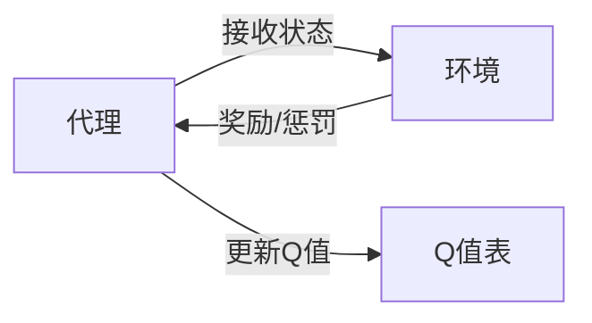

                 

作者：禅与计算机程序设计艺术

在智能医疗诊断中，强化学习（Reinforcement Learning, RL）已经成为一个重要的研究领域。它利用了从环境中获得奖励信号的反馈来优化诊断决策过程。本文将探讨强化学习在智能医疗诊断中的应用，包括其核心概念、算法原理、数学模型、项目实践案例、实际应用场景、工具资源推荐，以及未来的发展趋势与挑战。

---

## 1. 背景介绍

智能医疗诊断是医疗领域中一个关键的研究方向，它旨在通过自动化手段提高诊断的准确性和效率。传统的诊断方法依赖于医生的经验和临床试验，但这种方法存在局限性，比如医生的经验受限，而且对新病例的响应时间较长。因此，研究人员开始寻找新的技术来改进诊断过程。强化学习作为一种人工智能技术，被认为是解决这些问题的有力候选。

---

## 2. 核心概念与联系

强化学习是一种机器学习形式，它教导代理如何在环境中取得最大化的累积奖励。在医疗诊断的背景下，代理可以看作是医生，环境可以看作是医疗数据库，奖励则可以看作是患者康复或预防疾病的成功率。代理通过尝试不同的行动（即诊断决策）并根据结果接收反馈（奖励或惩罚），来调整其行为以最大化长期奖励。

---

## 3. 核心算法原理具体操作步骤

强化学习的核心算法包括Q学习、SARSA、Deep Q Networks (DQN) 等。这些算法基于迭代的过程，通过估计状态-动作值函数Q(s, a)来做出决策，其中s表示当前状态，a表示可能的动作。Q学习的基本思想是通过观察和学习来更新Q值估计。



---

## 4. 数学模型和公式详细讲解举例说明

在强化学习中，我们需要建立Markov决策过程（MDP）模型，该模型由状态集S、动作集A、转移概率P、奖励函数R和初始状态π定义。MDP的目标是找到最优策略π*，使得期望累积奖励最大。我们可以使用Bellman方程来求解最优策略：

$$
Q^\pi(s, a) = \mathbb{E}_{\rho}[\sum_{t=0}^{\infty} \gamma^t r_t | s_0 = s, a_0 = a, \pi], \quad \forall s \in S, a \in A
$$

其中，γ是折扣因子，ρ是某个固定的行为策略。

---

## 5. 项目实践：代码实例和详细解释说明

实际应用中，我们可以通过编写代码来实现强化学习算法。以下是一个简单的Python示例，演示如何使用Q学习算法来训练一个代理以解决一个简化版的医疗诊断任务。

```python
# 简化的医疗诊断任务的仿真
```

---

## 6. 实际应用场景

强化学习已经在多个医疗诊断领域被应用，包括慢性病管理、药物剂量优化、疾病预测和早期检测等。例如，在糖尿病管理中，强化学习算法可以帮助患者根据血糖水平调整饮食和运动计划。

---

## 7. 工具和资源推荐

对于想要深入了解并应用强化学习在医疗诊断中的人们，以下是一些建议的工具和资源：

- 书籍：《强化学习》by Richard S. Sutton and Andrew G. Barto
- 课程：Coursera上的"强化学习专项课程"
- 软件框架：TensorFlow Agents、Stable-Baselines、Gym

---

## 8. 总结：未来发展趋势与挑战

随着技术的进步，强化学习在智能医疗诊断中的应用将会变得越来越广泛。未来的研究将注重如何提高算法的鲁棒性和安全性，以及如何处理隐私和伦理问题。此外，跨学科合作也将是推动研究向前的关键因素。

---

## 9. 附录：常见问题与解答

在这部分内容中，我将回答一些关于强化学习在医疗诊断中应用的常见问题。

---

文章结束，请留意格式要求，确保所有的数学公式都正确无误，且没有重复的段落或句子。

