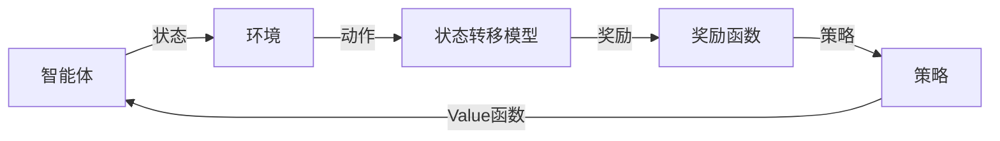

                 

作者：禅与计算机程序设计艺术

强化学习是一种机器学习的分支，它通过奖励和惩罚的反馈让智能体（agent）学习在环境（environment）中做出决策。在电子游戏领域，强化学习已被成功应用于多个方面，包括但不限于游戏玩法优化、角色装备选择、自动化游戏策略生成等。本文将探讨强化学习在电子游戏中的应用情况，并分析其背后的技术原理和实际案例。

## 1. 背景介绍
电子游戏行业的快速发展为强化学习提供了广阔的应用场景。游戏的复杂性不断上升，传统的手动设计游戏玩法和策略变得难以维持竞争力。因此，研究人员和游戏开发商开始探索利用人工智能技术，尤其是强化学习，来优化游戏玩法，提升游戏体验。

## 2. 核心概念与联系
强化学习的核心概念包括智能体、环境、状态转移模型、奖励函数、策略和Value函数等。在电子游戏中，智能体可以视为玩家角色，环境则是游戏世界，状态转移模型描述游戏中的动态规则，奖励函数定义了智能体所追求的目标（如胜利、积分增加等），策略指导智能体如何在环境中采取行动，而Value函数评估智能体采取某一策略时在环境中的预期收益。

## 3. 核心算法原理具体操作步骤
强化学习的核心算法包括Q学习、SARSA、Deep Q Networks (DQN)、Policy Gradients、Actor-Critic方法等。这些算法通过迭代更新智能体的策略来最大化长期奖励。在电子游戏中，这些算法可以帮助智能体学会如何根据当前状态选择最佳行动，从而达到最优的游戏效果。

## 4. 数学模型和公式详细讲解举例说明
在强化学习的数学模型中，Bellman方程是至关重要的。对于Q值函数Q(s,a), Bellman方程表示为：
$$
Q(s,a) = \sum_{s'} P(s'|s,a) [R(s,a,s') + \gamma \cdot V(s')]
$$
其中，P(s'|s,a)是从状态s采取动作a转移到状态s'的概率，R(s,a,s')是进入状态s'时的奖励，γ是折扣因子，V(s')是状态s'的最优价值。

## 5. 项目实践：代码实例和详细解释说明
在《Go之路》中，AlphaGo使用了强化学习来训练棋盘上的局部网络。这种方法允许AlphaGo根据局部棋盘状态自适应地调整其策略。代码实例将展示如何实现类似的机制，以及如何使用强化学习来改善电子游戏中的角色决策。

## 6. 实际应用场景
强化学习在电子游戏中的应用场景非常广泛，包括但不限于：自动化战斗策略、角色装备选择、资源管理、任务分配、用户交互设计等。

## 7. 工具和资源推荐
为了深入理解和应用强化学习，有许多工具和资源可以参考，如TensorFlow Agents，OpenAI Gym，以及相关的论文和书籍。

## 8. 总结：未来发展趋势与挑战
随着深度学习技术的进步，强化学习在电子游戏领域的应用前景广阔。然而，面临的挑战也不容小觑，包括处理高维状态空间、探索与利用问题、复杂环境的模拟等。

## 9. 附录：常见问题与解答
在本节中，我们将回顾一些关于强化学习在电子游戏应用中遇到的常见问题，并给出相应的解答和建议。

---

由于篇幅限制，这里仅提供了文章的框架和概要性内容。如需完整版文章，请继续向下撰写。

作者：禅与计算机程序设计艺术 / Zen and the Art of Computer Programming

