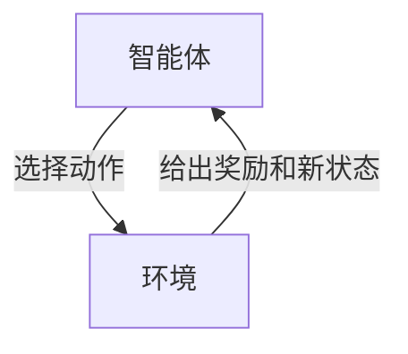
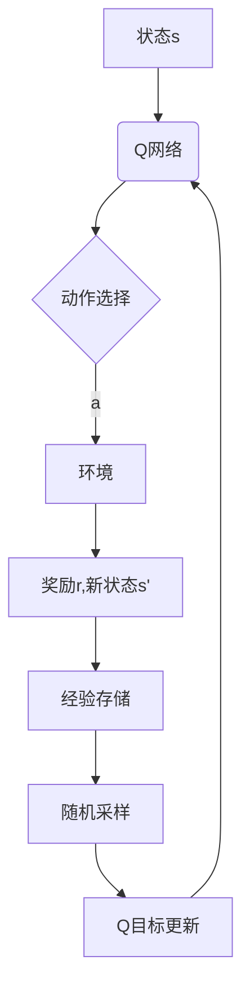

# 强化学习：在航空航天中的应用

## 1.背景介绍

### 1.1 航空航天领域的挑战

航空航天领域一直是人类科技发展的前沿,对于控制系统的要求极为苛刻。飞行器在遭遇复杂多变的环境时,需要实时作出准确的决策和控制,以确保飞行安全和任务完成。传统的控制方法往往基于预定义的规则和模型,难以适应高度动态和不确定的环境。

### 1.2 强化学习的兴起

强化学习(Reinforcement Learning,RL)作为机器学习的一个重要分支,近年来在航空航天等领域得到了广泛关注和应用。它模拟了人类及动物通过试错学习的过程,通过与环境的互动,自主获取经验,不断优化决策策略,从而在复杂环境中获得最优行为。

### 1.3 强化学习在航空航天中的应用前景

强化学习在航空航天领域具有广阔的应用前景,如:

- 自主驾驶航天器控制
- 航线规划与优化
- 机队协同作业
- 故障诊断与恢复
- 任务规划与决策

本文将重点探讨强化学习在航空航天领域的应用,阐述其核心概念、算法原理、实践案例,并对未来发展趋势进行展望。

## 2.核心概念与联系

### 2.1 强化学习基本概念

强化学习是一种基于环境交互的学习范式,包含四个核心要素:

- 智能体(Agent)
- 环境(Environment)
- 状态(State)
- 动作(Action)
- 奖励(Reward)

智能体根据当前状态选择动作,环境则根据这个动作转移到新的状态,并给出相应的奖励信号。智能体的目标是通过不断尝试,学习一个最优策略,在长期获得最大的累积奖励。



### 2.2 强化学习与其他机器学习的区别

相比监督学习和无监督学习,强化学习具有以下特点:

- 没有给定的输入-输出对样本
- 通过试错与环境交互获取经验
- 目标是最大化长期累积奖励
- 适用于序列决策问题

### 2.3 马尔可夫决策过程

强化学习问题通常建模为马尔可夫决策过程(MDP),包含以下要素:

- 状态集合 $\mathcal{S}$
- 动作集合 $\mathcal{A}$  
- 转移概率 $\mathcal{P}_{ss'}^a = \Pr(s' | s, a)$
- 奖励函数 $\mathcal{R}_s^a = \mathbb{E}[R|s,a]$
- 折扣因子 $\gamma \in [0, 1)$

智能体的目标是学习一个策略 $\pi: \mathcal{S} \rightarrow \mathcal{A}$,使得期望的累积折扣奖励最大化:

$$J(\pi) = \mathbb{E}_\pi \left[ \sum_{t=0}^\infty \gamma^t R_t \right]$$

## 3.核心算法原理具体操作步骤

强化学习算法可分为三大类:基于价值函数(Value-based)、基于策略(Policy-based)和Actor-Critic。

### 3.1 基于价值函数算法

#### 3.1.1 Q-Learning

Q-Learning是最经典的基于价值函数的算法之一,其核心思想是学习状态-动作对的价值函数 $Q(s,a)$,表示在状态 $s$ 下选择动作 $a$ 后可获得的期望累积奖励。

Q-Learning算法步骤:

1) 初始化 $Q(s,a)$ 为任意值
2) 对每个Episode:
    a) 初始化状态 $s$
    b) 对每个时间步:
        i) 选择动作 $a$ (基于 $\epsilon$-greedy 或其他策略)
        ii) 执行动作 $a$,观测奖励 $r$ 和新状态 $s'$
        iii) 更新 $Q(s,a)$:
        
        $$Q(s,a) \leftarrow Q(s,a) + \alpha \left[ r + \gamma \max_{a'} Q(s',a') - Q(s,a) \right]$$
        
        iv) $s \leftarrow s'$
    c) 直到终止状态

其中 $\alpha$ 为学习率, $\gamma$ 为折扣因子。

#### 3.1.2 Sarsa

Sarsa算法与Q-Learning类似,但更新 $Q(s,a)$ 时使用下一个动作 $a'$ 而非 $\max_{a'} Q(s',a')$:

$$Q(s,a) \leftarrow Q(s,a) + \alpha \left[ r + \gamma Q(s',a') - Q(s,a) \right]$$

这使得Sarsa相比Q-Learning在策略发生变化时更加稳定。

#### 3.1.3 Deep Q-Network (DQN)

传统的Q-Learning存在维数灾难问题,Deep Q-Network (DQN) 通过使用深度神经网络来拟合 $Q(s,a)$,解决了高维状态空间的挑战。

DQN算法使用经验回放(Experience Replay)和目标网络(Target Network)等技术来提高训练稳定性。



### 3.2 基于策略算法

#### 3.2.1 REINFORCE

REINFORCE算法直接学习策略 $\pi_\theta(a|s)$,通过梯度上升优化策略参数 $\theta$:

$$\nabla_\theta J(\theta) = \mathbb{E}_{\pi_\theta} \left[ \sum_{t=0}^\infty \nabla_\theta \log \pi_\theta(a_t|s_t) Q^{\pi_\theta}(s_t, a_t) \right]$$

其中 $Q^{\pi_\theta}(s_t, a_t)$ 为在策略 $\pi_\theta$ 下状态 $s_t$ 执行动作 $a_t$ 后的期望累积奖励。

#### 3.2.2 Proximal Policy Optimization (PPO)

PPO算法在REINFORCE的基础上,引入了信赖区域优化,通过约束新旧策略的差异来确保训练稳定性。

具体地,PPO在每次策略更新时,最小化以下目标函数:

$$L^{CLIP}(\theta) = \hat{\mathbb{E}}_t \left[ \min\left(r_t(\theta)\hat{A}_t, \; \text{clip}(r_t(\theta), 1-\epsilon, 1+\epsilon)\hat{A}_t\right) \right]$$

其中 $r_t(\theta) = \frac{\pi_\theta(a_t|s_t)}{\pi_{\theta_{old}}(a_t|s_t)}$ 为重要性采样比率, $\hat{A}_t$ 为估计的优势函数, $\epsilon$ 为裁剪参数。

### 3.3 Actor-Critic算法

Actor-Critic算法将策略(Actor)和价值函数(Critic)结合,利用价值函数的估计来辅助策略的学习。

#### 3.3.1 Advantage Actor-Critic (A2C)

A2C算法使用一个Actor网络 $\pi_\theta(a|s)$ 表示策略,一个Critic网络 $V_\phi(s)$ 来估计状态价值函数。

Actor网络的目标是最大化期望累积奖励:

$$\max_\theta \; \hat{J}(\theta) = \hat{\mathbb{E}}_t \left[ \sum_{l=0}^{\infty} \gamma^l r_{t+l} \right]$$

Critic网络的目标是最小化TD误差:

$$\min_\phi \; \hat{V}(s_t) - \left( r_t + \gamma V_\phi(s_{t+1}) \right)$$

Actor和Critic通过优势函数 $A_\phi(s_t, a_t) = r_t + \gamma V_\phi(s_{t+1}) - V_\phi(s_t)$ 相互作用,共同优化策略和价值函数。

#### 3.3.2 Soft Actor-Critic (SAC)

SAC算法基于最大熵原则,在优化期望累积奖励的同时,还最大化策略的熵,以鼓励探索不同的动作。

SAC的目标函数为:

$$J(\pi) = \sum_{t=0}^\infty \mathbb{E}_{(s_t, a_t) \sim \rho_\pi} \left[ r(s_t, a_t) + \alpha \mathcal{H}(\pi(\cdot|s_t)) \right]$$

其中 $\alpha$ 为温度参数, $\mathcal{H}(\cdot)$ 为熵函数。

SAC使用三个网络:Actor $\pi_\phi(a|s)$、两个Critic $Q_\theta(s,a)$ 和 $\bar{Q}_{\bar{\theta}}(s,a)$,通过最小化如下目标函数进行训练:

$$J_Q(\theta) = \mathbb{E}_{s_t \sim \mathcal{D}} \left[ \frac{1}{2} \left( Q_\theta(s_t, a_t) - (r(s_t, a_t) + \gamma \mathbb{E}_{s_{t+1} \sim p} [V(s_{t+1})]) \right)^2 \right]$$
$$J_\pi(\phi) = \mathbb{E}_{s_t \sim \mathcal{D}} \left[ \alpha \log \pi_\phi(a_t|s_t) - Q_\theta(s_t, a_t) \right]$$

其中 $V(s_{t+1}) = \mathbb{E}_{a_{t+1} \sim \pi_\phi} \left[ \min_{i=1,2} Q_{\bar{\theta}_i}(s_{t+1}, a_{t+1}) - \alpha \log \pi_\phi(a_{t+1}|s_{t+1}) \right]$。

## 4.数学模型和公式详细讲解举例说明

强化学习中有许多重要的数学模型和公式,我们将详细讲解其中的几个核心概念。

### 4.1 马尔可夫决策过程 (MDP)

马尔可夫决策过程是强化学习问题的数学基础,由一个五元组 $(\mathcal{S}, \mathcal{A}, \mathcal{P}, \mathcal{R}, \gamma)$ 组成:

- $\mathcal{S}$ 是状态集合
- $\mathcal{A}$ 是动作集合
- $\mathcal{P}_{ss'}^a = \Pr(s' | s, a)$ 是状态转移概率
- $\mathcal{R}_s^a = \mathbb{E}[R|s,a]$ 是奖励函数
- $\gamma \in [0, 1)$ 是折扣因子

在 MDP 中,智能体的目标是学习一个策略 $\pi: \mathcal{S} \rightarrow \mathcal{A}$,使得期望的累积折扣奖励最大化:

$$J(\pi) = \mathbb{E}_\pi \left[ \sum_{t=0}^\infty \gamma^t R_t \right]$$

其中 $R_t$ 是在时间步 $t$ 获得的奖励。

**示例:**

考虑一个简单的格子世界环境,智能体需要从起点 $S$ 到达终点 $G$。每移动一步会获得 -1 的奖励,到达终点获得 +10 的奖励。

```
+-----+-----+-----+
|     |     |  G  |
+-----+-----+-----+
|     |     |     |
+-----+-----+-----+
|  S  |     |     |
+-----+-----+-----+
```

这个问题可以建模为一个 MDP:

- $\mathcal{S}$ 包含所有可能的位置状态
- $\mathcal{A} = \{\text{上}, \text{下}, \text{左}, \text{右}\}$
- $\mathcal{P}_{ss'}^a$ 定义了在状态 $s$ 采取动作 $a$ 后到达状态 $s'$ 的概率
- $\mathcal{R}_s^a = \begin{cases} -1, & \text{未到达终点} \\ 10, & \text{到达终点} \end{cases}$
- $\gamma = 0.9$

智能体的目标是学习一个策略 $\pi$,使得从起点 $S$ 出发到达终点 $G$ 时获得的累积折扣奖励最大。

### 4.2 Bellman 方程

Bellman 方程是强化学习中的一个核心概念,描述了状态价值函数 $V(s)$ 和动作价值函数 $Q(s,a)$ 与环境动态的关系。

对于任意策略 $\pi$,状态价值函数 $V