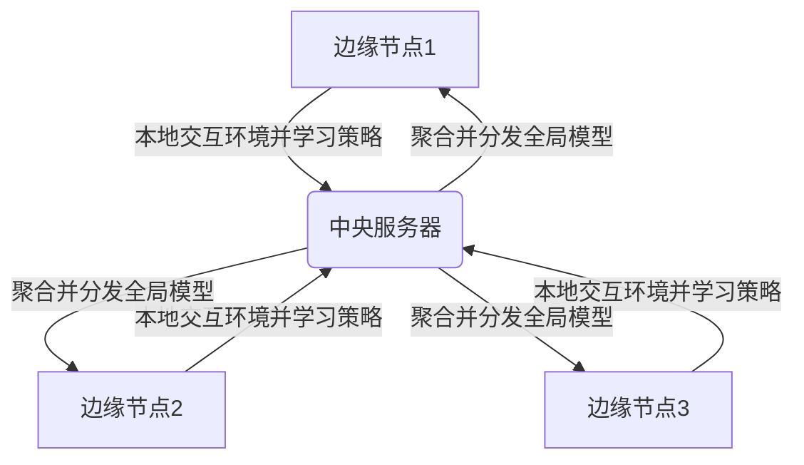
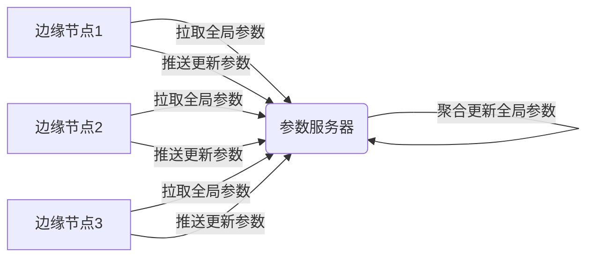

# 强化学习：在边缘计算中的应用

## 1.背景介绍

### 1.1 边缘计算概述

边缘计算(Edge Computing)是一种新兴的分布式计算范式,旨在将计算资源和数据存储靠近数据源,从而减少数据传输延迟、降低带宽成本,并提高响应速度。随着物联网(IoT)设备的快速增长,边缘计算应运而生,以满足实时数据处理、低延迟响应等需求。

在传统的云计算模式下,所有数据都需要传输到远程云端进行处理,这对于一些延迟敏感的应用(如自动驾驶、工业控制等)来说存在明显的局限性。相比之下,边缘计算将计算和存储资源部署在靠近数据源的边缘节点上,从而减少了数据传输距离,提高了实时性和可靠性。

### 1.2 强化学习简介  

强化学习(Reinforcement Learning)是机器学习的一个重要分支,它致力于让智能体(Agent)通过与环境(Environment)的交互来学习如何采取最优策略,从而最大化长期累积奖励。不同于监督学习需要大量标注数据,强化学习通过试错和奖惩机制自主学习,更加贴近人类的学习方式。

在强化学习中,智能体和环境之间的交互过程可以形象地描述为一个马尔可夫决策过程(Markov Decision Process, MDP)。智能体根据当前状态选择一个动作,环境会根据这个动作转移到下一个状态,并给出对应的奖励信号。智能体的目标是学习一个策略函数,使得在给定状态下选择的动作序列能够最大化预期的长期累积奖励。

## 2.核心概念与联系

### 2.1 强化学习在边缘计算中的重要性

将强化学习应用于边缘计算环境具有重要意义:

1. **实时决策**:边缘设备通常需要根据当前环境做出实时决策,强化学习可以学习出最优策略,在毫秒级别内作出反应。
2. **隐私保护**:相比于将原始数据上传到云端,在边缘节点上进行强化学习可以有效保护用户隐私。
3. **节省带宽**:只需要在边缘节点上训练策略模型,无需传输大量原始数据,从而节省了带宽资源。
4. **健壮性**:即使与云端连接中断,边缘设备仍可基于本地策略模型独立运行。

### 2.2 强化学习与边缘计算的融合挑战

尽管强化学习在边缘计算中具有广阔的应用前景,但也面临着一些挑战:

1. **计算资源受限**:边缘设备通常计算能力有限,无法承担复杂的模型训练任务。
2. **数据分散性**:分散在不同边缘节点上的数据难以集中,给模型训练带来障碍。
3. **动态环境**:边缘环境的高度动态性可能导致策略模型的频繁更新。
4. **异构设备**:不同边缘设备的硬件规格参差不齐,给统一部署带来困难。

解决上述挑战需要创新性的架构设计和算法优化,是强化学习与边缘计算融合的关键。

### 2.3 核心思想:分布式协作强化学习

为了充分发挥强化学习在边缘计算中的潜力,分布式协作强化学习(Distributed Collaborative Reinforcement Learning)应运而生。其核心思想是:

1. 将复杂的模型训练任务分解到多个边缘节点并行执行。
2. 不同边缘节点在本地交互环境并学习策略。
3. 定期将本地策略模型上传到中央服务器进行聚合。 
4. 中央服务器将聚合后的全局模型分发回各个边缘节点。
5. 边缘节点下载全局模型,并在此基础上继续训练和决策。

这种分布式架构可以有效解决计算资源受限、数据分散等问题,实现边缘智能的高效协作。

## 3.核心算法原理具体操作步骤  

### 3.1 分布式协作强化学习算法框架

分布式协作强化学习算法通常遵循以下框架:

1. **初始化**:在中央服务器和每个边缘节点上初始化策略模型的参数。
2. **本地交互与学习**:每个边缘节点基于本地环境与策略模型交互,并根据奖励信号更新模型参数。
3. **模型上传**:边缘节点将本地训练好的模型参数上传到中央服务器。
4. **模型聚合**:中央服务器将收集到的所有模型参数进行加权平均或其他聚合操作,得到全局模型。
5. **模型下发**:中央服务器将聚合后的全局模型分发回每个边缘节点。
6. **迭代训练**:边缘节点下载全局模型,并在此基础上继续进行本地交互与学习,重复步骤2-5。
7. **终止条件**:当满足某种终止条件(如达到预定训练轮数或收敛)时,算法停止迭代。

该框架的关键在于如何有效地在中央服务器和边缘节点之间进行模型参数的交换与聚合,以实现高效的分布式协作训练。

### 3.2 异步参数服务器架构

异步参数服务器(Asynchronous Parameter Server)架构是实现分布式协作强化学习的一种常见方式。其基本思路是:

1. 中央服务器维护一个全局模型的参数。
2. 每个边缘节点从参数服务器拉取当前的全局模型参数。
3. 边缘节点基于本地环境与全局模型参数交互,并根据经验更新参数。
4. 边缘节点将更新后的参数推送回参数服务器。
5. 参数服务器对收到的参数进行聚合,更新全局模型参数。
6. 重复步骤2-5,直至算法收敛或达到终止条件。

这种异步的参数更新方式可以充分利用边缘节点的计算资源,加快训练速度。但也存在一些挑战,如参数更新延迟、收敛性等,需要通过优化算法来解决。

### 3.3 联邦学习与差分隐私

在分布式协作强化学习中,如何保护边缘节点上的隐私数据是一个重要问题。联邦学习(Federated Learning)和差分隐私(Differential Privacy)技术可以为此提供有力支持。

**联邦学习**的核心思想是:边缘节点只需要上传本地训练得到的模型参数或梯度,而不需要上传原始数据。这样可以有效避免隐私数据的泄露。

**差分隐私**则通过在模型参数或梯度上引入噪声,使得单个数据对最终模型的影响很小,从而实现隐私保护。常见的差分隐私机制包括高斯机制、拉普拉斯机制等。

将联邦学习与差分隐私相结合,可以在分布式协作强化学习中实现隐私保护,提高用户数据安全性。但同时也需要权衡噪声引入对模型精度的影响。

### 3.4 多智能体协作强化学习

在复杂的边缘计算场景中,通常存在多个智能体需要相互协作完成某个任务。这就引入了多智能体强化学习(Multi-Agent Reinforcement Learning)的概念。

多智能体协作强化学习算法需要解决以下关键问题:

1. **协作机制**:如何设计智能体之间的协作机制,使得它们能够高效地完成任务?
2. **信息共享**:智能体之间应如何共享状态、动作和奖励信息,以提高协作效率?
3. **稳定性**:如何确保算法在多智能体环境中的收敛性和稳定性?
4. **计算复杂度**:由于状态空间和动作空间的指数级增长,如何降低算法的计算复杂度?

常见的多智能体协作算法包括独立学习者(Independent Learners)、领导者追随者(Leader-Follower)、价值分解(Value Decomposition)等。选择合适的算法对于解决特定的协作任务至关重要。

## 4.数学模型和公式详细讲解举例说明

### 4.1 马尔可夫决策过程(MDP)

强化学习问题通常建模为马尔可夫决策过程(Markov Decision Process, MDP)。一个MDP可以用元组 $\langle \mathcal{S}, \mathcal{A}, \mathcal{P}, \mathcal{R}, \gamma \rangle$ 来表示:

- $\mathcal{S}$ 是有限的状态空间集合
- $\mathcal{A}$ 是有限的动作空间集合
- $\mathcal{P}: \mathcal{S} \times \mathcal{A} \times \mathcal{S} \rightarrow [0, 1]$ 是状态转移概率函数
- $\mathcal{R}: \mathcal{S} \times \mathcal{A} \rightarrow \mathbb{R}$ 是奖励函数
- $\gamma \in [0, 1)$ 是折现因子,用于权衡当前奖励和未来奖励的重要性

在MDP中,智能体的目标是学习一个策略 $\pi: \mathcal{S} \rightarrow \mathcal{A}$,使得在遵循该策略时,预期的长期累积奖励最大化:

$$
\max_\pi \mathbb{E}_\pi \left[ \sum_{t=0}^\infty \gamma^t r_t \right]
$$

其中 $r_t$ 是在时间步 $t$ 获得的奖励。

### 4.2 Q-Learning算法

Q-Learning是强化学习中一种基于价值迭代的经典算法,它不需要事先知道环境的转移概率和奖励函数,可以通过与环境的交互来直接学习最优策略。

Q-Learning维护一个Q函数 $Q: \mathcal{S} \times \mathcal{A} \rightarrow \mathbb{R}$,表示在状态 $s$ 下采取动作 $a$ 后,可获得的预期长期累积奖励。Q函数的更新规则为:

$$
Q(s_t, a_t) \leftarrow Q(s_t, a_t) + \alpha \left[ r_t + \gamma \max_{a'} Q(s_{t+1}, a') - Q(s_t, a_t) \right]
$$

其中 $\alpha$ 是学习率,控制了新信息对Q函数更新的影响程度。

在Q函数收敛后,最优策略 $\pi^*$ 可以通过在每个状态 $s$ 选择使 $Q(s, a)$ 最大的动作 $a$ 来获得:

$$
\pi^*(s) = \arg\max_a Q(s, a)
$$

Q-Learning算法的优点是简单、易于实现,但在面对大规模状态空间时会遇到维数灾难的问题。为了应对这一挑战,人们提出了基于深度神经网络的深度Q网络(Deep Q-Network, DQN)算法。

### 4.3 策略梯度算法

除了基于价值函数的算法,强化学习中另一个重要的算法类别是基于策略梯度(Policy Gradient)的算法。策略梯度算法直接对策略函数 $\pi_\theta(a|s)$ (即在状态 $s$ 下选择动作 $a$ 的概率)进行参数化,并通过梯度上升的方式优化策略参数 $\theta$,使得预期的长期累积奖励最大化。

策略梯度的目标函数可以表示为:

$$
J(\theta) = \mathbb{E}_{\pi_\theta} \left[ \sum_{t=0}