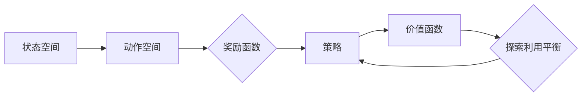

# 强化学习：状态-动作对的选择

## 1. 背景介绍

### 1.1 强化学习的起源与发展
#### 1.1.1 强化学习的起源
#### 1.1.2 强化学习的发展历程
#### 1.1.3 强化学习的现状与挑战

### 1.2 强化学习的定义与特点 
#### 1.2.1 强化学习的定义
#### 1.2.2 强化学习的特点
#### 1.2.3 强化学习与其他机器学习范式的区别

### 1.3 强化学习的应用领域
#### 1.3.1 游戏领域的应用
#### 1.3.2 机器人控制领域的应用  
#### 1.3.3 其他领域的应用

## 2. 核心概念与联系

### 2.1 马尔可夫决策过程
#### 2.1.1 状态空间
#### 2.1.2 动作空间
#### 2.1.3 转移概率与奖励函数

### 2.2 策略与价值函数
#### 2.2.1 策略的定义
#### 2.2.2 状态价值函数与动作价值函数
#### 2.2.3 最优策略与最优价值函数

### 2.3 探索与利用
#### 2.3.1 探索与利用的概念
#### 2.3.2 探索与利用的平衡
#### 2.3.3 常用的探索策略

### 2.4 强化学习的核心概念联系



## 3. 核心算法原理具体操作步骤

### 3.1 值迭代算法
#### 3.1.1 值迭代算法的原理
#### 3.1.2 值迭代算法的具体步骤
#### 3.1.3 值迭代算法的优缺点

### 3.2 策略迭代算法
#### 3.2.1 策略迭代算法的原理 
#### 3.2.2 策略评估与策略提升
#### 3.2.3 策略迭代算法的具体步骤

### 3.3 蒙特卡洛方法
#### 3.3.1 蒙特卡洛方法的原理
#### 3.3.2 蒙特卡洛方法的具体步骤
#### 3.3.3 蒙特卡洛方法的优缺点

### 3.4 时序差分学习
#### 3.4.1 时序差分学习的原理
#### 3.4.2 Sarsa算法与Q-learning算法
#### 3.4.3 时序差分学习的优缺点

## 4. 数学模型和公式详细讲解举例说明

### 4.1 马尔可夫决策过程的数学模型
#### 4.1.1 状态转移概率矩阵
$$P(s'|s,a) = P(S_{t+1}=s'|S_t=s, A_t=a)$$
#### 4.1.2 奖励函数
$$R(s,a) = \mathbb{E}[R_{t+1}|S_t=s, A_t=a]$$
#### 4.1.3 折扣因子
$$\gamma \in [0,1]$$

### 4.2 价值函数的数学模型
#### 4.2.1 状态价值函数
$$V^{\pi}(s)=\mathbb{E}_{\pi}[\sum_{k=0}^{\infty}\gamma^k R_{t+k+1}|S_t=s]$$
#### 4.2.2 动作价值函数 
$$Q^{\pi}(s,a)=\mathbb{E}_{\pi}[\sum_{k=0}^{\infty}\gamma^k R_{t+k+1}|S_t=s, A_t=a]$$
#### 4.2.3 价值函数之间的关系
$Q^{\pi}(s,a) = R(s,a) + \gamma \sum_{s'\in S}P(s'|s,a)V^{\pi}(s')$

### 4.3 贝尔曼方程
#### 4.3.1 状态价值函数的贝尔曼方程
$$V^{\pi}(s) = \sum_{a\in A}\pi(a|s)(R(s,a)+\gamma \sum_{s'\in S}P(s'|s,a)V^{\pi}(s'))$$
#### 4.3.2 动作价值函数的贝尔曼方程
$$Q^{\pi}(s,a) = R(s,a)+\gamma \sum_{s'\in S}P(s'|s,a)\sum_{a'\in A}\pi(a'|s')Q^{\pi}(s',a')$$
#### 4.3.3 最优价值函数的贝尔曼方程
$$V^{*}(s) = \max_{a\in A}(R(s,a)+\gamma \sum_{s'\in S}P(s'|s,a)V^{*}(s'))$$
$$Q^{*}(s,a) = R(s,a)+\gamma \sum_{s'\in S}P(s'|s,a)\max_{a'\in A}Q^{*}(s',a')$$

## 5. 项目实践：代码实例和详细解释说明

### 5.1 值迭代算法的代码实现
```python
def value_iteration(mdp, gamma, epsilon):
    V = np.zeros(mdp.num_states)
    while True:
        delta = 0
        for s in range(mdp.num_states):
            v = V[s]
            V[s] = max(mdp.R[s] + gamma * np.dot(mdp.P[s], V))
            delta = max(delta, abs(v - V[s]))
        if delta < epsilon:
            break
    return V
```
值迭代算法通过迭代更新状态价值函数，直到收敛到最优状态价值函数。其中，`mdp`表示马尔可夫决策过程，`gamma`为折扣因子，`epsilon`为收敛阈值。

### 5.2 蒙特卡洛方法的代码实现
```python
def monte_carlo_es(env, gamma, num_episodes):
    Q = np.zeros((env.num_states, env.num_actions))
    returns = defaultdict(list)
    
    for _ in range(num_episodes):
        episode = []
        state = env.reset()
        while True:
            action = np.random.choice(env.num_actions)
            next_state, reward, done, _ = env.step(action)
            episode.append((state, action, reward))
            state = next_state
            if done:
                break
        
        G = 0
        for t in range(len(episode)-1, -1, -1):
            state, action, reward = episode[t]
            G = gamma * G + reward
            if (state, action) not in [(x[0], x[1]) for x in episode[:t]]:
                returns[(state, action)].append(G)
                Q[state][action] = np.mean(returns[(state, action)])
    
    return Q
```
蒙特卡洛方法通过采样完整的交互序列来估计动作价值函数。其中，`env`表示环境，`gamma`为折扣因子，`num_episodes`为采样的序列数量。通过统计每个状态-动作对的回报，并计算其均值来估计Q值。

### 5.3 Q-learning算法的代码实现
```python
def q_learning(env, gamma, alpha, num_episodes):
    Q = np.zeros((env.num_states, env.num_actions))
    
    for _ in range(num_episodes):
        state = env.reset()
        while True:
            action = epsilon_greedy(Q[state], epsilon=0.1)
            next_state, reward, done, _ = env.step(action)
            Q[state][action] += alpha * (reward + gamma * np.max(Q[next_state]) - Q[state][action])
            state = next_state
            if done:
                break
    
    return Q
```
Q-learning算法通过时序差分学习来更新动作价值函数。其中，`env`表示环境，`gamma`为折扣因子，`alpha`为学习率，`num_episodes`为训练的序列数量。通过贪婪策略选择动作，并利用TD误差来更新Q值。

## 6. 实际应用场景

### 6.1 智能体游戏中的应用
#### 6.1.1 Atari游戏中的应用
#### 6.1.2 围棋游戏中的应用
#### 6.1.3 星际争霸游戏中的应用

### 6.2 机器人控制中的应用
#### 6.2.1 机器人运动规划中的应用
#### 6.2.2 机器人操纵技能学习中的应用
#### 6.2.3 自动驾驶中的应用

### 6.3 推荐系统中的应用
#### 6.3.1 基于强化学习的推荐算法
#### 6.3.2 在线广告投放中的应用
#### 6.3.3 新闻推荐中的应用

## 7. 工具和资源推荐

### 7.1 强化学习框架
#### 7.1.1 OpenAI Gym
#### 7.1.2 DeepMind Lab
#### 7.1.3 MuJoCo

### 7.2 深度强化学习库  
#### 7.2.1 Stable Baselines
#### 7.2.2 Keras-RL
#### 7.2.3 TensorFlow Agents

### 7.3 学习资源
#### 7.3.1 《Reinforcement Learning: An Introduction》by Richard S. Sutton and Andrew G. Barto
#### 7.3.2 David Silver 的强化学习课程
#### 7.3.3 OpenAI 的 Spinning Up 教程

## 8. 总结：未来发展趋势与挑战

### 8.1 强化学习的发展趋势
#### 8.1.1 深度强化学习的崛起
#### 8.1.2 多智能体强化学习的发展
#### 8.1.3 元强化学习的探索

### 8.2 强化学习面临的挑战
#### 8.2.1 样本效率问题
#### 8.2.2 奖励稀疏问题
#### 8.2.3 探索与利用的平衡问题

### 8.3 强化学习的未来展望
#### 8.3.1 强化学习与其他领域的结合
#### 8.3.2 可解释性与安全性问题
#### 8.3.3 强化学习在实际应用中的推广

## 9. 附录：常见问题与解答

### 9.1 强化学习与监督学习、无监督学习有什么区别？
### 9.2 强化学习中的探索策略有哪些？
### 9.3 如何处理强化学习中的延迟奖励问题？
### 9.4 什么是深度强化学习？与传统强化学习有何不同？
### 9.5 强化学习在实际应用中可能遇到哪些问题？如何解决？

作者：禅与计算机程序设计艺术 / Zen and the Art of Computer Programming