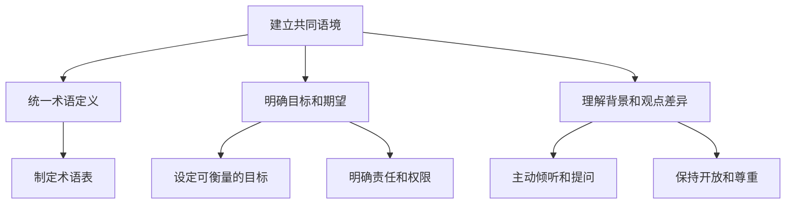
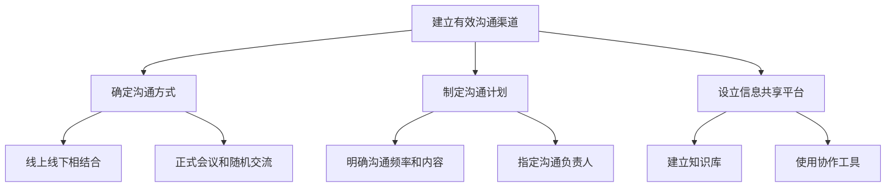
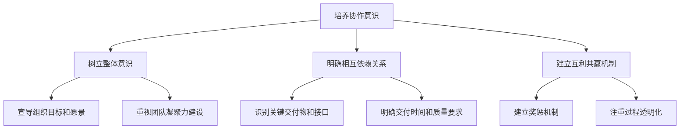
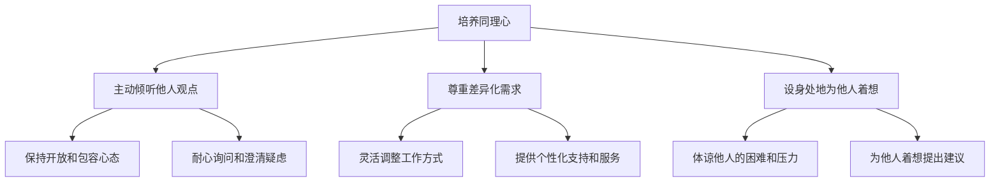
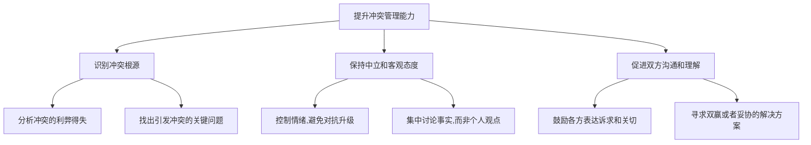
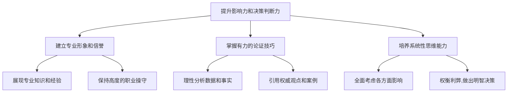

# 怎样培养跨部门沟通协调能力

## 1. 背景介绍

### 1.1 跨部门协作的重要性

在当今快节奏的商业环境中,跨部门协作已经成为组织取得成功的关键因素。随着企业规模的不断扩大,各部门之间的相互依赖性也在不断增强。有效的跨部门沟通协调能力可以确保信息流动顺畅,资源共享高效,从而提高工作效率,缩短项目周期,并最终实现组织目标。

### 1.2 跨部门沟通协调的挑战

然而,由于不同部门的职责分工、文化背景、沟通方式等存在差异,跨部门沟通协调往往面临诸多挑战。例如:

- 部门间目标不一致,导致优先级划分困难
- 信息孤岛,缺乏有效的信息共享机制
- 语言和术语存在隔阂,沟通效率低下
- 部门之间存在隔阂和不信任,影响协作氛围

### 1.3 培养跨部门协调能力的意义

因此,培养跨部门沟通协调能力对于个人职业发展和组织高效运转至关重要。掌握有效的沟通技巧和协调方法,不仅可以提升个人影响力和领导能力,而且还能促进组织内部的协同合作,实现资源的优化配置,从而为企业创造更大的价值。

## 2. 核心概念与联系

### 2.1 沟通的定义

沟通是指信息的传递、交换和理解的过程。有效的沟通需要发送方和接收方之间建立共同的语境和理解,才能实现信息的准确传递。

### 2.2 协调的定义

协调是指在多个参与者之间达成一致,使各方的行为有序、协同一致,从而完成既定目标的过程。协调需要各方相互理解、妥协和配合,以实现最佳的整体效果。

### 2.3 跨部门沟通协调的核心要素

跨部门沟通协调涉及以下几个核心要素:

- 信息共享
- 目标一致性
- 角色定位
- 利益权衡
- 决策协调
- 行动统一

这些要素相互关联、相互影响,需要通过有效的沟通和协调来实现协同合作。

### 2.4 跨部门沟通协调能力模型

跨部门沟通协调能力可以概括为以下几个方面:

1. 沟通技巧
2. 协作意识
3. 同理心
4. 冲突管理
5. 影响力
6. 决策判断

这些能力相互交织,构成了一个完整的能力模型,需要系统性的培养和提升。

## 3. 核心算法原理具体操作步骤

培养跨部门沟通协调能力是一个系统性的过程,需要从多个维度着手。下面将介绍其核心算法原理和具体操作步骤:

### 3.1 建立共同语境

1. 统一术语定义:不同部门可能对同一术语有不同的理解,因此需要统一术语的定义,避免沟通障碍。可以制定统一的术语表供各方参考。

2. 明确目标和期望:明确项目或任务的目标和各方的期望值,有助于达成共识,避免分歧。可以设定可衡量的目标,并明确责任和权限划分。

3. 理解背景和观点差异:不同部门由于职责和文化背景的差异,在看问题的角度和观点上也会有所不同。主动倾听和提问,保持开放和尊重的态度,有助于相互理解。

### 3.2 建立有效沟通渠道

1. 确定沟通方式:根据实际需求,采用线上线下相结合的方式,包括正式会议和随机交流,以确保信息的高效传递。

2. 制定沟通计划:明确沟通的频率、内容和负责人,有助于保持沟通的连续性和针对性。

3. 设立信息共享平台:建立知识库、使用协作工具等,为各方提供信息共享和协作的平台,避免信息孤岛。

### 3.3 培养协作意识

1. 树立整体意识:宣导组织的整体目标和愿景,重视团队凝聚力建设,让每个成员都意识到自身在整体中的角色和价值。

2. 明确相互依赖关系:识别各部门之间的关键交付物和接口,明确交付时间和质量要求,增强责任意识。

3. 建立互利共赢机制:通过建立奖惩机制和过程透明化,促进各方利益的平衡,形成合作共赢的局面。

### 3.4 培养同理心

1. 主动倾听他人观点:保持开放和包容的心态,耐心倾听并询问澄清疑虑,了解他人的真实需求和关切。

2. 尊重差异化需求:灵活调整工作方式,提供个性化的支持和服务,满足不同部门的差异化需求。

3. 设身处地为他人着想:体谅他人的困难和压力,从他人的角度出发,为他人着想提出建议和支持。

### 3.5 提升冲突管理能力

1. 识别冲突根源:分析冲突的利弊得失,找出引发冲突的关键问题,有助于解决问题的症结。

2. 保持中立和客观态度:控制情绪,避免对抗升级,集中讨论事实,而非个人观点,有助于理性分析问题。

3. 促进双方沟通和理解:鼓励各方表达诉求和关切,寻求双赢或者妥协的解决方案,化解分歧,达成共识。

### 3.6 提升影响力和决策判断力

1. 建立专业形象和信誉:展现专业知识和经验,保持高度的职业操守,有助于赢得他人的信任和尊重。

2. 掌握有力的论证技巧:理性分析数据和事实,引用权威观点和成功案例,增强论证的说服力。

3. 培养系统性思维能力:全面考虑各方面的影响,权衡利弊,做出明智的决策,提高决策的科学性和前瞻性。

## 4. 数学模型和公式详细讲解举例说明

在跨部门沟通协调过程中,我们可以借助一些数学模型和公式来量化和优化决策过程。

### 4.1 利益相关者分析模型

利益相关者分析模型(Stakeholder Analysis Model)是一种系统地识别和评估项目中各利益相关方的模型,有助于制定满足各方需求的协调方案。

该模型通常包括以下步骤:

1. 识别利益相关方
2. 分类和优先级排序
3. 分析利益相关方的期望和影响力
4. 制定应对策略

我们可以使用下面的公式来量化利益相关方的影响力和重要性:

$$
影响力分数 = \sum_{i=1}^{n}w_i \times 评分_i
$$

其中,$ w_i $表示第i个影响力因素的权重,$ 评分_i $表示对该因素的评分。

$$
重要性分数 = \sum_{j=1}^{m}v_j \times 评分_j
$$

其中,$ v_j $表示第j个重要性因素的权重,$ 评分_j $表示对该因素的评分。

根据影响力分数和重要性分数的大小,我们可以将利益相关方划分为不同的类别,并采取相应的应对策略。

### 4.2 冲突管理模型

在跨部门协作中,冲突是难以避免的。我们可以借助一些数学模型来分析和管理冲突。

#### 4.2.1 冲突强度模型

冲突强度模型(Conflict Intensity Model)可以用来衡量冲突的严重程度,从而采取相应的管理措施。

冲突强度可以用下面的公式来计算:

$$
冲突强度 = \alpha \times 目标差异 + \beta \times 利益差异 + \gamma \times 行为差异
$$

其中,$ \alpha $、$ \beta $、$ \gamma $分别表示目标差异、利益差异和行为差异的权重系数,它们的值可以根据具体情况进行调整。

目标差异、利益差异和行为差异分别表示相关方在目标、利益和行为上的分歧程度,可以通过评分或者其他方式进行量化。

根据冲突强度的大小,我们可以采取不同的管理策略,如协商、妥协、强制执行等。

#### 4.2.2 冲突成本模型

在管理冲突时,我们还需要考虑冲突所带来的成本。冲突成本模型(Conflict Cost Model)可以用来估算冲突的潜在成本,从而权衡管理冲突的收益。

冲突成本可以用下面的公式来计算:

$$
冲突成本 = 直接成本 + 间接成本
$$

其中,直接成本包括因冲突导致的时间和资源损失等;间接成本包括士气下降、声誉损失等无形成本。

我们可以进一步将直接成本和间接成本分解为多个具体项目:

$$
直接成本 = \sum_{i=1}^{n}c_i
$$

$$
间接成本 = \sum_{j=1}^{m}d_j
$$

其中,$ c_i $表示第i个直接成本项目,$ d_j $表示第j个间接成本项目。

通过估算冲突成本,我们可以