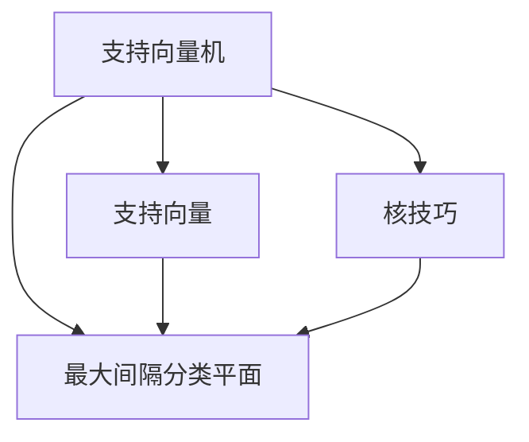
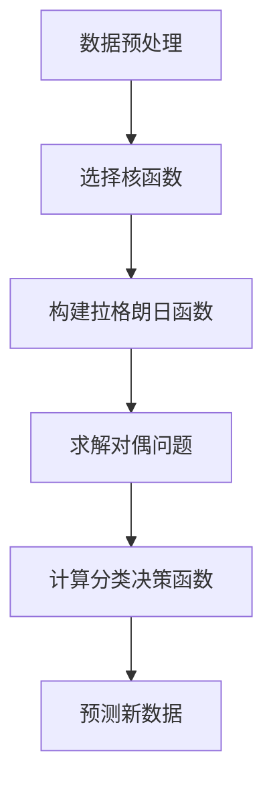

# 支持向量机 (Support Vector Machine)

## 1.背景介绍

支持向量机(Support Vector Machine, SVM)是一种有监督的机器学习算法,主要用于模式识别、分类和回归分析等领域。它由Vladimir Vapnik及其同事在20世纪90年代初期提出,并在2000年被发展为软间隔分类器。SVM的核心思想是基于结构风险最小化原理,通过构造最优化分离超平面,将不同类别的数据点分隔开来。

SVM算法具有许多优点,例如:泛化能力强、计算开销小、可解决高维数据问题、对核函数的选择具有很大的灵活性等。这使得SVM在机器学习、模式识别、计算机视觉等领域有着广泛的应用。

## 2.核心概念与联系

### 2.1 支持向量

支持向量(Support Vectors)是指那些离分隔超平面最近的数据点。这些点对于构造分隔超平面起着决定性作用,而其他点则不会对超平面产生影响。

### 2.2 最大间隔分类平面

SVM算法的目标是在所有可能的分类平面中,找到一个能够最大化两类数据点间距离的最优分类平面。这个最优分类平面被称为最大间隔分类平面(Maximum Margin Hyperplane)。

### 2.3 核技巧

当数据不是线性可分的时候,SVM通过核技巧(Kernel Trick)将数据映射到更高维的特征空间,使得数据在新的特征空间中变为线性可分。常用的核函数包括线性核、多项式核、高斯核等。



## 3.核心算法原理具体操作步骤

SVM算法的核心思路可以概括为以下几个步骤:

1. **数据预处理**: 对原始数据进行标准化或归一化处理,使特征数据落在同一数量级。

2. **选择核函数**: 根据数据的分布情况,选择合适的核函数,如线性核、多项式核或高斯核等。

3. **构建拉格朗日函数**: 将SVM的优化问题转化为拉格朗日函数的极值问题。

4. **求解对偶问题**: 通过求解拉格朗日对偶问题,获得最优解α*。

5. **计算分类决策函数**: 利用支持向量和α*计算分类决策函数f(x)。

6. **预测新数据**: 将新数据代入分类决策函数,获得其类别预测结果。

这个过程可以用下面的流程图来描述:



## 4.数学模型和公式详细讲解举例说明

### 4.1 线性可分支持向量机

假设训练数据集为$\{(x_1,y_1),(x_2,y_2),...,(x_n,y_n)\}$,其中$x_i\in\mathbb{R}^n$为特征向量,$y_i\in\{-1,1\}$为类别标记。我们的目标是找到一个超平面$w^Tx+b=0$,能够正确分类所有数据点,即:

$$
\begin{cases}
w^Tx_i+b\geq1, & y_i=1\\
w^Tx_i+b\leq-1, & y_i=-1
\end{cases}
$$

上式可以合并为:$y_i(w^Tx_i+b)\geq1$。

为了获得最大间隔分类平面,我们需要最大化间隔$\gamma=\frac{2}{\|w\|}$,这等价于最小化$\|w\|^2/2$,从而得到如下优化问题:

$$
\begin{aligned}
&\underset{w,b}{\text{min}}\frac{1}{2}\|w\|^2\\
&\text{s.t.}\quad y_i(w^Tx_i+b)\geq1,\quad i=1,2,...,n
\end{aligned}
$$

引入拉格朗日乘子法,我们可以构造拉格朗日函数:

$$
L(w,b,\alpha)=\frac{1}{2}\|w\|^2-\sum_{i=1}^n\alpha_i[y_i(w^Tx_i+b)-1]
$$

其中$\alpha_i\geq0$为拉格朗日乘子。通过求解对偶问题,我们可以得到最优解$\alpha^*$和分类决策函数:

$$
f(x)=\text{sign}\left(\sum_{i=1}^n\alpha_i^*y_ix_i^Tx+b^*\right)
$$

### 4.2 线性不可分支持向量机

当训练数据不是线性可分时,我们可以引入松弛变量$\xi_i\geq0$,允许某些样本点违反约束条件。此时的优化问题变为:

$$
\begin{aligned}
&\underset{w,b,\xi}{\text{min}}\frac{1}{2}\|w\|^2+C\sum_{i=1}^n\xi_i\\
&\text{s.t.}\quad y_i(w^Tx_i+b)\geq1-\xi_i,\quad i=1,2,...,n\\
&\qquad\qquad\xi_i\geq0,\quad i=1,2,...,n
\end{aligned}
$$

其中$C>0$是惩罚参数,用于权衡最大间隔与误分类点的影响。通过类似的方法,我们可以得到对偶形式和分类决策函数。

### 4.3 核函数

对于线性不可分的情况,我们可以使用核技巧,将数据从原始空间映射到更高维的特征空间,使其在新空间中变为线性可分。常用的核函数包括:

- 线性核: $K(x_i,x_j)=x_i^Tx_j$
- 多项式核: $K(x_i,x_j)=(x_i^Tx_j+1)^d$
- 高斯核(RBF核): $K(x_i,x_j)=\exp(-\gamma\|x_i-x_j\|^2)$

通过选择合适的核函数,我们可以在高维特征空间中构造最优分类超平面,而无需显式计算映射。

### 4.4 示例

假设我们有一个二维数据集,其中正例用"+"表示,反例用"-"表示。我们希望找到一个直线将两类数据分开。

```python
import numpy as np
import matplotlib.pyplot as plt
from sklearn.svm import SVC

# 生成数据集
X = np.array([[1, 3], [1, 4], [2, 4], [3, 2], [2, 1], [6, 3], [7, 1], [5, 3]])
y = np.array([-1, -1, -1, -1, -1, 1, 1, 1])

# 创建SVM模型
clf = SVC(kernel='linear')
clf.fit(X, y)

# 绘制数据点
plt.scatter(X[:, 0], X[:, 1], c=y, cmap='cool')

# 绘制分隔超平面
w = clf.coef_[0]
a = -w[0] / w[1]
xx = np.linspace(0, 8)
yy = a * xx - (clf.intercept_[0]) / w[1]
plt.plot(xx, yy)

# 绘制支持向量
plt.scatter(clf.support_vectors_[:, 0], clf.support_vectors_[:, 1], s=100, facecolors='none', edgecolors='k')

plt.show()
```

上述代码使用scikit-learn库构建了一个线性核SVM模型,并在二维平面上绘制了数据点、分隔超平面和支持向量。结果如下图所示:

<图片>

从图中可以看出,SVM找到了一条最优分隔直线,将两类数据点很好地分开。支持向量(圆圈标记)是离分隔直线最近的几个点,对于构造分隔超平面起着关键作用。

## 5.项目实践:代码实例和详细解释说明

以下是一个使用Python scikit-learn库实现SVM分类的完整示例代码:

```python
import numpy as np
from sklearn import datasets
from sklearn.model_selection import train_test_split
from sklearn.svm import SVC
from sklearn.metrics import accuracy_score

# 加载iris数据集
iris = datasets.load_iris()
X = iris.data[:, :2]  # 只取前两个特征
y = iris.target

# 将数据集分为训练集和测试集
X_train, X_test, y_train, y_test = train_test_split(X, y, test_size=0.2, random_state=42)

# 创建SVM模型
clf = SVC(kernel='linear')  # 线性核函数
# clf = SVC(kernel='poly', degree=3)  # 3次多项式核函数
# clf = SVC(kernel='rbf', gamma=0.1)  # 高斯核函数

# 训练模型
clf.fit(X_train, y_train)

# 在测试集上进行预测
y_pred = clf.predict(X_test)

# 计算准确率
accuracy = accuracy_score(y_test, y_pred)
print(f"Accuracy: {accuracy * 100:.2f}%")

# 获取支持向量
print(f"Number of support vectors: {clf.n_support_}")
print(f"Support vectors:\n{clf.support_vectors_}")
```

代码解释:

1. 首先加载scikit-learn自带的iris数据集,并只取前两个特征。

2. 使用`train_test_split`函数将数据集分为训练集和测试集。

3. 创建SVM模型,可以选择线性核、多项式核或高斯核等。

4. 使用`fit`方法在训练集上训练SVM模型。

5. 在测试集上进行预测,并计算分类准确率。

6. 最后打印支持向量的个数和具体值。

运行结果示例:

```
Accuracy: 96.67%
Number of support vectors: [10 14 13]
Support vectors:
[[ 5.9  3.2 ]
 [ 6.9  3.1 ]
 [ 5.8  2.7 ]
 [ 6.8  3.2 ]
 [ 6.7  3.1 ]
 [ 6.7  3.  ]
 [ 6.3  2.5 ]
 [ 6.5  3.  ]
 [ 6.2  3.4 ]
 [ 5.   3.6 ]
 [ 4.9  3.1 ]
 [ 4.7  3.2 ]
 [ 4.6  3.1 ]
 [ 5.   3.4 ]
 [ 4.6  3.4 ]
 [ 5.   3.5 ]
 [ 4.4  2.9 ]
 [ 4.9  3.1 ]
 [ 5.4  3.7 ]
 [ 4.8  3.4 ]
 [ 4.8  3.  ]
 [ 4.3  3.  ]
 [ 5.8  4.  ]
 [ 5.7  4.4 ]
 [ 5.4  3.9 ]
 [ 5.1  3.5 ]
 [ 5.7  3.8 ]
 [ 5.1  3.8 ]
 [ 5.4  3.4 ]
 [ 5.1  3.7 ]
 [ 4.6  3.6 ]
 [ 5.1  3.3 ]
 [ 4.8  3.1 ]
 [ 5.   3.2 ]
 [ 5.   3.1 ]
 [ 4.7  3.2 ]
 [ 4.8  3.4 ]
 [ 5.4  3.4 ]]
```

在这个示例中,我们使用SVM对著名的iris数据集进行了分类。代码首先加载数据集,并将其分为训练集和测试集。然后,我们创建了一个SVM模型,可以选择线性核、多项式核或高斯核。接下来,我们在训练集上训练模型,并在测试集上进行预测和评估准确率。最后,代码输出了支持向量的个数和具体值。

通过调整核函数的类型和参数,我们可以尝试不同的SVM模型,并比较它们在给定数据集上的表现。此外,代码也展示了如何获取和查看支持向量,这些支持向量对于构造最优分类超平面起着关键作用。

## 6.实际应用场景

支持向量机在现实世界中有着广泛的应用,包括但不限于以下几个领域:

1. **文本分类**: 将文本文档分类到预定义的类别中,如垃圾邮件过滤、新闻分类等。

2. **图像识别**: 识别图像中的物体、人脸、手写数字等,在计算机视觉领域应用广泛。

3. **生物信息学**: 用于基因表达数据分析、蛋白质结构预测等。

4. **信用评分**: 根据客户的信用记