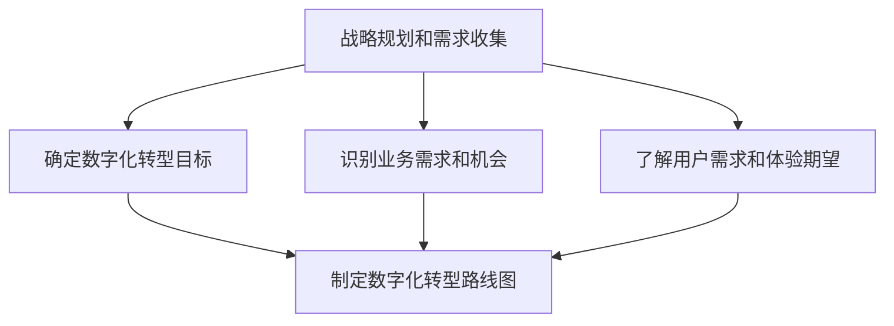
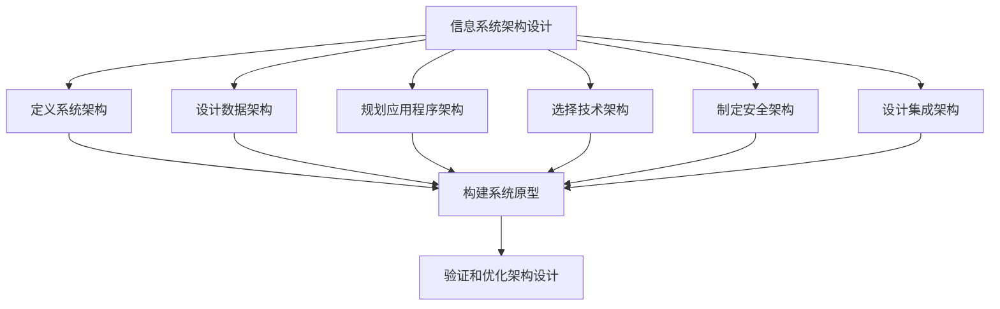
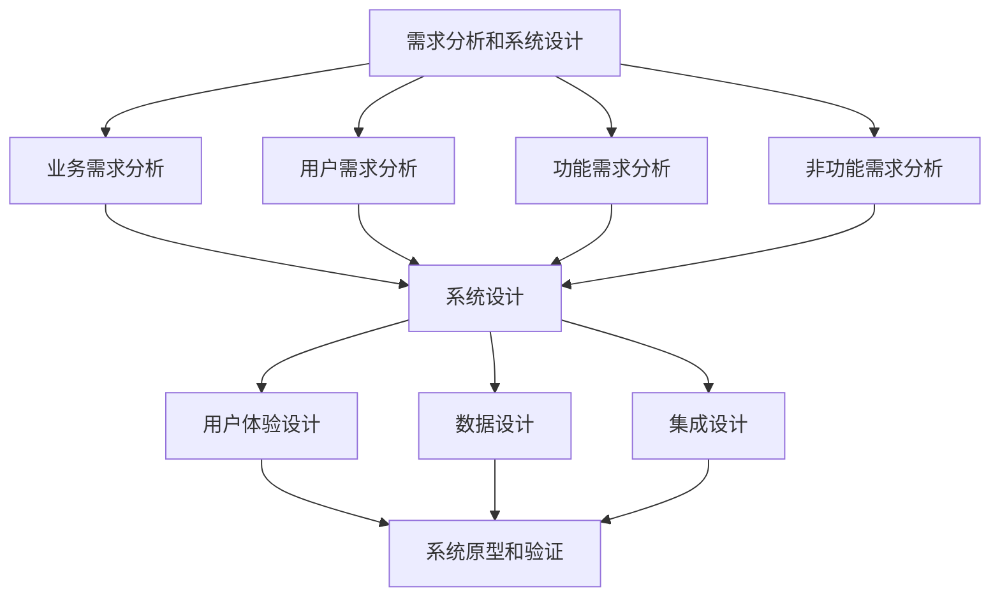
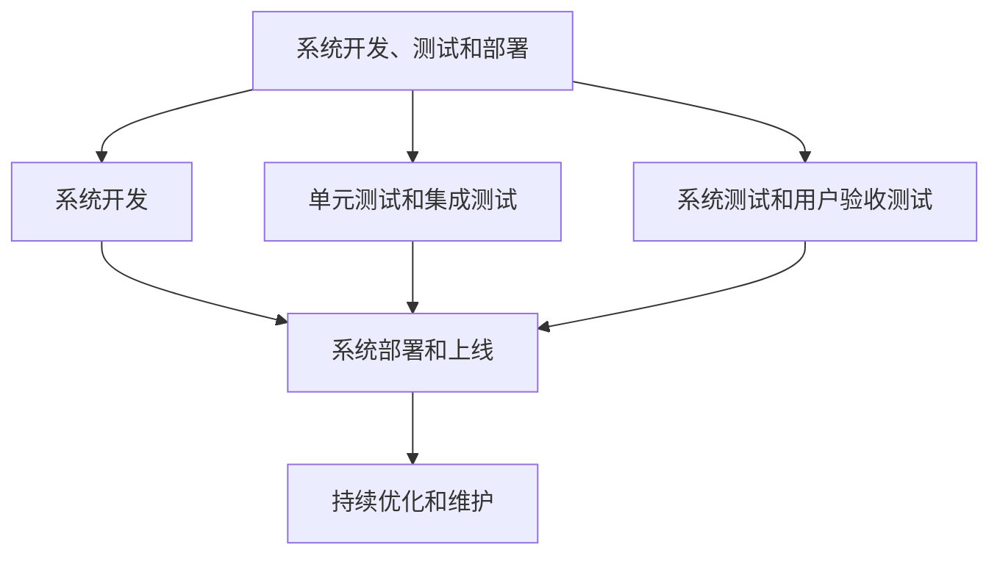

# 数字化转型项目设计：信息系统规划、布局及框架设计，需求分析、系统分析设计

## 1. 背景介绍

### 1.1 数字化转型的重要性

在当今快速发展的商业环境中，数字化转型已经成为企业保持竞争力和实现可持续发展的关键驱动力。传统的商业模式和流程已经无法满足日益增长的客户需求和市场变化。因此，企业必须通过采用先进的数字技术来转变其业务运营、产品和服务交付方式。

数字化转型不仅涉及技术层面的变革,更重要的是需要改变企业的文化、流程和思维模式。它要求企业重新思考客户体验、业务模式、运营效率和决策过程,并利用数字技术来实现这些变革。

### 1.2 信息系统在数字化转型中的作用

信息系统是数字化转型的核心支柱,它为企业提供了必要的技术基础设施和数据驱动的洞察力。通过规划、布局和框架设计,企业可以构建高效、可扩展和安全的信息系统,支持其数字化战略的实施。

有效的信息系统设计需要考虑企业的业务需求、技术趋势、数据管理、集成和安全性等多个方面。它还需要采用敏捷的方法,以确保系统能够快速响应不断变化的业务需求。

## 2. 核心概念与联系

### 2.1 数字化转型的核心概念

数字化转型是一个涵盖多个领域的广泛概念,包括以下核心要素:

1. **数字化业务模式**: 利用数字技术重新定义产品、服务和价值主张,创造新的收入来源和客户体验。
2. **数字化运营**: 通过自动化、优化和集成流程,提高运营效率和敏捷性。
3. **数字化客户体验**: 利用数字渠道和技术(如移动应用、社交媒体、物联网等)提供无缝的客户体验。
4. **数据驱动决策**: 利用大数据分析和人工智能技术,从海量数据中获取洞察力,支持业务决策。
5. **数字化文化和人才**: 培养数字化思维模式,建立敏捷的组织文化,并吸引和培养数字化人才。

### 2.2 信息系统规划、布局及框架设计的核心概念

信息系统规划、布局及框架设计是数字化转型的关键基础,它包括以下核心概念:

1. **系统架构**: 定义系统的整体结构、组件、模块和它们之间的关系,确保系统具有可扩展性、灵活性和可维护性。
2. **数据架构**: 设计数据模型、数据存储和数据管理策略,确保数据的完整性、一致性和可访问性。
3. **应用程序架构**: 规划和设计应用程序的功能、模块化和集成方式,以满足业务需求和技术要求。
4. **技术架构**: 选择和集成适当的技术平台、框架和工具,支持系统的开发、部署和运维。
5. **安全架构**: 制定安全策略、控制措施和最佳实践,保护系统、数据和用户隐私。
6. **集成架构**: 设计系统与现有系统和外部系统的集成方式,实现无缝的数据交换和业务流程协作。

### 2.3 需求分析和系统分析设计的核心概念

需求分析和系统分析设计是信息系统开发过程中的关键步骤,它们包括以下核心概念:

1. **业务需求分析**: 深入了解企业的业务目标、流程、痛点和机会,识别和定义系统需求。
2. **用户需求分析**: 通过用户研究和参与,了解用户的期望、行为和体验需求。
3. **功能需求分析**: 确定系统应该提供的功能和特性,以满足业务和用户需求。
4. **非功能需求分析**: 识别系统的性能、可用性、安全性、可维护性等非功能需求。
5. **系统设计**: 根据需求,设计系统的架构、模块、接口和数据模型,确保系统满足功能和非功能需求。
6. **用户体验设计**: 设计直观、高效和吸引人的用户界面和交互方式,提供优质的用户体验。
7. **数据设计**: 设计数据结构、数据流和数据存储策略,支持系统的数据管理和分析需求。
8. **集成设计**: 规划系统与现有系统和外部系统的集成方式,实现无缝的数据交换和业务流程协作。

这些核心概念相互关联,共同构建了一个完整的数字化转型信息系统解决方案。

## 3. 核心算法原理具体操作步骤

在数字化转型项目设计中,并没有特定的算法原理,而是一系列的方法论和最佳实践。然而,我们可以将整个过程概括为以下几个关键步骤:

### 3.1 战略规划和需求收集

1. 与企业高层领导和关键利益相关方进行深入讨论,确定数字化转型的战略目标和预期成果。
2. 通过业务流程分析、客户调研和竞争对手分析,识别当前业务模式的痛点和数字化转型的机会。
3. 利用用户研究、分析和参与设计等方法,深入了解用户的需求、行为和体验期望。
4. 根据战略目标、业务需求和用户需求,制定全面的数字化转型路线图和实施计划。

### 3.2 信息系统架构设计

1. 根据业务需求和技术趋势,定义系统的整体架构、组件、模块和它们之间的关系。
2. 设计数据模型、数据存储和数据管理策略,确保数据的完整性、一致性和可访问性。
3. 规划和设计应用程序的功能、模块化和集成方式,以满足业务需求和技术要求。
4. 选择和集成适当的技术平台、框架和工具,支持系统的开发、部署和运维。
5. 制定安全策略、控制措施和最佳实践,保护系统、数据和用户隐私。
6. 设计系统与现有系统和外部系统的集成方式,实现无缝的数据交换和业务流程协作。
7. 构建系统原型,验证和优化架构设计,确保其满足业务需求和技术要求。

### 3.3 需求分析和系统设计

1. 深入分析企业的业务目标、流程、痛点和机会,识别和定义系统的业务需求。
2. 通过用户研究和参与,了解用户的期望、行为和体验需求。
3. 确定系统应该提供的功能和特性,以满足业务和用户需求。
4. 识别系统的性能、可用性、安全性、可维护性等非功能需求。
5. 根据需求,设计系统的架构、模块、接口和数据模型,确保系统满足功能和非功能需求。
6. 设计直观、高效和吸引人的用户界面和交互方式,提供优质的用户体验。
7. 设计数据结构、数据流和数据存储策略,支持系统的数据管理和分析需求。
8. 规划系统与现有系统和外部系统的集成方式,实现无缝的数据交换和业务流程协作。
9. 构建系统原型,进行用户测试和验证,确保设计满足需求和预期。

### 3.4 系统开发、测试和部署

1. 基于系统设计,进行系统开发,包括编码、模块集成和构建。
2. 执行单元测试和集成测试,确保各个模块和组件的功能正确性和兼容性。
3. 进行系统测试和用户验收测试,验证系统是否满足业务需求和用户期望。
4. 在生产环境中部署和上线系统,确保平稳过渡和无缝切换。
5. 持续监控系统性能、收集用户反馈,并进行优化和维护,以确保系统的高效运行和持续改进。

这些步骤并非线性的,而是一个迭代的过程。在每个阶段,都需要与利益相关方进行密切沟通和协作,以确保设计和实施符合业务需求和用户期望。

## 4. 数学模型和公式详细讲解举例说明

在数字化转型项目设计中,并没有特定的数学模型或公式。然而,在某些特定领域或任务中,可能需要使用数学模型和公式来支持决策或优化过程。以下是一些可能使用的数学模型和公式的示例:

### 4.1 业务流程优化

在优化业务流程时,可以使用队列理论和马尔可夫模型来分析和优化流程效率。例如,可以使用下面的公式来计算系统的平均等待时间:

$$
W_q = \frac{\lambda}{μ(μ-\lambda)}
$$

其中:
- $W_q$ 是平均等待时间
- $\lambda$ 是到达率
- $μ$ 是服务率

通过调整服务率或优化流程,可以减少平均等待时间,提高效率。

### 4.2 资源优化

在规划和分配资源时,可以使用线性规划或整数规划模型来优化资源利用。例如,可以使用以下线性规划模型来最小化成本:

$$
\begin{align*}
\text{minimize} \quad & \sum_{i=1}^{n} c_i x_i \\
\text{subject to} \quad & \sum_{i=1}^{n} a_{ij} x_i \leq b_j, \quad j=1,\ldots,m \\
& x_i \geq 0, \quad i=1,\ldots,n
\end{align*}
$$

其中:
- $c_i$ 是资源 $i$ 的成本
- $x_i$ 是资源 $i$ 的数量
- $a_{ij}$ 是资源 $i$ 对约束条件 $j$的影响
- $b_j$ 是约束条件 $j$ 的限制

通过求解这个线性规划问题,可以确定最优的资源分配方案。

### 4.3 预测和决策支持

在进行预测和决策支持时,可以使用机器学习和统计模型,如回归模型、时间序列模型和决策树模型。例如,可以使用多元线性回归模型来预测销售额:

$$
y = \beta_0 + \beta_1 x_1 + \beta_2 x_2 + \ldots + \beta_n x_n + \epsilon
$$

其中:
- $y$ 是销售额
- $x_1, x_2, \ldots, x_n$ 是影响销售额的因素
- $\beta_0, \beta_1, \ldots, \beta_n$ 是回归系数
- $\epsilon$ 是误差项

通过估计回归系数,可以建立销售额与影响因素之间的关系模型,并用于预测和决策支持。

需要注意的是,在实际应用中,需要根据具体问题和数据特征选择合适的数学模型和算法,并进行适当的数据预处理、模型训练和验证。

## 5.