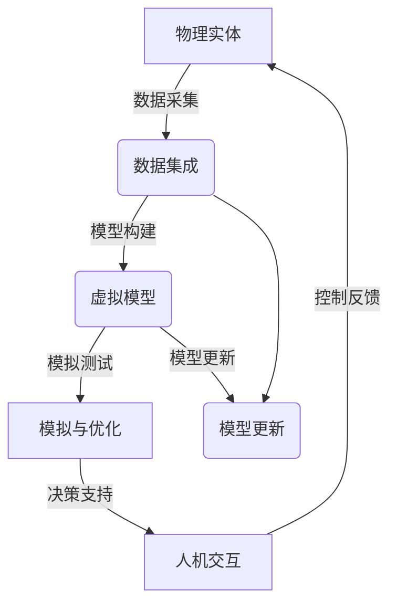

# 数字孪生 (Digital Twin)

## 1. 背景介绍

在当今快速发展的数字时代,数字孪生(Digital Twin)技术正在成为各行各业的热门话题。数字孪生是一种创新技术,它通过虚拟模型与现实世界中的物理实体建立双向连接,实现了物理世界与虚拟世界的无缝集成。

数字孪生的概念最早可以追溯到2002年,当时由迈克尔·格里夫斯(Michael Grieves)在课程演讲中提出。随后,NASA在航天项目中首次将其应用于产品生命周期管理。近年来,随着物联网、大数据、人工智能等技术的快速发展,数字孪生技术得到了广泛关注和应用。

数字孪生技术的核心思想是创建一个与现实世界中的物理实体高度映射的虚拟模型。这个虚拟模型不仅包含了物理实体的几何形状、材料属性等静态数据,还集成了运行时的动态数据,如传感器数据、工作状态等。通过双向数据流,物理实体和虚拟模型可以实时同步,实现了虚实互映。

### 1.1 数字孪生的特点

- **虚实映射**: 数字孪生将现实世界中的物理实体与虚拟模型紧密映射,实现了虚实的无缝集成。
- **实时同步**: 通过物联网和传感器技术,物理实体和虚拟模型可以实时同步数据,保持动态一致性。
- **全生命周期管理**: 数字孪生贯穿了产品或系统的整个生命周期,从设计、制造、运营到维护,提供了端到端的管理和优化。
- **多维度模拟**: 数字孪生可以模拟物理实体在不同条件下的行为,包括几何、物理、功能等多个维度。
- **预测与优化**: 基于历史数据和模拟结果,数字孪生可以预测未来状态,并优化系统性能和决策。

### 1.2 数字孪生的应用价值

数字孪生技术在各个领域都展现出了巨大的应用价值,主要体现在以下几个方面:

- **产品开发**: 通过虚拟模拟和测试,可以缩短产品开发周期,降低成本,提高质量。
- **智能制造**: 数字孪生可以优化生产流程,实现预测性维护,提高设备利用率和生产效率。
- **资产管理**: 对关键资产建立数字孪生模型,可以实现全生命周期管理,延长使用寿命,降低运营成本。
- **城市规划**: 通过数字孪生技术,可以模拟和优化城市基础设施、交通系统等,促进智慧城市建设。
- **医疗健康**: 数字孪生可以用于个性化医疗、虚拟手术训练等,提高医疗水平和效率。

## 2. 核心概念与联系

数字孪生技术涉及多个核心概念,这些概念相互关联,共同构建了数字孪生的理论基础和技术框架。

### 2.1 物理实体 (Physical Entity)

物理实体是指现实世界中的实体对象,如产品、设备、系统等。它是数字孪生技术的出发点和落脚点,是虚拟模型映射和同步的对象。

### 2.2 虚拟模型 (Virtual Model)

虚拟模型是物理实体在虚拟环境中的数字化表示,它包含了物理实体的几何形状、材料属性、行为模式等信息。虚拟模型是数字孪生的核心组成部分,是实现虚实映射和模拟的基础。

### 2.3 数据集成 (Data Integration)

数据集成是将来自物理实体的各种数据(如传感器数据、操作数据等)与虚拟模型进行集成和同步的过程。这是实现数字孪生的关键环节,需要利用物联网、大数据等技术来实现。

### 2.4 模型更新 (Model Updating)

随着物理实体的运行和变化,虚拟模型也需要不断更新和校准,以保持与物理实体的一致性。模型更新通常基于实时数据和历史数据,利用机器学习等技术来实现。

### 2.5 模拟与优化 (Simulation and Optimization)

利用虚拟模型,可以对物理实体进行各种模拟和测试,预测未来状态,优化性能和决策。这是数字孪生技术的核心价值所在,可以显著提高效率和质量。

### 2.6 人机交互 (Human-Machine Interaction)

数字孪生技术需要与人机交互技术相结合,以便用户可以直观地查看和操作虚拟模型,并获取所需的信息和洞察。这对于决策支持和可视化分析至关重要。

### 2.7 核心概念关系

上述核心概念相互关联,共同构建了数字孪生的整体架构。物理实体是数字孪生的起点,虚拟模型是核心;数据集成和模型更新保证了虚实的同步映射;模拟与优化是数字孪生的核心价值;人机交互则提供了与用户的交互接口。

上图展示了数字孪生的核心概念及其关系。物理实体通过数据采集与数据集成模块相连,数据集成模块负责构建虚拟模型。虚拟模型一方面可以进行模拟与优化,为决策提供支持,另一方面也需要根据实时数据不断更新以保持与物理实体的同步。人机交互模块则提供了用户与虚拟模型的交互界面,用户可以查看模拟结果、进行参数调整,并将控制指令反馈到物理实体。

## 3. 核心算法原理具体操作步骤

数字孪生技术的核心算法原理包括几何建模、物理建模、数据驱动建模和模型更新等多个方面,下面将详细介绍这些算法的具体操作步骤。

### 3.1 几何建模

几何建模是构建虚拟模型的基础,它描述了物理实体的形状和结构。常用的几何建模算法包括:

1. **参数建模**: 使用参数方程描述几何形状,如圆柱体、球体等。
2. **曲面建模**: 使用非均匀有理B-样条曲面(NURBS)等技术描述复杂曲面。
3. **多边形网格**: 使用三角形或四边形网格来近似表示复杂几何形状。

具体操作步骤如下:

1. 获取物理实体的几何数据,如CAD模型、3D扫描点云等。
2. 选择合适的建模方法,如参数建模、曲面建模或多边形网格。
3. 使用相应的算法和工具构建几何模型,如NURBS曲面拟合、Delaunay三角网格生成等。
4. 优化几何模型,如简化网格、平滑曲面等,以提高计算效率和可视化质量。
5. 将几何模型与其他模型(如物理模型、行为模型等)集成,构建完整的虚拟模型。

### 3.2 物理建模

物理建模描述了物理实体的物理属性和行为,是虚拟模型的重要组成部分。常用的物理建模算法包括:

1. **有限元分析(FEA)**: 用于模拟结构强度、热传导、流体动力学等物理现象。
2. **多体动力学(MBD)**: 用于模拟机械系统的运动和相互作用。
3. **计算流体动力学(CFD)**: 用于模拟流体流动和热传递等现象。

具体操作步骤如下:

1. 获取物理实体的材料属性、边界条件等参数。
2. 选择合适的物理建模方法,如FEA、MBD或CFD。
3. 将几何模型与物理模型相结合,构建计算网格或离散化模型。
4. 设置求解器参数,如时间步长、收敛条件等。
5. 执行数值计算,求解控制方程。
6. 后处理和可视化计算结果,如应力分布、位移场、流场等。
7. 与实际物理测试数据进行校准和验证。

### 3.3 数据驱动建模

数据驱动建模利用来自物理实体的实时数据和历史数据,通过机器学习等技术构建虚拟模型。常用的数据驱动建模算法包括:

1. **监督学习**: 使用标记数据训练回归或分类模型,如神经网络、支持向量机等。
2. **非监督学习**: 从未标记数据中发现潜在模式,如聚类、降维等。
3. **强化学习**: 通过与环境交互,学习最优策略。

具体操作步骤如下:

1. 收集和预处理物理实体的数据,包括传感器数据、操作数据等。
2. 选择合适的机器学习算法,如监督学习、非监督学习或强化学习。
3. 划分数据集,包括训练集、验证集和测试集。
4. 训练模型,优化模型参数。
5. 在测试集上评估模型性能,如准确率、均方根误差等。
6. 将训练好的模型部署到虚拟模型中,用于预测和决策。
7. 持续收集新数据,更新和优化模型。

### 3.4 模型更新

由于物理实体的状态会随时间变化,因此需要不断更新虚拟模型,以保持与物理实体的同步。常用的模型更新算法包括:

1. **卡尔曼滤波**: 用于估计动态系统的状态,融合测量数据和预测值。
2. **参数识别**: 使用优化算法识别模型参数,最小化模型与实际数据的差异。
3. **模型校正**: 根据实际测量数据,修正模型的某些部分或参数。

具体操作步骤如下:

1. 获取物理实体的实时数据,如传感器测量值。
2. 使用虚拟模型预测相应的输出值。
3. 比较预测值与实际测量值的差异。
4. 选择合适的模型更新算法,如卡尔曼滤波、参数识别或模型校正。
5. 根据差异和算法,更新虚拟模型的状态或参数。
6. 重复上述步骤,持续更新虚拟模型。

通过上述核心算法,可以构建出与物理实体高度映射的虚拟模型,并实现实时同步和模型更新,从而充分发挥数字孪生技术的优势。

## 4. 数学模型和公式详细讲解举例说明

数字孪生技术中涉及了多种数学模型和公式,下面将详细讲解其中的几个重要模型和公式。

### 4.1 有限元分析

有限元分析(FEA)是物理建模中常用的数值计算方法,它将连续的物理域离散化为有限个单元,在每个单元上建立控制方程,然后求解这些方程以获得物理场的近似解。

对于结构力学问题,控制方程通常是基于虚功原理导出的,可以表示为:

$$
\int_V \boldsymbol{\epsilon}^T \boldsymbol{D} \boldsymbol{\epsilon} dV - \int_V \boldsymbol{u}^T \boldsymbol{b} dV - \int_S \boldsymbol{u}^T \boldsymbol{t} dS = 0
$$

其中:
- $\boldsymbol{\epsilon}$ 是应变张量
- $\boldsymbol{D}$ 是材料的弹性矩阵
- $\boldsymbol{u}$ 是位移场
- $\boldsymbol{b}$ 是体力
- $\boldsymbol{t}$ 是表面力

通过有限元离散化和数值求解,可以获得结构的应力、应变和位移等物理场的近似解。

### 4.2 多体动力学

多体动力学(MBD)用于描述机械系统中多个刚体或柔体之间的运动和相互作用。常用的数学模型是拉格朗日方程:

$$
\frac{d}{dt}\left(\frac{\partial L}{\partial \dot{q}_i}\right) - \frac{\partial L}{\partial q_i} =