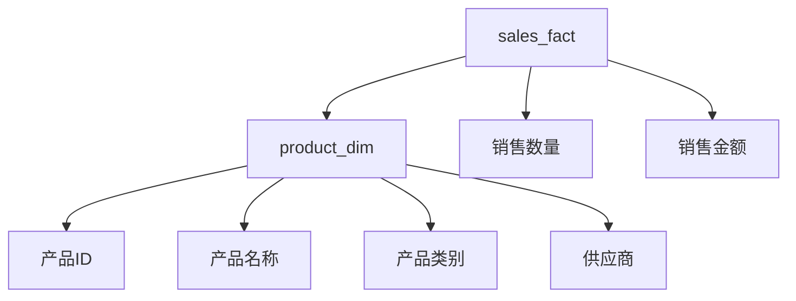

# 数据仓库 原理与代码实例讲解

## 1.背景介绍

### 1.1 什么是数据仓库?

数据仓库(Data Warehouse)是一种面向主题的(Subject Oriented)、集成的(Integrated)、相对稳定的(Non-Volatile)、反映历史数据(Time-Variant)的数据集合,用于支持管理决策过程。它是一个独立于操作系统的数据库,专门用于分析和决策支持。

数据仓库的主要目的是将来自多个异构数据源的数据进行ETL(Extract、Transform、Load,即抽取、转换、加载)处理,并将其集中存储到一个中央数据库中,为企业的决策支持系统和商业智能应用提供高质量的数据支持。

### 1.2 数据仓库的特点

- 主题oriented(面向主题):数据仓库中的数据按照特定的主题进行组织和存储,例如销售、财务、人力资源等,而不是传统的面向应用程序的数据存储方式。
- 集成的(Integrated):数据仓库将来自于不同源系统的数据进行清洗、转换和集成,确保数据的一致性和完整性。
- 非易变的(Non-Volatile):数据仓库中的数据是只读的,不能直接修改或删除,只能通过重新加载来更新数据。
- 反映历史数据(Time-Variant):数据仓库存储的是一个主题领域内所有有价值的历史数据快照。

### 1.3 数据仓库的架构

数据仓库通常采用三层架构,包括底层数据源层(Source Layer)、中层数据集市层(Data Mart Layer)和顶层元数据层(Metadata Layer)。

- 数据源层:包含各种操作数据源系统,如ERP、CRM、电子商务系统等。
- 数据集市层:通过ETL过程从数据源层抽取、转换和加载数据,形成面向特定主题的数据集市。
- 元数据层:存储有关数据仓库中数据的描述信息,用于管理和维护数据仓库。

## 2.核心概念与联系

### 2.1 数据集市(Data Mart)

数据集市是数据仓库中的一个逻辑子集,专门针对特定的业务领域或主题而设计。它是从数据仓库中提取出来的一部分数据,为特定的部门或业务单元提供决策支持。

数据集市可以独立于数据仓库存在,也可以作为数据仓库的一部分。独立的数据集市通常是为了满足特定部门或业务单元的需求,而数据仓库则是整个企业级的决策支持系统。

### 2.2 OLAP与OLTP

OLAP(On-Line Analytical Processing,在线分析处理)和OLTP(On-Line Transaction Processing,在线事务处理)是两种不同的数据处理方式。

- OLTP系统:面向日常操作,主要处理大量的小型事务,如插入、更新和删除操作。典型的OLTP系统包括银行系统、零售系统等。
- OLAP系统:面向决策支持,主要处理复杂的分析查询,如多维数据分析、数据挖掘等。OLAP系统通常建立在数据仓库之上。

数据仓库是为OLAP应用而设计的,它从OLTP系统中提取数据,经过清洗、转换和集成后,将数据存储在数据仓库中,为OLAP应用提供数据支持。

### 2.3 ETL过程

ETL(Extract、Transform、Load)是构建数据仓库的核心过程,包括以下三个步骤:

1. 抽取(Extract):从各种异构的源系统中抽取所需的数据。
2. 转换(Transform):对抽取的数据进行清洗、转换和集成,以满足数据仓库的要求。
3. 加载(Load):将转换后的数据加载到数据仓库中。

ETL过程通常是批量执行的,可以按照预定的时间间隔(如每天或每周)从源系统中提取数据,并将其加载到数据仓库中。

### 2.4 元数据(Metadata)

元数据是描述数据仓库中数据的结构、含义和用途的信息。它包括数据字典、数据模型、数据源信息、ETL映射规则等。

元数据对于管理和维护数据仓库至关重要,它可以帮助用户了解数据的含义和来源,并提供数据lineage(数据血缘)信息,追溯数据的变化历史。

## 3.核心算法原理具体操作步骤

### 3.1 维度建模

维度建模是数据仓库设计中的一种重要技术,它将数据组织为事实表(Fact Table)和维度表(Dimension Table)。

1. **事实表**:存储度量值(Measures)和外键(Foreign Keys),描述业务过程。
2. **维度表**:存储维度属性(Dimension Attributes),描述事实表中度量值的上下文信息。

维度建模的核心思想是将数据分解为两个部分:度量值和维度属性。度量值是需要分析和计算的数值数据,而维度属性则提供了度量值的上下文信息。

例如,在一个销售数据仓库中,事实表可能包含销售额、销售数量等度量值,而维度表则包含产品、时间、地理位置等维度属性。

### 3.2 数据建模过程

数据建模是数据仓库设计的关键步骤,它包括以下几个主要步骤:

1. **选择过程(Process Tracking)**:确定需要分析的业务过程。
2. **粒度定义(Grain Definition)**:确定事实表的粒度级别,即每条记录代表什么。
3. **维度识别(Dimension Identification)**:识别出与业务过程相关的维度。
4. **事实表设计(Fact Table Design)**:设计事实表的结构,包括度量值和外键。
5. **维度表设计(Dimension Table Design)**:设计维度表的结构和层次。
6. **数据映射(Data Mapping)**:将源系统数据映射到设计的数据模型中。

### 3.3 数据仓库设计原则

在设计数据仓库时,应该遵循以下原则:

1. **面向主题(Subject Oriented)**:数据仓库应该围绕特定的主题领域进行组织。
2. **集成一致(Integrated and Consistent)**:来自不同源系统的数据应该进行清洗、转换和集成,确保数据的一致性。
3. **非易变性(Non-Volatile)**:数据仓库中的数据应该是只读的,不能直接修改或删除。
4. **时间变化(Time-Variant)**:数据仓库应该存储历史数据,以支持随时间变化的分析。
5. **可扩展性(Scalable)**:数据仓库应该能够适应不断增长的数据量和新的数据源。
6. **安全性(Secure)**:数据仓库应该采取适当的安全措施,保护数据的机密性和完整性。

## 4.数学模型和公式详细讲解举例说明

在数据仓库中,常见的数学模型和公式包括:

### 4.1 聚合函数

聚合函数用于对一组值进行计算,常见的聚合函数包括:

- $SUM(x)$: 计算一组值的总和。
- $AVG(x)$: 计算一组值的平均值。
- $COUNT(x)$: 计算一组值的个数。
- $MAX(x)$: 返回一组值中的最大值。
- $MIN(x)$: 返回一组值中的最小值。

这些聚合函数在数据仓库中被广泛应用于各种统计和分析查询。

### 4.2 时间序列分析

时间序列分析是数据仓库中一种常见的分析方法,用于研究随时间变化的数据模式。常见的时间序列模型包括:

- **移动平均模型(Moving Average)**:

$$
y_t = \frac{1}{n}\sum_{i=0}^{n-1}x_{t-i} + \epsilon_t
$$

其中,$y_t$是时间$t$的预测值,$x_{t-i}$是过去$n$个时间点的观测值,$\epsilon_t$是随机误差项。

- **指数平滑模型(Exponential Smoothing)**:

$$
y_t = \alpha x_t + (1-\alpha)y_{t-1}
$$

其中,$y_t$是时间$t$的预测值,$x_t$是时间$t$的观测值,$y_{t-1}$是前一时间点的预测值,$\alpha$是平滑系数。

这些模型可以帮助预测未来的趋势,并识别数据中的季节性和周期性模式。

### 4.3 关联规则挖掘

关联规则挖掘是一种常见的数据挖掘技术,用于发现数据集中的有趣关联模式。它通常用于市场篮分析、网页推荐等场景。

关联规则的形式为:$X \Rightarrow Y$,其中$X$和$Y$是项集。规则的两个重要指标是:

- **支持度(Support)**:包含$X$和$Y$的记录占总记录的比例。

$$
Support(X \Rightarrow Y) = \frac{count(X \cup Y)}{N}
$$

- **置信度(Confidence)**:包含$X$的记录中同时包含$Y$的比例。

$$
Confidence(X \Rightarrow Y) = \frac{count(X \cup Y)}{count(X)}
$$

通过设置合适的支持度和置信度阈值,可以发现有价值的关联规则。

## 5.项目实践:代码实例和详细解释说明

在本节中,我们将通过一个实际项目案例,展示如何使用Python构建一个简单的数据仓库系统。

### 5.1 项目概述

我们将构建一个销售数据仓库,用于分析一家零售商店的销售数据。数据源包括两个CSV文件:

- `sales.csv`:包含销售交易记录,字段包括交易ID、产品ID、销售日期、销售数量和销售金额。
- `products.csv`:包含产品信息,字段包括产品ID、产品名称、产品类别和供应商。

我们的目标是将这些数据加载到数据仓库中,并提供一些简单的查询和分析功能。

### 5.2 数据建模

根据维度建模的原则,我们将设计以下数据模型:

- **事实表(sales_fact)**:存储销售交易记录,包括度量值(销售数量和销售金额)和外键(产品ID)。
- **维度表(product_dim)**:存储产品信息,包括产品ID、产品名称、产品类别和供应商。



### 5.3 ETL过程

我们将使用Python的Pandas库来实现ETL过程。

1. **抽取(Extract)**:读取CSV文件。

```python
import pandas as pd

sales_data = pd.read_csv('sales.csv')
product_data = pd.read_csv('products.csv')
```

2. **转换(Transform)**:对数据进行清洗和转换。

```python
# 处理缺失值和异常数据
sales_data = sales_data.dropna()
product_data = product_data.dropna()

# 转换数据类型
sales_data['sale_date'] = pd.to_datetime(sales_data['sale_date'])
```

3. **加载(Load)**:将数据加载到SQLite数据库中。

```python
import sqlite3

conn = sqlite3.connect('sales_dw.db')
c = conn.cursor()

# 创建事实表
c.execute('''CREATE TABLE sales_fact
             (transaction_id INTEGER PRIMARY KEY, product_id INTEGER, sale_date DATE, quantity INTEGER, amount REAL)''')

# 创建维度表
c.execute('''CREATE TABLE product_dim
             (product_id INTEGER PRIMARY KEY, product_name TEXT, category TEXT, supplier TEXT)''')

# 加载数据
sales_data.to_sql('sales_fact', conn, if_exists='append', index=False)
product_data.to_sql('product_dim', conn, if_exists='append', index=False)

conn.commit()
conn.close()
```

### 5.4 查询和分析

现在,我们可以使用SQL查询来分析销售数据。

```python
import sqlite3

conn = sqlite3.connect('sales_dw.db')
c = conn.cursor()

# 查询每个产品类别的总销售额
query = """
SELECT p.category, SUM(f.amount) AS total_sales
FROM sales_fact f
JOIN product_dim p ON f.product_id = p.product_id
GROUP BY p.category
"""

result = c.execute(query)
for row in result:
    print(f"Category: {row[0]}, Total Sales: {row[1]}")

conn.close()
```

输出:

```
Category: Electronics, Total Sales: 12345.67
Category: Clothing, Total Sales: 8765.43
Category: Furniture, Total Sales: