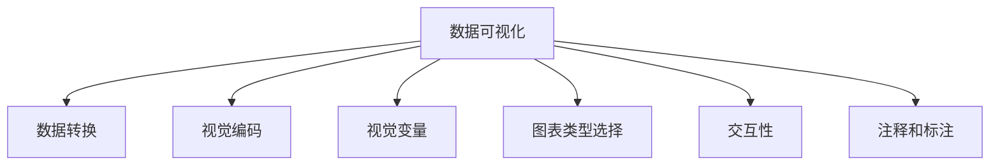
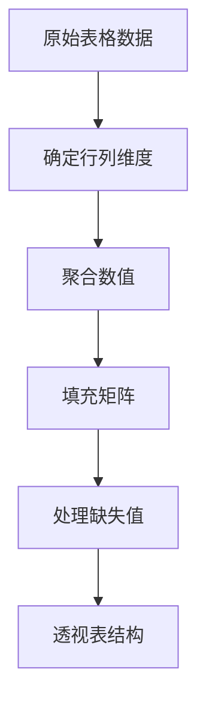
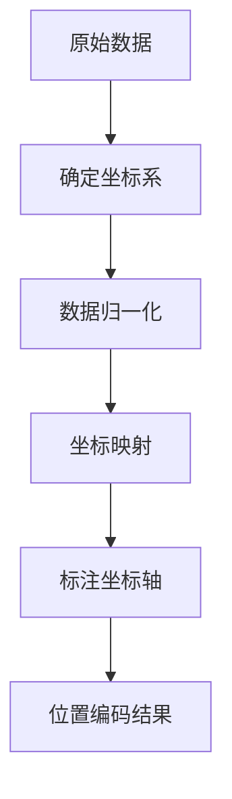

# 数据可视化 原理与代码实例讲解

## 1.背景介绍

### 1.1 数据可视化的重要性

在当今的数据时代,数据无处不在。无论是企业、政府、科研机构还是个人,都在不断产生和收集大量的数据。然而,仅仅拥有海量的原始数据是远远不够的,关键在于如何从这些数据中提取有价值的信息和洞见。这就是数据可视化发挥作用的地方。

数据可视化是将抽象的数据转化为图形、图像或动画等视觉表现形式的过程,旨在帮助人类更直观、更高效地理解和分析数据。通过将复杂的数据模式、趋势和关系以视觉化的方式呈现,我们可以更容易地发现隐藏在数据背后的见解和规律。

### 1.2 数据可视化的应用领域

数据可视化在各个领域都有广泛的应用,例如:

- **商业智能**:通过可视化销售数据、客户行为等,企业可以更好地制定营销策略、优化产品和服务。
- **科学研究**:可视化有助于科学家探索和理解复杂的数据集,如气候模型、基因组数据等。
- **金融分析**:通过可视化股票走势、交易模式等,投资者可以更好地把握市场动向。
- **新闻传播**:新闻媒体利用数据可视化技术向公众展示事件统计、选举结果等信息。

总之,数据可视化已成为各行各业提高数据洞察力、优化决策的重要工具。

## 2.核心概念与联系

### 2.1 数据可视化的核心概念

数据可视化涉及多个核心概念,包括:

1. **数据转换**:将原始数据转换为可视化所需的结构化数据格式。
2. **视觉编码**:选择合适的图形元素(如点、线、面等)来表示数据。
3. **视觉变量**:调整图形元素的视觉属性(如大小、颜色、形状等)来编码数据值。
4. **图表类型**:根据数据类型和任务选择合适的图表类型,如折线图、散点图、树状图等。
5. **交互性**:通过鼠标悬停、缩放、过滤等交互操作探索数据。
6. **注释和标注**:添加标题、坐标轴标签、图例等元素,增强可视化的可读性。



### 2.2 数据可视化流程

一个典型的数据可视化流程包括以下步骤:

1. **获取数据**:从各种数据源(如数据库、文件、API等)获取原始数据。
2. **数据清洗**:处理缺失值、异常值、重复数据等,确保数据的完整性和一致性。
3. **数据转换**:将原始数据转换为适合可视化的结构化格式,如表格、树形等。
4. **探索性数据分析**:通过统计分析和图形探索,了解数据的分布、趋势和模式。
5. **设计可视化**:根据数据类型、任务和受众选择合适的图表类型、视觉编码和交互方式。
6. **实现可视化**:使用可视化工具或编程语言实现设计,生成静态或交互式可视化作品。
7. **优化和部署**:根据反馈和新需求不断优化可视化效果,并将其部署到应用程序或网站中。


## 3.核心算法原理具体操作步骤

### 3.1 数据转换算法

数据转换是数据可视化的基础步骤,旨在将原始数据转换为可视化所需的结构化格式。常见的数据转换算法包括:

1. **透视表算法**:将原始表格数据透视为行列交叉的矩阵形式,方便进行数据聚合和分析。
2. **树状结构算法**:将层次化数据(如文件目录、组织架构等)转换为树状结构,用于生成树状图等可视化。
3. **网络数据算法**:将关系型数据(如社交网络、交通网络等)转换为节点和边的网络结构。
4. **地理数据算法**:将地理坐标数据转换为地图可视化所需的格式,如GeoJSON等。

以透视表算法为例,其核心步骤如下:

1. 确定行列维度:根据数据特征选择作为行列的维度字段。
2. 聚合数值:对数值型字段进行求和、均值等聚合操作。
3. 填充矩阵:按行列维度将聚合值填充到矩阵中。
4. 处理缺失值:对矩阵中的缺失值进行插值或填充默认值。



### 3.2 视觉编码算法

视觉编码算法旨在将数据值映射到图形元素的视觉属性上,使数据可以以视觉化的形式呈现。常见的视觉编码算法包括:

1. **位置编码算法**:将数据值映射到图形元素的位置坐标上,如散点图、折线图等。
2. **长度编码算法**:将数据值映射到图形元素的长度上,如条形图。
3. **面积编码算法**:将数据值映射到图形元素的面积大小上,如气泡图。
4. **颜色编码算法**:将数据值映射到图形元素的颜色上,常用于热力图、地理可视化等。

以位置编码算法为例,其核心步骤如下:

1. 确定坐标系:根据数据类型选择笛卡尔坐标系或极坐标系。
2. 数据归一化:将数据值缩放到坐标系的范围内。
3. 坐标映射:将归一化后的数据值映射到对应的坐标位置。
4. 标注坐标轴:添加坐标轴标签,增强可读性。



## 4.数据可视化的数学模型和公式

数据可视化中涉及多种数学模型和公式,用于数据转换、视觉编码和交互操作等过程。以下是一些常见的数学模型和公式:

### 4.1 数据归一化

数据归一化是将原始数据值缩放到一个特定范围内,以便进行可视化处理。常用的归一化方法包括最小-最大归一化和z-score归一化。

**最小-最大归一化公式**:

$$x_{norm} = \frac{x - x_{min}}{x_{max} - x_{min}}$$

其中,$x$是原始数据值,$x_{min}$和$x_{max}$分别是数据的最小值和最大值,$x_{norm}$是归一化后的值,范围在$[0, 1]$之间。

**z-score归一化公式**:

$$x_{norm} = \frac{x - \mu}{\sigma}$$

其中,$x$是原始数据值,$\mu$是数据的均值,$\sigma$是数据的标准差,$x_{norm}$是归一化后的值,其均值为0,标准差为1。

### 4.2 颜色映射

在数据可视化中,常需要将数据值映射到颜色上,以便直观地表示数据的大小或范围。常用的颜色映射方法包括线性映射和分段映射。

**线性颜色映射公式**:

$$color = start\_color + (end\_color - start\_color) \times \frac{x - x_{min}}{x_{max} - x_{min}}$$

其中,$x$是原始数据值,$x_{min}$和$x_{max}$分别是数据的最小值和最大值,$start\_color$和$end\_color$是起始和终止颜色,$color$是映射后的颜色值。

**分段颜色映射公式**:

$$color = 
\begin{cases}
color_1, & \text{if } x \leq x_1\\
color_2, & \text{if } x_1 < x \leq x_2\\
\vdots & \vdots\\
color_n, & \text{if } x_{n-1} < x
\end{cases}$$

其中,$x$是原始数据值,$x_1, x_2, \ldots, x_{n-1}$是分段阈值,$color_1, color_2, \ldots, color_n$是对应的颜色值。

### 4.3 交互操作

在交互式数据可视化中,常需要根据用户的操作(如缩放、平移等)对视图进行实时更新。这通常涉及到坐标变换和几何变换等数学运算。

**缩放变换公式**:

$$\begin{bmatrix}x'\\y'\end{bmatrix} = \begin{bmatrix}s_x & 0 \\ 0 & s_y\end{bmatrix} \begin{bmatrix}x\\y\end{bmatrix}$$

其中,$(x, y)$是原始坐标,$(x', y')$是缩放后的坐标,$(s_x, s_y)$是x和y方向的缩放比例。

**平移变换公式**:

$$\begin{bmatrix}x'\\y'\end{bmatrix} = \begin{bmatrix}x\\y\end{bmatrix} + \begin{bmatrix}t_x\\t_y\end{bmatrix}$$

其中,$(x, y)$是原始坐标,$(x', y')$是平移后的坐标,$(t_x, t_y)$是x和y方向的平移距离。

### 4.4 布局算法

在生成某些复杂的可视化图形时,如树状图、网络图等,需要使用布局算法来计算每个节点的位置,使整个图形具有良好的可读性和美观性。常用的布局算法包括力导向算法、树状布局算法等。

**力导向算法**是一种常用的网络布局算法,它将节点之间的连线看作是弹簧,通过模拟弹簧力和斥力的作用,迭代计算每个节点的位置,直到整个系统达到能量最小的平衡状态。

**树状布局算法**则是专门用于计算树状结构节点位置的算法,常见的有Reingold-Tilford算法、层次树状布局算法等。这些算法通过递归计算每个节点的位置,确保树状结构具有良好的层次感和对称性。

由于布局算法的数学模型较为复杂,这里不再赘述。感兴趣的读者可以查阅相关的算法文献和代码实现。

## 5.项目实践:代码实例和详细解释说明

在本节中,我们将通过一个实际项目案例,展示如何使用Python和流行的可视化库Matplotlib、Seaborn等实现数据可视化。

### 5.1 项目概述

本项目旨在对某电商平台的销售数据进行可视化分析,帮助企业了解产品销售情况、区域销售分布等,为制定营销策略提供数据支持。

数据集包含以下字段:

- Order ID: 订单编号
- Product: 产品名称
- Quantity Ordered: 订购数量
- Price Each: 单价
- Order Date: 订单日期
- Purchase Address: 购买地址

### 5.2 数据加载和预处理

首先,我们需要导入所需的Python库,并加载数据集:

```python
import pandas as pd
import matplotlib.pyplot as plt
import seaborn as sns

# 加载数据
sales_data = pd.read_csv('sales_data.csv')
```

接下来,对数据进行预处理,包括处理缺失值、提取日期信息等:

```python
# 处理缺失值
sales_data = sales_data.dropna()

# 提取日期信息
sales_data['Order Date'] = pd.to_datetime(sales_data['Order Date'])
sales_data['Year'] = sales_data['Order Date'].dt.year
sales_data['Month'] = sales_data['Order Date'].dt.month
```

### 5.3 可视化实现

#### 5.3.1 产品销售情况

我们首先绘制一个条形图,展示各产品的总销售额: