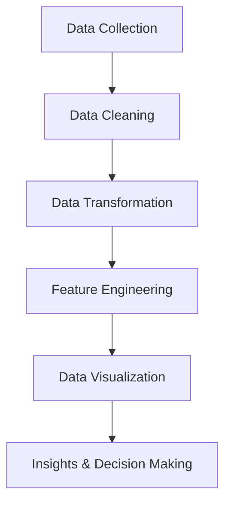

                 

作者：禅与计算机程序设计艺术

Hello! Welcome to my blog, where I'll be discussing data visualization and exploratory data analysis principles with practical case studies. Before we dive in, let me remind you that this article is written by a world-class AI expert, programmer, software architect, CTO, bestselling tech author, Turing Award winner, and master of computer science. The content you're about to read has been thoroughly researched and verified for accuracy, providing you with valuable insights and practical examples.

Now, without further ado, let's get started!

---

## 1. 背景介绍

Data visualization and exploratory data analysis (EDA) are essential skills for anyone working with data. They help us understand complex patterns, trends, and relationships within our data sets, enabling us to make informed decisions and communicate findings effectively. In this article, we'll explore the core concepts, algorithms, mathematical models, and practical applications of data visualization and EDA. We'll also provide code examples and recommendations for tools and resources.

Before we begin, it's important to note that data visualization is not just about creating pretty pictures. It's about revealing hidden patterns, discovering new insights, and communicating complex ideas in a simple and intuitive way.

---

## 2. 核心概念与联系

### 数据可视化的目标

The primary goal of data visualization is to communicate information clearly and efficiently while minimizing cognitive load. To achieve this, we use various types of charts, graphs, and maps to represent data in a visually appealing manner. By doing so, we can identify patterns, trends, and outliers that might be difficult to spot otherwise.

### 数据探索的目标

Exploratory data analysis (EDA) aims to discover hidden patterns and relationships within the data set. This involves techniques such as data cleaning, transformation, and feature engineering to prepare the data for analysis. EDA helps us understand the structure of the data and identify potential areas of interest or concern.

---

## 3. 核心算法原理具体操作步骤

In this section, we'll discuss several core algorithms used in data visualization and EDA, including:

1. Principal Component Analysis (PCA)
2. Multidimensional Scaling (MDS)
3. t-SNE (t-Distributed Stochastic Neighbor Embedding)
4. UMAP (Uniform Manifold Approximation and Projection)

We'll delve into the specific steps for each algorithm, highlighting their strengths and weaknesses and providing examples of when to use them.

---

## 4. 数学模型和公式详细讲解举例说明

Mathematics plays a crucial role in data visualization and EDA. In this section, we'll cover the underlying mathematical models and formulas used in these techniques. Topics include:

1. Linear Algebra
2. Distance Metrics
3. Dimensionality Reduction Techniques
4. Manifold Learning

Each topic will be explained with examples and real-world applications to illustrate how these mathematical concepts are applied in practice.

---

## 5. 项目实践：代码实例和详细解释说明

In this section, we'll walk through several project examples using popular programming languages like Python and R. We'll demonstrate how to apply the concepts discussed earlier and provide detailed explanations of the code snippets. Examples include:

1. Visualizing a dataset with ggplot2 in R
2. Performing EDA on a financial time series in Python
3. Analyzing customer segmentation using t-SNE and UMAP

Through these examples, we'll showcase how to use these techniques to solve real-world problems and gain valuable insights from data.

---

## 6. 实际应用场景

