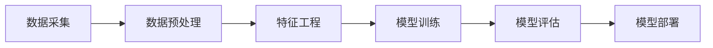

# 数据挖掘 原理与代码实例讲解

## 1. 背景介绍

数据挖掘是从大量的数据中发现隐藏的、先前未知的、潜在有用的信息和知识的过程。随着大数据时代的到来,数据挖掘技术在各个领域得到了广泛的应用,如商业智能、生物信息学、社交网络分析等。本文将深入探讨数据挖掘的核心概念、算法原理、数学模型,并结合Python代码实例进行详细讲解。

### 1.1 数据挖掘的发展历程
#### 1.1.1 数据挖掘的起源
#### 1.1.2 数据挖掘技术的演进
#### 1.1.3 数据挖掘的现状与挑战

### 1.2 数据挖掘的应用领域
#### 1.2.1 商业智能
#### 1.2.2 生物信息学
#### 1.2.3 社交网络分析
#### 1.2.4 其他应用领域

## 2. 核心概念与联系

数据挖掘涉及多个核心概念,包括数据预处理、特征工程、模型训练与评估等。这些概念之间存在着紧密的联系,共同构成了数据挖掘的完整流程。

### 2.1 数据预处理
#### 2.1.1 数据清洗
#### 2.1.2 数据集成
#### 2.1.3 数据变换
#### 2.1.4 数据规约

### 2.2 特征工程  
#### 2.2.1 特征选择
#### 2.2.2 特征提取
#### 2.2.3 特征构建

### 2.3 模型训练与评估
#### 2.3.1 监督学习
#### 2.3.2 无监督学习
#### 2.3.3 半监督学习
#### 2.3.4 强化学习
#### 2.3.5 模型评估指标

### 2.4 数据挖掘流程图



## 3. 核心算法原理具体操作步骤

数据挖掘涉及多种算法,如决策树、支持向量机、神经网络等。本节将重点介绍几种常用算法的原理和具体操作步骤。

### 3.1 决策树
#### 3.1.1 ID3算法
#### 3.1.2 C4.5算法
#### 3.1.3 CART算法

### 3.2 支持向量机
#### 3.2.1 线性支持向量机
#### 3.2.2 非线性支持向量机
#### 3.2.3 多分类支持向量机

### 3.3 神经网络 
#### 3.3.1 前馈神经网络
#### 3.3.2 卷积神经网络
#### 3.3.3 循环神经网络

### 3.4 聚类算法
#### 3.4.1 K-means算法
#### 3.4.2 层次聚类算法
#### 3.4.3 DBSCAN算法

## 4. 数学模型和公式详细讲解举例说明

数据挖掘算法的背后都有严谨的数学模型和公式支撑。本节将通过具体的例子,详细讲解几种常见模型的数学原理。

### 4.1 线性回归模型
假设有一组数据点 $(x_i,y_i), i=1,2,...,n$,线性回归模型可表示为:

$$y_i = w^Tx_i+b+\epsilon_i$$

其中,$w$为权重向量,$b$为偏置项,$\epsilon_i$为随机误差。目标是找到最优的$w$和$b$,使得预测值与真实值之间的误差最小化。常用的优化方法有最小二乘法和梯度下降法。

### 4.2 逻辑回归模型
逻辑回归是一种常用的二分类模型,其数学表达式为:

$$P(y=1|x) = \frac{1}{1+e^{-(w^Tx+b)}}$$

其中,$P(y=1|x)$表示在给定特征$x$的条件下,样本属于正类的概率。逻辑回归的目标是找到最优的$w$和$b$,使得正负样本的对数似然函数最大化。

### 4.3 支持向量机模型
支持向量机(SVM)的目标是在特征空间中找到一个超平面,使得不同类别的样本能够被最大间隔地分开。对于线性可分的情况,SVM的数学模型可表示为:

$$\min \frac{1}{2}||w||^2 \quad s.t. \quad y_i(w^Tx_i+b) \geq 1, i=1,2,...,n$$

其中,$y_i \in {-1,+1}$表示样本的类别标签。通过求解该优化问题,可得到最优的分类超平面。对于线性不可分的情况,可引入松弛变量和核函数,将样本映射到高维空间中进行分类。

## 5. 项目实践：代码实例和详细解释说明

本节将通过Python代码实例,演示如何利用Scikit-learn库实现几种常见的数据挖掘算法。

### 5.1 决策树分类器

```python
from sklearn.datasets import load_iris
from sklearn.tree import DecisionTreeClassifier
from sklearn.model_selection import train_test_split
from sklearn.metrics import accuracy_score

# 加载鸢尾花数据集
iris = load_iris()
X = iris.data
y = iris.target

# 划分训练集和测试集
X_train, X_test, y_train, y_test = train_test_split(X, y, test_size=0.2, random_state=42)

# 创建决策树分类器
clf = DecisionTreeClassifier()

# 训练模型
clf.fit(X_train, y_train)

# 在测试集上进行预测
y_pred = clf.predict(X_test)

# 计算分类准确率
accuracy = accuracy_score(y_test, y_pred)
print("Accuracy: {:.2f}".format(accuracy))
```

上述代码首先加载了鸢尾花数据集,然后将其划分为训练集和测试集。接着创建了一个决策树分类器,并在训练集上进行训练。最后,在测试集上进行预测,并计算分类准确率。

### 5.2 支持向量机分类器

```python
from sklearn.datasets import load_breast_cancer
from sklearn.svm import SVC
from sklearn.model_selection import train_test_split
from sklearn.metrics import accuracy_score

# 加载乳腺癌数据集
breast_cancer = load_breast_cancer()
X = breast_cancer.data
y = breast_cancer.target

# 划分训练集和测试集 
X_train, X_test, y_train, y_test = train_test_split(X, y, test_size=0.2, random_state=42)

# 创建支持向量机分类器
clf = SVC(kernel='linear')

# 训练模型
clf.fit(X_train, y_train)

# 在测试集上进行预测
y_pred = clf.predict(X_test)

# 计算分类准确率
accuracy = accuracy_score(y_test, y_pred)
print("Accuracy: {:.2f}".format(accuracy))
```

上述代码使用了乳腺癌数据集,并创建了一个线性核的支持向量机分类器。其余步骤与决策树分类器类似。

### 5.3 K-means聚类

```python
from sklearn.datasets import make_blobs
from sklearn.cluster import KMeans
import matplotlib.pyplot as plt

# 生成聚类数据
X, y = make_blobs(n_samples=1000, centers=4, random_state=42)

# 创建K-means聚类器
kmeans = KMeans(n_clusters=4)

# 训练模型
kmeans.fit(X)

# 获取聚类结果
labels = kmeans.labels_
centroids = kmeans.cluster_centers_

# 可视化聚类结果
plt.scatter(X[:,0], X[:,1], c=labels)
plt.scatter(centroids[:,0], centroids[:,1], marker='x', s=200, linewidths=3, color='r')
plt.xlabel('Feature 1')
plt.ylabel('Feature 2') 
plt.title('K-means Clustering')
plt.show()
```

上述代码首先生成了一个包含4个聚类的数据集,然后创建了一个K-means聚类器。通过训练模型,可以得到每个样本的聚类标签以及聚类中心。最后,使用Matplotlib库对聚类结果进行可视化。

## 6. 实际应用场景

数据挖掘技术在各个领域都有广泛的应用,下面列举几个典型的应用场景。

### 6.1 客户细分
在商业领域,数据挖掘可用于客户细分。通过分析客户的购买行为、人口统计学特征等,可以将客户划分为不同的群体,从而实施针对性的营销策略。

### 6.2 异常检测
数据挖掘技术可用于检测异常行为,如欺诈检测、入侵检测等。通过建立正常行为的模型,可以识别出异常的数据点或事件。  

### 6.3 推荐系统
推荐系统是数据挖掘的一个重要应用。通过分析用户的历史行为数据,可以预测用户的兴趣偏好,从而提供个性化的推荐服务。

### 6.4 医疗诊断
数据挖掘技术在医疗领域也有广泛应用,如辅助诊断、药物研发等。通过分析医疗影像、基因数据等,可以发现疾病的潜在模式,提高诊断的准确性。

## 7. 工具和资源推荐

以下是一些常用的数据挖掘工具和学习资源:

- Scikit-learn:基于Python的机器学习库,提供了丰富的数据挖掘算法实现。
- Weka:一个开源的数据挖掘软件,提供了图形化的用户界面。
- RapidMiner:一个数据科学平台,支持数据预处理、建模、评估等完整的数据挖掘流程。
- 《数据挖掘:概念与技术》:经典的数据挖掘教材,系统介绍了数据挖掘的基本概念和常用技术。
- Coursera上的数据挖掘课程:由著名大学和企业提供的在线课程,涵盖数据挖掘的各个主题。

## 8. 总结：未来发展趋势与挑战

数据挖掘技术正在快速发展,不断有新的算法和模型被提出。未来,数据挖掘将向以下几个方向发展:

- 大数据挖掘:如何从海量、高维、异构的大数据中挖掘有价值的信息,是未来的一大挑战。
- 实时数据挖掘:随着数据实时生成和更新,需要开发能够实时处理和分析数据的挖掘算法。
- 隐私保护数据挖掘:在挖掘数据的同时,如何保护个人隐私也是一个重要的研究课题。
- 可解释的数据挖掘:传统的数据挖掘模型往往是"黑盒"模型,需要开发可解释性强的模型,以增强用户对挖掘结果的信任。

总之,数据挖掘是一个充满机遇和挑战的研究领域,需要研究者不断探索新的理论和方法,以应对日益复杂的数据分析需求。

## 9. 附录：常见问题与解答

### 9.1 数据挖掘与机器学习有何区别?
数据挖掘是从数据中发现模式和知识的过程,机器学习则是数据挖掘的一种具体技术,旨在让计算机系统从数据中学习。可以说,机器学习是实现数据挖掘的一种手段。

### 9.2 数据挖掘的基本步骤有哪些?
数据挖掘的基本步骤包括:数据采集、数据预处理、特征工程、模型训练、模型评估、模式评估、知识表示。这是一个反复迭代的过程,需要不断优化和调整。

### 9.3 如何选择合适的数据挖掘算法?
选择合适的数据挖掘算法需要考虑以下因素:数据类型和规模、问题的类型(如分类、聚类、预测等)、对可解释性的要求、算法的效率和可扩展性等。可以通过交叉验证等方法比较不同算法的性能,选择最优的算法。

### 9.4 数据挖掘与数据隐私之间如何权衡?
数据挖掘与隐私保护之间存在矛盾。一方面,数据挖掘需要收集和分析大量数据;另一方面,隐私保护要求最小化数据收集和使用。需要在二者之间寻求平衡,采取适当的技术和管理措施,在保护