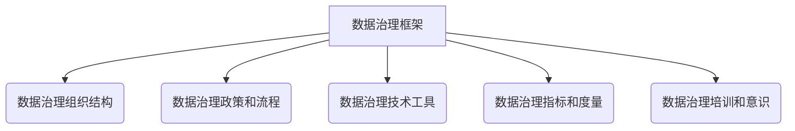

# 数据治理 原理与代码实例讲解

## 1.背景介绍

### 1.1 数据的重要性

在当今时代,数据已经成为了企业和组织最宝贵的资产之一。无论是金融、医疗、制造还是电子商务等行业,都极度依赖于数据来驱动业务决策、优化运营效率、改善客户体验和开发创新产品。随着数据量的爆炸式增长,如何高效地管理和利用这些数据资产对于企业的成功至关重要。

### 1.2 数据质量挑战

然而,由于数据来源的多样性、格式的不一致性以及数据生命周期的复杂性,确保数据的准确性、完整性、一致性和及时性仍然是一个巨大的挑战。低质量的数据不仅会导致业务决策的失误,还可能带来合规性风险和财务损失。因此,建立有效的数据治理机制来管理企业数据资产的全生命周期变得势在必行。

### 1.3 数据治理的重要性

数据治理是一种战略性方法,旨在确保企业数据的可用性、可靠性、安全性和隐私性。它涉及数据管理的各个方面,包括数据架构、数据质量、数据安全、数据隐私、数据集成、数据访问和数据使用等。通过制定明确的政策、流程和标准,数据治理有助于确保数据的一致性、完整性和准确性,从而支持企业的战略目标和业务运营。

## 2.核心概念与联系

### 2.1 数据治理框架

数据治理框架是一个全面的模型,用于规划、实施和监控数据治理计划。它通常包括以下几个关键组成部分:

1. **数据治理组织结构**: 明确定义数据治理角色和职责,如数据管理员、数据管理者、数据利用者等。
2. **数据治理政策和流程**: 制定数据治理政策和标准操作流程,涵盖数据质量、数据安全、数据隐私、数据访问等方面。
3. **数据治理技术工具**: 采用适当的技术工具来支持数据治理活动,如数据质量工具、数据目录、数据加密等。
4. **数据治理指标和度量**: 设置关键绩效指标(KPI)和度量标准,用于监控和评估数据治理计划的有效性。
5. **数据治理培训和意识**: 提高员工对数据治理重要性的认识,并提供相关培训和指导。

### 2.2 数据质量维度

数据质量是数据治理的核心目标之一。高质量的数据需要满足以下几个关键维度:

1. **准确性(Accuracy)**: 数据应该准确反映实际情况,没有错误或遗漏。
2. **完整性(Completeness)**: 数据应该包含所有必需的字段和值,没有缺失或空白。
3. **一致性(Consistency)**: 数据在不同系统和应用程序中应该保持一致,没有矛盾或冲突。
4. **及时性(Timeliness)**: 数据应该是最新的,能够及时反映当前状态。
5. **可访问性(Accessibility)**: 数据应该易于访问和使用,具有适当的权限控制。
6. **可解释性(Interpretability)**: 数据的含义和上下文应该清晰易懂,便于理解和分析。

通过建立数据质量规则和指标,企业可以持续监控和改进数据质量,确保数据满足业务需求。

### 2.3 数据治理生命周期

数据治理是一个持续的过程,涵盖了数据的整个生命周期,包括:

1. **数据创建**: 确保数据在创建时遵循标准和规范,保证数据质量。
2. **数据采集**: 从各种来源采集数据,并进行数据集成和转换。
3. **数据存储**: 将数据存储在适当的存储系统中,如数据库、数据湖或数据仓库。
4. **数据访问和使用**: 控制对数据的访问权限,并确保数据被正确使用。
5. **数据保护和隐私**: 实施适当的安全措施,保护数据免受未经授权的访问、修改或删除。
6. **数据归档和删除**: 根据法规和政策要求,适时归档或删除不再需要的数据。

通过对数据生命周期的全面管理,企业可以确保数据的可靠性、安全性和合规性。

## 3.核心算法原理具体操作步骤

### 3.1 数据质量评估算法

评估数据质量是数据治理的关键任务之一。常用的数据质量评估算法包括:

1. **规则验证算法**: 根据预定义的规则和约束条件,检查数据是否符合特定的质量标准。例如,检查字段值是否在允许的范围内、是否存在空值或重复值等。

2. **统计分析算法**: 使用统计方法分析数据的分布、离群值、相关性等特征,以发现潜在的质量问题。例如,计算字段值的均值、中位数、方差等统计量。

3. **机器学习算法**: 利用机器学习技术,从历史数据中学习数据模式和规律,并应用于新数据的质量评估。例如,使用分类算法识别异常值或使用聚类算法发现数据群集。

4. **数据匹配算法**: 比较来自不同数据源的记录,识别重复或冲突的数据。常用的算法包括精确匹配、模糊匹配、概率匹配等。

5. **数据扫描算法**: 对大规模数据集进行全面扫描,检测各种类型的数据质量问题,如缺失值、异常值、不一致性等。

这些算法可以单独使用,也可以组合使用,以全面评估数据质量并发现潜在的问题。

### 3.2 数据清理和转换算法

一旦发现数据质量问题,下一步就是进行数据清理和转换,以提高数据质量。常用的算法包括:

1. **数据标准化算法**: 将数据转换为统一的格式或标准,以确保数据的一致性。例如,将日期格式转换为 YYYY-MM-DD 格式。

2. **数据解重算法**: 识别和消除重复数据,保留唯一记录。常用的算法包括基于键值的精确匹配、基于相似性的模糊匹配等。

3. **数据填充算法**: 为缺失值或异常值填充合理的数据。可以使用统计方法(如均值、中位数等)或机器学习模型(如回归、决策树等)进行数据填充。

4. **数据映射算法**: 将数据从一种表示形式转换为另一种表示形式,以满足特定的业务需求或系统要求。例如,将数字代码映射为对应的文本描述。

5. **数据加密算法**: 对敏感数据进行加密,以保护数据隐私和安全性。常用的算法包括对称加密算法(如AES)和非对称加密算法(如RSA)。

6. **数据掩码算法**: 将敏感数据部分遮蔽或替换,以保护数据隐私,同时保留数据的部分信息。例如,将信用卡号码的前几位和后几位显示,中间数字用 * 代替。

通过应用这些算法,企业可以有效地清理和转换数据,提高数据质量并满足特定的业务需求。

## 4.数学模型和公式详细讲解举例说明

在数据治理过程中,数学模型和公式扮演着重要的角色,用于量化和评估数据质量、分析数据模式以及优化数据处理流程。以下是一些常用的数学模型和公式,以及它们在数据治理中的应用。

### 4.1 数据质量评分模型

数据质量评分模型旨在将数据质量量化为一个可衡量的分数或指标,以便于监控和比较。常用的评分模型包括:

1. **加权平均模型**:

$$
\text{数据质量分数} = \sum_{i=1}^{n} w_i \times s_i
$$

其中,$ w_i $表示第 i 个质量维度的权重,$ s_i $表示该维度的评分,$ n $表示质量维度的总数。通过调整权重,可以根据业务需求对不同质量维度赋予不同的重要性。

2. **几何平均模型**:

$$
\text{数据质量分数} = \sqrt[n]{\prod_{i=1}^{n} s_i}
$$

该模型假设各个质量维度之间存在相互依赖关系,只有当所有维度的评分都较高时,整体分数才会较高。

3. **最小值模型**:

$$
\text{数据质量分数} = \min\limits_{1 \leq i \leq n} s_i
$$

该模型认为,数据质量由最差的维度决定。只有当所有维度的评分都较高时,整体分数才会较高。

这些模型可以根据具体情况进行选择和调整,以量化和评估数据质量。

### 4.2 数据相似性度量

在数据匹配和解重过程中,需要度量不同记录之间的相似性。常用的相似性度量包括:

1. **编辑距离**:

编辑距离(Edit Distance)是指将一个字符串转换为另一个字符串所需的最小编辑操作数,包括插入、删除和替换。常用的编辑距离算法有Levenshtein距离和Damerau-Levenshtein距离。

$$
\text{Levenshtein距离}(a, b) = \min\limits_{\substack{\text{插入}(i) \\ \text{删除}(j) \\ \text{替换}(i,j)}} \sum\limits_{k=1}^{K} c(o_k)
$$

其中,$ a $和$ b $是两个字符串,$ o_k $是将$ a $转换为$ b $所需的第$ k $个操作,$ c(o_k) $是该操作的代价。

2. **Jaccard相似系数**:

Jaccard相似系数(Jaccard Similarity Coefficient)用于度量两个集合之间的相似性,常用于文本数据的相似性比较。

$$
J(A, B) = \frac{|A \cap B|}{|A \cup B|}
$$

其中,$ A $和$ B $是两个集合,$ |A \cap B| $表示两个集合的交集元素个数,$ |A \cup B| $表示两个集合的并集元素个数。

3. **余弦相似度**:

余弦相似度(Cosine Similarity)常用于向量空间模型中,度量两个向量之间的相似性。

$$
\text{余弦相似度}(A, B) = \frac{A \cdot B}{\|A\| \|B\|} = \frac{\sum\limits_{i=1}^{n} A_i B_i}{\sqrt{\sum\limits_{i=1}^{n} A_i^2} \sqrt{\sum\limits_{i=1}^{n} B_i^2}}
$$

其中,$ A $和$ B $是两个$ n $维向量。

通过选择合适的相似性度量方法,企业可以有效地进行数据匹配和解重,提高数据质量。

### 4.3 数据填充模型

在处理缺失值或异常值时,常使用数据填充模型来估计并填充合理的值。常用的数据填充模型包括:

1. **均值填充**:

$$
x_i^* = \frac{1}{n} \sum\limits_{j=1}^{n} x_j
$$

其中,$ x_i^* $是缺失值的估计值,$ x_j $是已知值,$ n $是已知值的个数。

2. **中位数填充**:

$$
x_i^* = \text{median}(x_1, x_2, \ldots, x_n)
$$

中位数填充通常比均值填充更加稳健,不容易受到异常值的影响。

3. **回归模型**:

$$
y = f(X) + \epsilon
$$

其中,$ y $是目标变量(缺失值),$ X $是特征向量,$ f $是回归函数,$ \epsilon $是误差项。常用的回归模型包括线性回归、决策树回归等。

4. **多重插补法**:

多重插补法(Multiple Imputation)通过构建多个填充数据集,并对结果进行合并,从而减少单一插补方法带来的偏差。

$$
\hat{Q} = \frac{1}{M} \sum\limits_{m=1}