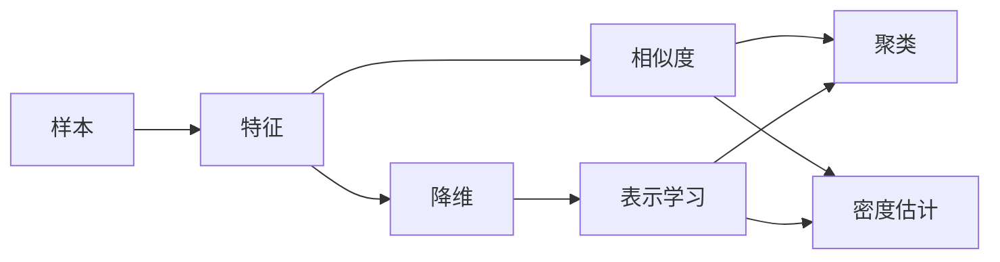

# 无监督学习 (Unsupervised Learning)

## 1.背景介绍
### 1.1 无监督学习的定义
无监督学习(Unsupervised Learning)是机器学习的一个重要分支,它主要研究如何从没有标注的数据中学习出有用的模式和结构。与监督学习不同,无监督学习的训练数据没有预先定义的标签或结果,算法需要自主发现数据中隐藏的结构和关系。
### 1.2 无监督学习的意义
无监督学习在很多领域都有广泛应用,例如:
- 数据降维与可视化:将高维数据映射到低维空间,方便人类理解和分析
- 聚类分析:将相似的数据点归为一类,揭示数据内在的分组结构  
- 异常检测:找出数据集中与大多数数据点明显不同的异常点
- 关联规则挖掘:发现数据项之间有趣的关联关系,如购物篮分析

无监督学习可以帮助我们从海量的无标注数据中自动提取知识,为进一步的分析和决策提供依据。

## 2.核心概念与联系
### 2.1 数据表示
- 样本(Sample):数据集中的一个独立的数据点,通常表示为一个特征向量
- 特征(Feature):描述样本属性的变量,可以是数值型、类别型等
- 相似度(Similarity):衡量两个样本之间相似程度的指标,如欧氏距离、余弦相似度等
### 2.2 基本任务  
- 聚类(Clustering):将数据集划分为多个组,使得组内样本相似度高、组间相似度低
- 降维(Dimensionality Reduction):在保留数据主要信息的前提下,将数据从高维空间映射到低维空间
- 密度估计(Density Estimation):估计样本的概率密度函数,刻画数据的分布情况
- 表示学习(Representation Learning):学习数据的一个低维表示,以揭示数据的内在结构

这些任务相互关联,比如聚类可以作为一种降维方法,降维学习到的表示可用于密度估计等。

### 2.3 核心概念之间的关系


## 3.核心算法原理与步骤
本节介绍几种常见的无监督学习算法。
### 3.1 K-均值聚类(K-Means)
K-均值是一种基于原型的聚类算法,它通过迭代优化的方式将数据划分为K个簇。
算法步骤:
1. 随机选择K个样本作为初始聚类中心
2. 重复直到收敛:
   a. 将每个样本分配到距离最近的聚类中心所在的簇
   b. 更新每个簇的聚类中心为簇内样本的均值
3. 输出最终的簇划分结果

K-均值简单高效,但需要预先确定聚类数K,且对初始聚类中心敏感。

### 3.2 主成分分析(PCA) 
PCA是一种基于矩阵分解的线性降维方法,它将数据投影到方差最大的正交方向上。
算法步骤:
1. 对数据进行中心化,即减去每一维的均值
2. 计算数据的协方差矩阵
3. 对协方差矩阵进行特征值分解  
4. 取最大的k个特征值对应的特征向量,构成降维矩阵
5. 将数据乘以降维矩阵,得到降维后的k维表示

PCA可以去除数据中的噪声,揭示数据的主要变化模式,但难以发现非线性结构。

### 3.3 t-SNE
t-SNE(t-distributed Stochastic Neighbor Embedding)是一种非线性降维算法,擅长保持数据的局部结构。
算法步骤:  
1. 在高维空间和低维空间分别计算样本之间的相似度
2. 定义代价函数,使低维相似度尽可能符合高维相似度
3. 用梯度下降优化代价函数,更新低维表示
4. 迭代直到代价函数收敛

t-SNE在可视化高维数据方面表现出色,能展示数据的聚类结构,但计算复杂度较高。

## 4.数学模型与公式推导
本节以PCA为例,介绍其背后的数学原理。
### 4.1 问题描述
给定样本集$\mathbf{X}=\{\mathbf{x}_1,\ldots,\mathbf{x}_n\},\mathbf{x}_i\in \mathbb{R}^d$,找到一个映射$f:\mathbb{R}^d\rightarrow\mathbb{R}^k(k<d)$,使得降维后的样本$\mathbf{z}_i=f(\mathbf{x}_i)$尽可能保留原始数据的信息。
### 4.2 优化目标
PCA的目标是让降维后样本的方差最大化:

$$\max_{\mathbf{W}} \sum_{i=1}^n \Vert \mathbf{W}^T\mathbf{x}_i \Vert^2, \text{ s.t. } \mathbf{W}^T\mathbf{W}=\mathbf{I}_k$$

其中$\mathbf{W}\in \mathbb{R}^{d\times k}$是降维矩阵,$\mathbf{I}_k$是$k$阶单位矩阵。约束条件确保降维矩阵的列向量标准正交。
### 4.3 求解过程
记样本均值$\mathbf{\mu}=\frac{1}{n}\sum_{i=1}^n \mathbf{x}_i$,样本协方差矩阵$\mathbf{S}=\frac{1}{n}\sum_{i=1}^n (\mathbf{x}_i-\mathbf{\mu})(\mathbf{x}_i-\mathbf{\mu})^T$。

优化问题可以改写为:

$$\max_{\mathbf{W}} \text{tr}(\mathbf{W}^T\mathbf{S}\mathbf{W}), \text{ s.t. } \mathbf{W}^T\mathbf{W}=\mathbf{I}_k$$

利用拉格朗日乘子法,引入乘子矩阵$\mathbf{\Lambda}\in \mathbb{R}^{k\times k}$,得到拉格朗日函数:

$$L(\mathbf{W},\mathbf{\Lambda})=\text{tr}(\mathbf{W}^T\mathbf{S}\mathbf{W})-\text{tr}((\mathbf{W}^T\mathbf{W}-\mathbf{I}_k)\mathbf{\Lambda})$$

对$\mathbf{W}$求导并令导数为0,得到:

$$\mathbf{S}\mathbf{W}=\mathbf{W}\mathbf{\Lambda}$$

这说明$\mathbf{W}$的列向量是协方差矩阵$\mathbf{S}$的特征向量。将其代入目标函数:

$$\text{tr}(\mathbf{W}^T\mathbf{S}\mathbf{W})=\text{tr}(\mathbf{\Lambda})=\sum_{j=1}^k \lambda_j$$

其中$\lambda_j$是$\mathbf{S}$的特征值。因此,只需要取$\mathbf{S}$的最大的$k$个特征值对应的特征向量,就得到了最优的降维矩阵$\mathbf{W}^*$。

### 4.4 算法总结
PCA的完整算法可总结为:
1. 计算样本均值$\mathbf{\mu}=\frac{1}{n}\sum_{i=1}^n \mathbf{x}_i$
2. 计算样本协方差矩阵$\mathbf{S}=\frac{1}{n}\sum_{i=1}^n (\mathbf{x}_i-\mathbf{\mu})(\mathbf{x}_i-\mathbf{\mu})^T$
3. 对$\mathbf{S}$进行特征值分解
4. 取最大的$k$个特征值对应的特征向量$\mathbf{w}_1,\ldots,\mathbf{w}_k$,构成降维矩阵$\mathbf{W}^*=[\mathbf{w}_1,\ldots,\mathbf{w}_k]$
5. 将样本投影到降维矩阵上,得到降维后的表示$\mathbf{z}_i=\mathbf{W}^{*T}(\mathbf{x}_i-\mathbf{\mu})$

PCA利用了数据的协方差结构,通过特征值分解找到了最优的降维方向。理解了其中的数学原理,就可以更好地把握PCA的适用场景和局限性。

## 5.项目实践
下面我们用Python实现PCA算法,并用它对手写数字图像进行降维可视化。
### 5.1 数据准备
使用scikit-learn库自带的MNIST数据集,它包含60000张28x28的手写数字灰度图像。

```python
from sklearn.datasets import fetch_openml

mnist = fetch_openml('mnist_784')
X = mnist.data / 255.0  # 归一化
y = mnist.target
```

### 5.2 PCA降维
使用scikit-learn的PCA类进行降维,将数据降到2维:

```python
from sklearn.decomposition import PCA

pca = PCA(n_components=2)
X_pca = pca.fit_transform(X)
```

### 5.3 可视化
用Matplotlib画出降维后的数据散点图,不同类别用不同颜色表示:

```python
import matplotlib.pyplot as plt

plt.figure(figsize=(8, 8))
plt.scatter(X_pca[:, 0], X_pca[:, 1], c=y, cmap='rainbow')
plt.xlabel('Principal Component 1')
plt.ylabel('Principal Component 2')
plt.colorbar()
plt.show()
```


从图中可以看出,PCA学习到的特征能较好地区分不同数字,体现了其降维的有效性。不同数字形成了一些明显的簇结构,表明PCA捕捉到了数据的固有模式。

当然,PCA作为线性降维方法,也有其局限性。对于更复杂的非线性数据流形,可能需要t-SNE等更高级的方法。

## 6.实际应用场景
无监督学习在工业界有广泛应用,下面列举几个典型场景。
### 6.1 客户细分
电商平台通过对用户行为数据进行聚类,可以发现不同的客户群体,如忠实用户、潜在客户、流失风险用户等,从而实施针对性的营销策略。
### 6.2 社交网络分析
对社交网络中的用户进行社区发现,挖掘出紧密联系的用户群体,为用户推荐好友、组织社交活动提供依据。
### 6.3 异常检测
在工业生产、金融交易等领域,通过密度估计等方法构建正常数据的概率模型,当新样本的概率值很低时,就可以判定为异常情况,及时预警。
### 6.4 推荐系统
利用聚类找到相似的用户或物品,再基于相似性进行推荐。或者用矩阵分解等方法,从用户-物品交互矩阵中自动学习用户和物品的隐向量表示,直接用于推荐。

## 7.工具和资源推荐
- scikit-learn:机器学习算法库,包含了常见的无监督学习模型
- TensorFlow/PyTorch:深度学习框架,可用于训练自编码器等无监督神经网络
- ELKI:专门用于聚类分析的工具包,拥有丰富的聚类算法
- Kaggle:数据科学竞赛平台,提供了许多无标注数据集供研究使用
- 吴恩达《机器学习》课程:主要介绍监督学习,但也覆盖了K-均值等无监督模型
- Hinton《神经网络与深度学习》课程:讲解了自编码器、受限玻尔兹曼机等生成式模型

## 8.总结与展望
无监督学习是从无标注数据中发掘知识的利器。聚类、降维、密度估计等经典方法奠定了无监督学习的基础,而基于深度神经网络的表示学习则进一步拓展了无监督学习的边界。

当前,无监督学习仍然面临许多挑战:
- 如何衡量学习到的表示的质量,缺乏统一的评估指标
- 对高维数据和大规模数据,计算效率有待进一步提升
- 对少样本、多模态数据,需要更强大的归纳偏置和先验知