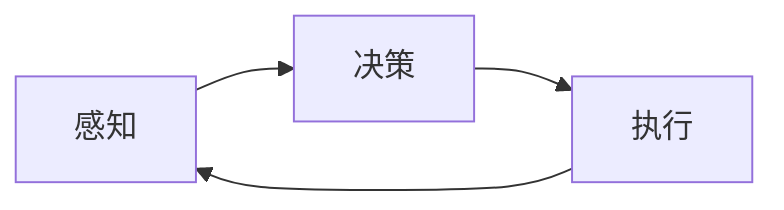

# 机器人学(Robotics)原理与代码实战案例讲解

## 1.背景介绍
### 1.1 机器人学的定义与发展历程
#### 1.1.1 机器人学的定义
#### 1.1.2 机器人学的发展历程
### 1.2 机器人学研究的意义
#### 1.2.1 推动科技进步
#### 1.2.2 服务人类社会
#### 1.2.3 探索未知领域

## 2.核心概念与联系
### 2.1 机器人学的核心概念
#### 2.1.1 机器人的定义与分类
#### 2.1.2 机器人的组成部分
#### 2.1.3 机器人的工作原理
### 2.2 机器人学与其他学科的联系
#### 2.2.1 机器人学与人工智能
#### 2.2.2 机器人学与控制理论 
#### 2.2.3 机器人学与机械工程

## 3.核心算法原理具体操作步骤
### 3.1 机器人运动学
#### 3.1.1 正向运动学
#### 3.1.2 逆向运动学
#### 3.1.3 雅可比矩阵
### 3.2 机器人动力学
#### 3.2.1 拉格朗日方程
#### 3.2.2 牛顿-欧拉方程
#### 3.2.3 动力学参数辨识
### 3.3 机器人控制算法
#### 3.3.1 PID控制
#### 3.3.2 自适应控制
#### 3.3.3 鲁棒控制
### 3.4 机器人路径规划
#### 3.4.1 路径规划问题描述
#### 3.4.2 图搜索算法
#### 3.4.3 采样式路径规划

## 4.数学模型和公式详细讲解举例说明
### 4.1 机器人运动学模型
#### 4.1.1 D-H参数
#### 4.1.2 正向运动学公式推导
#### 4.1.3 逆向运动学求解方法
### 4.2 机器人动力学模型  
#### 4.2.1 拉格朗日动力学建模
#### 4.2.2 牛顿-欧拉动力学建模
#### 4.2.3 动力学参数辨识原理
### 4.3 机器人控制系统数学模型
#### 4.3.1 状态空间表示
#### 4.3.2 传递函数表示
#### 4.3.3 频域分析方法

## 5.项目实践：代码实例和详细解释说明
### 5.1 机械臂正逆运动学求解
#### 5.1.1 D-H参数表示
#### 5.1.2 正向运动学Python代码实现
#### 5.1.3 逆向运动学C++代码实现 
### 5.2 机械臂动力学仿真
#### 5.2.1 动力学方程求解
#### 5.2.2 动力学仿真环境搭建
#### 5.2.3 动力学参数辨识Matlab代码
### 5.3 移动机器人路径规划
#### 5.3.1 基于ROS的导航框架
#### 5.3.2 全局路径规划算法实现
#### 5.3.3 局部路径规划算法实现

## 6.实际应用场景
### 6.1 工业机器人
#### 6.1.1 工业机器人的发展现状
#### 6.1.2 工业机器人的应用领域
#### 6.1.3 工业机器人的发展趋势
### 6.2 服务机器人
#### 6.2.1 家用服务机器人 
#### 6.2.2 医疗服务机器人
#### 6.2.3 公共服务机器人
### 6.3 特种机器人
#### 6.3.1 深海机器人
#### 6.3.2 航天机器人
#### 6.3.3 军事机器人

## 7.工具和资源推荐
### 7.1 机器人仿真平台
#### 7.1.1 Gazebo
#### 7.1.2 V-rep
#### 7.1.3 Webots
### 7.2 机器人操作系统
#### 7.2.1 ROS
#### 7.2.2 YARP
#### 7.2.3 MOOS
### 7.3 机器人开发库
#### 7.3.1 OpenRAVE
#### 7.3.2 MoveIt!
#### 7.3.3 OMPL

## 8.总结：未来发展趋势与挑战
### 8.1 机器人学的发展趋势
#### 8.1.1 人机协作
#### 8.1.2 仿生机器人
#### 8.1.3 群体机器人 
### 8.2 机器人学面临的挑战
#### 8.2.1 环境感知与理解
#### 8.2.2 自主决策与规划
#### 8.2.3 人机交互与安全
### 8.3 机器人学的未来展望
#### 8.3.1 智能化
#### 8.3.2 模块化
#### 8.3.3 网络化

## 9.附录：常见问题与解答
### 9.1 机器人学习路线推荐
### 9.2 机器人相关竞赛介绍
### 9.3 机器人学习资源汇总

机器人学是一门融合了计算机科学、控制理论、机械设计等多个学科的交叉学科，旨在研究如何设计和开发智能机器人系统。机器人学的核心是使机器人具备感知、规划、决策和控制的能力，从而使其能够自主地完成各种任务。

机器人学的发展可以追溯到20世纪中期，随着计算机技术的不断进步，机器人学得到了长足的发展。如今，机器人已经广泛应用于工业制造、医疗服务、家庭服务、军事国防等诸多领域，极大地推动了人类社会的进步。

机器人学的核心概念包括机器人的定义与分类、机器人的组成部分以及机器人的工作原理。一般来说，机器人可以分为操作机器人和移动机器人两大类。操作机器人主要用于工业制造等领域，完成装配、焊接、喷涂等任务；移动机器人则主要用于服务、探索等领域，完成导航、避障、环境感知等任务。

机器人通常由执行机构、传感器、控制器、驱动器等部分组成。执行机构是机器人完成任务的主要载体，包括机械臂、机械手、移动平台等；传感器用于获取机器人所处环境的信息，包括视觉传感器、力传感器、触觉传感器等；控制器则是机器人的"大脑"，负责对传感器信息进行处理，并根据任务要求对执行机构进行控制；驱动器提供机械能，驱动执行机构完成运动。

机器人的工作原理可以简单概括为"感知-决策-执行"的循环。机器人通过传感器获取外界信息，然后由控制器根据环境信息和任务要求做出决策，最后通过执行机构完成具体的动作。这一过程不断循环，使机器人能够自主地适应环境变化，完成各种复杂任务。



在机器人学中，运动学和动力学是两个非常重要的研究方向。机器人运动学研究机器人的运动几何关系，包括正向运动学和逆向运动学两个子问题。正向运动学是已知机器人关节的转角，求解机器人末端执行器的位置和姿态；逆向运动学则是已知机器人末端执行器的位置和姿态，求解机器人关节的转角。

以机械臂为例，设机械臂的关节变量为 $\theta=[\theta_1, \theta_2, ..., \theta_n]^T$，末端执行器的位姿为 $X=[x,y,z,\alpha,\beta,\gamma]^T$，则正向运动学可以表示为：

$$
X = f(\theta)
$$

其中，$f$ 为机械臂的正向运动学方程。逆向运动学则可以表示为：

$$
\theta = f^{-1}(X)
$$

其中，$f^{-1}$ 为机械臂的逆向运动学方程。

机器人动力学研究机器人的运动与力之间的关系，常用的动力学建模方法包括拉格朗日方程法和牛顿-欧拉方程法。以拉格朗日方程法为例，设机器人的广义坐标为 $q=[q_1,q_2,...,q_n]^T$，广义力为 $\tau=[\tau_1,\tau_2,...,\tau_n]^T$，则机器人的动力学方程可以表示为：

$$
\frac{d}{dt}\left(\frac{\partial L}{\partial \dot{q}}\right) - \frac{\partial L}{\partial q} = \tau
$$

其中，$L=T-V$ 为机器人系统的拉格朗日函数，$T$ 为机器人系统的动能，$V$ 为机器人系统的势能。

在机器人控制中，常用的控制算法包括PID控制、自适应控制、鲁棒控制等。以PID控制为例，设机器人的期望位置为 $q_d$，实际位置为 $q$，控制器的输出为 $\tau$，则PID控制器可以表示为：

$$
\tau = K_p(q_d-q) + K_i\int(q_d-q)dt + K_d\frac{d(q_d-q)}{dt}
$$

其中，$K_p$、$K_i$、$K_d$ 分别为比例、积分、微分系数。

在机器人路径规划中，常用的算法包括图搜索算法和采样式路径规划算法。图搜索算法将环境抽象为一个图，然后使用启发式搜索算法如A*算法在图上搜索最优路径；采样式路径规划算法则通过在状态空间中随机采样，然后使用运动规划算法如RRT算法来搜索可行路径。

下面给出机器人学的一些代码实例。首先是机械臂正向运动学的Python代码实现：

```python
import numpy as np

def forward_kinematics(theta, alpha, a, d):
    """
    计算机械臂正向运动学
    
    :param theta: 关节角度
    :param alpha: 连杆扭转角
    :param a: 连杆长度
    :param d: 关节偏距
    :return: 末端执行器位姿
    """
    n = len(theta)
    T = np.eye(4)
    for i in range(n):
        Ti = np.array([[np.cos(theta[i]), -np.sin(theta[i])*np.cos(alpha[i]), 
                        np.sin(theta[i])*np.sin(alpha[i]), a[i]*np.cos(theta[i])],
                       [np.sin(theta[i]), np.cos(theta[i])*np.cos(alpha[i]), 
                        -np.cos(theta[i])*np.sin(alpha[i]), a[i]*np.sin(theta[i])],
                       [0, np.sin(alpha[i]), np.cos(alpha[i]), d[i]],
                       [0, 0, 0, 1]])
        T = T.dot(Ti)
    return T
```

接下来是机械臂逆向运动学求解的C++代码实现：

```cpp
#include <iostream>
#include <Eigen/Dense>

using namespace std;
using namespace Eigen;

VectorXd inverse_kinematics(const Vector3d& pos, const Matrix3d& rot, 
                            const VectorXd& theta0, double eps=1e-6, int max_iter=1000) {
    /*
    机械臂逆向运动学求解
    
    :param pos: 目标位置
    :param rot: 目标姿态
    :param theta0: 初始关节角度
    :param eps: 误差阈值 
    :param max_iter: 最大迭代次数
    :return: 关节角度
    */
    
    int n = theta0.size();
    VectorXd theta = theta0;
    
    MatrixXd J(6, n); // 雅可比矩阵
    VectorXd e(6);    // 误差向量
    
    for (int i = 0; i < max_iter; i++) {
        // 计算正向运动学
        Matrix4d T = forward_kinematics(theta);
        Vector3d curr_pos = T.block<3,1>(0,3);
        Matrix3d curr_rot = T.block<3,3>(0,0);
        
        // 计算误差
        e.segment<3>(0) = pos - curr_pos;
        AngleAxisd aa(curr_rot.transpose() * rot);
        e.segment<3>(3) = aa.angle() * aa.axis();
        
        if (e.norm() < eps) {
            break;
        }
        
        // 计算雅可比矩阵
        J = calc_jacobian(theta);
        
        // 求解关节角度变化量
        VectorXd dtheta = J.colPivHouseholderQr().solve(e);
        
        // 更新关节