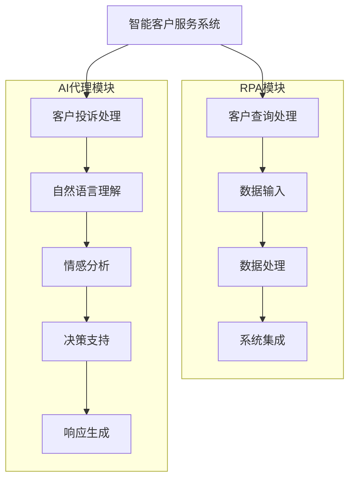

# 机器人进程自动化(RPA)与AI代理工作流的融合

## 1. 背景介绍

### 1.1 机器人流程自动化(RPA)的兴起

在当今数字化转型的浪潮中,机器人流程自动化(Robotic Process Automation, RPA)作为一种新兴技术,正在改变企业运营的方式。RPA旨在通过配置软件机器人或"机器人工人"来自动执行高度重复、规则驱动的任务,从而提高效率、降低成本并减轻人力资源的负担。

RPA的主要优势在于它可以与现有的企业系统和应用程序无缝集成,无需对底层系统进行昂贵的定制和升级。通过模拟人类与应用程序的交互方式,RPA机器人可以执行各种任务,如数据输入、数据处理、数据迁移、系统集成等。

### 1.2 人工智能(AI)代理工作流的兴起

另一方面,人工智能(Artificial Intelligence, AI)技术的快速发展正在推动企业寻求更智能化的自动化解决方案。AI代理工作流(AI-enabled Workflow)通过将AI技术(如机器学习、自然语言处理、计算机视觉等)与工作流自动化相结合,旨在实现更高级别的自动化。

AI代理工作流不仅可以执行规则驱动的任务,还能处理更复杂、需要认知能力的任务。它们可以从大量数据中学习,做出智能决策,并根据环境的变化自主调整行为。这种智能自动化有助于提高效率、降低错误率,并为企业带来新的价值创造机会。

### 1.3 RPA与AI代理工作流的融合

虽然RPA和AI代理工作流各有优势,但它们也存在一定的局限性。RPA主要关注于自动执行重复性任务,而缺乏智能决策和学习能力;而AI代理工作流虽然具有智能化特征,但在处理结构化数据和集成遗留系统方面可能会遇到挑战。

因此,将RPA与AI代理工作流相结合,可以发挥两者的优势,实现更全面、更智能的自动化解决方案。这种融合不仅可以提高自动化的覆盖范围和效率,还能为企业带来新的商业价值和竞争优势。

## 2. 核心概念与联系

### 2.1 RPA的核心概念

RPA的核心概念包括:

1. **软件机器人(Software Robot)**: 一种基于规则的软件程序,可以模拟人类与计算机系统的交互,执行各种重复性任务。

2. **流程自动化(Process Automation)**: 通过软件机器人自动执行一系列预定义的流程步骤,实现端到端的自动化。

3. **无代码/低代码开发(No-code/Low-code Development)**: RPA工具通常采用可视化编程界面,允许非技术人员通过拖拽和配置的方式构建自动化流程,降低了开发门槛。

4. **集成(Integration)**: RPA机器人可以与现有的企业系统和应用程序无缝集成,实现数据交换和任务协作。

### 2.2 AI代理工作流的核心概念

AI代理工作流的核心概念包括:

1. **智能代理(Intelligent Agent)**: 一种具有自主性、反应性、主动性和社会能力的软件实体,能够感知环境、做出决策并采取行动。

2. **机器学习(Machine Learning)**: 赋予智能代理从数据中学习和改进的能力,使其能够处理更复杂的任务。

3. **自然语言处理(Natural Language Processing, NLP)**: 使智能代理能够理解和生成人类语言,实现更自然的人机交互。

4. **计算机视觉(Computer Vision)**: 赋予智能代理识别和理解图像、视频等视觉信息的能力。

5. **决策支持(Decision Support)**: 智能代理可以基于学习到的知识和规则,为人类决策提供建议和支持。

### 2.3 RPA与AI代理工作流的融合

将RPA与AI代理工作流相结合,可以实现以下优势:

1. **扩展自动化范围**: RPA可以处理结构化数据和遗留系统集成,而AI代理工作流可以处理非结构化数据和认知任务,两者相辅相成,扩展了自动化的覆盖范围。

2. **提高自动化智能化水平**: AI技术赋予了自动化流程更强的智能决策和学习能力,使其能够处理更复杂的场景。

3. **增强灵活性和适应性**: AI代理工作流可以根据环境变化自主调整行为,提高了自动化解决方案的灵活性和适应性。

4. **释放人力资源潜力**:通过将重复性任务和认知任务自动化,人力资源可以专注于更有价值的工作,发挥创新和决策能力。

5. **创造新的商业价值**:智能自动化可以优化业务流程、提高效率、降低成本,并发现新的商业机会和价值创造途径。

## 3. 核心算法原理具体操作步骤

### 3.1 RPA算法原理

RPA算法的核心原理是基于规则的自动化流程执行。它通过以下步骤实现:

1. **录制(Recording)**: 使用RPA工具录制人类与应用程序的交互过程,捕获每一个操作步骤和数据输入。

2. **编辑(Editing)**: 对录制的流程进行编辑和优化,添加决策逻辑、异常处理等功能。

3. **调度(Scheduling)**: 根据预定义的时间表或触发事件,调度软件机器人执行自动化流程。

4. **执行(Execution)**: 软件机器人模拟人类操作,按照录制的步骤与应用程序交互,执行自动化任务。

5. **监控(Monitoring)**: 实时监控自动化流程的执行情况,记录日志并处理异常情况。

6. **优化(Optimization)**: 根据执行结果和反馈,不断优化和改进自动化流程,提高效率和稳定性。

### 3.2 AI代理工作流算法原理

AI代理工作流算法的核心原理是基于机器学习和知识表示的智能决策和行为调整。它通过以下步骤实现:

1. **数据收集(Data Collection)**: 从各种来源(如业务系统、传感器、社交媒体等)收集相关数据,作为训练和决策的基础。

2. **特征工程(Feature Engineering)**: 从原始数据中提取有意义的特征,以便机器学习模型能够更好地学习和理解数据。

3. **模型训练(Model Training)**: 使用机器学习算法(如深度学习、决策树等)在训练数据上训练模型,学习数据中蕴含的模式和规律。

4. **知识表示(Knowledge Representation)**: 将学习到的知识以适当的形式(如规则、概念、语义网络等)表示和存储,以便智能代理进行推理和决策。

5. **决策和行为(Decision and Action)**: 智能代理根据当前环境状态、知识库和决策规则,做出相应的决策并采取行动。

6. **反馈和优化(Feedback and Optimization)**: 根据行动的结果和反馈,不断调整和优化模型参数、知识库和决策规则,提高智能代理的性能和适应性。

## 4. 数学模型和公式详细讲解举例说明

在RPA与AI代理工作流的融合中,数学模型和公式扮演着重要的角色,尤其是在机器学习和决策支持方面。以下是一些常见的数学模型和公式,以及它们在智能自动化中的应用:

### 4.1 线性回归模型

线性回归模型是一种常见的监督学习算法,用于建立自变量和因变量之间的线性关系。它的数学表达式如下:

$$y = \beta_0 + \beta_1x_1 + \beta_2x_2 + ... + \beta_nx_n + \epsilon$$

其中,y是因变量,x_i是自变量,β_i是回归系数,ε是误差项。

在智能自动化中,线性回归模型可用于预测任务,如销售预测、需求预测等,为决策提供支持。

### 4.2 逻辑回归模型

逻辑回归模型是一种用于分类问题的监督学习算法。它的数学表达式如下:

$$P(y=1|x) = \sigma(\beta_0 + \beta_1x_1 + \beta_2x_2 + ... + \beta_nx_n)$$

其中,P(y=1|x)表示给定自变量x时,因变量y取值为1的概率,σ(z)是逻辑sigmoid函数,用于将线性组合映射到(0,1)区间。

在智能自动化中,逻辑回归模型可用于文本分类、图像分类等任务,为智能代理提供决策支持。

### 4.3 决策树模型

决策树是一种常用的机器学习模型,通过构建决策树来进行分类或回归。它的工作原理是根据特征值递归地将数据划分为更小的子集,直到每个子集都属于同一类别或满足某个停止条件。

决策树模型可以用信息增益或基尼指数等指标来选择最优特征进行分裂,从而构建出一棵决策树。在智能自动化中,决策树模型可用于规则推理、异常检测等任务,为智能代理提供决策支持。

### 4.4 马尔可夫决策过程(MDP)

马尔可夫决策过程(Markov Decision Process, MDP)是一种描述序列决策问题的数学框架。它由以下几个要素组成:

- 状态集合S
- 动作集合A
- 转移概率P(s'|s,a),表示在状态s下执行动作a后,转移到状态s'的概率
- 奖励函数R(s,a,s'),表示在状态s下执行动作a后,转移到状态s'所获得的奖励

MDP的目标是找到一个最优策略π,使得在遵循该策略时,可以最大化累积的期望奖励。

在智能自动化中,MDP可用于建模和求解序列决策问题,如工作流优化、资源调度等,为智能代理提供决策支持。

### 4.5 强化学习算法

强化学习是一种基于MDP的机器学习范式,它通过与环境的交互来学习最优策略。常见的强化学习算法包括Q-Learning、Sarsa、策略梯度等。

以Q-Learning为例,它的核心思想是通过不断更新Q值函数Q(s,a)来逼近最优Q值函数Q*(s,a),从而找到最优策略。Q值函数的更新规则如下:

$$Q(s_t,a_t) \leftarrow Q(s_t,a_t) + \alpha[r_t + \gamma\max_aQ(s_{t+1},a) - Q(s_t,a_t)]$$

其中,α是学习率,γ是折现因子,r_t是在时刻t获得的奖励。

在智能自动化中,强化学习算法可用于优化工作流、调度资源等任务,使智能代理能够通过与环境的交互来学习最优策略。

## 5. 项目实践:代码实例和详细解释说明

为了更好地理解RPA与AI代理工作流的融合,我们将通过一个实际项目案例来进行说明。该项目旨在开发一个智能客户服务系统,能够自动处理客户查询和投诉,提高客户满意度和服务效率。

### 5.1 系统架构

该系统的架构如下所示:

该系统由两个主要模块组成:

1. **RPA模块**: 负责处理结构化的客户查询,包括数据输入、数据处理和系统集成等任务。

2. **AI代理模块**: 负责处理非结构化的客户投诉,包括自然语言理解、情感分析、决策支持和响应生成等任务。

两个模块通过智能客户服务系统进行协调和集成,共同为客户提供优质的服务体验。

### 5.2 RPA模块实现

RPA模块的实现基于U