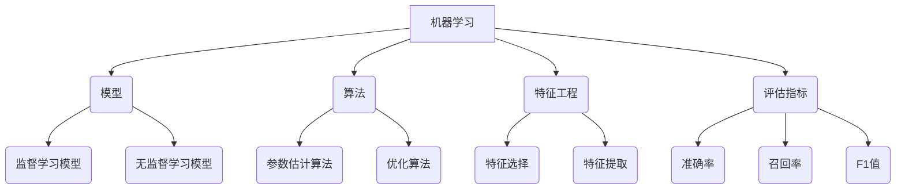

# 机器学习 原理与代码实例讲解

## 1.背景介绍

机器学习是人工智能领域的一个重要分支,旨在使计算机能够从数据中自动学习,而无需显式编程。随着大数据时代的到来,海量数据的出现为机器学习提供了广阔的应用空间。机器学习已经广泛应用于图像识别、自然语言处理、推荐系统、金融预测等诸多领域,并取得了令人瞩目的成就。

### 1.1 机器学习的发展历程

机器学习的概念可以追溯到上世纪50年代,当时的一些先驱者提出了"模式识别"的想法。随后,概率论、统计学、信息论等数学理论为机器学习奠定了坚实的理论基础。20世纪80年代,专家系统和神经网络的出现,推动了机器学习的发展。进入21世纪后,大数据和计算能力的飞速提升,使得机器学习算法得以在实践中大规模应用,取得了突破性进展。

### 1.2 机器学习的重要性

机器学习在当今时代扮演着越来越重要的角色,主要体现在以下几个方面:

1. **自动化决策**:机器学习可以从海量数据中发现隐藏的模式和规律,从而实现自动化决策,提高效率和准确性。
2. **预测与分析**:机器学习擅长对未来进行预测和分析,为企业制定战略提供有力支持。
3. **个性化服务**:通过学习用户行为数据,机器学习可以为用户提供个性化的服务和推荐。
4. **优化与控制**:在工业生产、交通控制等领域,机器学习可以优化系统性能,提高效率。

## 2.核心概念与联系

机器学习涉及多个核心概念,这些概念相互关联,构成了机器学习的理论基础。



### 2.1 模型

模型是机器学习的核心,它是对现实世界的一种抽象和近似。根据是否需要人工标注的训练数据,模型可分为监督学习模型和无监督学习模型。

1. **监督学习模型**:利用带有标签的训练数据,学习输入和输出之间的映射关系,常见的有线性回归、逻辑回归、决策树、支持向量机等。
2. **无监督学习模型**:从未标注的数据中发现隐藏的结构和模式,常见的有聚类算法、关联规则挖掘、降维算法等。

### 2.2 算法

算法是机器学习的核心工具,用于从数据中学习模型参数。主要包括以下两类算法:

1. **参数估计算法**:根据给定的模型和数据,估计模型参数的算法,如最大似然估计、最大后验估计等。
2. **优化算法**:用于优化目标函数的算法,如梯度下降法、牛顿法、共轭梯度法等。

### 2.3 特征工程

特征工程是机器学习的重要环节,旨在从原始数据中提取有用的特征,以提高模型的性能。主要包括以下两个方面:

1. **特征选择**:从原始特征中选择出对模型最有用的一部分特征。
2. **特征提取**:从原始特征中构造出一组新的特征,使其更具有区分能力。

### 2.4 评估指标

评估指标用于衡量机器学习模型的性能,常见的指标有:

1. **准确率**:正确预测的样本数占总样本数的比例。
2. **召回率**:正确预测的正例样本数占所有正例样本数的比例。
3. **F1值**:准确率和召回率的加权调和平均值。

## 3.核心算法原理具体操作步骤

机器学习算法的核心思想是从数据中学习模型参数,使模型能够很好地拟合数据。下面以线性回归为例,介绍其核心算法原理和具体操作步骤。

### 3.1 线性回归模型

线性回归试图学习出一个线性方程,使其能够很好地拟合给定的数据。具体来说,对于输入特征向量$\boldsymbol{x}=(x_1,x_2,\cdots,x_n)$,线性回归模型的输出为:

$$
y = w_1x_1 + w_2x_2 + \cdots + w_nx_n + b
$$

其中,$w_1,w_2,\cdots,w_n$为模型参数(权重),$b$为偏置项。

### 3.2 损失函数

为了学习模型参数,需要定义一个损失函数,衡量模型预测值与真实值之间的差距。对于线性回归,通常采用均方误差作为损失函数:

$$
J(w_1,w_2,\cdots,w_n,b) = \frac{1}{2m}\sum_{i=1}^m(y_i - (w_1x_1^{(i)} + w_2x_2^{(i)} + \cdots + w_nx_n^{(i)} + b))^2
$$

其中,$m$为训练样本的数量,$(x_1^{(i)},x_2^{(i)},\cdots,x_n^{(i)})$为第$i$个训练样本的特征向量,$y_i$为第$i$个训练样本的真实值。

### 3.3 参数学习

学习线性回归模型的参数,就是求解能够最小化损失函数的$w_1,w_2,\cdots,w_n,b$的值。常用的优化算法有梯度下降法、normal方程等。

1. **梯度下降法**:通过计算损失函数关于每个参数的偏导数,并沿着梯度的反方向更新参数,直至收敛。具体步骤如下:

```
初始化参数 w1,w2,...,wn,b
repeat
    计算损失函数关于每个参数的偏导数
    w1 = w1 - α * ∂J/∂w1
    w2 = w2 - α * ∂J/∂w2
    ...
    wn = wn - α * ∂J/∂wn
    b = b - α * ∂J/∂b
until 收敛
```

其中,$\alpha$为学习率,控制每次更新的步长。

2. **normal方程**:通过解析方法求解能够使损失函数最小化的参数值。具体做法是将损失函数关于每个参数的偏导数等于0,得到一个线性方程组,求解该方程组即可得到最优参数值。

### 3.4 算法评估

学习得到模型参数后,需要对模型进行评估,检验其在新的数据上的泛化能力。常用的评估指标有均方根误差(RMSE)、决定系数($R^2$)等。

## 4.数学模型和公式详细讲解举例说明

机器学习算法往往涉及大量的数学概念和公式,理解和掌握这些数学基础对于深入学习机器学习至关重要。下面以线性回归为例,详细讲解其中涉及的数学模型和公式。

### 4.1 矩阵和向量

在线性回归中,我们通常将训练数据表示为矩阵和向量的形式。设有$m$个训练样本,每个样本有$n$个特征,则特征矩阵$\boldsymbol{X}$为$m \times (n+1)$维,其中第$i$行为第$i$个训练样本的特征向量$(x_1^{(i)},x_2^{(i)},\cdots,x_n^{(i)},1)$;标签向量$\boldsymbol{y}$为$m$维列向量,第$i$个元素为第$i$个训练样本的标签$y^{(i)}$。

因此,线性回归模型可以用矩阵向量形式表示为:

$$
\boldsymbol{y} = \boldsymbol{X}\boldsymbol{w}
$$

其中,$\boldsymbol{w}$为$(n+1)$维权重向量$(w_1,w_2,\cdots,w_n,b)^T$。

### 4.2 均方误差损失函数

线性回归的损失函数为均方误差:

$$
J(\boldsymbol{w}) = \frac{1}{2m}||\boldsymbol{X}\boldsymbol{w} - \boldsymbol{y}||_2^2
$$

其中,$||\cdot||_2$表示$L_2$范数。我们可以将其展开为:

$$
J(\boldsymbol{w}) = \frac{1}{2m}\sum_{i=1}^m(x_1^{(i)}w_1 + x_2^{(i)}w_2 + \cdots + x_n^{(i)}w_n + w_{n+1} - y^{(i)})^2
$$

### 4.3 梯度下降法

为了求解能够最小化损失函数的$\boldsymbol{w}$,我们可以使用梯度下降法。具体做法是计算损失函数关于每个权重的偏导数,并沿着梯度的反方向更新权重:

$$
\boldsymbol{w} = \boldsymbol{w} - \alpha\nabla_{\boldsymbol{w}}J(\boldsymbol{w})
$$

其中,$\alpha$为学习率,$\nabla_{\boldsymbol{w}}J(\boldsymbol{w})$为损失函数关于$\boldsymbol{w}$的梯度,计算公式为:

$$
\nabla_{\boldsymbol{w}}J(\boldsymbol{w}) = \frac{1}{m}\boldsymbol{X}^T(\boldsymbol{X}\boldsymbol{w} - \boldsymbol{y})
$$

### 4.4 正规方程

除了梯度下降法,我们还可以使用正规方程求解最优权重$\boldsymbol{w}$。具体做法是令损失函数关于$\boldsymbol{w}$的梯度等于0:

$$
\nabla_{\boldsymbol{w}}J(\boldsymbol{w}) = \frac{1}{m}\boldsymbol{X}^T(\boldsymbol{X}\boldsymbol{w} - \boldsymbol{y}) = 0
$$

整理可得:

$$
\boldsymbol{X}^T\boldsymbol{X}\boldsymbol{w} = \boldsymbol{X}^T\boldsymbol{y}
$$

若$\boldsymbol{X}^T\boldsymbol{X}$可逆,则最优权重为:

$$
\boldsymbol{w} = (\boldsymbol{X}^T\boldsymbol{X})^{-1}\boldsymbol{X}^T\boldsymbol{y}
$$

## 5.项目实践：代码实例和详细解释说明

为了加深对线性回归的理解,下面我们通过一个实际项目实践,编写代码实现线性回归算法,并对关键步骤进行详细解释。

### 5.1 数据准备

我们使用一个经典的房价预测数据集,其中包含房屋面积、房龄、房间数等特征,以及对应的房价。首先导入相关库并加载数据:

```python
import numpy as np
import pandas as pd

data = pd.read_csv('housing.csv')
X = data[['area', 'age', 'rooms']]
y = data['price']
```

### 5.2 特征缩放

由于不同特征的数值范围差异较大,为了避免某些特征对模型的影响过大,我们对特征进行标准化处理:

```python
from sklearn.preprocessing import StandardScaler

scaler = StandardScaler()
X_scaled = scaler.fit_transform(X)
```

### 5.3 训练测试集划分

将数据集划分为训练集和测试集,用于模型训练和评估:

```python
from sklearn.model_selection import train_test_split

X_train, X_test, y_train, y_test = train_test_split(X_scaled, y, test_size=0.2, random_state=42)
```

### 5.4 线性回归模型训练

使用scikit-learn库中的LinearRegression类实现线性回归模型的训练:

```python
from sklearn.linear_model import LinearRegression

model = LinearRegression()
model.fit(X_train, y_train)
```

### 5.5 模型评估

在测试集上评估模型的性能,计算均方根误差(RMSE):

```python
from sklearn.metrics import mean_squared_error

y_pred = model.predict(X_test)
rmse = np.sqrt(mean_squared_error(y_test, y_pred))
print(f'RMSE: {rmse:.2f}')
```

### 5