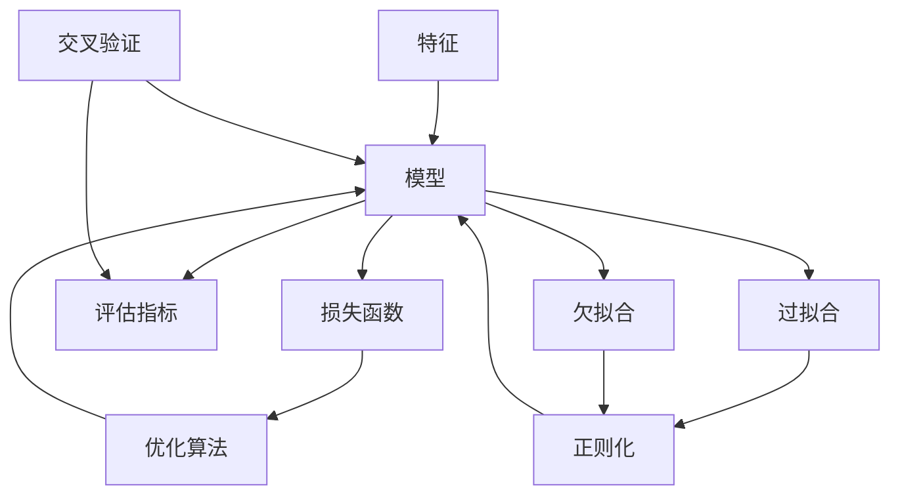

# 机器学习(Machine Learning) - 原理与代码实例讲解

## 1. 背景介绍
### 1.1 机器学习的定义与发展历程
机器学习(Machine Learning,ML)是人工智能(Artificial Intelligence, AI)的一个重要分支。它是一门专门研究计算机怎样模拟或实现人类学习行为,以获取新的知识或技能,重新组织已有的知识结构使之不断改善自身性能的学科。

机器学习的发展可以追溯到20世纪50年代,随着计算机技术的发展和数据量的增加,机器学习在近几十年取得了长足的进步。从早期的感知机(Perceptron)算法,到支持向量机(Support Vector Machine, SVM)的提出,再到21世纪以来深度学习(Deep Learning)的兴起,机器学习已经成为人工智能领域最活跃、最令人振奋的方向之一。

### 1.2 机器学习的分类
根据学习方式的不同,机器学习主要可以分为以下三大类:

1. 监督学习(Supervised Learning):训练数据包含输入和预期输出,目标是学习一个模型,可以对新数据做出预测。常见算法包括线性回归、逻辑回归、决策树、支持向量机等。

2. 无监督学习(Unsupervised Learning):训练数据只包含输入,没有预期输出,目标是发现数据中的结构和关系。常见算法包括聚类、降维、关联规则学习等。

3. 强化学习(Reinforcement Learning):通过与环境的交互,获得奖励或惩罚,不断调整策略,最大化累积奖励。常见算法包括Q-Learning、策略梯度等。

### 1.3 机器学习的应用场景
机器学习在各个领域都有广泛的应用,包括但不限于:

1. 计算机视觉:图像分类、目标检测、人脸识别等
2. 自然语言处理:情感分析、机器翻译、语音识别等 
3. 推荐系统:电商推荐、个性化新闻推荐等
4. 金融领域:信用评分、反欺诈、股票预测等
5. 医疗健康:辅助诊断、药物发现等
6. 智能交通:交通流量预测、无人驾驶等

随着数据的爆炸式增长和计算能力的提升,机器学习正在不断拓展新的应用领域,为人类社会的发展带来深远影响。

## 2. 核心概念与联系
### 2.1 特征(Feature)
特征是对数据的抽象表示,是机器学习算法的基本输入。通常将样本的属性、embedding向量等称为特征。特征选择和特征工程是机器学习的关键步骤,直接影响模型的性能。

### 2.2 模型(Model)
模型是机器学习算法的核心,通过对训练数据的学习,建立输入到输出的映射关系。不同的算法对应不同的模型,如线性模型、树模型、神经网络等。模型的复杂度、泛化能力、可解释性等都是需要权衡的因素。

### 2.3 损失函数(Loss Function)
损失函数用于衡量模型预测值与真实值之间的差距,是模型优化的目标函数。常见的损失函数包括均方误差(MSE)、交叉熵(Cross Entropy)等。损失函数的选择要根据问题的类型和模型的特点来确定。

### 2.4 优化算法(Optimization Algorithm)  
优化算法是用于最小化损失函数,更新模型参数的方法。梯度下降(Gradient Descent)是最常用的优化算法,包括批量梯度下降(BGD)、随机梯度下降(SGD)、小批量梯度下降(Mini-Batch GD)等变种。此外还有牛顿法、拟牛顿法、Adagrad、RMSprop、Adam等高阶优化算法。

### 2.5 评估指标(Evaluation Metric)
评估指标用于衡量模型在测试集上的表现,反映模型的泛化能力。不同任务对应不同的评估指标,如分类任务常用准确率(Accuracy)、精确率(Precision)、召回率(Recall)、F1分数等,回归任务常用平均绝对误差(MAE)、均方误差(MSE)、R平方等。

### 2.6 过拟合(Overfitting)与欠拟合(Underfitting)
过拟合是指模型在训练集上表现很好,但在测试集上表现较差,即模型过于复杂,学习到了数据的噪声。欠拟合是指模型在训练集和测试集上表现都较差,即模型过于简单,没有很好地学习数据的特征。如何在过拟合和欠拟合之间取得平衡是机器学习的重要课题。

### 2.7 正则化(Regularization)
正则化是一种缓解过拟合的常用方法,通过在损失函数中加入正则化项,限制模型复杂度,提高泛化能力。常见的正则化方法有L1正则化、L2正则化、Dropout等。

### 2.8 交叉验证(Cross Validation)
交叉验证是一种模型选择和评估的方法,将数据集划分为多个子集,轮流将每个子集作为验证集,其余子集作为训练集,最后将多次的结果取平均。常见的交叉验证方法有K折交叉验证、留一交叉验证等。

### 2.9 核心概念之间的关系
下图展示了机器学习核心概念之间的关系:

从上图可以看出,特征作为模型的输入,模型的优劣由损失函数来衡量,并通过优化算法来不断改进。评估指标反映了模型在新数据上的表现。过拟合和欠拟合是模型面临的两大问题,可以通过正则化等方法来缓解。交叉验证贯穿于模型选择和评估的全过程。理解这些概念之间的联系,有助于我们更好地把握机器学习的全貌。

## 3. 核心算法原理与具体操作步骤
机器学习算法种类繁多,本节将重点介绍几种常见的算法:线性回归、逻辑回归、决策树、支持向量机和神经网络。

### 3.1 线性回归(Linear Regression)
线性回归是一种基本的监督学习算法,用于拟合连续型变量之间的线性关系。假设有 $n$ 个样本 $(x_1,y_1),(x_2,y_2),...,(x_n,y_n)$,其中 $x_i=(x_{i1},x_{i2},...,x_{id})$ 为第 $i$ 个样本的特征向量,$y_i$ 为对应的目标值。线性回归的目标是学习一个线性函数:
$$
f(x)=w^Tx+b
$$
使得预测值 $f(x_i)$ 与真实值 $y_i$ 的差距最小。其中 $w=(w_1,w_2,...,w_d)$ 为权重向量,$b$ 为偏置项。

线性回归的具体步骤如下:

1. 数据预处理:对特征进行归一化、标准化等处理,使其分布更加平稳。

2. 定义损失函数:常用的是均方误差(MSE):
$$
J(w,b)=\frac{1}{2n}\sum_{i=1}^n(f(x_i)-y_i)^2
$$

3. 优化模型参数:通过梯度下降等优化算法,不断更新 $w$ 和 $b$,使损失函数最小化。梯度下降的更新公式为:
$$
w:=w-\alpha\frac{\partial J}{\partial w}
$$
$$
b:=b-\alpha\frac{\partial J}{\partial b}
$$
其中 $\alpha$ 为学习率。

4. 模型评估:在测试集上评估模型的性能,常用的指标有平均绝对误差(MAE)、均方误差(MSE)、R平方等。

5. 模型应用:使用训练好的模型对新数据进行预测。

线性回归虽然简单,但在实际应用中非常有效,尤其适用于特征与目标之间存在线性关系的场景。

### 3.2 逻辑回归(Logistic Regression)
逻辑回归是一种常用的分类算法,用于二分类问题。与线性回归类似,逻辑回归也是在特征和目标之间建立线性关系,但引入了 Sigmoid 函数将输出映射到 $(0,1)$ 区间,表示样本属于正类的概率。Sigmoid 函数的定义为:
$$
\sigma(z)=\frac{1}{1+e^{-z}}
$$
逻辑回归的具体步骤如下:

1. 数据预处理:类似线性回归。

2. 定义损失函数:常用的是交叉熵损失函数:
$$
J(w,b)=-\frac{1}{n}\sum_{i=1}^n[y_i\log(\hat{y}_i)+(1-y_i)\log(1-\hat{y}_i)]
$$
其中 $\hat{y}_i=\sigma(w^Tx_i+b)$ 为模型预测的概率值。

3. 优化模型参数:与线性回归类似,使用梯度下降等优化算法。

4. 模型评估:常用的指标有准确率、精确率、召回率、F1分数、AUC等。

5. 模型应用:将预测概率值转化为类别标签(一般以0.5为阈值)。

逻辑回归可以看作是线性回归在分类问题上的推广,在实践中应用十分广泛。

### 3.3 决策树(Decision Tree)
决策树是一种树形结构的分类模型,通过一系列的判断条件将样本划分到不同的叶子节点上,每个叶子节点对应一个类别。决策树的学习过程就是根据某个指标选择最优划分属性,递归地构建子树的过程。

决策树的具体步骤如下:

1. 数据预处理:与前面类似。

2. 选择最优划分属性:常用的指标有信息增益、信息增益比、基尼指数等。以信息增益为例,假设当前节点包含的样本集合为 $D$,属性 $a$ 有 $V$ 个可能的取值 ${a^1,a^2,...,a^V}$,根据 $a$ 的取值将 $D$ 划分为 $V$ 个子集 ${D_1,D_2,...,D_V}$,则属性 $a$ 的信息增益定义为:
$$
Gain(D,a)=Ent(D)-\sum_{v=1}^V\frac{|D_v|}{|D|}Ent(D_v)
$$
其中 $Ent(D)=-\sum_{k=1}^K\frac{|C_k|}{|D|}\log_2\frac{|C_k|}{|D|}$ 为数据集 $D$ 的信息熵,$K$ 为类别数。选择信息增益最大的属性作为最优划分属性。

3. 递归构建子树:对每个子节点,若其中样本属于同一类别,则将该节点标记为叶子节点;否则,重复步骤2继续划分,直到满足停止条件(如样本数小于阈值、树的深度达到上限等)。

4. 模型评估:与前面类似。

5. 模型应用:对新样本,从根节点开始,根据判断条件逐步移动到叶子节点,输出对应的类别。

决策树易于理解和解释,可以处理数值型和类别型特征,但容易过拟合,泛化能力较差。实践中常采用集成学习方法(如随机森林)来改进决策树的性能。

### 3.4 支持向量机(Support Vector Machine, SVM)
支持向量机是一种基于间隔最大化的二分类模型,其基本思想是在特征空间中寻找一个超平面,使得不同类别的样本被超平面所分割,且离超平面最近的样本(支持向量)到超平面的距离最大。

对于线性可分的情况,SVM 的目标是求解以下优化问题:
$$
\min_{w,b} \frac{1}{2}||w||^2 \\
s.t. \quad y_i(w^Tx_i+b) \geq 1, \quad i=1,2,...,n
$$
其中 $w$ 为超平面的法向量,$b$ 为偏置项。通过拉格朗日乘子法和对偶问题,可以得到 SVM