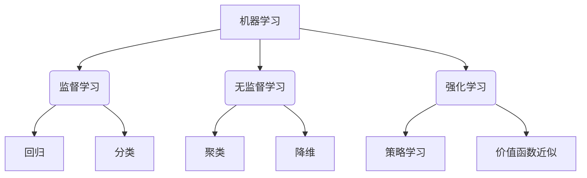

# 机器学习原理与代码实例讲解

## 1. 背景介绍

### 1.1 什么是机器学习?

机器学习是人工智能的一个重要分支,它赋予计算机从数据中自主学习和获取经验的能力。与传统的基于规则的编程不同,机器学习算法可以从大量数据中发现内在的模式和规律,并基于这些规律对新数据进行预测或决策。

机器学习已广泛应用于图像识别、自然语言处理、推荐系统、金融预测等诸多领域,极大地提高了计算机系统的智能化水平。随着大数据时代的到来和计算能力的不断提升,机器学习的重要性与日俱增。

### 1.2 机器学习的发展历程

机器学习的概念最早可以追溯到20世纪50年代,当时的一些先驱者提出了"给予计算机学习的能力"的想法。1959年,Arthur Samuel在编写国际象棋程序时首次使用了"机器学习"一词。

20世纪60年代,贝叶斯理论、最小二乘法等统计学方法开始应用于机器学习。70年代,人工神经网络、支持向量机等算法理论被提出。80年代,决策树算法和集成学习方法得到发展。

进入21世纪,机器学习迎来了爆发式增长。大数据时代的到来为机器学习提供了充足的训练数据,并行计算和GPU的发展也极大地提高了算法的运算效率。深度学习、强化学习等新兴技术不断涌现,使得机器学习能够解决越来越复杂的问题。

## 2. 核心概念与联系

机器学习可以分为三大类:监督学习、无监督学习和强化学习。

### 2.1 监督学习

监督学习是机器学习中最常见的一种范式。它的目标是从已知的输入-输出数据对中学习一个映射函数,使得对于新的输入数据,可以预测其对应的输出。

监督学习可以进一步分为回归问题和分类问题。回归问题是指预测一个连续的数值输出,如房价预测;分类问题则是将输入数据划分到有限的类别中,如垃圾邮件分类。

常见的监督学习算法包括线性回归、逻辑回归、决策树、支持向量机、神经网络等。

### 2.2 无监督学习  

无监督学习的训练数据只有输入,没有任何相应的标签或监督信号。算法需要从数据中自主发现内在的模式和结构。

无监督学习的主要任务包括聚类和降维。聚类是将相似的数据点分组到同一个簇中,如客户细分;降维则是将高维数据映射到低维空间,以降低数据的复杂性和冗余性。

常见的无监督学习算法有K-Means聚类、高斯混合模型、主成分分析等。

### 2.3 强化学习

强化学习是一种基于环境交互的学习范式。智能体(Agent)通过与环境(Environment)的持续交互,获取环境反馈,并根据这些反馈不断更新自身的策略,以最大化长期累积奖励。

强化学习常用于决策序列问题,如机器人控制、游戏AI、自动驾驶等。著名的算法有Q-Learning、深度Q网络、策略梯度等。

## 3. 核心算法原理具体操作步骤

接下来,我们将介绍几种核心的机器学习算法的基本原理和操作步骤。

### 3.1 线性回归

线性回归是最基础也是最常用的监督学习算法之一,旨在找到最佳拟合的线性方程来描述自变量和因变量之间的关系。

#### 3.1.1 原理

线性回归假设自变量 $\boldsymbol{x}$ 和因变量 $y$ 之间存在线性关系:

$$y = \boldsymbol{w}^T\boldsymbol{x} + b$$

其中, $\boldsymbol{w}$ 是权重向量, $b$ 是偏置项。算法的目标是通过最小化损失函数(如均方误差)来找到最优的 $\boldsymbol{w}$ 和 $b$。

#### 3.1.2 操作步骤

1. 收集数据,构建自变量矩阵 $\boldsymbol{X}$ 和因变量向量 $\boldsymbol{y}$。
2. 初始化权重向量 $\boldsymbol{w}$ 和偏置项 $b$。
3. 计算预测值 $\hat{\boldsymbol{y}} = \boldsymbol{Xw} + b$。
4. 计算损失函数 $J(\boldsymbol{w}, b) = \frac{1}{2m}\sum_{i=1}^m(\hat{y}^{(i)} - y^{(i)})^2$。
5. 使用梯度下降法更新 $\boldsymbol{w}$ 和 $b$:
   $$\boldsymbol{w} := \boldsymbol{w} - \alpha\frac{\partial J}{\partial \boldsymbol{w}}$$
   $$b := b - \alpha\frac{\partial J}{\partial b}$$
6. 重复步骤3-5,直到收敛或达到最大迭代次数。

其中, $\alpha$ 是学习率,决定了每次更新的步长。

### 3.2 逻辑回归

逻辑回归是一种用于分类问题的监督学习算法,尤其适用于二分类问题。

#### 3.2.1 原理 

逻辑回归使用 Sigmoid 函数将线性回归的输出值映射到 (0, 1) 区间,从而得到一个概率值,表示样本属于正类的可能性:

$$\hat{p} = \sigma(\boldsymbol{w}^T\boldsymbol{x} + b) = \frac{1}{1 + e^{-(\boldsymbol{w}^T\boldsymbol{x} + b)}}$$

然后,根据概率值是否大于某个阈值(通常为0.5)来判定样本的类别。

逻辑回归的目标是最大化似然函数(或最小化对数似然损失函数):

$$J(\boldsymbol{w}, b) = -\frac{1}{m}\sum_{i=1}^m[y^{(i)}\log\hat{p}^{(i)} + (1 - y^{(i)})\log(1 - \hat{p}^{(i)})]$$

#### 3.2.2 操作步骤

1. 收集数据,构建自变量矩阵 $\boldsymbol{X}$ 和因变量向量 $\boldsymbol{y}$。
2. 初始化权重向量 $\boldsymbol{w}$ 和偏置项 $b$。  
3. 计算概率估计 $\hat{\boldsymbol{p}} = \sigma(\boldsymbol{Xw} + b)$。
4. 计算对数似然损失函数 $J(\boldsymbol{w}, b)$。
5. 使用梯度下降法更新 $\boldsymbol{w}$ 和 $b$。
6. 重复步骤3-5,直到收敛或达到最大迭代次数。
7. 根据概率阈值对新样本进行分类。

### 3.3 决策树

决策树是一种监督学习算法,可用于回归和分类问题。它通过递归地构建决策树模型,将复杂的决策过程呈现为树状结构。

#### 3.3.1 原理

决策树的构建过程是自顶向下、递归地将数据集划分为较小的子集。根据某个特征的值,将数据集分成两个或多个子集,使得每个子集尽可能"纯"(即属于同一类别)。这个过程一直重复,直到满足某个停止条件。

常用的决策树算法包括ID3、C4.5和CART等。它们采用不同的特征选择标准,如信息增益、信息增益比、基尼指数等。

#### 3.3.2 操作步骤

1. 收集数据,构建自变量矩阵 $\boldsymbol{X}$ 和因变量向量 $\boldsymbol{y}$。
2. 计算每个特征的特征选择标准(如信息增益),选择最优特征作为根节点。
3. 根据选定特征的值,将数据集划分为若干子集。
4. 对于每个子集,重复步骤2-3,构建决策树的子节点,直到满足停止条件。
5. 对于叶节点,确定该节点的类别(对于分类问题)或输出值(对于回归问题)。
6. 对新样本,根据决策树的路径进行分类或回归预测。

### 3.4 K-Means聚类

K-Means是一种无监督学习算法,用于将数据集划分为K个簇。

#### 3.4.1 原理

K-Means算法的目标是最小化所有数据点到其所属簇质心的距离平方和:

$$J = \sum_{i=1}^{m}\sum_{k=1}^{K}r_{ik}\left\Vert\boldsymbol{x}^{(i)} - \boldsymbol{\mu}_k\right\Vert^2$$

其中, $r_{ik}$ 是指示函数,表示样本 $\boldsymbol{x}^{(i)}$ 是否属于第 $k$ 个簇; $\boldsymbol{\mu}_k$ 是第 $k$ 个簇的质心。

算法通过迭代地重新分配簇和更新质心,直至收敛。

#### 3.4.2 操作步骤

1. 随机初始化 $K$ 个簇的质心。
2. 对于每个数据点,计算它与每个质心的距离,将其分配到最近的簇。
3. 对于每个簇,重新计算簇的质心。
4. 重复步骤2-3,直至质心不再发生变化或达到最大迭代次数。

## 4. 数学模型和公式详细讲解举例说明

在机器学习中,数学模型和公式扮演着至关重要的角色。我们将详细讲解几种常见的数学模型及其公式。

### 4.1 线性回归模型

线性回归模型假设自变量 $\boldsymbol{x}$ 和因变量 $y$ 之间存在线性关系:

$$y = \boldsymbol{w}^T\boldsymbol{x} + b$$

其中, $\boldsymbol{w}$ 是权重向量, $b$ 是偏置项。我们的目标是通过最小化均方误差损失函数来找到最优的 $\boldsymbol{w}$ 和 $b$:

$$J(\boldsymbol{w}, b) = \frac{1}{2m}\sum_{i=1}^m(\hat{y}^{(i)} - y^{(i)})^2$$

其中, $\hat{y}^{(i)} = \boldsymbol{w}^T\boldsymbol{x}^{(i)} + b$ 是对第 $i$ 个样本的预测值。

通过对损失函数求偏导并使用梯度下降法,我们可以得到更新 $\boldsymbol{w}$ 和 $b$ 的公式:

$$\boldsymbol{w} := \boldsymbol{w} - \alpha\frac{1}{m}\sum_{i=1}^m(\hat{y}^{(i)} - y^{(i)})\boldsymbol{x}^{(i)}$$
$$b := b - \alpha\frac{1}{m}\sum_{i=1}^m(\hat{y}^{(i)} - y^{(i)})$$

其中, $\alpha$ 是学习率,决定了每次更新的步长。

**示例**:假设我们有一个数据集,包含房屋面积 $x$ 和房价 $y$,我们希望通过线性回归拟合出一条最佳直线来描述二者的关系。

首先,我们初始化权重 $w$ 和偏置 $b$,如 $w = 0.1, b = 0.3$。然后,对于每个训练样本 $(x^{(i)}, y^{(i)})$,我们计算预测值 $\hat{y}^{(i)} = wx^{(i)} + b$,并根据上述公式更新 $w$ 和 $b$。重复这个过程,直到收敛或达到最大迭代次数。

最终,我们得到的 $w$ 和 $b$ 就是最佳拟合直线的参数,对于新的房屋面积 $x$,我们可以通过 $y = wx + b$ 来预测其房价。

### 4.2 逻辑回归模型

逻辑回归模型常用于二分类