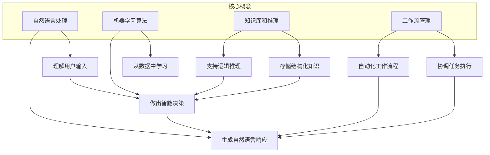

# 构建AI代理：从需求收集到工作流实现

## 1. 背景介绍

### 1.1 人工智能时代的到来

在过去的几十年里,人工智能(AI)已经从一个理论概念发展成为一种革命性的技术力量,正在重塑我们的生活、工作和思维方式。随着算力的不断提升、数据量的激增以及算法的持续创新,AI系统在语音识别、图像处理、自然语言处理等领域展现出了令人惊叹的能力。

AI代理作为AI系统的重要组成部分,正在被广泛应用于各个领域,如客户服务、智能助理、教育培训等。AI代理可以模拟人类的行为和决策过程,与用户进行自然语言交互,为用户提供个性化的服务和支持。

### 1.2 构建AI代理的挑战

尽管AI代理带来了巨大的机遇,但构建一个高质量、高效率的AI代理系统并非一蹴而就。这个过程需要解决诸多挑战,包括:

- 需求收集和理解:准确捕捉用户需求,并将其转化为可执行的系统需求。
- 数据准备和处理:获取高质量的训练数据,并对其进行适当的清洗和预处理。
- 算法选择和优化:选择合适的机器学习算法,并根据具体任务对其进行优化和调整。
- 系统集成和部署:将AI模型与其他系统组件(如自然语言处理、知识库等)进行无缝集成,并将整个系统部署到生产环境中。
- 用户体验设计:设计直观、友好的用户界面,确保用户与AI代理的交互流畅自然。
- 隐私和安全:保护用户数据的隐私和安全,防止AI系统被滥用。

## 2. 核心概念与联系

构建AI代理系统涉及多个关键概念和技术,它们相互关联、相互影响。下面我们将介绍这些核心概念及其联系。

### 2.1 自然语言处理(NLP)

自然语言处理是AI代理系统的核心技术之一。它使AI代理能够理解和生成人类可理解的自然语言,实现人机对话。NLP技术包括:

- 词法分析:将自然语言文本分解为单词、标点符号等词素。
- 句法分析:确定句子中词语的语法结构和句子成分。
- 语义分析:理解句子的含义,捕捉语义信息。
- 自然语言生成:根据语义表示生成自然语言文本。

### 2.2 机器学习算法

机器学习算法是AI代理系统的"大脑",它们使系统能够从数据中学习并做出智能决策。常用的机器学习算法包括:

- 监督学习:基于标注数据训练模型,如分类、回归等。
- 无监督学习:从未标注数据中发现潜在模式,如聚类分析。
- 强化学习:通过与环境交互并获得反馈来优化决策策略。
- 深度学习:基于神经网络的机器学习算法,在NLP、计算机视觉等领域表现出色。

### 2.3 知识库和推理

知识库存储了AI代理所需的结构化知识,如实体、关系、规则等。推理引擎则利用这些知识进行逻辑推理,支持AI代理做出合理的决策。常见的知识库技术包括:

- 本体论:形式化描述领域概念及其关系。
- 规则引擎:基于规则进行推理和决策。
- 图数据库:高效存储和查询图结构数据。

### 2.4 工作流管理

AI代理通常需要执行一系列复杂的任务,这些任务之间存在依赖关系和条件约束。工作流管理技术能够协调和自动化这些任务的执行,提高AI代理的效率和可靠性。

## 3. 核心算法原理具体操作步骤

构建AI代理系统涉及多种算法和技术,下面我们将重点介绍其中的核心算法原理及具体操作步骤。

### 3.1 序列到序列模型

序列到序列(Seq2Seq)模型是NLP领域的一种常用模型,广泛应用于机器翻译、对话系统等任务。它的基本思想是将输入序列(如一个句子)映射到一个向量表示,然后根据该向量生成输出序列(如该句子的翻译)。

Seq2Seq模型的核心是两个递归神经网络(RNN):编码器(Encoder)和解码器(Decoder)。编码器读取输入序列,生成其向量表示;解码器则根据该向量生成输出序列。

1. **编码器**:遍历输入序列,每个时间步骤读取一个输入符号,更新自身隐藏状态向量。最后的隐藏状态向量就是对整个输入序列的编码。
2. **解码器**:首先将编码器最后的隐藏状态向量作为初始状态。然后在每个时间步骤,根据当前隐藏状态向量生成一个输出符号,并更新隐藏状态向量。

3. **注意力机制**:为了提高性能,Seq2Seq模型引入了注意力机制。在生成每个输出符号时,解码器不仅考虑自身隐藏状态,还参考编码器在每个位置的注意力权重,从而更好地利用输入序列的信息。

4. **Beam Search**:在生成输出序列时,Beam Search算法可以有效提高性能。它每次保留概率最高的k个候选序列,避免搜索整个序列空间。

### 3.2 生成式对抗网络

生成式对抗网络(Generative Adversarial Networks, GANs)是一种用于生成式建模的深度学习架构,可以生成逼真的图像、音频等数据。它由两个神经网络组成:生成器(Generator)和判别器(Discriminator)。

1. **生成器**:接收一个随机噪声向量作为输入,输出一个样本(如图像)。
2. **判别器**:接收一个样本作为输入(真实样本或生成器生成的样本),输出一个0到1之间的概率分数,表示该样本是真实数据的可能性。

生成器和判别器相互对抗地训练:

1. 生成器努力生成足以欺骗判别器的假样本。
2. 判别器努力识别生成器生成的假样本。

通过这种对抗训练,生成器逐渐学会生成更加逼真的样本。GANs可以用于AI代理的头像生成、语音合成等应用。

### 3.3 强化学习算法

强化学习是一种基于环境反馈来学习最优策略的机器学习范式。在强化学习中,智能体(Agent)与环境(Environment)交互,执行动作(Action)以maximizeize累积奖励(Reward)。

1. **状态(State)**: 描述环境的当前状况。
2. **动作(Action)**: 智能体对环境所采取的行为。
3. **奖励(Reward)**: 环境对智能体动作的反馈,指导智能体朝着正确的方向学习。
4. **策略(Policy)**: 智能体根据当前状态选择动作的策略。

强化学习算法的目标是学习一个最优策略,使得在该策略指导下,智能体可以获得最大化的长期累积奖励。

常用的强化学习算法包括:

- **Q-Learning**: 基于Q值迭代更新的经典算法。
- **策略梯度(Policy Gradient)**: 直接对策略进行优化的算法。
- **Actor-Critic**: 结合价值函数(Critic)和策略(Actor)的算法。

强化学习可以应用于AI代理的对话管理、任务规划等领域,使其能够通过与用户交互来持续学习和优化策略。

## 4. 数学模型和公式详细讲解举例说明

构建AI代理系统离不开数学模型和公式的支持。下面我们将介绍一些常用的数学模型,并详细讲解相关公式。

### 4.1 N-gram语言模型

N-gram语言模型是自然语言处理中的基础模型之一。它根据前面的n-1个词来预测当前词的概率,用于捕捉语言的局部统计特性。

对于一个长度为m的句子$W = w_1, w_2, ..., w_m$,它的概率可以根据链式法则分解为:

$$P(W) = \prod_{i=1}^{m}P(w_i|w_1, ..., w_{i-1})$$

由于计算复杂度过高,N-gram模型做了马尔可夫假设,即一个词的出现只与前面n-1个词相关:

$$P(w_i|w_1, ..., w_{i-1}) \approx P(w_i|w_{i-n+1}, ..., w_{i-1})$$

因此,句子概率可以近似为:

$$P(W) \approx \prod_{i=1}^{m}P(w_i|w_{i-n+1}, ..., w_{i-1})$$

这些条件概率可以通过统计语料库中的n-gram计数来估计。

### 4.2 词嵌入

词嵌入(Word Embedding)是将词映射到连续向量空间的技术,能够有效地捕捉词与词之间的语义和句法关系。

假设一个词汇表V的大小为|V|,我们可以使用一个|V|×d的矩阵W来存储所有词的d维嵌入向量。对于第i个词$w_i$,它的嵌入向量就是W的第i行$\vec{w}_i$。

词嵌入可以通过神经网络模型从大规模语料中学习得到,例如Word2Vec、GloVe等模型。以Word2Vec的CBOW模型为例,对于中心词$w_t$及其上下文词$w_{t-c},...,w_{t-1},w_{t+1},...,w_{t+c}$,模型的目标是最大化:

$$\frac{1}{2c}\sum_{j=1}^c\left[\log P(w_{t+j}|w_t) + \log P(w_{t-j}|w_t)\right]$$

其中$P(w_c|w_t)$通过softmax函数计算:

$$P(w_c|w_t) = \frac{\exp(\vec{w}_c^T\vec{w}_t)}{\sum_{w\in V}\exp(\vec{w}^T\vec{w}_t)}$$

通过最小化上述目标函数,模型可以学习到词嵌入矩阵W。

### 4.3 注意力机制

注意力机制是序列模型中的一种重要技术,它允许模型在生成每个输出元素时,对输入序列中不同位置的元素赋予不同的注意力权重。

假设我们有一个编码器输入序列$X=(x_1, x_2, ..., x_n)$和一个解码器隐藏状态$s_t$,我们需要计算上下文向量$c_t$,作为生成输出$y_t$的参考。注意力机制的计算过程如下:

1. **计算注意力分数**:对每个输入元素$x_i$,计算其与当前解码器状态$s_t$的相关性分数:

$$a(s_t, x_i) = \mathrm{score}(s_t, x_i)$$

常用的相关性分数函数包括点乘、加性等。

2. **计算注意力权重**:通过softmax函数将注意力分数转换为概率分布,得到每个输入元素的注意力权重:

$$\alpha_{t,i} = \frac{\exp(a(s_t, x_i))}{\sum_{j=1}^n\exp(a(s_t, x_j))}$$

3. **计算上下文向量**:将输入元素的嵌入向量根据注意力权重求加权和,得到上下文向量:

$$c_t = \sum_{i=1}^n\alpha_{t,i}h_i$$

其中$h